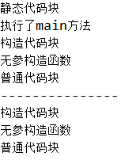
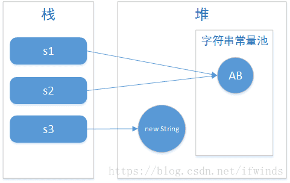
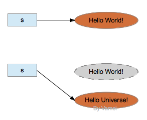
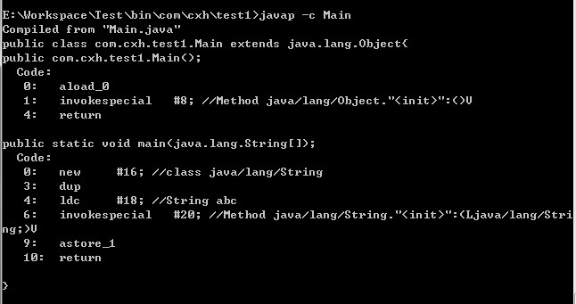
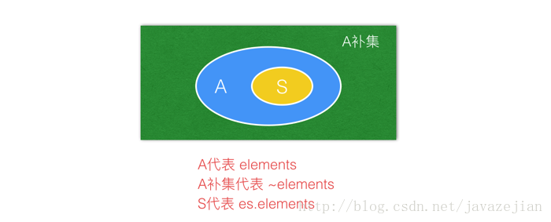

# 学习路线

<p><a target="_blank" href="https://www.bilibili.com/video/BV1Kb411W75N">JavaSE</a>&nbsp;--&gt;&nbsp;<a target="_blank" href="https://www.bilibili.com/video/BV1xW411u7ax">MySQL基础</a>&nbsp;--&gt;&nbsp;<a target="_blank" href="https://www.bilibili.com/video/BV1eJ411c7rf">JDBC&nbsp;</a>--&gt;&nbsp;<a target="_blank" href="https://www.bilibili.com/video/BV1Y7411K7zz">JavaWeb</a>&nbsp;--&gt;&nbsp;<a target="_blank" href="https://www.bilibili.com/video/BV1Vf4y127N5">Spring5</a>&nbsp;--&gt;&nbsp;<a target="_blank" href="https://www.bilibili.com/video/BV1mW411M7YA">SpringMVC</a>&nbsp;--&gt;&nbsp;<a target="_blank" href="https://www.bilibili.com/video/BV1mW411M737">MyBatis</a>&nbsp;--&gt;&nbsp;<a target="_blank" href="https://www.bilibili.com/video/BV1TW411g7hP">Maven</a>&nbsp;--&gt;&nbsp;<a target="_blank" href="https://www.bilibili.com/video/BV17W411g7zP">Ssm框架整合案例</a>&nbsp;--&gt;&nbsp;<a target="_blank" href="https://www.bilibili.com/video/BV1pW411A7a5">Git/GitHub</a>&nbsp;--&gt;&nbsp;<a target="_blank" href="https://www.bilibili.com/video/BV1oW411u75R">Redis</a>&nbsp;--&gt;&nbsp;<a target="_blank" href="https://www.bilibili.com/video/BV1KW411u7vy">MySQL高级优化</a>&nbsp;--&gt;&nbsp;<a target="_blank" href="https://www.bilibili.com/video/BV1Ds411E76Y">MyBatisPlus</a>&nbsp;--&gt;&nbsp;<a target="_blank" href="https://www.bilibili.com/video/BV1gW411W7wy">Spring注解驱动开发</a>&nbsp;--&gt; &nbsp;<a target="_blank" href="https://www.bilibili.com/video/BV1PW411r7iP">ZooKeeper</a>&nbsp;--&gt;&nbsp;<a target="_blank" href="https://www.bilibili.com/video/BV1ns411c7jV">Dubbo</a>&nbsp;--&gt;&nbsp;<a target="_blank" href="https://www.bilibili.com/video/BV164411G7aB">消息中间件ActiveMQ</a>&nbsp;--&gt; <a target="_blank" href="https://www.bilibili.com/video/BV19K4y1L7MT">SpringBoot2</a>--&gt;&nbsp;&nbsp;<a target="_blank" href="https://www.bilibili.com/video/BV18E411x7eT">SpringCloud</a>&nbsp;--&gt;&nbsp;<a target="_blank" href="https://www.bilibili.com/video/BV1bE411T7oZ">尚筹网项目</a>&nbsp;--&gt;&nbsp;<a target="_blank" href="https://www.bilibili.com/video/BV1dQ4y1A75e">在线教育项目</a>&nbsp;--&gt;&nbsp;<a target="_blank" href="https://www.bilibili.com/video/BV1np4y1C7Yf">谷粒商城项目</a>&nbsp;--&gt;&nbsp;<a target="_blank" href="https://www.bilibili.com/video/BV1Eb411P7bP">高频面试题第一季</a>&nbsp;--&gt;&nbsp;<a target="_blank" href="https://www.bilibili.com/video/BV18b411M7xz">大厂面试题第二季&nbsp;</a>--&gt;&nbsp;<a target="_blank" href="https://www.bilibili.com/video/BV1Hy4y1B78T">大厂面试题第三季</a>&nbsp;</p>


# final关键字

> 提及final关键字都会想到一个常见的面试题就是：
> final、finally、finalize区别
> 在这里我们来简单回忆一下这三者的区别，

- final: Final用于修饰类、成员变量和成员方法。final修饰的类，不能被继承（String、StringBuilder、StringBuffer、Math，不可变类），其中所有的方法都不能被重写(这里需要注意的是不能被重写，但是可以被重载，这里很多人会弄混)，所以不能同时用abstract和final修饰类（abstract修饰的类是抽象类，抽象类是用于被子类继承的，和final起相反的作用）；Final修饰的方法不能被重写，但是子类可以用父类中final修饰的方法；Final修饰的成员变量是不可变的，如果成员变量是基本数据类型，初始化之后成员变量的值不能被改变，如果成员变量是引用类型，那么它只能指向初始化时指向的那个对象，不能再指向别的对象，但是对象当中的内容是允许改变的。

------

我们来深入理解一下被final修饰的类、方法、变量

1. final修饰的类
   

> 可以看到 被final修饰的类被继承编译器就直接报错了，如果去掉final
> 
> 就没有问题

> 那这里就有一个问题了，为什么设计了继承还要有final来破坏这种继承关系呢。
> 这个解释在《Java编程思想》说的比较清楚：
> 使用 final 方法的原因有两个。第一个原因是把方法锁定，以防任何继承类修改它的含义；第二个原因是效率。在早期的Java实现版本中，会将final方法转为内嵌调用。但是如果方法过于庞大，可能看不到内嵌调用带来的任何性能提升。在最近的 Java 版本中，不需要使用 final 方法进行这些优化了。“

1. 被final修饰的变量

> 我们来看一个有意思的代码

```java
public class Main {
   public static void main(String[] args) {
       String a = "xiaomeng2";
       final String b = "xiaomeng";
       String d = "xiaomeng";
       String c = b + 2;
       String e = d + 2;
       System.out.println((a == c));
       System.out.println((a == e));
   }
}
1234567891011
```

> 这段代码的输出结果是什么呢？
> 答案是： true 和 false
> 原因：
>
> 1. 变量a指的是字符串常量池中的 xiaomeng2；
> 2. 变量 b 是 final 修饰的，变量 b 的值在编译时候就已经确定了它的确定值，换句话说就是提前知道了变量 b 的内容到底是个啥，相当于一个编译期常量；
> 3. 变量 c 是 b + 2得到的，由于 b 是一个常量，所以在使用 b 的时候直接相当于使用 b 的原始值（xiaomeng）来进行计算，所以 c 生成的也是一个常量，a 是常量，c 也是常量，都是 xiaomeng2 而 Java 中常量池中只生成唯一的一个 xiaomeng2 字符串，所以 a 和 c 是相等的！
> 4. d 是指向常量池中 xiaomeng，但由于 d 不是 final 修饰，也就是说在使用 d 的时候不会提前知道 d 的值是什么，所以在计算 e 的时候就不一样了，e的话由于使用的是 d 的引用计算，变量d的访问却需要在运行时通过链接来进行，所以这种计算会在堆上生成 xiaomeng2 ,所以最终 e 指向的是堆上的 xiaomeng2 ， 所以 a 和 e 不相等。
>    总得来说就是:a、c是常量池的xiaomeng2，e是堆上的xiaomeng2

然后我们来看一下被final修饰的引用变量和基本变量有什么不同：

> 我们看基本变量
> 
> 可以看到 基本变量使用final修饰了就不可变了

> 对于引用变量被final修饰了:引用变量引用不可变，但是引用对象的内容可以改变。
> 
> 可以看到使用final修饰了的类不能再指向别处
> 如何理解内容可变呢：
> 
> 可以看到这里类的属性a的值是能够改变的

> 然后我们总结一下使用final关键字的好处：
>
> 1. final方法比非final快一些
> 2. final关键字提高了性能。JVM和Java应用都会缓存final变量。
> 3. final变量可以安全的在多线程环境下进行共享，而不需要额外的同步开销。
> 4. 使用final关键字，JVM会对方法、变量及类进行优化。

- ## Finally:

> 通常和try catch搭配使用，保证不管有没有发生异常，资源都能够被释放（释放连接、关闭IO流）

> 当try中有return时执行顺序：return语句并不是函数的最终出口，如果有finally语句，这在return之后还会执行finally（return的值会暂存在栈里面，等待finally执行后再返回）

- #### 情况一（try中有return，finally中没有return）


> “return num += 80”被拆分成了“num = num+80”和“return num”两个语句，线执行try中的“num =num+80”语句，将其保存起来，在try中的”return num“执行前，先将finally中的语句执行完，而后再将90返回。

- #### 情况二（try和finally中均有return）


> try中的return被”覆盖“掉了，不再执行。

- #### 情况三（finally中改变返回值num）


> 虽然在finally中改变了返回值num，但因为finally中没有return该num的值，因此在执行完finally中的语句后，test（）函数会得到try中返回的num的值，而try中的num的值依然是程序进入finally代码块前保留下来的值，因此得到的返回值为10。并且函数最后面的return语句不会执行。

- #### 另外一种情况：将num的值包装在Num类中


## 总结:

> try语句在返回前，将其他所有的操作执行完，保留好要返回的值，而后转入执行finally中的语句，而后分为以下三种情况：

> 情况一：如果finally中有return语句，则会将try中的return语句”覆盖“掉，直接执行finally中的return语句，得到返回值，这样便无法得到try之前保留好的返回值。

> 情况二：如果finally中没有return语句，也没有改变要返回值，则执行完finally中的语句后，会接着执行try中的return语句，返回之前保留的值。

> 情况三：如果finally中没有return语句，但是改变了要返回的值，这里有点类似与引用传递和值传递的区别，分以下两种情况：
> 如果return的数据是基本数据类型，则在finally中对该基本数据的改变不起作用，try中的return语句依然会返回进入finally块之前保留的值。
> 如果return的数据是引用数据类型，而在finally中对该引用数据类型的属性值的改变起作用，try中的return语句返回的就是在finally中改变后的该属性的值。

------

- ## Finalize：

> Finalize是object类中的一个方法，子类可以重写finalize()方法实现对资源的回收。垃圾回收只负责回收内存，并不负责资源的回收，资源回收要由程序员完成，Java虚拟机在垃圾回收之前会先调用垃圾对象的finalize方法用于使对象释放资源（如关闭连接、关闭文件），之后才进行垃圾回收，这个方法一般不会显示的调用，在垃圾回收时垃圾回收器会主动调用。

参考

https://blog.csdn.net/CSDN_bang/article/details/86851078
https://blog.csdn.net/stypace/article/details/42102181

# java修饰符

|| ** 同一个类** | **同一个包** | **不同包的子类** | **不同包的非子类** |
| ------------- | ------------ | ---------------- | ------------------ | ---- |
| Private       | √            |                  |                    |      |
| Default       | √            | √                |                    |      |
| Protected     | √            | √                | √                  |      |
| Public        | √            | √                | √                  | √    |

**注意：**java的访问控制是停留在编译层的，也就是它不会在.class文件中留下任何的痕迹，只在编译的时候进行访问控制的检查。其实，通过反射的手段，是可以访问任何包下任何类中的成员，例如，访问类的私有成员也是可能的。

<hr>

public：

具有最大的访问权限，可以访问任何一个在classpath下的类、接口、异常等。它往往用于对外的情况，也就是对象或类对外的一种接口的形式。

protected：

主要的作用就是用来保护子类的。它的含义在于子类可以用它修饰的成员，其他的不可以，它相当于传递给子类的一种继承的东西

default：

有时候也称为friendly，它是针对本包访问而设计的，任何处于本包下的类、接口、异常等，都可以相互访问，即使是父类没有用protected修饰的成员也可以。

private：

访问权限仅限于类的内部，是一种封装的体现，例如，大多数成员变量都是修饰符为private的，它们不希望被其他任何外部的类访问。


区别：

public：可以被所有其他类所访问

private：只能被自己访问和修改

protected：自身、子类及同一个包中类可以访问

default：同一包中的类可以访问，声明时没有加修饰符，认为是friendly。


# 内部类

## 一、什么是内部类？

　　内部类是指在一个外部类的内部再定义一个类。内部类作为外部类的一个成员，并且依附于外部类而存在的。内部类可为静态，可用protected和private修饰（而外部类只能使用public和缺省的包访问权限）。内部类主要有以下几类：**成员内部类**、**局部内部类**、**静态内部类**、**匿名内部类**

## 二、内部类的共性

(1)、内部类仍然是一个独立的类，在编译之后内部类会被编译成独立的.class文件，但是前面冠以外部类的类名和$符号 。

(2)、内部类不能用普通的方式访问。

(3)、内部类声明成静态的，就不能随便的访问外部类的成员变量了，此时内部类只能访问外部类的静态成员变量 。

(4)、外部类不能直接访问内部类的的成员，但可以通过内部类对象来访问

　　内部类是外部类的一个成员，因此内部类可以自由地访问外部类的成员变量，无论是否是private的。

　　因为当某个外围类的对象创建内部类的对象时，此内部类会捕获一个隐式引用，它引用了实例化该内部对象的外围类对象。通过这个指针，可以访问外围类对象的全部状态。

通过反编译内部类的字节码，分析之后主要是通过以下几步做到的： 
　　1 编译器自动为内部类添加一个成员变量， 这个成员变量的类型和外部类的类型相同， 这个成员变量就是指向外部类对象的引用； 
　　2 编译器自动为内部类的构造方法添加一个参数， 参数的类型是外部类的类型， 在构造方法内部使用这个参数为1中添加的成员变量赋值； 
　　3 在调用内部类的构造函数初始化内部类对象时， 会默认传入外部类的引用。

## 三、为什么需要内部类？

其主要原因有以下几点：

- 内部类方法可以访问该类定义所在的作用域的数据，包括私有的数据
- 内部类可以对同一个包中的其他类隐藏起来,一般的非内部类，是不允许有 private 与protected权限的，但内部类可以
- 可以实现多重继承
- 当想要定义一个回调函数且不想编写大量代码时，使用匿名内部类比较便捷

使用内部类最吸引人的原因是：

　　每个内部类都能独立地继承自一个（接口的）实现，所以无论外围类是否已经继承了某个（接口的）实现，对于内部类都没有影响。大家都知道Java只能继承一个类，它的多重继承在我们没有学习内部类之前是用接口来实现的。但使用接口有时候有很多不方便的地方。比如我们实现一个接口就必须实现它里面的所有方法。而有了内部类就不一样了。它可以使我们的类继承多个具体类或抽象类。

大家看下面的例子:


```
public class Example1 {
    public String name(){
       return "liutao";
   }
}

public class Example2 {
    public int age(){
        return 25;
    }
}

public class MainExample {

   private class test1 extends Example1{
        public String name(){
          return super.name();
        }
    }

    private class test2 extends Example2 {
       public int age(){
         return super.age();
       }
    }

   public String name(){
    return new test1().name(); 
   }

   public int age(){
       return new test2().age();
   }

   public static void main(String args[]){
       MainExample mi=new MainExample();
       System.out.println("姓名:"+mi.name());
       System.out.println("年龄:"+mi.age());
   }
}
```


## 四、成员内部类：

　　即在一个类中直接定义的内部类， 成员内部类与普通的成员没什么区别，可以与普通成员一样进行修饰和限制。成员内部类不能含有static的变量和方法。**
**

```
public class Outer {
    private static int i = 1;
    private int j = 10;
    private int k = 20;

    public static void outer_f1() {}

    public void outer_f2() {}

    // 成员内部类中，不能定义静态成员
    // 成员内部类中，可以访问外部类的所有成员
    class Inner {
        // static int inner_i = 100;//内部类中不允许定义静态变量
        int j = 100; // 内部类和外部类的实例变量可以共存
        int inner_i = 1;

        void inner_f1() {
            System.out.println(i);
            // 在内部类中访问内部类自己的变量直接用变量名
            System.out.println(j);
            // 在内部类中访问内部类自己的变量也可以用this.变量名
            System.out.println(this.j);
            // 在内部类中访问外部类中与内部类同名的实例变量用外部类名.this.变量名
            System.out.println(Outer.this.j);
            // 如果内部类中没有与外部类同名的变量，则可以直接用变量名访问外部类变量
            System.out.println(k);
            outer_f1();
            outer_f2();
        }
    }

    // 外部类的非静态方法访问成员内部类
    public void outer_f3() {
        Inner inner = new Inner();
        inner.inner_f1();
    }

    // 外部类的静态方法访问成员内部类，与在外部类外部访问成员内部类一样
    public static void outer_f4() {
        // step1 建立外部类对象
        Outer out = new Outer();
        // step2 根据外部类对象建立内部类对象
        Inner inner = out.new Inner();
        // step3 访问内部类的方法
        inner.inner_f1();
    }

    public static void main(String[] args) {
        //outer_f4();//该语句的输出结果和下面三条语句的输出结果一样
        // 如果要直接创建内部类的对象，不能想当然地认为只需加上外围类Outer的名字，
        // 就可以按照通常的样子生成内部类的对象，而是必须使用此外围类的一个对象来
        // 创建其内部类的一个对象：
        // Outer.Inner outin = out.new Inner()
        // 因此，除非你已经有了外围类的一个对象，否则不可能生成内部类的对象。因为此
        // 内部类的对象会悄悄地链接到创建它的外围类的对象。如果你用的是静态的内部类，
        // 那就不需要对其外围类对象的引用。
        Outer out = new Outer();
        Outer.Inner outin = out.new Inner();
        outin.inner_f1();
    }
}
```

## 六、局部内部类：

　　在方法中定义的内部类称为局部内部类。与局部变量类似，局部内部类不能有访问说明符，因为它不是外围类的一部分，但是它可以访问当前代码块内的常量，和此外围类所有的成员。

需要注意的是：

　　(1)、局部内部类只能在定义该内部类的方法内实例化，不可以在此方法外对其实例化。

　　(2)、局部内部类对象不能使用该内部类所在方法的非final局部变量。

具体原因等下再说

```
public class Outer {
    private int s = 100;
    private int out_i = 1;

    public void f(final int k) {
        final int s = 200;
        int i = 1;
        final int j = 10;

        // 定义在方法内部
        class Inner {
            int s = 300;// 可以定义与外部类同名的变量

            // static int m = 20;//不可以定义静态变量
            Inner(int k) {
                inner_f(k);
            }

            int inner_i = 100;

            void inner_f(int k) {
                // 如果内部类没有与外部类同名的变量，在内部类中可以直接访问外部类的实例变量
                System.out.println(out_i);
                // 可以访问外部类的局部变量(即方法内的变量)，但是变量必须是final的
                System.out.println(j);
                // System.out.println(i);
                // 如果内部类中有与外部类同名的变量，直接用变量名访问的是内部类的变量
                System.out.println(s);
                // 用this.变量名访问的也是内部类变量
                System.out.println(this.s);
                // 用外部类名.this.内部类变量名访问的是外部类变量
                System.out.println(Outer.this.s);
            }
        }
        new Inner(k);
    }

    public static void main(String[] args) {
        // 访问局部内部类必须先有外部类对象
        Outer out = new Outer();
        out.f(3);
    }
}
```

 

## 七、静态内部类(嵌套类)：

　　如果你不需要内部类对象与其外围类对象之间有联系，那你可以将内部类声明为static。这通常称为嵌套类（nested class）。想要理解static应用于内部类时的含义，你就必须记住，普通的内部类对象隐含地保存了一个引用，指向创建它的外围类对象。然而，当内部类是static的时，就不是这样了。嵌套类意味着：

　　1. 要创建嵌套类的对象，并不需要其外围类的对象。

　　2. 不能从嵌套类的对象中访问非静态的外围类对象。

```
public class Outer {
    private static int i = 1;
    private int j = 10;

    public static void outer_f1() {}

    public void outer_f2() {}

    // 静态内部类可以用public,protected,private修饰
    // 静态内部类中可以定义静态或者非静态的成员
    private static class Inner {
        static int inner_i = 100;
        int inner_j = 200;

        static void inner_f1() {
            // 静态内部类只能访问外部类的静态成员(包括静态变量和静态方法)
            System.out.println("Outer.i" + i);
            outer_f1();
        }

        void inner_f2() {
            // 静态内部类不能访问外部类的非静态成员(包括非静态变量和非静态方法)
            // System.out.println("Outer.i"+j);
            // outer_f2();
        }
    }

    public void outer_f3() {
        // 外部类访问内部类的静态成员：内部类.静态成员
        System.out.println(Inner.inner_i);
        Inner.inner_f1();
        // 外部类访问内部类的非静态成员:实例化内部类即可
        Inner inner = new Inner();
        inner.inner_f2();
    }

    public static void main(String[] args) {
        new Outer().outer_f3();
    }
}
```

生成一个静态内部类不需要外部类成员：这是静态内部类和成员内部类的区别。静态内部类的对象可以直接生成：Outer.Inner in = new Outer.Inner();而不需要通过生成外部类对象来生成。这样实际上使静态内部类成为了一个顶级类(正常情况下，你不能在接口内部放置任何代码，但嵌套类可以作为接口的一部分，因为它是static 的。只是将嵌套类置于接口的命名空间内，这并不违反接口的规则）

 

## 八、匿名内部类：

简单地说：匿名内部类就是没有名字的内部类。什么情况下需要使用匿名内部类？如果满足下面的一些条件，使用匿名内部类是比较合适的：

- 只用到类的一个实例。
- 类在定义后马上用到。
- 类非常小（SUN推荐是在4行代码以下）
- 给类命名并不会导致你的代码更容易被理解。

在使用匿名内部类时，要记住以下几个原则：

- 　　匿名内部类不能有构造方法。
- 　　匿名内部类不能定义任何静态成员、方法和类。
- 　　匿名内部类不能是public,protected,private,static。
- 　　只能创建匿名内部类的一个实例。

-   一个匿名内部类一定是在new的后面，用其隐含实现一个接口或实现一个类。
- 　　因匿名内部类为局部内部类，所以局部内部类的所有限制都对其生效。

 

下面的代码展示的是，如果你的基类需要一个有参数的构造器，应该怎么办：


```
public class Parcel7 {
    public Wrapping wrap(int x) {
        // Base constructor call:
        return new Wrapping(x) { // Pass constructor argument.
            public int value() {
                return super.value() * 47;
            }
        }; // Semicolon required
    }
    public static void main(String[] args) {
        Parcel7 p = new Parcel7();
        Wrapping w = p.wrap(10);
    }
}
```


只需简单地传递合适的参数给基类的构造器即可，这里是将x 传进new Wrapping(x)。在匿名内部类末尾的分号，并不是用来标记此内部类结束（C++中是那样）。实际上，它标记的是表达式的结束，只不过这个表达式正巧包含了内部类罢了。因此，这与别的地方使用的分号是一致的。

 

如果在匿名类中定义成员变量或者使用带参数的构造函数，你同样能够对其执行初始化操作：


```
public class Parcel8 {
    // Argument must be final to use inside
    // anonymous inner class:
    public Destination dest(final String name, String city) {
        return new Destination(name, city) {
            private String label = name;

            public String getName() {
                return label;
            }
        };
    }

    public static void main(String[] args) {
        Parcel8 p = new Parcel8();
        Destination d = p.dest("Tanzania", "gz");
    }

    abstract class Destination {
        Destination(String name, String city) {
            System.out.println(city);
        }

        abstract String getName();
    }
}
```


注意这里的形参city，由于它没有被匿名内部类直接使用，而是被抽象类Inner的构造函数所使用，所以不必定义为final。

 

 

## 九、内部类的重载问题

 

　　如果你创建了一个内部类，然后继承其外围类并重新定义此内部类时，会发生什么呢？也就是说，内部类可以被重载吗？这看起来似乎是个很有用的点子，但是“重载”内部类就好像它是外围类的一个方法，其实并不起什么作用：

 


```
class Egg {
       private Yolk y;
 
       protected class Yolk {
              public Yolk() {
                     System.out.println("Egg.Yolk()");
              }
       }
 
       public Egg() {
              System.out.println("New Egg()");
              y = new Yolk();
       }
}
 
public class BigEgg extends Egg {
       public class Yolk {
              public Yolk() {
                     System.out.println("BigEgg.Yolk()");
              }
       }
 
       public static void main(String[] args) {
              new BigEgg();
       }}
```


输出结果为：

New Egg()

Egg.Yolk()

 

缺省的构造器是编译器自动生成的，这里是调用基类的缺省构造器。你可能认为既然创建了BigEgg 的对象，那么所使用的应该是被“重载”过的Yolk，但你可以从输出中看到实际情况并不是这样的。

这个例子说明，当你继承了某个外围类的时候，内部类并没有发生什么特别神奇的变化。这两个内部类是完全独立的两个实体，各自在自己的命名空间内。当然，明确地继承某个内部类也是可以的：


```
class Egg2 {
       protected class Yolk {
              public Yolk() {
                     System.out.println("Egg2.Yolk()");
              }
 
              public void f() {
                     System.out.println("Egg2.Yolk.f()");
              }
       }
 
       private Yolk y = new Yolk();
 
       public Egg2() {
              System.out.println("New Egg2()");
       }
 
       public void insertYolk(Yolk yy) {
              y = yy;
       }
 
       public void g() {
              y.f();
       }
}
 
public class BigEgg2 extends Egg2 {
       public class Yolk extends Egg2.Yolk {
              public Yolk() {
                     System.out.println("BigEgg2.Yolk()");
              }
 
              public void f() {
                     System.out.println("BigEgg2.Yolk.f()");
              }
       }
 
       public BigEgg2() {
              insertYolk(new Yolk());
       }
 
       public static void main(String[] args) {
              Egg2 e2 = new BigEgg2();
              e2.g();
       }
}
```


输出结果为：

Egg2.Yolk()

New Egg2()

Egg2.Yolk()

BigEgg2.Yolk()

BigEgg2.Yolk.f()

 

现在BigEgg2.Yolk 通过extends Egg2.Yolk 明确地继承了此内部类，并且重载了其中的方法。Egg2 的insertYolk()方法使得BigEgg2 将它自己的Yolk 对象向上转型，然后传递给引用y。所以当g()调用y.f()时，重载后的新版的f()被执行。第二次调用Egg2.Yolk()是BigEgg2.Yolk 的构造器调用了其基类的构造器。可以看到在调用g()的时候，新版的f()被调用了。

 

## 十、内部类的继承问题

　　因为内部类的构造器要用到其外围类对象的引用，所以在你继承一个内部类的时候，事情变得有点复杂。问题在于，那个“秘密的”外围类对象的引用必须被初始化，而在被继承的类中并不存在要联接的缺省对象。要解决这个问题，需使用专门的语法来明确说清它们之间的关联：


```
class WithInner {
        class Inner {
                Inner(){
                        System.out.println("this is a constructor in WithInner.Inner");
                };
        }
}
 
public class InheritInner extends WithInner.Inner {
        // ! InheritInner() {} // Won't compile
        InheritInner(WithInner wi) {
                wi.super();
                System.out.println("this is a constructor in InheritInner");
        }
 
        public static void main(String[] args) {
                WithInner wi = new WithInner();
                InheritInner ii = new InheritInner(wi);
        }
}
```


输出结果为：

this is a constructor in WithInner.Inner

this is a constructor in InheritInner

 

可以看到，InheritInner 只继承自内部类，而不是外围类。但是当要生成一个构造器时，缺省的构造器并不算好，而且你不能只是传递一个指向外围类对象的引用。此外，你必须在构造器内使用如下语法：

enclosingClassReference.super();

这样才提供了必要的引用，然后程序才能编译通过。

 

## 为什么非静态内部类中不能有static修饰的属性，但却可以有常量？

如：

```
public class InnerClassDemo{
    int x;
    class A{
        static  int a = 0;//这样写是不合法的.
        static final int b=0;//这样写是合法的

     }
}
```

定义一个静态的域或者方法，要求在静态环境或者顶层环境，即如果加上 static class A变成静态内部类就ok非静态内部类 依赖于一个外部类对象，而静态域/方法是不依赖与对象——仅与类相关（细说了，就是加载静态域时，根本没有外部类对象）因此，非静态内部类中不能定义静态域/方法，编译过不了。


而常量之所以可以（不论有无static），因为java在编译期就确定所有常量，放到所谓的常量池当中。常量的机制和普通变量不一样

# 静态代码块

在Java中，静态代码块、构造代码块、构造函数、普通代码块的执行顺序是一个笔试的考点，通过这篇文章希望大家能彻底了解它们之间的执行顺序。

### 1、静态代码块


#### 　　①、格式

　　在java类中（方法中不能存在静态代码块）使用static关键字和{}声明的代码块：

```java
public class CodeBlock {
    static{
        System.out.println("静态代码块");
    }
}
```


#### 　　②、执行时机

　　静态代码块在类被加载的时候就运行了，而且只运行一次，并且优先于各种代码块以及构造函数。如果一个类中有多个静态代码块，会按照书写顺序依次执行。后面在比较的时候会通过具体实例来证明。


#### 　　③、静态代码块的作用

　　一般情况下，如果有些代码需要在项目启动的时候就执行，这时候就需要静态代码块。比如一个项目启动需要加载的很多配置文件等资源，我们就可以都放入静态代码块中。


#### 　　④、静态代码块不能存在任何方法体中

　　这个应该很好理解，首先我们要明确静态代码块是在类加载的时候就要运行了。我们分情况讨论：

　　对于普通方法，由于普通方法是通过加载类，然后new出实例化对象，通过对象才能运行这个方法，而静态代码块只需要加载类之后就能运行了。

　　对于静态方法，在类加载的时候，静态方法也已经加载了，但是我们必须要通过类名或者对象名才能访问，也就是说相比于静态代码块，静态代码块是主动运行的，而静态方法是被动运行的。

　　不管是哪种方法，我们需要明确静态代码块的存在在类加载的时候就自动运行了，而放在不管是普通方法还是静态方法中，都是不能自动运行的。


#### 　　⑤、静态代码块不能访问普通变量

　　这个理解思维同上，普通变量只能通过对象来调用，是不能放在静态代码块中的。

[回到顶部](https://www.cnblogs.com/ysocean/p/8194428.html#_labelTop)

### 2、构造代码块


#### 　　①、格式

　　在java类中使用{}声明的代码块（和静态代码块的区别是少了static关键字）:

```java
public class CodeBlock {
    static{
        System.out.println("静态代码块");
    }
    {
        System.out.println("构造代码块");
    }
}
```


#### 　　②、执行时机

　　构造代码块在创建对象时被调用，每次创建对象都会调用一次，但是优先于构造函数执行。需要注意的是，听名字我们就知道，构造代码块不是优先于构造函数执行，而是依托于构造函数，也就是说，如果你不实例化对象，构造代码块是不会执行的。怎么理解呢？我们看看下面这段代码：

```java
public class CodeBlock {
    {
        System.out.println("构造代码块");
    }
     
    public CodeBlock(){
        System.out.println("无参构造函数");
    }
    public CodeBlock(String str){
        System.out.println("有参构造函数");
    }
}
```

　　我们反编译生成的class文件：

　　

　　如果存在多个构造代码块，则执行顺序按照书写顺序依次执行。


#### 　　③、构造代码块的作用

 　和构造函数的作用类似，都能对对象进行初始化，并且只要创建一个对象，构造代码块都会执行一次。但是反过来，构造函数则不一定每个对象建立时都执行（多个构造函数情况下，建立对象时传入的参数不同则初始化使用对应的构造函数）。

　　利用每次创建对象的时候都会提前调用一次构造代码块特性，我们可以做诸如统计创建对象的次数等功能。


### 3、构造函数 

　　1.构造函数的命名必须和类名完全相同。在java中普通函数可以和构造函数同名，但是必须带有返回值；

　　2.构造函数的功能主要用于在类的对象创建时定义初始化的状态。它没有返回值，也不能用void来修饰。这就保证了它不仅什么也不用自动返回，而且根本不能有任何选择。而其他方法都有返回值，即使是void返回值。尽管方法体本身不会自动返回什么，但仍然可以让它返回一些东西，而这些东西可能是不安全的；

　　3.构造函数不能被直接调用，必须通过new运算符在创建对象时才会自动调用；而一般的方法是在程序执行到它的时候被调用的；

　　4.当定义一个类的时候，通常情况下都会显示该类的构造函数，并在函数中指定初始化的工作也可省略，不过Java编译器会提供一个默认的构造函数.此默认构造函数是不带参数的。而一般的方法不存在这一特点；


### 4、普通代码块

　　普通代码块和构造代码块的区别是，构造代码块是在类中定义的，而普通代码块是在方法体中定义的。且普通代码块的执行顺序和书写顺序一致。

```java
public void sayHello(){
    {
        System.out.println("普通代码块");
    }
}
```


### 5、执行顺序

- 　**静态代码块>构造代码块>构造函数>普通代码块**　

```java
public class CodeBlock {
    static{
        System.out.println("静态代码块");
    }
    {
        System.out.println("构造代码块");
    }
    public CodeBlock(){
        System.out.println("无参构造函数");
    }
     
    public void sayHello(){
        {
            System.out.println("普通代码块");
        }
    }
     
    public static void main(String[] args) {
        System.out.println("执行了main方法");
         
        new CodeBlock().sayHello();;
        System.out.println("---------------");
        new CodeBlock().sayHello();;
    }
}
```

　　**反编译生成的class文件：**

　　

 

　　**执行结果：**

 　

　　我们创建了两个匿名对象，但是静态代码块只是调用了一次。


### 6、父类和子类执行顺序

　　对象的初始化顺序：

　　首先执行父类静态的内容，父类静态的内容执行完毕后，接着去执行子类的静态的内容，当子类的静态内容执行完毕之后，再去看父类有没有构造代码块，如果有就执行父类的构造代码块，父类的构造代码块执行完毕，接着执行父类的构造方法；父类的构造方法执行完毕之后，它接着去看子类有没有构造代码块，如果有就执行子类的构造代码块。子类的构造代码块执行完毕再去执行子类的构造方法。

　　总之一句话，静态代码块内容先执行，接着执行父类构造代码块和构造方法，然后执行子类构造代码块和构造方法。

　　父类：SuperClass.java

```
package com.ys.extend;
 
public class SuperClass {
    static{
        System.out.println("父类静态代码块");
    }
    {
        System.out.println("父类构造代码块");
    }
    public SuperClass(){
        System.out.println("父类构造函数");
    }
}
```

　　子类：SubClass.java

```
package com.ys.extend;
 
public class SubClass extends SuperClass{
    static{
        System.out.println("子类静态代码块");
    }
     
    {
        System.out.println("子类构造代码块");
    }
     
    public SubClass(){
        System.out.println("子类构造函数");
    }
     
}
```

　　测试：

```
public static void main(String[] args) {
    SubClass sb = new SubClass();
    System.out.println("------------");
    SubClass sb1 = new SubClass();
}
```

　　打印结果：

　　

# String类

在Java语言中，所有类似“ABC”的字面值，都是String类的实例；String类位于java.lang包下，是Java语言的核心类，提供了字符串的比较、查找、截取、大小写转换等操作；Java语言为“+”连接符（字符串连接符）以及对象转换为字符串提供了特殊的支持，字符串对象可以使用“+”连接其他对象。String类的部分源码如下

```java
public final class String
    implements java.io.Serializable, Comparable<String>, CharSequence {
    /** The value is used for character storage. */
    private final char value[];

    /** Cache the hash code for the string */
    private int hash; // Default to 0
    ...
}
123456789
```

从上面可以看出
1）String类被final关键字修饰，意味着String类不能被继承，并且它的成员方法都默认为final方法；字符串一旦创建就不能再修改。
2）String类实现了Serializable、CharSequence、 Comparable接口。
3）String实例的值是通过字符数组实现字符串存储的。


## 1. “+”连接符

### 1.1 “+”连接符的实现原理

Java语言为“+”连接符以及对象转换为字符串提供了特殊的支持，字符串对象可以使用“+”连接其他对象。其中字符串连接是通过 StringBuilder（或 StringBuffer）类及其append 方法实现的，对象转换为字符串是通过 toString 方法实现的，该方法由 Object 类定义，并可被 Java 中的所有类继承。有关字符连接和转换的更多信息，可以参阅 Gosling、Joy 和 Steele 合著的 《The Java Language Specification》

我们可以通过反编译验证一下

```java
/**
 * 测试代码
 */
public class Test {
    public static void main(String[] args) {
        int i = 10;
        String s = "abc";
        System.out.println(s + i);
    }
}

/**
 * 反编译后
 */
public class Test {
    public static void main(String args[]) {    //删除了默认构造函数和字节码
        byte byte0 = 10;      
        String s = "abc";      
        System.out.println((new StringBuilder()).append(s).append(byte0).toString());
    }
}
123456789101112131415161718192021
```

由上可以看出，Java中使用"+"连接字符串对象时，会创建一个StringBuilder()对象，并调用append()方法将数据拼接，最后调用toString()方法返回拼接好的字符串。由于append()方法的各种重载形式会调用String.valueOf方法，所以我们可以认为：

```java
//以下两者是等价的
s = i + ""
s = String.valueOf(i);
 
//以下两者也是等价的
s = "abc" + i;
s = new StringBuilder("abc").append(i).toString();
1234567
```

### 1.2 “+”连接符的效率

使用“+”连接符时，JVM会隐式创建StringBuilder对象，这种方式在大部分情况下并不会造成效率的损失，不过在进行大量循环拼接字符串时则需要注意。

```java
String s = "abc";
for (int i=0; i<10000; i++) {
    s += "abc";
}

/**
 * 反编译后
 */
String s = "abc";
for(int i = 0; i < 1000; i++) {
     s = (new StringBuilder()).append(s).append("abc").toString();    
}
123456789101112
```

这样由于大量StringBuilder创建在堆内存中，肯定会造成效率的损失，所以在这种情况下建议在循环体外创建一个StringBuilder对象调用append()方法手动拼接（如上面例子如果使用手动拼接运行时间将缩小到1/200左右）。

```java
/**
 * 循环中使用StringBuilder代替“+”连接符
 */
StringBuilder sb = new StringBuilder("abc");
for (int i = 0; i < 1000; i++) {
    sb.append("abc");
}
sb.toString();
12345678
```

与此之外还有一种特殊情况，也就是当"+"两端均为编译期确定的字符串常量时，编译器会进行相应的优化，直接将两个字符串常量拼接好，例如：

```java
System.out.println("Hello" + "World");

/**
 * 反编译后
 */
System.out.println("HelloWorld");
123456
/**
 * 编译期确定
 * 对于final修饰的变量，它在编译时被解析为常量值的一个本地拷贝存储到自己的常量池中或嵌入到它的字节码流中。
 * 所以此时的"a" + s1和"a" + "b"效果是一样的。故结果为true。
 */
String s0 = "ab"; 
final String s1 = "b"; 
String s2 = "a" + s1;  
System.out.println((s0 == s2)); //result = true
123456789
/**
 * 编译期无法确定
 * 这里面虽然将s1用final修饰了，但是由于其赋值是通过方法调用返回的，那么它的值只能在运行期间确定
 * 因此s0和s2指向的不是同一个对象，故上面程序的结果为false。
 */
String s0 = "ab"; 
final String s1 = getS1(); 
String s2 = "a" + s1; 
System.out.println((s0 == s2)); //result = false 
 
public String getS1() {  
    return "b";   
}
12345678910111213
```

综上，“+”连接符对于直接相加的字符串常量效率很高，因为在编译期间便确定了它的值，也就是说形如"I"+“love”+“java”; 的字符串相加，在编译期间便被优化成了"Ilovejava"。对于间接相加（即包含字符串引用，且编译期无法确定值的），形如s1+s2+s3; 效率要比直接相加低，因为在编译器不会对引用变量进行优化。

## 2. 字符串常量池

在Java的内存分配中，总共3种常量池，分别是**Class常量池**、**运行时常量池**、**字符串常量池**。

字符串的分配和其他对象分配一样，是需要消耗高昂的时间和空间的，而且字符串使用的非常多。JVM为了提高性能和减少内存的开销，在实例化字符串的时候进行了一些优化：使用字符串常量池。每当创建字符串常量时，JVM会首先检查字符串常量池，如果该字符串已经存在常量池中，那么就直接返回常量池中的实例引用。如果字符串不存在常量池中，就会实例化该字符串并且将其放到常量池中。由于String字符串的不可变性，**常量池中一定不存在两个相同的字符串**。

```java
/**
 * 字符串常量池中的字符串只存在一份！
 * 运行结果为true
 */
String s1 = "hello world!";
String s2 = "hello world!";
System.out.println(s1 == s2);
1234567
```

### 2.1 内存区域

在HotSpot VM中字符串常量池是通过一个StringTable类实现的，它是一个Hash表，默认值大小长度是1009；这个StringTable在每个HotSpot VM的实例中只有一份，被所有的类共享；字符串常量由一个一个字符组成，放在了StringTable上。要注意的是，如果放进String Pool的String非常多，就会造成Hash冲突严重，从而导致链表会很长，而链表长了后直接会造成的影响就是当调用String.intern时性能会大幅下降（因为要一个一个找）。

在JDK6及之前版本，字符串常量池是放在Perm Gen区(也就是方法区)中的，StringTable的长度是固定的1009；在JDK7版本中，字符串常量池被移到了堆中，StringTable的长度可以通过**-XX:StringTableSize=66666**参数指定。至于JDK7为什么把常量池移动到堆上实现，原因可能是由于方法区的内存空间太小且不方便扩展，而堆的内存空间比较大且扩展方便。

### 2.2 存放的内容

在JDK6及之前版本中，String Pool里放的都是字符串常量；在JDK7.0中，由于String.intern()发生了改变，因此String Pool中也可以存放放于堆内的字符串对象的引用。

```java
/**
 * 运行结果为true false
 */
String s1 = "AB";
String s2 = "AB";
String s3 = new String("AB");
System.out.println(s1 == s2);
System.out.println(s1 == s3);
12345678
```

由于常量池中不存在两个相同的对象，所以s1和s2都是指向JVM字符串常量池中的"AB"对象。new关键字一定会产生一个对象，并且这个对象存储在堆中。所以String s3 = new String(“AB”);产生了两个对象：保存在栈中的s3和保存堆中的String对象。


当执行String s1 = "AB"时，JVM首先会去字符串常量池中检查是否存在"AB"对象，如果不存在，则在字符串常量池中创建"AB"对象，并将"AB"对象的地址返回给s1；如果存在，则不创建任何对象，直接将字符串常量池中"AB"对象的地址返回给s1。

## 3. intern方法

直接使用双引号声明出来的String对象会直接存储在字符串常量池中，如果不是用双引号声明的String对象，可以使用String提供的intern方法。intern 方法是一个native方法，intern方法会从字符串常量池中查询当前字符串是否存在，如果存在，就直接返回当前字符串；如果不存在就会将当前字符串放入常量池中，之后再返回。

JDK1.7的改动：

1. 将String常量池 从 Perm 区移动到了 Java Heap区
2. String.intern() 方法时，如果存在堆中的对象，会直接保存对象的引用，而不会重新创建对象。

```java
/**
 * Returns a canonical representation for the string object.
 * <p>
 * A pool of strings, initially empty, is maintained privately by the
 * class {@code String}.
 * <p>
 * When the intern method is invoked, if the pool already contains a
 * string equal to this {@code String} object as determined by
 * the {@link #equals(Object)} method, then the string from the pool is
 * returned. Otherwise, this {@code String} object is added to the
 * pool and a reference to this {@code String} object is returned.
 * <p>
 * It follows that for any two strings {@code s} and {@code t},
 * {@code s.intern() == t.intern()} is {@code true}
 * if and only if {@code s.equals(t)} is {@code true}.
 * <p>
 * All literal strings and string-valued constant expressions are
 * interned. String literals are defined in section 3.10.5 of the
 * <cite>The Java&trade; Language Specification</cite>.
 *
 * @return  a string that has the same contents as this string, but is
 *          guaranteed to be from a pool of unique strings.
 */
public native String intern();
123456789101112131415161718192021222324
```

### 3.1 intern的用法

```java
static final int MAX = 1000 * 10000;
static final String[] arr = new String[MAX];

public static void main(String[] args) throws Exception {
    Integer[] DB_DATA = new Integer[10];
    Random random = new Random(10 * 10000);
    for (int i = 0; i < DB_DATA.length; i++) {
        DB_DATA[i] = random.nextInt();
    }
    long t = System.currentTimeMillis();
    for (int i = 0; i < MAX; i++) {
        //arr[i] = new String(String.valueOf(DB_DATA[i % DB_DATA.length]));
         arr[i] = new String(String.valueOf(DB_DATA[i % DB_DATA.length])).intern();
    }

    System.out.println((System.currentTimeMillis() - t) + "ms");
    System.gc();
}
123456789101112131415161718
```

运行的参数是：-Xmx2g -Xms2g -Xmn1500M 上述代码是一个演示代码，其中有两条语句不一样，一条是未使用 intern，一条是使用 intern。结果如下图

未使用intern，耗时826ms：

使用intern，耗时2160ms：

通过上述结果，我们发现不使用 intern 的代码生成了1000w 个字符串，占用了大约640m 空间。 使用了 intern 的代码生成了1345个字符串，占用总空间 133k 左右。其实通过观察程序中只是用到了10个字符串，所以准确计算后应该是正好相差100w 倍。虽然例子有些极端，但确实能准确反应出 intern 使用后产生的巨大空间节省。

细心的同学会发现使用了 intern 方法后时间上有了一些增长。这是因为程序中每次都是用了 new String 后，然后又进行 intern 操作的耗时时间，这一点如果在内存空间充足的情况下确实是无法避免的，但我们平时使用时，内存空间肯定不是无限大的，不使用 intern 占用空间导致 jvm 垃圾回收的时间是要远远大于这点时间的。 毕竟这里使用了1000w次intern 才多出来1秒钟多的时间。

## 4. String、StringBuilder和StringBuffer

### 4.1 继承结构


### 4.2 主要区别

1）String是不可变字符序列，StringBuilder和StringBuffer是可变字符序列。
2）执行速度StringBuilder > StringBuffer > String。
3）StringBuilder是非线程安全的，StringBuffer是线程安全的。

## 5. 总结

String类是我们使用频率最高的类之一，也是面试官经常考察的题目，下面是一个小测验。

```java
public static void main(String[] args) {
    String s1 = "AB";
    String s2 = new String("AB");
    String s3 = "A";
    String s4 = "B";
    String s5 = "A" + "B";
    String s6 = s3 + s4;
    System.out.println(s1 == s2);
    System.out.println(s1 == s5);
    System.out.println(s1 == s6);
    System.out.println(s1 == s6.intern());
    System.out.println(s2 == s2.intern());
}
12345678910111213
```

运行结果：


解析：真正理解此题目需要清楚以下三点
1）直接使用双引号声明出来的String对象会直接存储在常量池中；
2）String对象的intern方法会得到字符串对象在常量池中对应的引用，如果常量池中没有对应的字符串，则该字符串将被添加到常量池中，然后返回常量池中字符串的引用；
3） 字符串的+操作其本质是创建了StringBuilder对象进行append操作，然后将拼接后的StringBuilder对象用toString方法处理成String对象，这一点可以用javap -c命令获得class文件对应的JVM字节码指令就可以看出来。


**1.String类初始化后是不可变的(immutable)**

String使用private final char value[]来实现字符串的存储，也就是说String对象创建之后，就不能再修改此对象中存储的字符串内容，就是因为如此，才说String类型是不可变的(immutable)。程序员不能对已有的不可变对象进行修改。我们自己也可以创建不可变对象，只要在接口中不提供修改数据的方法就可以。
然而，String类对象确实有编辑字符串的功能，比如replace()。这些编辑功能是通过创建一个新的对象来实现的，而不是对原有对象进行修改。比如:

```java
s = s.replace("World", "Universe");
```

上面对s.replace()的调用将创建一个新的字符串"Hello Universe!"，并返回该对象的引用。通过赋值，引用s将指向该新的字符串。如果没有其他引用指向原有字符串"Hello World!"，原字符串对象将被垃圾回收。



**2.引用变量与对象**

A aa;
这个语句声明一个类A的引用变量aa[我们常常称之为句柄]，而对象一般通过new创建。所以aa仅仅是一个引用变量，它不是对象。

**3.创建字符串的方式**

创建字符串的方式归纳起来有两类：

（1）使用""引号创建字符串;

（2）使用new关键字创建字符串。

结合上面例子，总结如下:

（1）单独使用""引号创建的字符串都是常量,编译期就已经确定存储到String Pool中；

（2）使用new String("")创建的对象会存储到heap中,是运行期新创建的；

**new创建字符串时首先查看池中是否有相同值的字符串，如果有，则拷贝一份到堆中，然后返回堆中的地址；如果池中没有，则在堆中创建一份，然后返回堆中的地址（注意，此时不需要从堆中复制到池中，否则，将使得堆中的字符串永远是池中的子集，导致浪费池的空间）！**

（3）使用只包含常量的字符串连接符如"aa" + "aa"创建的也是常量,编译期就能确定,已经确定存储到String Pool中；

（4）使用包含变量的字符串连接符如"aa" + s1创建的对象是运行期才创建的,存储在heap中；

**4.使用String不一定创建对象**

在执行到双引号包含字符串的语句时，如String a = "123"，JVM会先到常量池里查找，如果有的话返回常量池里的这个实例的引用，否则的话创建一个新实例并置入常量池里。所以，当我们在使用诸如String str = "abc"；的格式定义对象时，总是想当然地认为，创建了String类的对象str。**担心陷阱！对象可能并没有被创建！而可能只是指向一个先前已经创建的对象。**只有通过new()方法才能保证每次都创建一个新的对象。

**5.使用new String，一定创建对象**

在执行String a = new String("123")的时候，首先走常量池的路线取到一个实例的引用，然后在堆上创建一个新的String实例，走以下构造函数给value属性赋值，然后把实例引用赋值给a：

```java
public String(String original) {
    int size = original.count;
    char[] originalValue = original.value;
    char[] v;
      if (originalValue.length > size) {
         // The array representing the String is bigger than the new
         // String itself.  Perhaps this constructor is being called
         // in order to trim the baggage, so make a copy of the array.
            int off = original.offset;
            v = Arrays.copyOfRange(originalValue, off, off+size);
     } else {
         // The array representing the String is the same
         // size as the String, so no point in making a copy.
        v = originalValue;
     }
    this.offset = 0;
    this.count = size;
    this.value = v;
    }
```

从中我们可以看到，虽然是新创建了一个String的实例，但是value是等于常量池中的实例的value，即是说没有new一个新的字符数组来存放"123"。

**6.关于String.intern()**

**intern方法使用：**一个初始为空的字符串池，它由类String独自维护。当调用 intern方法时，如果池已经包含一个等于此String对象的字符串（用equals(oject)方法确定），则返回池中的字符串。否则，将此String对象添加到池中，并返回此String对象的引用。

**它遵循以下规则：对于任意两个字符串 s 和 t，当且仅当 s.equals(t) 为 true 时，s.intern() == t.intern() 才为 true。**

String.intern();
再补充介绍一点：存在于.class文件中的常量池，在运行期间被jvm装载，并且可以扩充。String的intern()方法就是扩充常量池的一个方法；当一个String实例str调用intern()方法时，java查找常量池中是否有相同unicode的字符串常量，如果有，则返回其引用，如果没有，则在常量池中增加一个unicode等于str的字符串并返回它的引用。

```java
/**
 * 关于String.intern()
 */
public void test11(){
    String s0 = "kvill"; 
    String s1 = new String("kvill"); 
    String s2 = new String("kvill"); 
    System.out.println("===========test11============");
    System.out.println( s0 == s1 ); //false
    System.out.println( "**********" ); 
    s1.intern(); //虽然执行了s1.intern(),但它的返回值没有赋给s1
    s2 = s2.intern(); //把常量池中"kvill"的引用赋给s2 
    System.out.println( s0 == s1); //flase
    System.out.println( s0 == s1.intern() ); //true//说明s1.intern()返回的是常量池中"kvill"的引用
    System.out.println( s0 == s2 ); //true
}
```


运行结果：false、false、true、true。

**7.关于equals和==**

（1）对于==，如果作用于基本数据类型的变量（byte,short,char,int,long,float,double,boolean ），则直接比较其存储的"值"是否相等；如果作用于引用类型的变量（String），则比较的是所指向的对象的地址（即是否指向同一个对象）。

（2）equals方法是基类Object中的方法，因此对于所有的继承于Object的类都会有该方法。在Object类中，equals方法是用来比较两个对象的引用是否相等，即是否指向同一个对象。

（3）对于equals方法，注意：equals方法不能作用于基本数据类型的变量。如果没有对equals方法进行重写，则比较的是引用类型的变量所指向的对象的地址；而String类对equals方法进行了重写，用来比较指向的字符串对象所存储的字符串是否相等。其他的一些类诸如Double，Date，Integer等，都对equals方法进行了重写用来比较指向的对象所存储的内容是否相等。


```java
/**
 * 关于equals和==
 */
public void test12(){
    String s1="hello";
    String s2="hello";
    String s3=new String("hello");
    System.out.println("===========test12============");
    System.out.println( s1 == s2); //true,表示s1和s2指向同一对象，它们都指向常量池中的"hello"对象
    //flase,表示s1和s3的地址不同，即它们分别指向的是不同的对象,s1指向常量池中的地址，s3指向堆中的地址
    System.out.println( s1 == s3); 
    System.out.println( s1.equals(s3)); //true,表示s1和s3所指向对象的内容相同
}
```


**8.String相关的+：**

String中的 + 常用于字符串的连接。看下面一个简单的例子：


```java
/**
 * String相关的+
 */
public void test13(){
    String a = "aa";
    String b = "bb";
    String c = "xx" + "yy " + a + "zz" + "mm" + b;
    System.out.println("===========test13============");
    System.out.println(c);
}
```


编译运行后，主要字节码部分如下：


```java
public static main([Ljava/lang/String;)V
   L0
    LINENUMBER 5 L0
    LDC "aa"
    ASTORE 1
   L1
    LINENUMBER 6 L1
    LDC "bb"
    ASTORE 2
   L2
    LINENUMBER 7 L2
    NEW java/lang/StringBuilder
    DUP
    LDC "xxyy "
    INVOKESPECIAL java/lang/StringBuilder.<init> (Ljava/lang/String;)V
    ALOAD 1
    INVOKEVIRTUAL java/lang/StringBuilder.append (Ljava/lang/String;)Ljava/lang/StringBuilder;
    LDC "zz"
    INVOKEVIRTUAL java/lang/StringBuilder.append (Ljava/lang/String;)Ljava/lang/StringBuilder;
    LDC "mm"
    INVOKEVIRTUAL java/lang/StringBuilder.append (Ljava/lang/String;)Ljava/lang/StringBuilder;
    ALOAD 2
    INVOKEVIRTUAL java/lang/StringBuilder.append (Ljava/lang/String;)Ljava/lang/StringBuilder;
    INVOKEVIRTUAL java/lang/StringBuilder.toString ()Ljava/lang/String;
    ASTORE 3
   L3
    LINENUMBER 8 L3
    GETSTATIC java/lang/System.out : Ljava/io/PrintStream;
    ALOAD 3
    INVOKEVIRTUAL java/io/PrintStream.println (Ljava/lang/String;)V
   L4
    LINENUMBER 9 L4
    RETURN
   L5
    LOCALVARIABLE args [Ljava/lang/String; L0 L5 0
    LOCALVARIABLE a Ljava/lang/String; L1 L5 1
    LOCALVARIABLE b Ljava/lang/String; L2 L5 2
    LOCALVARIABLE c Ljava/lang/String; L3 L5 3
    MAXSTACK = 3
    MAXLOCALS = 4
}
```


显然，通过字节码我们可以得出如下几点结论：
(1).String中使用 + 字符串连接符进行字符串连接时，连接操作最开始时如果都是字符串常量，编译后将尽可能多的直接将字符串常量连接起来，形成新的字符串常量参与后续连接（通过反编译工具jd-gui也可以方便的直接看出）；

(2).接下来的字符串连接是从左向右依次进行，对于不同的字符串，首先以最左边的字符串为参数创建StringBuilder对象，然后依次对右边进行append操作，最后将StringBuilder对象通过toString()方法转换成String对象（注意：中间的多个字符串常量不会自动拼接）。

也就是说**String c = "xx" + "yy " + a + "zz" + "mm" + b; 实质上的实现过程是： String c = new StringBuilder("xxyy ").append(a).append("zz").append("mm").append(b).toString();**

**由此得出结论：当使用+进行多个字符串连接时，实际上是产生了一个StringBuilder对象和一个String对象。**

**9.String的不可变性导致字符串变量使用+号的代价：**

```java
String s = "a" + "b" + "c"; 
String s1  =  "a"; 
String s2  =  "b"; 
String s3  =  "c"; 
String s4  =  s1  +  s2  +  s3;
```

分析：变量s的创建等价于 String s = "abc"; 由上面例子可知编译器进行了优化，这里只创建了一个对象。由上面的例子也可以知道s4不能在编译期进行优化，其对象创建相当于：

```java
StringBuilder temp = new StringBuilder();   
temp.append(a).append(b).append(c);   
String s = temp.toString();
```

由上面的分析结果，可就不难推断出String 采用连接运算符（+）效率低下原因分析，形如这样的代码：


```java
public class Test {
    public static void main(String args[]) {
        String s = null;
        for(int i = 0; i < 100; i++) {
            s += "a";
        }
    }
}
```


每做一次 + 就产生个StringBuilder对象，然后append后就扔掉。下次循环再到达时重新产生个StringBuilder对象，然后 append 字符串，如此循环直至结束。 如果我们直接采用 StringBuilder 对象进行 append 的话，我们可以节省 N - 1 次创建和销毁对象的时间。所以对于在循环中要进行字符串连接的应用，一般都是用StringBuffer或StringBulider对象来进行append操作。

**10.String、StringBuffer、StringBuilder的区别**

（1）可变与不可变：String是**不可变字符串对象**，StringBuilder和StringBuffer是**可变字符串对象**（其内部的字符数组长度可变）。

（2）是否多线程安全：String中的对象是不可变的，也就可以理解为常量，显然**线程安全**。StringBuffer 与 StringBuilder 中的方法和功能完全是等价的，只是StringBuffer 中的方法大都采用了synchronized 关键字进行修饰，因此是**线程安全**的，而 StringBuilder 没有这个修饰，可以被认为是**非线程安全**的。

（3）String、StringBuilder、StringBuffer三者的执行效率：
StringBuilder > StringBuffer > String 当然这个是相对的，不一定在所有情况下都是这样。比如String str = "hello"+ "world"的效率就比 StringBuilder st = new StringBuilder().append("hello").append("world")要高。因此，这三个类是各有利弊，应当根据不同的情况来进行选择使用：
当字符串相加操作或者改动较少的情况下，建议使用 String str="hello"这种形式；
当字符串相加操作较多的情况下，建议使用StringBuilder，如果采用了多线程，则使用StringBuffer。

**11.String中的final用法和理解**

```java
final StringBuffer a = new StringBuffer("111");
final StringBuffer b = new StringBuffer("222");
a=b;//此句编译不通过

final StringBuffer a = new StringBuffer("111");
a.append("222");//编译通过
```

可见，**final只对引用的"值"(即内存地址)有效，它迫使引用只能指向初始指向的那个对象，改变它的指向会导致编译期错误。**至于它所指向的对象的变化，final是不负责的。

**12.关于String str = new String("abc")创建了多少个对象？**

这个问题在很多书籍上都有说到比如《Java程序员面试宝典》，包括很多国内大公司笔试面试题都会遇到，大部分网上流传的以及一些面试书籍上都说是2个对象，这种说法是片面的。

首先必须弄清楚创建对象的含义，创建是什么时候创建的？这段代码在运行期间会创建2个对象么？毫无疑问不可能，用javap -c反编译即可得到JVM执行的字节码内容：



很显然，new只调用了一次，也就是说只创建了一个对象。而这道题目让人混淆的地方就是这里，这段代码在运行期间确实只创建了一个对象，即在堆上创建了"abc"对象。而为什么大家都在说是2个对象呢，这里面要澄清一个概念，该段代码执行过程和类的加载过程是有区别的。在类加载的过程中，确实在运行时常量池中创建了一个"abc"对象，而在代码执行过程中确实只创建了一个String对象。
因此，这个问题如果换成 String str = new String("abc")涉及到几个String对象？合理的解释是2个。
个人觉得在面试的时候如果遇到这个问题，可以向面试官询问清楚”是这段代码执行过程中创建了多少个对象还是涉及到多少个对象“再根据具体的来进行回答。

**13.字符串池的优缺点：**
字符串池的优点就是避免了相同内容的字符串的创建，节省了内存，省去了创建相同字符串的时间，同时提升了性能；另一方面，字符串池的缺点就是牺牲了JVM在常量池中遍历对象所需要的时间，不过其时间成本相比而言比较低。

**四、综合实例**

```java
package com.spring.test;

public class StringTest {
    public static void main(String[] args) {  
        /** 
         * 情景一：字符串池 
          * JAVA虚拟机(JVM)中存在着一个字符串池，其中保存着很多String对象; 
         * 并且可以被共享使用，因此它提高了效率。 
         * 由于String类是final的，它的值一经创建就不可改变。 
         * 字符串池由String类维护，我们可以调用intern()方法来访问字符串池。  
         */  
        String s1 = "abc";     
        //↑ 在字符串池创建了一个对象  
        String s2 = "abc";     
        //↑ 字符串pool已经存在对象“abc”(共享),所以创建0个对象，累计创建一个对象  
        System.out.println("s1 == s2 : "+(s1==s2));    
        //↑ true 指向同一个对象，  
        System.out.println("s1.equals(s2) : " + (s1.equals(s2)));    
        //↑ true  值相等  
        //↑------------------------------------------------------over  
        /** 
         * 情景二：关于new String("") 
         *  
         */  
        String s3 = new String("abc");  
        //↑ 创建了两个对象，一个存放在字符串池中，一个存在与堆区中；  
        //↑ 还有一个对象引用s3存放在栈中  
        String s4 = new String("abc");  
        //↑ 字符串池中已经存在“abc”对象，所以只在堆中创建了一个对象  
        System.out.println("s3 == s4 : "+(s3==s4));  
        //↑false   s3和s4栈区的地址不同，指向堆区的不同地址；  
        System.out.println("s3.equals(s4) : "+(s3.equals(s4)));  
        //↑true  s3和s4的值相同  
        System.out.println("s1 == s3 : "+(s1==s3));  
        //↑false 存放的地区多不同，一个栈区，一个堆区  
        System.out.println("s1.equals(s3) : "+(s1.equals(s3)));  
        //↑true  值相同  
        //↑------------------------------------------------------over  
        /** 
         * 情景三：  
         * 由于常量的值在编译的时候就被确定(优化)了。 
         * 在这里，"ab"和"cd"都是常量，因此变量str3的值在编译时就可以确定。 
         * 这行代码编译后的效果等同于： String str3 = "abcd"; 
         */  
        String str1 = "ab" + "cd";  //1个对象  
        String str11 = "abcd";   
        System.out.println("str1 = str11 : "+ (str1 == str11));  
        //↑------------------------------------------------------over  
        /** 
         * 情景四：  
         * 局部变量str2,str3存储的是存储两个拘留字符串对象(intern字符串对象)的地址。 
         *  
         * 第三行代码原理(str2+str3)： 
         * 运行期JVM首先会在堆中创建一个StringBuilder类， 
         * 同时用str2指向的拘留字符串对象完成初始化， 
         * 然后调用append方法完成对str3所指向的拘留字符串的合并， 
         * 接着调用StringBuilder的toString()方法在堆中创建一个String对象， 
         * 最后将刚生成的String对象的堆地址存放在局部变量str3中。 
         *  
         * 而str5存储的是字符串池中"abcd"所对应的拘留字符串对象的地址。 
         * str4与str5地址当然不一样了。 
         *  
         * 内存中实际上有五个字符串对象： 
         *       三个拘留字符串对象、一个String对象和一个StringBuilder对象。 
         */  
        String str2 = "ab";  //1个对象  
        String str3 = "cd";  //1个对象                                         
        String str4 = str2+str3;                                        
        String str5 = "abcd";    
        System.out.println("str4 = str5 : " + (str4==str5)); // false  
        //↑------------------------------------------------------over  
        /** 
         * 情景五： 
         *  JAVA编译器对string + 基本类型/常量 是当成常量表达式直接求值来优化的。 
         *  运行期的两个string相加，会产生新的对象的，存储在堆(heap)中 
         */  
        String str6 = "b";  
        String str7 = "a" + str6;  
        String str67 = "ab";  
        System.out.println("str7 = str67 : "+ (str7 == str67));  
        //↑str6为变量，在运行期才会被解析。  
        final String str8 = "b";  
        String str9 = "a" + str8;  
        String str89 = "ab";  
        System.out.println("str9 = str89 : "+ (str9 == str89));  
        //↑str8为常量变量，编译期会被优化  
        //↑------------------------------------------------------over  
    }
}
```

运行结果：

s1 == s2 : true
s1.equals(s2) : true
s3 == s4 : false
s3.equals(s4) : true
s1 == s3 : false
s1.equals(s3) : true
str1 = str11 : true
str4 = str5 : false
str7 = str67 : false
str9 = str89 : true


# Collection

## 一、集合大纲


#### 1.集合和数组的区别：


#### 2.Collection集合的方法：


#### 3.常用集合的分类：

**Collection** 接口的接口 对象的集合（单列集合）
├——-**List** 接口：元素按进入先后有序保存，可重复
│—————-├ **LinkedList** 接口实现类， 链表， 插入删除， 没有同步， 线程不安全
│—————-├ **ArrayList** 接口实现类， 数组， 随机访问， 没有同步， 线程不安全
│—————-└ **Vector** 接口实现类 数组， 同步， 线程安全
│ ———————-└ **Stack** 是Vector类的实现类
└——-**Set** 接口： 仅接收一次，不可重复，并做内部排序
├—————-└**HashSet** 使用hash表（数组）存储元素
│————————└ **LinkedHashSet** 链表维护元素的插入次序
└ —————-**TreeSet** 底层实现为二叉树，元素排好序

**Map** 接口 键值对的集合 （双列集合）
├———**Hashtable** 接口实现类， 同步， 线程安全
├———**HashMap** 接口实现类 ，没有同步， 线程不安全-
│—————–├ **LinkedHashMap** 双向链表和哈希表实现
│—————–└ **WeakHashMap**
├ ——–**TreeMap** 红黑树对所有的key进行排序
└———**IdentifyHashMap**

## 二、List和Set集合详解：

#### 1.list和set的区别：


#### 2.List：

**（1）ArrayList**：底层数据结构是数组，查询快，增删慢，线程不安全，效率高，可以存储重复元素
**（2）LinkedList** 底层数据结构是链表，查询慢，增删快，线程不安全，效率高，可以存储重复元素
**（3）Vector**:底层数据结构是数组，查询快，增删慢，线程安全，效率低，可以存储重复元素

（4小结：

#### 3.Set：

**(1)HashSet**底层数据结构采用哈希表实现，元素无序且唯一，线程不安全，效率高，可以存储null元素，元素的唯一性是靠所存储元素类型是否重写hashCode()和equals()方法来保证的，如果没有重写这两个方法，则无法保证元素的唯一性。
具体实现唯一性的比较过程：存储元素首先会使用hash()算法函数生成一个int类型hashCode散列值，然后已经的所存储的元素的hashCode值比较，如果hashCode不相等，则所存储的两个对象一定不相等，此时存储当前的新的hashCode值处的元素对象；如果hashCode相等，存储元素的对象还是不一定相等，此时会调用equals()方法判断两个对象的内容是否相等，如果内容相等，那么就是同一个对象，无需存储；如果比较的内容不相等，那么就是不同的对象，就该存储了，此时就要采用哈希的解决地址冲突算法，在当前hashCode值处类似一个新的链表， 在同一个hashCode值的后面存储存储不同的对象，这样就保证了元素的唯一性。
Set的实现类的集合对象中不能够有重复元素，HashSet也一样他是使用了一种标识来确定元素的不重复，HashSet用一种算法来保证HashSet中的元素是不重复的， HashSet采用哈希算法，底层用数组存储数据。默认初始化容量16，加载因子0.75。
Object类中的hashCode()的方法是所有子类都会继承这个方法，这个方法会用Hash算法算出一个Hash（哈希）码值返回，HashSet会用Hash码值去和数组长度取模， 模（这个模就是对象要存放在数组中的位置）相同时才会判断数组中的元素和要加入的对象的内容是否相同，如果不同才会添加进去。
Hash算法是一种散列算法。
Set hs=new HashSet();

hs.add(o);
|
o.hashCode();
|
o%当前总容量 (0–15)
|
| 不发生冲突
是否发生冲突—————–直接存放
|
| 发生冲突
| 假（不相等）
o1.equals(o2)——————-找一个空位添加
|
| 是（相等）
不添加
覆盖hashCode()方法的原则：
1、一定要让那些我们认为相同的对象返回相同的hashCode值
2、尽量让那些我们认为不同的对象返回不同的hashCode值，否则，就会增加冲突的概率。
3、尽量的让hashCode值散列开（两值用异或运算可使结果的范围更广）
HashSet 的实现比较简单，相关HashSet的操作，基本上都是直接调用底层HashMap的相关方法来完成，我们应该为保存到HashSet中的对象覆盖hashCode()和equals()，因为再将对象加入到HashSet中时，会首先调用hashCode方法计算出对象的hash值，接着根据此hash值调用HashMap中的hash方法，得到的值& (length-1)得到该对象在hashMap的transient Entry[] table中的保存位置的索引，接着找到数组中该索引位置保存的对象，并调用equals方法比较这两个对象是否相等，如果相等则不添加，注意：所以要存入HashSet的集合对象中的自定义类必须覆盖hashCode(),equals()两个方法，才能保证集合中元素不重复。在覆盖equals()和hashCode()方法时， 要使相同对象的hashCode()方法返回相同值，覆盖equals()方法再判断其内容。为了保证效率，所以在覆盖hashCode()方法时， 也要尽量使不同对象尽量返回不同的Hash码值。

如果数组中的元素和要加入的对象的hashCode()返回了相同的Hash值（相同对象）,才会用equals()方法来判断两个对象的内容是否相同。

**(2)LinkedHashSet**底层数据结构采用链表和哈希表共同实现，链表保证了元素的顺序与存储顺序一致，哈希表保证了元素的唯一性。线程不安全，效率高。
**(3)TreeSet**底层数据结构采用二叉树来实现，元素唯一且已经排好序；唯一性同样需要重写hashCode和equals()方法，二叉树结构保证了元素的有序性。根据构造方法不同，分为自然排序（无参构造）和比较器排序（有参构造），自然排序要求元素必须实现Compareable接口，并重写里面的compareTo()方法，元素通过比较返回的int值来判断排序序列，返回0说明两个对象相同，不需要存储；比较器排需要在TreeSet初始化是时候传入一个实现Comparator接口的比较器对象，或者采用匿名内部类的方式new一个Comparator对象，重写里面的compare()方法；
（4）小结：Set具有与Collection完全一样的接口，因此没有任何额外的功能，不像前面有两个不同的List。实际上Set就是Collection,只 是行为不同。(这是继承与多态思想的典型应用：表现不同的行为。)Set不保存重复的元素。
Set 存入Set的每个元素都必须是唯一的，因为Set不保存重复元素。加入Set的元素必须定义equals()方法以确保对象的唯一性。Set与Collection有完全一样的接口。Set接口不保证维护元素的次序。

#### 4.List和Set总结：

（1）、List,Set都是继承自Collection接口，Map则不是
（2）、List特点：元素有放入顺序，元素可重复 ，Set特点：元素无放入顺序，元素不可重复，重复元素会覆盖掉，（注意：元素虽然无放入顺序，但是元素在set中的位置是有该元素的HashCode决定的，其位置其实是固定的，加入Set 的Object必须定义equals()方法 ，另外list支持for循环，也就是通过下标来遍历，也可以用迭代器，但是set只能用迭代，因为他无序，无法用下标来取得想要的值。）
（3）.Set和List对比：
Set：检索元素效率低下，删除和插入效率高，插入和删除不会引起元素位置改变。
List：和数组类似，List可以动态增长，查找元素效率高，插入删除元素效率低，因为会引起其他元素位置改变。
（4）、ArrayList与LinkedList的区别和适用场景
Arraylist：
**优点**：ArrayList是实现了基于动态数组的数据结构,因为地址连续，一旦数据存储好了，查询操作效率会比较高（在内存里是连着放的）。
**缺点**：因为地址连续， ArrayList要移动数据,所以插入和删除操作效率比较低。

LinkedList：
**优点**：LinkedList基于链表的数据结构,地址是任意的，所以在开辟内存空间的时候不需要等一个连续的地址，对于新增和删除操作add和remove，LinedList比较占优势。LinkedList 适用于要头尾操作或插入指定位置的场景
**缺点**：因为LinkedList要移动指针,所以查询操作性能比较低。
**适用场景分析**：
当需要对数据进行对此访问的情况下选用ArrayList，当需要对数据进行多次增加删除修改时采用LinkedList。

ArrayList与Vector的区别和适用场景
ArrayList有三个构造方法：

```
public ArrayList(int initialCapacity)//构造一个具有指定初始容量的空列表。    
public ArrayList()      //默认构造一个初始容量为10的空列表。    
public ArrayList(Collection<? extends E> c)//构造一个包含指定 collection 的元素的列表123
```

Vector有四个构造方法：

```
public Vector()//使用指定的初始容量和等于0的容量增量构造一个空向量。    
public Vector(int initialCapacity)//构造一个空向量，使其内部数据数组的大小，其标准容量增量为零。    
public Vector(Collection<? extends E> c)//构造一个包含指定 collection 中的元素的向量    
public Vector(int initialCapacity,int capacityIncrement)//使用指定的初始容量和容量增量构造一个空的向量    1234
```

ArrayList和Vector都是用数组实现的，主要有这么三个区别：
*（1）*.Vector是多线程安全的，线程安全就是说多线程访问同一代码，不会产生不确定的结果。而ArrayList不是，这个可以从源码中看出，Vector类中的方法很多有synchronized进行修饰，这样就导致了Vector在效率上无法与ArrayList相比；
*（2）*两个都是采用的线性连续空间存储元素，但是当空间不足的时候，两个类的增加方式是不同。
*（3）*Vector可以设置增长因子，而ArrayList不可以。
*（4）*Vector是一种老的动态数组，是线程同步的，效率很低，一般不赞成使用。
**适用场景分析**：
1.Vector是线程同步的，所以它也是线程安全的，而ArrayList是线程异步的，是不安全的。如果不考虑到线程的安全因素，一般用ArrayList效率比较高。
2.如果集合中的元素的数目大于目前集合数组的长度时，在集合中使用数据量比较大的数据，用Vector有一定的优势。

.TreeSet 是二差树（红黑树的树据结构）实现的,Treeset中的数据是自动排好序的，不允许放入null值
2.HashSet 是哈希表实现的,HashSet中的数据是无序的，可以放入null，但只能放入一个null，两者中的值都不能重复，就如数据库中唯一约束
3.HashSet要求放入的对象必须实现HashCode()方法，放入的对象，是以hashcode码作为标识的，而具有相同内容的String对象，hashcode是一样，所以放入的内容不能重复。但是同一个类的对象可以放入不同的实例

**适用场景分析**:HashSet是基于Hash算法实现的，其性能通常都优于TreeSet。为快速查找而设计的Set，我们通常都应该使用HashSet，在我们需要排序的功能时，我们才使用TreeSet。
（5）何时使用：


## 三、Map详解：

Map用于保存具有映射关系的数据，Map里保存着两组数据：key和value，它们都可以使任何引用类型的数据，但key不能重复。所以通过指定的key就可以取出对应的value。

（1）、**请注意！！！**， Map 没有继承 Collection 接口， Map 提供 key 到 value 的映射，你可以通过“键”查找“值”。一个 Map 中不能包含相同的 key ，每个 key 只能映射一个 value 。 Map 接口提供 3 种集合的视图， Map 的内容可以被当作一组 key 集合，一组 value 集合，或者一组 key-value 映射。
（2）Map：

（3）HashMap和HashTable的比较：

（4）TreeMap：

（5）Map的其它类：
**IdentityHashMap**和**HashMap**的具体区别，IdentityHashMap使用 == 判断两个key是否相等，而HashMap使用的是equals方法比较key值。有什么区别呢？
对于==，如果作用于基本数据类型的变量，则直接比较其存储的 “值”是否相等； 如果作用于引用类型的变量，则比较的是所指向的对象的地址。
对于equals方法，注意：equals方法不能作用于基本数据类型的变量
如果没有对equals方法进行重写，则比较的是引用类型的变量所指向的对象的地址；
诸如String、Date等类对equals方法进行了重写的话，比较的是所指向的对象的内容。

（6）小结：
HashMap 非线程安全
HashMap：基于哈希表实现。使用HashMap要求添加的键类明确定义了hashCode()和equals()[可以重写hashCode()和equals()]，为了优化HashMap空间的使用，您可以调优初始容量和负载因子。

TreeMap：非线程安全基于红黑树实现。TreeMap没有调优选项，因为该树总处于平衡状态。

**适用场景分析：**
HashMap和HashTable:HashMap去掉了HashTable的contains方法，但是加上了containsValue()和containsKey()方法。HashTable同步的，而HashMap是非同步的，效率上比HashTable要高。HashMap允许空键值，而HashTable不允许。

HashMap：适用于Map中插入、删除和定位元素。
Treemap：适用于按自然顺序或自定义顺序遍历键(key)。

5.线程安全集合类与非线程安全集合类
LinkedList、ArrayList、HashSet是非线程安全的，Vector是线程安全的;
HashMap是非线程安全的，HashTable是线程安全的;
StringBuilder是非线程安全的，StringBuffer是线程安全的。

数据结构
ArrayXxx:底层数据结构是数组，查询快，增删慢
LinkedXxx:底层数据结构是链表，查询慢，增删快
HashXxx:底层数据结构是哈希表。依赖两个方法：hashCode()和equals()
TreeXxx:底层数据结构是二叉树。两种方式排序：自然排序和比较器排序


如何选择合适的集合？

Set集合(理解)

​     (1)Set集合的特点

​         无序,唯一

​     (2)HashSet集合(掌握)

​         A:底层数据结构是哈希表(是一个元素为链表的数组)

​         B:哈希表底层依赖两个方法：hashCode()和equals()

​          执行顺序：

​             首先比较哈希值是否相同

​                  相同：继续执行equals()方法

​                      返回true：元素重复了，不添加

​                      返回false：直接把元素添加到集合

​                  不同：就直接把元素添加到集合

​         C:如何保证元素唯一性的呢?

​             由hashCode()和equals()保证的

​         D:开发的时候，代码利用eclipse自动生成即可。

   

​     (3)TreeSet集合

​         A:底层数据结构是红黑树(是一个自平衡的二叉树)

​         B:保证元素的排序方式

​             a:自然排序(元素具备比较性)

​                  让元素所属的类实现Comparable接口

​             b:比较器排序(集合具备比较性)

​                  让集合构造方法接收Comparator的实现类对象

​         

3:Collection集合总结(掌握)

​     Collection

​         |--List   有序,可重复

​             |--ArrayList

​                  底层数据结构是数组，查询快，增删慢。

​                  线程不安全，效率高

​             |--Vector

​                  底层数据结构是数组，查询快，增删慢。

​                  线程安全，效率低

​             |--LinkedList

​                  底层数据结构是链表，查询慢，增删快。

​                  线程不安全，效率高

​         |--Set    无序,唯一

​             |--HashSet

​                  底层数据结构是哈希表。

​                  如何保证元素唯一性的呢?

​                      依赖两个方法：hashCode()和equals()

​                      开发中自动生成这两个方法即可

​                  |--LinkedHashSet

​                      底层数据结构是链表和哈希表

​                      由链表保证元素有序

​                      由哈希表保证元素唯一

​             |--TreeSet

​                  底层数据结构是红黑树。

​                  如何保证元素排序的呢?

​                      自然排序

​                      比较器排序

​                  如何保证元素唯一性的呢?

​                      根据比较的返回值是否是0来决定

​                      

4:针对Collection集合我们到底使用谁呢?(掌握)

​     唯一吗?

​         是：Set

​             排序吗?

​                  是：TreeSet

​                  否：HashSet

​              如果你知道是Set，但是不知道是哪个Set，就用HashSet。

​             

​         否：List

​             要安全吗?

​                  是：Vector

​                  否：ArrayList或者LinkedList

​                      查询多：ArrayList

​                      增删多：LinkedList

​              如果你知道是List，但是不知道是哪个List，就用ArrayList。

​    

​       如果你知道是Collection集合，但是不知道使用谁，就用ArrayList。

​    

​       如果你只知道用集合，就用ArrayList。

​    

5:在集合中常见的数据结构(掌握)

​     ArrayXxx:底层数据结构是数组，查询快，增删慢

​     LinkedXxx:底层数据结构是链表，查询慢，增删快

​     HashXxx:底层数据结构是哈希表。依赖两个方法：hashCode()和equals()

​     TreeXxx:底层数据结构是二叉树。两种方式排序：自然排序和比较器排序

# 泛型

## 1. 概述

泛型在java中有很重要的地位，在面向对象编程及各种设计模式中有非常广泛的应用。

什么是泛型？为什么要使用泛型？

```
泛型，即“参数化类型”。一提到参数，最熟悉的就是定义方法时有形参，然后调用此方法时传递实参。那么参数化类型怎么理解呢？顾名思义，就是将类型由原来的具体的类型参数化，类似于方法中的变量参数，此时类型也定义成参数形式（可以称之为类型形参），然后在使用/调用时传入具体的类型（类型实参）。

泛型的本质是为了参数化类型（在不创建新的类型的情况下，通过泛型指定的不同类型来控制形参具体限制的类型）。也就是说在泛型使用过程中，操作的数据类型被指定为一个参数，这种参数类型可以用在类、接口和方法中，分别被称为泛型类、泛型接口、泛型方法。
```


## 2. 一个栗子

一个被举了无数次的例子：


```
List arrayList = new ArrayList();
arrayList.add("aaaa");
arrayList.add(100);

for(int i = 0; i< arrayList.size();i++){
    String item = (String)arrayList.get(i);
    Log.d("泛型测试","item = " + item);
}
```


毫无疑问，程序的运行结果会以崩溃结束：

```
java.lang.ClassCastException: java.lang.Integer cannot be cast to java.lang.String
```

ArrayList可以存放任意类型，例子中添加了一个String类型，添加了一个Integer类型，再使用时都以String的方式使用，因此程序崩溃了。为了解决类似这样的问题（在编译阶段就可以解决），泛型应运而生。

我们将第一行声明初始化list的代码更改一下，编译器会在编译阶段就能够帮我们发现类似这样的问题。

```
List<String> arrayList = new ArrayList<String>();
...
//arrayList.add(100); 在编译阶段，编译器就会报错
```

## 3. 特性

泛型只在编译阶段有效。看下面的代码：


```
List<String> stringArrayList = new ArrayList<String>();
List<Integer> integerArrayList = new ArrayList<Integer>();

Class classStringArrayList = stringArrayList.getClass();
Class classIntegerArrayList = integerArrayList.getClass();

if(classStringArrayList.equals(classIntegerArrayList)){
    Log.d("泛型测试","类型相同");
}
```


输出结果：`D/泛型测试: 类型相同`。

通过上面的例子可以证明，在编译之后程序会采取去泛型化的措施。也就是说Java中的泛型，只在编译阶段有效。在编译过程中，正确检验泛型结果后，会将泛型的相关信息擦出，并且在对象进入和离开方法的边界处添加类型检查和类型转换的方法。也就是说，泛型信息不会进入到运行时阶段。

对此总结成一句话：泛型类型在逻辑上看以看成是多个不同的类型，实际上都是相同的基本类型。

## 4. 泛型的使用

泛型有三种使用方式，分别为：泛型类、泛型接口、泛型方法

### 4.3 泛型类

泛型类型用于类的定义中，被称为泛型类。通过泛型可以完成对一组类的操作对外开放相同的接口。最典型的就是各种容器类，如：List、Set、Map。

泛型类的最基本写法（这么看可能会有点晕，会在下面的例子中详解）：

```
class 类名称 <泛型标识：可以随便写任意标识号，标识指定的泛型的类型>{
  private 泛型标识 /*（成员变量类型）*/ var; 
  .....

  }
}
```

一个最普通的泛型类：


```
//此处T可以随便写为任意标识，常见的如T、E、K、V等形式的参数常用于表示泛型
//在实例化泛型类时，必须指定T的具体类型
public class Generic<T>{ 
    //key这个成员变量的类型为T,T的类型由外部指定  
    private T key;

    public Generic(T key) { //泛型构造方法形参key的类型也为T，T的类型由外部指定
        this.key = key;
    }

    public T getKey(){ //泛型方法getKey的返回值类型为T，T的类型由外部指定
        return key;
    }
}
```


 


```
//泛型的类型参数只能是类类型（包括自定义类），不能是简单类型
//传入的实参类型需与泛型的类型参数类型相同，即为Integer.
Generic<Integer> genericInteger = new Generic<Integer>(123456);

//传入的实参类型需与泛型的类型参数类型相同，即为String.
Generic<String> genericString = new Generic<String>("key_vlaue");
Log.d("泛型测试","key is " + genericInteger.getKey());
Log.d("泛型测试","key is " + genericString.getKey());
```


 

```
12-27 09:20:04.432 13063-13063/? D/泛型测试: key is 123456
12-27 09:20:04.432 13063-13063/? D/泛型测试: key is key_vlaue
```

定义的泛型类，就一定要传入泛型类型实参么？并不是这样，在使用泛型的时候如果传入泛型实参，则会根据传入的泛型实参做相应的限制，此时泛型才会起到本应起到的限制作用。如果不传入泛型类型实参的话，在泛型类中使用泛型的方法或成员变量定义的类型可以为任何的类型。

看一个例子：


```
Generic generic = new Generic("111111");
Generic generic1 = new Generic(4444);
Generic generic2 = new Generic(55.55);
Generic generic3 = new Generic(false);

Log.d("泛型测试","key is " + generic.getKey());
Log.d("泛型测试","key is " + generic1.getKey());
Log.d("泛型测试","key is " + generic2.getKey());
Log.d("泛型测试","key is " + generic3.getKey());
```


```
D/泛型测试: key is 111111
D/泛型测试: key is 4444
D/泛型测试: key is 55.55
D/泛型测试: key is false
```

 

**注意：**

- 泛型的类型参数只能是类类型，不能是简单类型。
- 不能对确切的泛型类型使用instanceof操作。如下面的操作是非法的，编译时会出错。

　　if(ex_num instanceof Generic<Number>){ }

### 4.4 泛型接口

泛型接口与泛型类的定义及使用基本相同。泛型接口常被用在各种类的生产器中，可以看一个例子：

```
//定义一个泛型接口
public interface Generator<T> {
    public T next();
}
```

当实现泛型接口的类，未传入泛型实参时：


```
/**
 * 未传入泛型实参时，与泛型类的定义相同，在声明类的时候，需将泛型的声明也一起加到类中
 * 即：class FruitGenerator<T> implements Generator<T>{
 * 如果不声明泛型，如：class FruitGenerator implements Generator<T>，编译器会报错："Unknown class"
 */
class FruitGenerator<T> implements Generator<T>{
    @Override
    public T next() {
        return null;
    }
}
```


当实现泛型接口的类，传入泛型实参时：


```
/**
 * 传入泛型实参时：
 * 定义一个生产器实现这个接口,虽然我们只创建了一个泛型接口Generator<T>
 * 但是我们可以为T传入无数个实参，形成无数种类型的Generator接口。
 * 在实现类实现泛型接口时，如已将泛型类型传入实参类型，则所有使用泛型的地方都要替换成传入的实参类型
 * 即：Generator<T>，public T next();中的的T都要替换成传入的String类型。
 */
public class FruitGenerator implements Generator<String> {

    private String[] fruits = new String[]{"Apple", "Banana", "Pear"};

    @Override
    public String next() {
        Random rand = new Random();
        return fruits[rand.nextInt(3)];
    }
}
```


### 4.5 泛型通配符

我们知道`Ingeter`是`Number`的一个子类，同时在特性章节中我们也验证过`Generic<Ingeter>`与`Generic<Number>`实际上是相同的一种基本类型。那么问题来了，在使用`Generic<Number>`作为形参的方法中，能否使用`Generic<Ingeter>`的实例传入呢？在逻辑上类似于`Generic<Number>`和`Generic<Ingeter>`是否可以看成具有父子关系的泛型类型呢？

为了弄清楚这个问题，我们使用`Generic<T>`这个泛型类继续看下面的例子：

```
public void showKeyValue1(Generic<Number> obj){
    Log.d("泛型测试","key value is " + obj.getKey());
}
```

 


```
Generic<Integer> gInteger = new Generic<Integer>(123);
Generic<Number> gNumber = new Generic<Number>(456);

showKeyValue(gNumber);

// showKeyValue这个方法编译器会为我们报错：Generic<java.lang.Integer> 
// cannot be applied to Generic<java.lang.Number>
// showKeyValue(gInteger);
```


 

通过提示信息我们可以看到`Generic<Integer>`不能被看作为``Generic<Number>`的子类。由此可以看出:同一种泛型可以对应多个版本（因为参数类型是不确定的），不同版本的泛型类实例是不兼容的。

回到上面的例子，如何解决上面的问题？总不能为了定义一个新的方法来处理`Generic<Integer>`类型的类，这显然与java中的多台理念相违背。因此我们需要一个在逻辑上可以表示同时是`Generic<Integer>`和`Generic<Number>`父类的引用类型。由此类型通配符应运而生。

我们可以将上面的方法改一下：

```
public void showKeyValue1(Generic<?> obj){
    Log.d("泛型测试","key value is " + obj.getKey());
}
```

类型通配符一般是使用？代替具体的类型实参，注意了，此处’？’是类型实参，而不是类型形参 。重要说三遍！此处’？’是类型实参，而不是类型形参 ！ 此处’？’是类型实参，而不是类型形参 ！再直白点的意思就是，此处的？和Number、String、Integer一样都是一种实际的类型，可以把？看成所有类型的父类。是一种真实的类型。

可以解决当具体类型不确定的时候，这个通配符就是 ? ；当操作类型时，不需要使用类型的具体功能时，只使用Object类中的功能。那么可以用 ? 通配符来表未知类型。

### 4.6 泛型方法

在java中,泛型类的定义非常简单，但是泛型方法就比较复杂了。

```
尤其是我们见到的大多数泛型类中的成员方法也都使用了泛型，有的甚至泛型类中也包含着泛型方法，这样在初学者中非常容易将泛型方法理解错了。
```

泛型类，是在实例化类的时候指明泛型的具体类型；泛型方法，是在调用方法的时候指明泛型的具体类型 。


```
/**
 * 泛型方法的基本介绍
 * @param tClass 传入的泛型实参
 * @return T 返回值为T类型
 * 说明：
 *     1）public 与 返回值中间<T>非常重要，可以理解为声明此方法为泛型方法。
 *     2）只有声明了<T>的方法才是泛型方法，泛型类中的使用了泛型的成员方法并不是泛型方法。
 *     3）<T>表明该方法将使用泛型类型T，此时才可以在方法中使用泛型类型T。
 *     4）与泛型类的定义一样，此处T可以随便写为任意标识，常见的如T、E、K、V等形式的参数常用于表示泛型。
 */
public <T> T genericMethod(Class<T> tClass)throws InstantiationException ,
  IllegalAccessException{
        T instance = tClass.newInstance();
        return instance;
}
```


 

```
Object obj = genericMethod(Class.forName("com.test.test"));
```

#### 4.6.1 泛型方法的基本用法

光看上面的例子有的同学可能依然会非常迷糊，我们再通过一个例子，把我泛型方法再总结一下。


```
public class GenericTest {
   //这个类是个泛型类，在上面已经介绍过
   public class Generic<T>{     
        private T key;

        public Generic(T key) {
            this.key = key;
        }

        //我想说的其实是这个，虽然在方法中使用了泛型，但是这并不是一个泛型方法。
        //这只是类中一个普通的成员方法，只不过他的返回值是在声明泛型类已经声明过的泛型。
        //所以在这个方法中才可以继续使用 T 这个泛型。
        public T getKey(){
            return key;
        }

        /**
         * 这个方法显然是有问题的，在编译器会给我们提示这样的错误信息"cannot reslove symbol E"
         * 因为在类的声明中并未声明泛型E，所以在使用E做形参和返回值类型时，编译器会无法识别。
        public E setKey(E key){
             this.key = keu
        }
        */
    }

    /** 
     * 这才是一个真正的泛型方法。
     * 首先在public与返回值之间的<T>必不可少，这表明这是一个泛型方法，并且声明了一个泛型T
     * 这个T可以出现在这个泛型方法的任意位置.
     * 泛型的数量也可以为任意多个 
     *    如：public <T,K> K showKeyName(Generic<T> container){
     *        ...
     *        }
     */
    public <T> T showKeyName(Generic<T> container){
        System.out.println("container key :" + container.getKey());
        //当然这个例子举的不太合适，只是为了说明泛型方法的特性。
        T test = container.getKey();
        return test;
    }

    //这也不是一个泛型方法，这就是一个普通的方法，只是使用了Generic<Number>这个泛型类做形参而已。
    public void showKeyValue1(Generic<Number> obj){
        Log.d("泛型测试","key value is " + obj.getKey());
    }

    //这也不是一个泛型方法，这也是一个普通的方法，只不过使用了泛型通配符?
    //同时这也印证了泛型通配符章节所描述的，?是一种类型实参，可以看做为Number等所有类的父类
    public void showKeyValue2(Generic<?> obj){
        Log.d("泛型测试","key value is " + obj.getKey());
    }

     /**
     * 这个方法是有问题的，编译器会为我们提示错误信息："UnKnown class 'E' "
     * 虽然我们声明了<T>,也表明了这是一个可以处理泛型的类型的泛型方法。
     * 但是只声明了泛型类型T，并未声明泛型类型E，因此编译器并不知道该如何处理E这个类型。
    public <T> T showKeyName(Generic<E> container){
        ...
    }  
    */

    /**
     * 这个方法也是有问题的，编译器会为我们提示错误信息："UnKnown class 'T' "
     * 对于编译器来说T这个类型并未项目中声明过，因此编译也不知道该如何编译这个类。
     * 所以这也不是一个正确的泛型方法声明。
    public void showkey(T genericObj){

    }
    */

    public static void main(String[] args) {


    }
}
```


#### 4.6.2 类中的泛型方法

当然这并不是泛型方法的全部，泛型方法可以出现杂任何地方和任何场景中使用。但是有一种情况是非常特殊的，当泛型方法出现在泛型类中时，我们再通过一个例子看一下


```
public class GenericFruit {
    class Fruit{
        @Override
        public String toString() {
            return "fruit";
        }
    }

    class Apple extends Fruit{
        @Override
        public String toString() {
            return "apple";
        }
    }

    class Person{
        @Override
        public String toString() {
            return "Person";
        }
    }

    class GenerateTest<T>{
        public void show_1(T t){
            System.out.println(t.toString());
        }

        //在泛型类中声明了一个泛型方法，使用泛型E，这种泛型E可以为任意类型。可以类型与T相同，也可以不同。
        //由于泛型方法在声明的时候会声明泛型<E>，因此即使在泛型类中并未声明泛型，编译器也能够正确识别泛型方法中识别的泛型。
        public <E> void show_3(E t){
            System.out.println(t.toString());
        }

        //在泛型类中声明了一个泛型方法，使用泛型T，注意这个T是一种全新的类型，可以与泛型类中声明的T不是同一种类型。
        public <T> void show_2(T t){
            System.out.println(t.toString());
        }
    }

    public static void main(String[] args) {
        Apple apple = new Apple();
        Person person = new Person();

        GenerateTest<Fruit> generateTest = new GenerateTest<Fruit>();
        //apple是Fruit的子类，所以这里可以
        generateTest.show_1(apple);
        //编译器会报错，因为泛型类型实参指定的是Fruit，而传入的实参类是Person
        //generateTest.show_1(person);

        //使用这两个方法都可以成功
        generateTest.show_2(apple);
        generateTest.show_2(person);

        //使用这两个方法也都可以成功
        generateTest.show_3(apple);
        generateTest.show_3(person);
    }
}
```


#### 4.6.3 泛型方法与可变参数

再看一个泛型方法和可变参数的例子：

```
public <T> void printMsg( T... args){
    for(T t : args){
        Log.d("泛型测试","t is " + t);
    }
}
printMsg("111",222,"aaaa","2323.4",55.55);
```

#### 4.6.4 静态方法与泛型

静态方法有一种情况需要注意一下，那就是在类中的静态方法使用泛型：静态方法无法访问类上定义的泛型；如果静态方法操作的引用数据类型不确定的时候，必须要将泛型定义在方法上。

即：如果静态方法要使用泛型的话，必须将静态方法也定义成泛型方法 。


```
public class StaticGenerator<T> {
    ....
    ....
    /**
     * 如果在类中定义使用泛型的静态方法，需要添加额外的泛型声明（将这个方法定义成泛型方法）
     * 即使静态方法要使用泛型类中已经声明过的泛型也不可以。
     * 如：public static void show(T t){..},此时编译器会提示错误信息：
          "StaticGenerator cannot be refrenced from static context"
     */
    public static <T> void show(T t){

    }
}
```


#### 4.6.5 泛型方法总结

泛型方法能使方法独立于类而产生变化，以下是一个基本的指导原则：

```
无论何时，如果你能做到，你就该尽量使用泛型方法。也就是说，如果使用泛型方法将整个类泛型化，

那么就应该使用泛型方法。另外对于一个static的方法而已，无法访问泛型类型的参数。

所以如果static方法要使用泛型能力，就必须使其成为泛型方法。
```

### 4.6 泛型上下边界

在使用泛型的时候，我们还可以为传入的泛型类型实参进行上下边界的限制，如：类型实参只准传入某种类型的父类或某种类型的子类。

为泛型添加上边界，即传入的类型实参必须是指定类型的子类型

```
public void showKeyValue1(Generic<? extends Number> obj){
    Log.d("泛型测试","key value is " + obj.getKey());
}
```


```
Generic<String> generic1 = new Generic<String>("11111");
Generic<Integer> generic2 = new Generic<Integer>(2222);
Generic<Float> generic3 = new Generic<Float>(2.4f);
Generic<Double> generic4 = new Generic<Double>(2.56);

//这一行代码编译器会提示错误，因为String类型并不是Number类型的子类
//showKeyValue1(generic1);

showKeyValue1(generic2);
showKeyValue1(generic3);
showKeyValue1(generic4);
```


如果我们把泛型类的定义也改一下:


```
public class Generic<T extends Number>{
    private T key;

    public Generic(T key) {
        this.key = key;
    }

    public T getKey(){
        return key;
    }
}
```


 

```
//这一行代码也会报错，因为String不是Number的子类
Generic<String> generic1 = new Generic<String>("11111");
```

再来一个泛型方法的例子：

 


```
//在泛型方法中添加上下边界限制的时候，必须在权限声明与返回值之间的<T>上添加上下边界，即在泛型声明的时候添加
//public <T> T showKeyName(Generic<T extends Number> container)，编译器会报错："Unexpected bound"
public <T extends Number> T showKeyName(Generic<T> container){
    System.out.println("container key :" + container.getKey());
    T test = container.getKey();
    return test;
}
```


通过上面的两个例子可以看出：泛型的上下边界添加，必须与泛型的声明在一起 。

### 4.7 关于泛型数组要提一下

看到了很多文章中都会提起泛型数组，经过查看sun的说明文档，在java中是”不能创建一个确切的泛型类型的数组”的。

也就是说下面的这个例子是不可以的：

```
List<String>[] ls = new ArrayList<String>[10];  
```

而使用通配符创建泛型数组是可以的，如下面这个例子：

```
List<?>[] ls = new ArrayList<?>[10]; 
```

这样也是可以的：

```
List<String>[] ls = new ArrayList[10];
```

下面使用[Sun](http://docs.oracle.com/javase/tutorial/extra/generics/fineprint.html)[的一篇文档](http://docs.oracle.com/javase/tutorial/extra/generics/fineprint.html)的一个例子来说明这个问题：


```
List<String>[] lsa = new List<String>[10]; // Not really allowed.    
Object o = lsa;    
Object[] oa = (Object[]) o;    
List<Integer> li = new ArrayList<Integer>();    
li.add(new Integer(3));    
oa[1] = li; // Unsound, but passes run time store check    
String s = lsa[1].get(0); // Run-time error: ClassCastException.
```


 


```
这种情况下，由于JVM泛型的擦除机制，在运行时JVM是不知道泛型信息的，所以可以给oa[1]赋上一个ArrayList而不会出现异常，但是在取出数据的时候却要做一次类型转换，所以就会出现ClassCastException，如果可以进行泛型数组的声明，上面说的这种情况在编译期将不会出现任何的警告和错误，只有在运行时才会出错。

而对泛型数组的声明进行限制，对于这样的情况，可以在编译期提示代码有类型安全问题，比没有任何提示要强很多。
```


 

下面采用通配符的方式是被允许的:数组的类型不可以是类型变量，除非是采用通配符的方式，因为对于通配符的方式，最后取出数据是要做显式的类型转换的。


```
List<?>[] lsa = new List<?>[10]; // OK, array of unbounded wildcard type.    
Object o = lsa;    
Object[] oa = (Object[]) o;    
List<Integer> li = new ArrayList<Integer>();    
li.add(new Integer(3));    
oa[1] = li; // Correct.    
Integer i = (Integer) lsa[1].get(0); // OK
```

## 5.compare

## 一、比较器的基本应用

使用 java.util.Arrays 类进行数组排序操作时，对象所在的类必须实现 Comparable 接口，这个接口就是用于指定对象排序规则的

因为这里本身就是用泛型定义的，所以子类继承需要指定子类类型

Comparable 接口的定义如下：

```java
public interface Comparable<T>{
	public int compareTo(T o)
}
123
```

这里接口中只有一个 compareTo 方法，该方法返回一个 int 类型的数据，但是此 int 的值只能是一下3种：

```java
1：表示大于
-1：表示小于
0：表示相等
123
```

例如此时设计一个学生类，包含姓名、年龄、成绩，并产生一个对象数组，要求按成绩由高到底排序，如果成绩相等，则按年龄由低到高排序。
此时如果直接编写排序操作会比较麻烦，所以可以==使用 Arrays 类中的 sort() 方法进行排序操作。

```java
import java.util.Arrays;

class Student implements Comparable<Student>{//指定类型为 Student
    private String name;
    private int age;
    private float score;
    public Student(String name,int age,float score){
        this.name = name;
        this.age = age;
        this.score = score;
    }
    public String toString(){
        return name + "\t\t" + age + "\t\t" + score;
    }
    public int compareTo(Student stu){
        //覆写 compareTo() 方法，实现排序规则的应用
        if (this.score>stu.score){
            return -1;
        }else if(this.score < stu.score){
            return 1;
        }else {
            if (this.age > stu.age){
                return 1;
            }else if (this.age<stu.age){
                return -1;
            }else {
                return 0;
            }
        }
    }

}
public class Root{
    public static void main(String[] args) {
        Student[] stu = {new Student("stu1",20,90.0f),
        new Student("stu2",22,90.0f),
        new Student("stu3",20,70.0f),
        new Student("stu4",34,98)};
        Arrays.sort(stu);
        for (Student x:stu){
            System.out.println(x);
        }
    }
}
1234567891011121314151617181920212223242526272829303132333435363738394041424344
```


## 二、分析比较器的排序原理

这里排序过程实际上就是数据结构中的二叉树排序方法，通过二叉树进行排序，然后利用中序遍历的方式把内容依次读取出来。

二叉树的排序原理：

> 将第一个内容作为根节点保存，如果后面的值比根节点的值小，则放在根节点的左子树，如果后面的值比根节点的值大，则放在根节点的右子树。


```java
class BinaryTree{
    class Node{//声明一个节点类
        private Comparable data;//保存具体的内容
        private Node left;
        private Node right;
        public void addNode(Node newNode){
            //要确定是放在左子树还是右子树
            if(newNode.data.compareTo(this.data)<0){
                if(this.left == null){//放在左子树
                    this.left = newNode;
                }else {
                    this.left.addNode(newNode);
                }
            }
            if (newNode.data.compareTo(this.data)>=0){
                if(this.right == null){ //放在右子树
                    this.right = newNode;
                }else {
                    this.right.addNode(newNode);
                }
            }
        }
        public void printNode(){//输出时采用中序遍历
            if (this.left != null){//先输出左子树
                this.left.printNode();
            }
            System.out.print(this.data + "\t");//再输出根节点
            if (this.right !=null){
                this.right.printNode();
            }
        }
    }
    private Node root;
    public void add(Comparable data){
        Node newNode = new Node();//每传入一个新的内容就声明一个根节点
        newNode.data = data;
        if(root == null){
            root = newNode;//如果是第1个元素，设置成根元素
        }else{
            root.addNode(newNode);//确定节点是放在左子树还是右子树
        }
    }
    public void print(){//输出节点
        this.root.printNode();
    }
}
public class Test{
    public static void main(String[] args) {
        BinaryTree bt = new BinaryTree();
        bt.add(8);
        bt.add(3);
        bt.add(3);
        bt.add(10);
        bt.add(9);
        bt.add(1);
        bt.add(5);
        bt.add(5);//加入重复元素
        System.out.println("排序之后的结果：");
        bt.print();
    }
}
12345678910111213141516171819202122232425262728293031323334353637383940414243444546474849505152535455565758596061
```


# IO流

## 1、IO流是什么

​    说白了，IO流就是java 平台类库提供给我们的用于处理数据的API，在java API中，**我们从其中读入一个字节序列的对象为输入流（InputStream），反之，向其中写入一个字节序列的对象为输出流（OutputStream）**。所以本质上来说，Java 中所有类似对象对应的类共同组成了我们所说的IO流。

 

## 2、IO流能干什么

​    在说其功能之前，我们简单的看一下下面这张图：


很简单，但这就是IO流功能的概括，用于在不同的存储位置间传递数据，至于传递什么类型的数据，如何高效的传递数据以及如何保证传递数据的安全性等等，就延伸除了不同的IO流。这些不同种类的IO流就形成了我们Java当中的IO家族。

 

## 3、IO流家族的组成

其实了解IO流小伙伴都知道，IO流的分类有很多种方式，比如按**传输的数据基本单位**类型分，按**流的方向分**等；那我们这里就顾名思义一下，先按最简单最直观的方式分一下，I（In）O（Out）流也就是输入输出流，其实也就是我们常说的：

> - **InputStream (Reader)：输入流**
> - **OutputStream(Writer)：输出流**

除了这种，还有就是按**传输的数据单位**来分：

> - **Reader,Writer：字符流**
> - **InputStream,OutputStream：字节流**

说到这里，我们在上一篇用的主要API基本上都出来了，那么下面就来看看Java中关于IO这一块的API究竟有多少，我们先看**字节流相关API组成以及层级结构：**


哇，看着有一点多，但是没有关系，我们先简单对上图进行简要的说明，在后续我们会对其中的主要API进行逐一详细的介绍的；关于上图有以下几点说明：

> - 上图源于《Java 核心技术》卷2
> - 其中矩形表示Class，八边形表示Interface
> - 其中绿颜色矩形表示使用相对较多的API（后续可能会变，因为我也是在学习的过程中，只是结合自己的使用频率来的）
> - 实现接口本应该使用虚线，我这里使用和继承一样的实线，不好意思

目前，关于本图的解释就到这里了，至于InputStream和OutputStream是字节输入输出流的基类以及FilterInputStream和其子类实际上是采用了装饰者设计模式的关系等等这样的说明，在本篇不展开，后续会逐一介绍。上面就是IO流家族中的字节流家族，虽然可以把IO流家族分为字节流和字符流两种，但是这部分在IO流家族中占比是肯定不止一半的。Ok，说完了字节流，下面就来看看**字符流的家族组成：**


其实我不说你也能明白，为什么字符流占不到半壁江山了，但是不得不说，我们在平时的读写文件中，基本上使用的都是字符流，因为我们编码读写的通常都是文本文件，而针对不同的编码使用字节流读取这些文本文件可能会有问题，而且字符流读写本身在性能上就有优势，所以，这部分看似类容不多，但是在我们的开发中使用的频率还是蛮高的，这里也是同样，关于上图给出如下几点说明：

> - 上图源于《Java 核心技术》卷2
> - 矩形表示Class，其中绿颜色矩形表示使用相对较多的API（后续可能会变，因为我也是在学习的过程中，只是结合自己的使用频率来的）
> - 字节流不便于处理以Unicode形式存储的信息的理解

其实到这里，IO流家族成员就列举完了，但是有一点需要注意，那就是**下面的几个接口：**


 

后续我们会说到，关于流使用完之后要释放资源的问题，通常我们都是通过调用close()方法，所以这里可以看出，字节流和字符流的基类都是实现了Closeable接口的；Appendable接口就不用多说了，我们在使用StringBuilder的时候就经常使用Appendable中的方法append(),关于该接口的详细类容在后续会有介绍

# 枚举

## 理解枚举类型

枚举类型是Java 5中新增特性的一部分，它是一种特殊的数据类型，之所以特殊是因为它既是一种类(class)类型却又比类类型多了些特殊的约束，但是这些约束的存在也造就了枚举类型的简洁性、安全性以及便捷性。下面先来看看什么是枚举？如何定义枚举？

### 枚举的定义

回忆一下下面的程序，这是在没有枚举类型时定义常量常见的方式

```
/**
 * Created by zejian on 2017/5/7.
 * Blog : http://blog.csdn.net/javazejian [原文地址,请尊重原创]
 * 使用普通方式定义日期常量
 */
public class DayDemo {

    public static final int MONDAY =1;

    public static final int TUESDAY=2;

    public static final int WEDNESDAY=3;

    public static final int THURSDAY=4;

    public static final int FRIDAY=5;

    public static final int SATURDAY=6;

    public static final int SUNDAY=7;

}12345678910111213141516171819202122
```

上述的常量定义常量的方式称为int枚举模式，这样的定义方式并没有什么错，但它存在许多不足，如在类型安全和使用方便性上并没有多少好处，如果存在定义int值相同的变量，混淆的几率还是很大的，编译器也不会提出任何警告，因此这种方式在枚举出现后并不提倡，现在我们利用枚举类型来重新定义上述的常量，同时也感受一把枚举定义的方式，如下定义周一到周日的常量

```
//枚举类型，使用关键字enum
enum Day {
    MONDAY, TUESDAY, WEDNESDAY,
    THURSDAY, FRIDAY, SATURDAY, SUNDAY
}12345
```

相当简洁，在定义枚举类型时我们使用的关键字是enum，与class关键字类似，只不过前者是定义枚举类型，后者是定义类类型。枚举类型Day中分别定义了从周一到周日的值，这里要注意，值一般是大写的字母，多个值之间以逗号分隔。同时我们应该知道的是枚举类型可以像类(class)类型一样，定义为一个单独的文件，当然也可以定义在其他类内部，更重要的是枚举常量在类型安全性和便捷性都很有保证，如果出现类型问题编译器也会提示我们改进，但务必记住枚举表示的类型其取值是必须有限的，也就是说每个值都是可以枚举出来的，比如上述描述的一周共有七天。那么该如何使用呢？如下：

```
/**
 * Created by zejian on 2017/5/7.
 * Blog : http://blog.csdn.net/javazejian [原文地址,请尊重原创]
 */
public class EnumDemo {

    public static void main(String[] args){
        //直接引用
        Day day =Day.MONDAY;
    }

}
//定义枚举类型
enum Day {
    MONDAY, TUESDAY, WEDNESDAY,
    THURSDAY, FRIDAY, SATURDAY, SUNDAY
}1234567891011121314151617
```

就像上述代码那样，直接引用枚举的值即可，这便是枚举类型的最简单模型。

### 枚举实现原理

我们大概了解了枚举类型的定义与简单使用后，现在有必要来了解一下枚举类型的基本实现原理。实际上在使用关键字enum创建枚举类型并编译后，编译器会为我们生成一个相关的类，这个类继承了Java API中的java.lang.Enum类，也就是说通过关键字enum创建枚举类型在编译后事实上也是一个类类型而且该类继承自java.lang.Enum类。下面我们编译前面定义的EnumDemo.java并查看生成的class文件来验证这个结论：

```
//查看目录下的java文件
zejian@zejiandeMBP enumdemo$ ls
EnumDemo.java
//利用javac命令编译EnumDemo.java
zejian@zejiandeMBP enumdemo$ javac EnumDemo.java 
//查看生成的class文件，注意有Day.class和EnumDemo.class 两个
zejian@zejiandeMBP enumdemo$ ls
Day.class  EnumDemo.class  EnumDemo.java12345678
```

利用javac编译前面定义的EnumDemo.java文件后分别生成了Day.class和EnumDemo.class文件，而Day.class就是枚举类型，这也就验证前面所说的使用关键字enum定义枚举类型并编译后，编译器会自动帮助我们生成一个与枚举相关的类。我们再来看看反编译Day.class文件：

```java
//反编译Day.class
final class Day extends Enum
{
    //编译器为我们添加的静态的values()方法
    public static Day[] values()
    {
        return (Day[])$VALUES.clone();
    }
    //编译器为我们添加的静态的valueOf()方法，注意间接调用了Enum也类的valueOf方法
    public static Day valueOf(String s)
    {
        return (Day)Enum.valueOf(com/zejian/enumdemo/Day, s);
    }
    //私有构造函数
    private Day(String s, int i)
    {
        super(s, i);
    }
     //前面定义的7种枚举实例
    public static final Day MONDAY;
    public static final Day TUESDAY;
    public static final Day WEDNESDAY;
    public static final Day THURSDAY;
    public static final Day FRIDAY;
    public static final Day SATURDAY;
    public static final Day SUNDAY;
    private static final Day $VALUES[];

    static 
    {    
        //实例化枚举实例
        MONDAY = new Day("MONDAY", 0);
        TUESDAY = new Day("TUESDAY", 1);
        WEDNESDAY = new Day("WEDNESDAY", 2);
        THURSDAY = new Day("THURSDAY", 3);
        FRIDAY = new Day("FRIDAY", 4);
        SATURDAY = new Day("SATURDAY", 5);
        SUNDAY = new Day("SUNDAY", 6);
        $VALUES = (new Day[] {
            MONDAY, TUESDAY, WEDNESDAY, THURSDAY, FRIDAY, SATURDAY, SUNDAY
        });
    }
}12345678910111213141516171819202122232425262728293031323334353637383940414243
```

从反编译的代码可以看出编译器确实帮助我们生成了一个Day类(注意该类是final类型的，将无法被继承)而且该类继承自java.lang.Enum类，该类是一个抽象类(稍后我们会分析该类中的主要方法)，除此之外，编译器还帮助我们生成了7个Day类型的实例对象分别对应枚举中定义的7个日期，这也充分说明了我们前面使用关键字enum定义的Day类型中的每种日期枚举常量也是实实在在的Day实例对象，只不过代表的内容不一样而已。注意编译器还为我们生成了两个静态方法，分别是values()和 valueOf()，稍后会分析它们的用法，到此我们也就明白了，使用关键字enum定义的枚举类型，在编译期后，也将转换成为一个实实在在的类，而在该类中，会存在每个在枚举类型中定义好变量的对应实例对象，如上述的MONDAY枚举类型对应`public static final Day MONDAY;`，同时编译器会为该类创建两个方法，分别是values()和valueOf()。ok~，到此相信我们对枚举的实现原理也比较清晰，下面我们深入了解一下java.lang.Enum类以及values()和valueOf()的用途。

### 枚举的常见方法

#### Enum抽象类常见方法

Enum是所有 Java 语言枚举类型的公共基本类（注意Enum是抽象类），以下是它的常见方法：

| 返回类型                      | 方法名称                                         | 方法说明                                                     |
| ----------------------------- | ------------------------------------------------ | ------------------------------------------------------------ |
| `int`                         | `compareTo(E o)`                                 | 比较此枚举与指定对象的顺序                                   |
| `boolean`                     | `equals(Object other)`                           | 当指定对象等于此枚举常量时，返回 true。                      |
| `Class<?>`                    | `getDeclaringClass()`                            | 返回与此枚举常量的枚举类型相对应的 Class 对象                |
| `String`                      | `name()`                                         | 返回此枚举常量的名称，在其枚举声明中对其进行声明             |
| `int`                         | `ordinal()`                                      | 返回枚举常量的序数（它在枚举声明中的位置，其中初始常量序数为零） |
| `String`                      | `toString()`                                     | 返回枚举常量的名称，它包含在声明中                           |
| `static<T extends Enum<T>> T` | `static valueOf(Class<T> enumType, String name)` | `返回带指定名称的指定枚举类型的枚举常量。`                   |

这里主要说明一下`ordinal()`方法，该方法获取的是枚举变量在枚举类中声明的顺序，下标从0开始，如日期中的MONDAY在第一个位置，那么MONDAY的ordinal值就是0，如果MONDAY的声明位置发生变化，那么ordinal方法获取到的值也随之变化，注意在大多数情况下我们都不应该首先使用该方法，毕竟它总是变幻莫测的。`compareTo(E o)`方法则是比较枚举的大小，注意其内部实现是根据每个枚举的ordinal值大小进行比较的。`name()`方法与`toString()`几乎是等同的，都是输出变量的字符串形式。至于`valueOf(Class<T> enumType, String name)`方法则是根据枚举类的Class对象和枚举名称获取枚举常量，注意该方法是静态的，后面在枚举单例时，我们还会详细分析该方法，下面的代码演示了上述方法：

```java
package com.zejian.enumdemo;

/**
 * Created by zejian on 2017/5/7.
 * Blog : http://blog.csdn.net/javazejian [原文地址,请尊重原创]
 */
public class EnumDemo {

    public static void main(String[] args){

        //创建枚举数组
        Day[] days=new Day[]{Day.MONDAY, Day.TUESDAY, Day.WEDNESDAY,
                Day.THURSDAY, Day.FRIDAY, Day.SATURDAY, Day.SUNDAY};

        for (int i = 0; i <days.length ; i++) {
            System.out.println("day["+i+"].ordinal():"+days[i].ordinal());
        }

        System.out.println("-------------------------------------");
        //通过compareTo方法比较,实际上其内部是通过ordinal()值比较的
        System.out.println("days[0].compareTo(days[1]):"+days[0].compareTo(days[1]));
        System.out.println("days[0].compareTo(days[1]):"+days[0].compareTo(days[2]));

        //获取该枚举对象的Class对象引用,当然也可以通过getClass方法
        Class<?> clazz = days[0].getDeclaringClass();
        System.out.println("clazz:"+clazz);

        System.out.println("-------------------------------------");

        //name()
        System.out.println("days[0].name():"+days[0].name());
        System.out.println("days[1].name():"+days[1].name());
        System.out.println("days[2].name():"+days[2].name());
        System.out.println("days[3].name():"+days[3].name());

        System.out.println("-------------------------------------");

        System.out.println("days[0].toString():"+days[0].toString());
        System.out.println("days[1].toString():"+days[1].toString());
        System.out.println("days[2].toString():"+days[2].toString());
        System.out.println("days[3].toString():"+days[3].toString());

        System.out.println("-------------------------------------");

        Day d=Enum.valueOf(Day.class,days[0].name());
        Day d2=Day.valueOf(Day.class,days[0].name());
        System.out.println("d:"+d);
        System.out.println("d2:"+d2);
    }
 /**
 执行结果:
   day[0].ordinal():0
   day[1].ordinal():1
   day[2].ordinal():2
   day[3].ordinal():3
   day[4].ordinal():4
   day[5].ordinal():5
   day[6].ordinal():6
   -------------------------------------
   days[0].compareTo(days[1]):-1
   days[0].compareTo(days[1]):-2
   clazz:class com.zejian.enumdemo.Day
   -------------------------------------
   days[0].name():MONDAY
   days[1].name():TUESDAY
   days[2].name():WEDNESDAY
   days[3].name():THURSDAY
   -------------------------------------
   days[0].toString():MONDAY
   days[1].toString():TUESDAY
   days[2].toString():WEDNESDAY
   days[3].toString():THURSDAY
   -------------------------------------
   d:MONDAY
   d2:MONDAY
   */

}
enum Day {
    MONDAY, TUESDAY, WEDNESDAY,
    THURSDAY, FRIDAY, SATURDAY, SUNDAY
}
1234567891011121314151617181920212223242526272829303132333435363738394041424344454647484950515253545556575859606162636465666768697071727374757677787980818283
```

到此对于抽象类Enum类的基本内容就介绍完了，这里提醒大家一点，Enum类内部会有一个构造函数，该构造函数只能有编译器调用，我们是无法手动操作的，不妨看看Enum类的主要源码：

```java
//实现了Comparable
public abstract class Enum<E extends Enum<E>>
        implements Comparable<E>, Serializable {

    private final String name; //枚举字符串名称

    public final String name() {
        return name;
    }

    private final int ordinal;//枚举顺序值

    public final int ordinal() {
        return ordinal;
    }

    //枚举的构造方法，只能由编译器调用
    protected Enum(String name, int ordinal) {
        this.name = name;
        this.ordinal = ordinal;
    }

    public String toString() {
        return name;
    }

    public final boolean equals(Object other) {
        return this==other;
    }

    //比较的是ordinal值
    public final int compareTo(E o) {
        Enum<?> other = (Enum<?>)o;
        Enum<E> self = this;
        if (self.getClass() != other.getClass() && // optimization
            self.getDeclaringClass() != other.getDeclaringClass())
            throw new ClassCastException();
        return self.ordinal - other.ordinal;//根据ordinal值比较大小
    }

    @SuppressWarnings("unchecked")
    public final Class<E> getDeclaringClass() {
        //获取class对象引用，getClass()是Object的方法
        Class<?> clazz = getClass();
        //获取父类Class对象引用
        Class<?> zuper = clazz.getSuperclass();
        return (zuper == Enum.class) ? (Class<E>)clazz : (Class<E>)zuper;
    }


    public static <T extends Enum<T>> T valueOf(Class<T> enumType,
                                                String name) {
        //enumType.enumConstantDirectory()获取到的是一个map集合，key值就是name值，value则是枚举变量值   
        //enumConstantDirectory是class对象内部的方法，根据class对象获取一个map集合的值       
        T result = enumType.enumConstantDirectory().get(name);
        if (result != null)
            return result;
        if (name == null)
            throw new NullPointerException("Name is null");
        throw new IllegalArgumentException(
            "No enum constant " + enumType.getCanonicalName() + "." + name);
    }

    //.....省略其他没用的方法
}1234567891011121314151617181920212223242526272829303132333435363738394041424344454647484950515253545556575859606162636465
```

通过Enum源码，可以知道，Enum实现了Comparable接口，这也是可以使用compareTo比较的原因，当然Enum构造函数也是存在的，该函数只能由编译器调用，毕竟我们只能使用enum关键字定义枚举，其他事情就放心交给编译器吧。

```
//由编译器调用
protected Enum(String name, int ordinal) {
        this.name = name;
        this.ordinal = ordinal;
    }
123456
```

#### 编译器生成的Values方法与ValueOf方法

values()方法和valueOf(String name)方法是编译器生成的static方法，因此从前面的分析中，在Enum类中并没出现values()方法，但valueOf()方法还是有出现的，只不过编译器生成的valueOf()方法需传递一个name参数，而Enum自带的静态方法valueOf()则需要传递两个方法，从前面反编译后的代码可以看出，编译器生成的valueOf方法最终还是调用了Enum类的valueOf方法，下面通过代码来演示这两个方法的作用：

```java
Day[] days2 = Day.values();
System.out.println("day2:"+Arrays.toString(days2));
Day day = Day.valueOf("MONDAY");
System.out.println("day:"+day);

/**
 输出结果:
 day2:[MONDAY, TUESDAY, WEDNESDAY, THURSDAY, FRIDAY, SATURDAY, SUNDAY]
 day:MONDAY
 */12345678910
```

从结果可知道，values()方法的作用就是获取枚举类中的所有变量，并作为数组返回，而valueOf(String name)方法与Enum类中的valueOf方法的作用类似根据名称获取枚举变量，只不过编译器生成的valueOf方法更简洁些只需传递一个参数。这里我们还必须注意到，由于values()方法是由编译器插入到枚举类中的static方法，所以如果我们将枚举实例向上转型为Enum，那么values()方法将无法被调用，因为Enum类中并没有values()方法，valueOf()方法也是同样的道理，注意是一个参数的。

```java
 //正常使用
Day[] ds=Day.values();
//向上转型Enum
Enum e = Day.MONDAY;
//无法调用,没有此方法
//e.values();123456
```

## 枚举与Class对象

上述我们提到当枚举实例向上转型为Enum类型后，values()方法将会失效，也就无法一次性获取所有枚举实例变量，但是由于Class对象的存在，即使不使用values()方法，还是有可能一次获取到所有枚举实例变量的，在Class对象中存在如下方法：

| 返回类型  | 方法名称             | 方法说明                                                     |
| --------- | -------------------- | ------------------------------------------------------------ |
| `T[]`     | `getEnumConstants()` | 返回该枚举类型的所有元素，如果Class对象不是枚举类型，则返回null。 |
| `boolean` | `isEnum()`           | 当且仅当该类声明为源代码中的枚举时返回 true                  |

因此通过getEnumConstants()方法，同样可以轻而易举地获取所有枚举实例变量下面通过代码来演示这个功能：

```java
//正常使用
Day[] ds=Day.values();
//向上转型Enum
Enum e = Day.MONDAY;
//无法调用,没有此方法
//e.values();
//获取class对象引用
Class<?> clasz = e.getDeclaringClass();
if(clasz.isEnum()) {
    Day[] dsz = (Day[]) clasz.getEnumConstants();
    System.out.println("dsz:"+Arrays.toString(dsz));
}

/**
   输出结果:
   dsz:[MONDAY, TUESDAY, WEDNESDAY, THURSDAY, FRIDAY, SATURDAY, SUNDAY]
 */1234567891011121314151617
```

正如上述代码所展示，通过Enum的class对象的getEnumConstants方法，我们仍能一次性获取所有的枚举实例常量。

## 枚举的进阶用法

在前面的分析中，我们都是基于简单枚举类型的定义，也就是在定义枚举时只定义了枚举实例类型，并没定义方法或者成员变量，实际上使用关键字enum定义的枚举类，除了不能使用继承(因为编译器会自动为我们继承Enum抽象类而Java只支持单继承，因此枚举类是无法手动实现继承的)，可以把enum类当成常规类，也就是说我们可以向enum类中添加方法和变量，甚至是mian方法，下面就来感受一把。

### 向enum类添加方法与自定义构造函数

重新定义一个日期枚举类，带有desc成员变量描述该日期的对于中文描述，同时定义一个getDesc方法，返回中文描述内容，自定义私有构造函数，在声明枚举实例时传入对应的中文描述，代码如下：

```
package com.zejian.enumdemo;

/**
 * Created by zejian on 2017/5/8.
 * Blog : http://blog.csdn.net/javazejian [原文地址,请尊重原创]
 */
public enum Day2 {
    MONDAY("星期一"),
    TUESDAY("星期二"),
    WEDNESDAY("星期三"),
    THURSDAY("星期四"),
    FRIDAY("星期五"),
    SATURDAY("星期六"),
    SUNDAY("星期日");//记住要用分号结束

    private String desc;//中文描述

    /**
     * 私有构造,防止被外部调用
     * @param desc
     */
    private Day2(String desc){
        this.desc=desc;
    }

    /**
     * 定义方法,返回描述,跟常规类的定义没区别
     * @return
     */
    public String getDesc(){
        return desc;
    }

    public static void main(String[] args){
        for (Day2 day:Day2.values()) {
            System.out.println("name:"+day.name()+
                    ",desc:"+day.getDesc());
        }
    }

    /**
     输出结果:
     name:MONDAY,desc:星期一
     name:TUESDAY,desc:星期二
     name:WEDNESDAY,desc:星期三
     name:THURSDAY,desc:星期四
     name:FRIDAY,desc:星期五
     name:SATURDAY,desc:星期六
     name:SUNDAY,desc:星期日
     */
}123456789101112131415161718192021222324252627282930313233343536373839404142434445464748495051
```

从上述代码可知，在enum类中确实可以像定义常规类一样声明变量或者成员方法。但是我们必须注意到，如果打算在enum类中定义方法，务必在声明完枚举实例后使用分号分开，倘若在枚举实例前定义任何方法，编译器都将会报错，无法编译通过，同时即使自定义了构造函数且enum的定义结束，我们也永远无法手动调用构造函数创建枚举实例，毕竟这事只能由编译器执行。

### 关于覆盖enum类方法

既然enum类跟常规类的定义没什么区别（实际上enum还是有些约束的），那么覆盖父类的方法也不会是什么难说，可惜的是父类Enum中的定义的方法只有toString方法没有使用final修饰，因此只能覆盖toString方法，如下通过覆盖toString省去了getDesc方法：

```
package com.zejian.enumdemo;

/**
 * Created by zejian on 2017/5/8.
 * Blog : http://blog.csdn.net/javazejian [原文地址,请尊重原创]
 */
public enum Day2 {
    MONDAY("星期一"),
    TUESDAY("星期二"),
    WEDNESDAY("星期三"),
    THURSDAY("星期四"),
    FRIDAY("星期五"),
    SATURDAY("星期六"),
    SUNDAY("星期日");//记住要用分号结束

    private String desc;//中文描述

    /**
     * 私有构造,防止被外部调用
     * @param desc
     */
    private Day2(String desc){
        this.desc=desc;
    }

    /**
     * 覆盖
     * @return
     */
    @Override
    public String toString() {
        return desc;
    }


    public static void main(String[] args){
        for (Day2 day:Day2.values()) {
            System.out.println("name:"+day.name()+
                    ",desc:"+day.toString());
        }
    }

    /**
     输出结果:
     name:MONDAY,desc:星期一
     name:TUESDAY,desc:星期二
     name:WEDNESDAY,desc:星期三
     name:THURSDAY,desc:星期四
     name:FRIDAY,desc:星期五
     name:SATURDAY,desc:星期六
     name:SUNDAY,desc:星期日
     */
}1234567891011121314151617181920212223242526272829303132333435363738394041424344454647484950515253
```

### enum类中定义抽象方法

与常规抽象类一样，enum类允许我们为其定义抽象方法，然后使每个枚举实例都实现该方法，以便产生不同的行为方式，注意abstract关键字对于枚举类来说并不是必须的如下：

```java
package com.zejian.enumdemo;

/**
 * Created by zejian on 2017/5/9.
 * Blog : http://blog.csdn.net/javazejian [原文地址,请尊重原创]
 */
public enum EnumDemo3 {

    FIRST{
        @Override
        public String getInfo() {
            return "FIRST TIME";
        }
    },
    SECOND{
        @Override
        public String getInfo() {
            return "SECOND TIME";
        }
    }

    ;

    /**
     * 定义抽象方法
     * @return
     */
    public abstract String getInfo();

    //测试
    public static void main(String[] args){
        System.out.println("F:"+EnumDemo3.FIRST.getInfo());
        System.out.println("S:"+EnumDemo3.SECOND.getInfo());
        /**
         输出结果:
         F:FIRST TIME
         S:SECOND TIME
         */
    }
}12345678910111213141516171819202122232425262728293031323334353637383940
```

通过这种方式就可以轻而易举地定义每个枚举实例的不同行为方式。我们可能注意到，enum类的实例似乎表现出了多态的特性，可惜的是枚举类型的实例终究不能作为类型传递使用，就像下面的使用方式，编译器是不可能答应的：

```
//无法通过编译,毕竟EnumDemo3.FIRST是个实例对象
 public void text(EnumDemo3.FIRST instance){ }12
```

在枚举实例常量中定义抽象方法

### enum类与接口

由于Java单继承的原因，enum类并不能再继承其它类，但并不妨碍它实现接口，因此enum类同样是可以实现多接口的，如下：

```java
package com.zejian.enumdemo;

/**
 * Created by zejian on 2017/5/8.
 * Blog : http://blog.csdn.net/javazejian [原文地址,请尊重原创]
 */

interface food{
    void eat();
}

interface sport{
    void run();
}

public enum EnumDemo2 implements food ,sport{
    FOOD,
    SPORT,
    ; //分号分隔

    @Override
    public void eat() {
        System.out.println("eat.....");
    }

    @Override
    public void run() {
        System.out.println("run.....");
    }
}123456789101112131415161718192021222324252627282930
```

有时候，我们可能需要对一组数据进行分类，比如进行食物菜单分类而且希望这些菜单都属于food类型，appetizer(开胃菜)、mainCourse(主菜)、dessert(点心)、Coffee等，每种分类下有多种具体的菜式或食品，此时可以利用接口来组织，如下(代码引用自Thinking in Java)：

```java
public interface Food {
  enum Appetizer implements Food {
    SALAD, SOUP, SPRING_ROLLS;
  }
  enum MainCourse implements Food {
    LASAGNE, BURRITO, PAD_THAI,
    LENTILS, HUMMOUS, VINDALOO;
  }
  enum Dessert implements Food {
    TIRAMISU, GELATO, BLACK_FOREST_CAKE,
    FRUIT, CREME_CARAMEL;
  }
  enum Coffee implements Food {
    BLACK_COFFEE, DECAF_COFFEE, ESPRESSO,
    LATTE, CAPPUCCINO, TEA, HERB_TEA;
  }
}

public class TypeOfFood {
  public static void main(String[] args) {
    Food food = Appetizer.SALAD;
    food = MainCourse.LASAGNE;
    food = Dessert.GELATO;
    food = Coffee.CAPPUCCINO;
  }
} 1234567891011121314151617181920212223242526
```

通过这种方式可以很方便组织上述的情景，同时确保每种具体类型的食物也属于Food，现在我们利用一个枚举嵌套枚举的方式，把前面定义的菜谱存放到一个Meal菜单中，通过这种方式就可以统一管理菜单的数据了。

```java
public enum Meal{
  APPETIZER(Food.Appetizer.class),
  MAINCOURSE(Food.MainCourse.class),
  DESSERT(Food.Dessert.class),
  COFFEE(Food.Coffee.class);
  private Food[] values;
  private Meal(Class<? extends Food> kind) {
    //通过class对象获取枚举实例
    values = kind.getEnumConstants();
  }
  public interface Food {
    enum Appetizer implements Food {
      SALAD, SOUP, SPRING_ROLLS;
    }
    enum MainCourse implements Food {
      LASAGNE, BURRITO, PAD_THAI,
      LENTILS, HUMMOUS, VINDALOO;
    }
    enum Dessert implements Food {
      TIRAMISU, GELATO, BLACK_FOREST_CAKE,
      FRUIT, CREME_CARAMEL;
    }
    enum Coffee implements Food {
      BLACK_COFFEE, DECAF_COFFEE, ESPRESSO,
      LATTE, CAPPUCCINO, TEA, HERB_TEA;
    }
  }
} 12345678910111213141516171819202122232425262728
```

## 枚举与switch

关于枚举与switch是个比较简单的话题，使用switch进行条件判断时，条件参数一般只能是整型，字符型。而枚举型确实也被switch所支持，在java 1.7后switch也对字符串进行了支持。这里我们简单看一下switch与枚举类型的使用：

```
/**
 * Created by zejian on 2017/5/9.
 * Blog : http://blog.csdn.net/javazejian [原文地址,请尊重原创]
 */

enum Color {GREEN,RED,BLUE}

public class EnumDemo4 {

    public static void printName(Color color){
        switch (color){
            case BLUE: //无需使用Color进行引用
                System.out.println("蓝色");
                break;
            case RED:
                System.out.println("红色");
                break;
            case GREEN:
                System.out.println("绿色");
                break;
        }
    }

    public static void main(String[] args){
        printName(Color.BLUE);
        printName(Color.RED);
        printName(Color.GREEN);

        //蓝色
        //红色
        //绿色
    }
}12345678910111213141516171819202122232425262728293031323334
```

需要注意的是使用在于switch条件进行结合使用时，无需使用Color引用。

## 枚举与单例模式

单例模式可以说是最常使用的设计模式了，它的作用是确保某个类只有一个实例，自行实例化并向整个系统提供这个实例。在实际应用中，线程池、缓存、日志对象、对话框对象常被设计成单例，总之，选择单例模式就是为了避免不一致状态，下面我们将会简单说明单例模式的几种主要编写方式，从而对比出使用枚举实现单例模式的优点。首先看看饿汉式的单例模式：

```
/**
 * Created by wuzejian on 2017/5/9.
 * 饿汉式（基于classloder机制避免了多线程的同步问题）
 */
public class SingletonHungry {

    private static SingletonHungry instance = new SingletonHungry();

    private SingletonHungry() {
    }

    public static SingletonHungry getInstance() {
        return instance;
    }
}123456789101112131415
```

显然这种写法比较简单，但问题是无法做到延迟创建对象，事实上如果该单例类涉及资源较多，创建比较耗时间时，我们更希望它可以尽可能地延迟加载，从而减小初始化的负载，于是便有了如下的懒汉式单例：

```
/**
 * Created by wuzejian on 2017/5/9..
 * 懒汉式单例模式（适合多线程安全）
 */
public class SingletonLazy {

    private static volatile SingletonLazy instance;

    private SingletonLazy() {
    }

    public static synchronized SingletonLazy getInstance() {
        if (instance == null) {
            instance = new SingletonLazy();
        }
        return instance;
    }
}123456789101112131415161718
```

这种写法能够在多线程中很好的工作避免同步问题，同时也具备lazy loading机制，遗憾的是，由于synchronized的存在，效率很低，在单线程的情景下，完全可以去掉synchronized，为了兼顾效率与性能问题，改进后代码如下：

```
public class Singleton {
    private static volatile Singleton singleton = null;

    private Singleton(){}

    public static Singleton getSingleton(){
        if(singleton == null){
            synchronized (Singleton.class){
                if(singleton == null){
                    singleton = new Singleton();
                }
            }
        }
        return singleton;
    }    
}12345678910111213141516
```

这种编写方式被称为“双重检查锁”，主要在getSingleton()方法中，进行两次null检查。这样可以极大提升并发度，进而提升性能。毕竟在单例中new的情况非常少，绝大多数都是可以并行的读操作，因此在加锁前多进行一次null检查就可以减少绝大多数的加锁操作，也就提高了执行效率。但是必须注意的是volatile关键字，该关键字有两层语义。第一层语义是可见性，可见性是指在一个线程中对该变量的修改会马上由工作内存（Work Memory）写回主内存（Main Memory），所以其它线程会马上读取到已修改的值，关于工作内存和主内存可简单理解为高速缓存（直接与CPU打交道）和主存（日常所说的内存条），注意工作内存是线程独享的，主存是线程共享的。volatile的第二层语义是禁止指令重排序优化，我们写的代码（特别是多线程代码），由于编译器优化，在实际执行的时候可能与我们编写的顺序不同。编译器只保证程序执行结果与源代码相同，却不保证实际指令的顺序与源代码相同，这在单线程并没什么问题，然而一旦引入多线程环境，这种乱序就可能导致严重问题。volatile关键字就可以从语义上解决这个问题，值得关注的是volatile的禁止指令重排序优化功能在Java 1.5后才得以实现，因此1.5前的版本仍然是不安全的，即使使用了volatile关键字。或许我们可以利用静态内部类来实现更安全的机制，静态内部类单例模式如下：

```
/**
 * Created by wuzejian on 2017/5/9.
 * 静态内部类
 */
public class SingletonInner {
    private static class Holder {
        private static SingletonInner singleton = new SingletonInner();
    }

    private SingletonInner(){}

    public static SingletonInner getSingleton(){
        return Holder.singleton;
    }
}123456789101112131415
```

正如上述代码所展示的，我们把Singleton实例放到一个静态内部类中，这样可以避免了静态实例在Singleton类的加载阶段（类加载过程的其中一个阶段的，此时只创建了Class对象，关于Class对象可以看博主另外一篇博文，[ 深入理解Java类型信息(Class对象)与反射机制](http://blog.csdn.net/javazejian/article/details/70768369)）就创建对象，毕竟静态变量初始化是在SingletonInner类初始化时触发的，并且由于静态内部类只会被加载一次，所以这种写法也是线程安全的。从上述4种单例模式的写法中，似乎也解决了效率与懒加载的问题，但是它们都有两个共同的缺点：

- 序列化可能会破坏单例模式，比较每次反序列化一个序列化的对象实例时都会创建一个新的实例，解决方案如下：

  ```java
  //测试例子(四种写解决方式雷同)
  public class Singleton implements java.io.Serializable {     
     public static Singleton INSTANCE = new Singleton();     
  
     protected Singleton() {     
     }  
  
     //反序列时直接返回当前INSTANCE
     private Object readResolve() {     
              return INSTANCE;     
        }    
  }   123456789101112
  ```

- 使用反射强行调用私有构造器，解决方式可以修改构造器，让它在创建第二个实例的时候抛异常，如下：

  ```
  public static Singleton INSTANCE = new Singleton();     
  private static volatile  boolean  flag = true;
  private Singleton(){
      if(flag){
      flag = false;   
      }else{
          throw new RuntimeException("The instance  already exists ！");
      }
  }123456789
  ```

如上所述，问题确实也得到了解决，但问题是我们为此付出了不少努力，即添加了不少代码，还应该注意到如果单例类维持了其他对象的状态时还需要使他们成为transient的对象，这种就更复杂了，那有没有更简单更高效的呢？当然是有的，那就是枚举单例了，先来看看如何实现：

```
/**
 * Created by wuzejian on 2017/5/9.
 * 枚举单利
 */
public enum  SingletonEnum {
    INSTANCE;
    private String name;
    public String getName(){
        return name;
    }
    public void setName(String name){
        this.name = name;
    }
}1234567891011121314
```

代码相当简洁，我们也可以像常规类一样编写enum类，为其添加变量和方法，访问方式也更简单，使用`SingletonEnum.INSTANCE`进行访问，这样也就避免调用getInstance方法，更重要的是使用枚举单例的写法，我们完全不用考虑序列化和反射的问题。枚举序列化是由jvm保证的，每一个枚举类型和定义的枚举变量在JVM中都是唯一的，在枚举类型的序列化和反序列化上，Java做了特殊的规定：在序列化时Java仅仅是将枚举对象的name属性输出到结果中，反序列化的时候则是通过java.lang.Enum的valueOf方法来根据名字查找枚举对象。同时，编译器是不允许任何对这种序列化机制的定制的并禁用了writeObject、readObject、readObjectNoData、writeReplace和readResolve等方法，从而保证了枚举实例的唯一性，这里我们不妨再次看看Enum类的valueOf方法：

```
public static <T extends Enum<T>> T valueOf(Class<T> enumType,
                                              String name) {
      T result = enumType.enumConstantDirectory().get(name);
      if (result != null)
          return result;
      if (name == null)
          throw new NullPointerException("Name is null");
      throw new IllegalArgumentException(
          "No enum constant " + enumType.getCanonicalName() + "." + name);
  }12345678910
```

实际上通过调用enumType(Class对象的引用)的enumConstantDirectory方法获取到的是一个Map集合，在该集合中存放了以枚举name为key和以枚举实例变量为value的Key&Value数据，因此通过name的值就可以获取到枚举实例，看看enumConstantDirectory方法源码：

```java
Map<String, T> enumConstantDirectory() {
        if (enumConstantDirectory == null) {
            //getEnumConstantsShared最终通过反射调用枚举类的values方法
            T[] universe = getEnumConstantsShared();
            if (universe == null)
                throw new IllegalArgumentException(
                    getName() + " is not an enum type");
            Map<String, T> m = new HashMap<>(2 * universe.length);
            //map存放了当前enum类的所有枚举实例变量，以name为key值
            for (T constant : universe)
                m.put(((Enum<?>)constant).name(), constant);
            enumConstantDirectory = m;
        }
        return enumConstantDirectory;
    }
    private volatile transient Map<String, T> enumConstantDirectory = null;12345678910111213141516
```

到这里我们也就可以看出枚举序列化确实不会重新创建新实例，jvm保证了每个枚举实例变量的唯一性。再来看看反射到底能不能创建枚举，下面试图通过反射获取构造器并创建枚举

```java
public static void main(String[] args) throws IllegalAccessException, InvocationTargetException, InstantiationException, NoSuchMethodException {
  //获取枚举类的构造函数(前面的源码已分析过)
   Constructor<SingletonEnum> constructor=SingletonEnum.class.getDeclaredConstructor(String.class,int.class);
   constructor.setAccessible(true);
   //创建枚举
   SingletonEnum singleton=constructor.newInstance("otherInstance",9);
  }1234567
```

执行报错

```java
Exception in thread "main" java.lang.IllegalArgumentException: Cannot reflectively create enum objects
    at java.lang.reflect.Constructor.newInstance(Constructor.java:417)
    at zejian.SingletonEnum.main(SingletonEnum.java:38)
    at sun.reflect.NativeMethodAccessorImpl.invoke0(Native Method)
    at sun.reflect.NativeMethodAccessorImpl.invoke(NativeMethodAccessorImpl.java:62)
    at sun.reflect.DelegatingMethodAccessorImpl.invoke(DelegatingMethodAccessorImpl.java:43)
    at java.lang.reflect.Method.invoke(Method.java:498)
    at com.intellij.rt.execution.application.AppMain.main(AppMain.java:144)12345678
```

显然告诉我们不能使用反射创建枚举类，这是为什么呢？不妨看看newInstance方法源码：

```java
 public T newInstance(Object ... initargs)
        throws InstantiationException, IllegalAccessException,
               IllegalArgumentException, InvocationTargetException
    {
        if (!override) {
            if (!Reflection.quickCheckMemberAccess(clazz, modifiers)) {
                Class<?> caller = Reflection.getCallerClass();
                checkAccess(caller, clazz, null, modifiers);
            }
        }
        //这里判断Modifier.ENUM是不是枚举修饰符，如果是就抛异常
        if ((clazz.getModifiers() & Modifier.ENUM) != 0)
            throw new IllegalArgumentException("Cannot reflectively create enum objects");
        ConstructorAccessor ca = constructorAccessor;   // read volatile
        if (ca == null) {
            ca = acquireConstructorAccessor();
        }
        @SuppressWarnings("unchecked")
        T inst = (T) ca.newInstance(initargs);
        return inst;
    }123456789101112131415161718192021
```

源码很了然，确实无法使用反射创建枚举实例，也就是说明了创建枚举实例只有编译器能够做到而已。显然枚举单例模式确实是很不错的选择，因此我们推荐使用它。但是这总不是万能的，对于android平台这个可能未必是最好的选择，在android开发中，内存优化是个大块头，而使用枚举时占用的内存常常是静态变量的两倍还多，因此android官方在内存优化方面给出的建议是尽量避免在android中使用enum。但是不管如何，关于单例，我们总是应该记住：线程安全，延迟加载，序列化与反序列化安全，反射安全是很重重要的。

## EnumMap

### EnumMap基本用法

先思考这样一个问题，现在我们有一堆size大小相同而颜色不同的数据，需要统计出每种颜色的数量是多少以便将数据录入仓库，定义如下枚举用于表示颜色Color:

```java
enum Color {
    GREEN,RED,BLUE,YELLOW
}123
```

我们有如下解决方案，使用Map集合来统计，key值作为颜色名称，value代表衣服数量，如下：

```java
package com.zejian.enumdemo;

import java.util.*;

/**
 * Created by zejian on 2017/5/10.
 * Blog : http://blog.csdn.net/javazejian [原文地址,请尊重原创]
 */
public class EnumMapDemo {
    public static void main(String[] args){
        List<Clothes> list = new ArrayList<>();
        list.add(new Clothes("C001",Color.BLUE));
        list.add(new Clothes("C002",Color.YELLOW));
        list.add(new Clothes("C003",Color.RED));
        list.add(new Clothes("C004",Color.GREEN));
        list.add(new Clothes("C005",Color.BLUE));
        list.add(new Clothes("C006",Color.BLUE));
        list.add(new Clothes("C007",Color.RED));
        list.add(new Clothes("C008",Color.YELLOW));
        list.add(new Clothes("C009",Color.YELLOW));
        list.add(new Clothes("C010",Color.GREEN));
        //方案1:使用HashMap
        Map<String,Integer> map = new HashMap<>();
        for (Clothes clothes:list){
           String colorName=clothes.getColor().name();
           Integer count = map.get(colorName);
            if(count!=null){
                map.put(colorName,count+1);
            }else {
                map.put(colorName,1);
            }
        }

        System.out.println(map.toString());

        System.out.println("---------------");

        //方案2:使用EnumMap
        Map<Color,Integer> enumMap=new EnumMap<>(Color.class);

        for (Clothes clothes:list){
            Color color=clothes.getColor();
            Integer count = enumMap.get(color);
            if(count!=null){
                enumMap.put(color,count+1);
            }else {
                enumMap.put(color,1);
            }
        }

        System.out.println(enumMap.toString());
    }

    /**
     输出结果:
     {RED=2, BLUE=3, YELLOW=3, GREEN=2}
     ---------------
     {GREEN=2, RED=2, BLUE=3, YELLOW=3}
     */
}123456789101112131415161718192021222324252627282930313233343536373839404142434445464748495051525354555657585960
```

代码比较简单，我们使用两种解决方案，一种是HashMap，一种EnumMap，虽然都统计出了正确的结果，但是EnumMap作为枚举的专属的集合，我们没有理由再去使用HashMap，毕竟EnumMap要求其Key必须为Enum类型，因而使用Color枚举实例作为key是最恰当不过了，也避免了获取name的步骤，更重要的是EnumMap效率更高，因为其内部是通过数组实现的（稍后分析），注意EnumMap的key值不能为null，虽说是枚举专属集合，但其操作与一般的Map差不多，概括性来说EnumMap是专门为枚举类型量身定做的Map实现，虽然使用其它的Map（如HashMap）也能完成相同的功能，但是使用EnumMap会更加高效，它只能接收同一枚举类型的实例作为键值且不能为null，由于枚举类型实例的数量相对固定并且有限，所以EnumMap使用数组来存放与枚举类型对应的值，毕竟数组是一段连续的内存空间，根据程序局部性原理，效率会相当高。下面我们来进一步了解EnumMap的用法，先看构造函数：

```java
//创建一个具有指定键类型的空枚举映射。
EnumMap(Class<K> keyType) 
//创建一个其键类型与指定枚举映射相同的枚举映射，最初包含相同的映射关系（如果有的话）。     
EnumMap(EnumMap<K,? extends V> m) 
//创建一个枚举映射，从指定映射对其初始化。
EnumMap(Map<K,? extends V> m)       123456
```

与HashMap不同，它需要传递一个类型信息，即Class对象，通过这个参数EnumMap就可以根据类型信息初始化其内部数据结构，另外两只是初始化时传入一个Map集合，代码演示如下：

```
//使用第一种构造
Map<Color,Integer> enumMap=new EnumMap<>(Color.class);
//使用第二种构造
Map<Color,Integer> enumMap2=new EnumMap<>(enumMap);
//使用第三种构造
Map<Color,Integer> hashMap = new HashMap<>();
hashMap.put(Color.GREEN, 2);
hashMap.put(Color.BLUE, 3);
Map<Color, Integer> enumMap = new EnumMap<>(hashMap);123456789
```

至于EnumMap的方法，跟普通的map几乎没有区别，注意与HashMap的主要不同在于构造方法需要传递类型参数和EnumMap保证Key顺序与枚举中的顺序一致，但请记住Key不能为null。

### EnumMap实现原理剖析

EnumMap的源码有700多行，这里我们主要分析其内部存储结构，添加查找的实现，了解这几点，对应EnumMap内部实现原理也就比较清晰了，先看数据结构和构造函数

```
public class EnumMap<K extends Enum<K>, V> extends AbstractMap<K, V>
    implements java.io.Serializable, Cloneable
{
    //Class对象引用
    private final Class<K> keyType;

    //存储Key值的数组
    private transient K[] keyUniverse;

    //存储Value值的数组
    private transient Object[] vals;

    //map的size
    private transient int size = 0;

    //空map
    private static final Enum<?>[] ZERO_LENGTH_ENUM_ARRAY = new Enum<?>[0];

    //构造函数
    public EnumMap(Class<K> keyType) {
        this.keyType = keyType;
        keyUniverse = getKeyUniverse(keyType);
        vals = new Object[keyUniverse.length];
    }

}1234567891011121314151617181920212223242526
```

EnumMap继承了AbstractMap类，因此EnumMap具备一般map的使用方法，keyType表示类型信息，keyUniverse表示键数组，存储的是所有可能的枚举值，vals数组表示键对应的值，size表示键值对个数。在构造函数中通过`keyUniverse = getKeyUniverse(keyType);`初始化了keyUniverse数组的值，内部存储的是所有可能的枚举值，接着初始化了存在Value值得数组vals，其大小与枚举实例的个数相同，getKeyUniverse方法实现如下

```
//返回枚举数组
private static <K extends Enum<K>> K[] getKeyUniverse(Class<K> keyType) {
        //最终调用到枚举类型的values方法，values方法返回所有可能的枚举值
        return SharedSecrets.getJavaLangAccess()
                                        .getEnumConstantsShared(keyType);
    }123456
```

从方法的返回值来看，返回类型是枚举数组，事实也是如此，最终返回值正是枚举类型的values方法的返回值，前面我们分析过values方法返回所有可能的枚举值，因此keyUniverse数组存储就是枚举类型的所有可能的枚举值。接着看put方法的实现

```
 public V put(K key, V value) {
        typeCheck(key);//检测key的类型
        //获取存放value值得数组下标
        int index = key.ordinal();
        //获取旧值
        Object oldValue = vals[index];
        //设置value值
        vals[index] = maskNull(value);
        if (oldValue == null)
            size++;
        return unmaskNull(oldValue);//返回旧值
    }123456789101112
```

这里通过typeCheck方法进行了key类型检测，判断是否为枚举类型，如果类型不对，会抛出异常

```
private void typeCheck(K key) {
   Class<?> keyClass = key.getClass();//获取类型信息
   if (keyClass != keyType && keyClass.getSuperclass() != keyType)
       throw new ClassCastException(keyClass + " != " + keyType);
}12345
```

接着通过`int index = key.ordinal()`的方式获取到该枚举实例的顺序值，利用此值作为下标，把值存储在vals数组对应下标的元素中即`vals[index]`，这也是为什么EnumMap能维持与枚举实例相同存储顺序的原因，我们发现在对vals[]中元素进行赋值和返回旧值时分别调用了maskNull方法和unmaskNull方法

```
 //代表NULL值得空对象实例
  private static final Object NULL = new Object() {
        public int hashCode() {
            return 0;
        }

        public String toString() {
            return "java.util.EnumMap.NULL";
        }
    };

    private Object maskNull(Object value) {
        //如果值为空，返回NULL对象，否则返回value
        return (value == null ? NULL : value);
    }

    @SuppressWarnings("unchecked")
    private V unmaskNull(Object value) {
        //将NULL对象转换为null值
        return (V)(value == NULL ? null : value);
    }123456789101112131415161718192021
```

由此看来EnumMap还是允许存放null值的，但key绝对不能为null，对于null值，EnumMap进行了特殊处理,将其包装为NULL对象，毕竟vals[]存的是Object，maskNull方法和unmaskNull方法正是用于null的包装和解包装的。这就是EnumMap集合的添加过程。下面接着看获取方法

```
 public V get(Object key) {
        return (isValidKey(key) ?
                unmaskNull(vals[((Enum<?>)key).ordinal()]) : null);
    }

 //对Key值的有效性和类型信息进行判断
 private boolean isValidKey(Object key) {
      if (key == null)
          return false;

      // Cheaper than instanceof Enum followed by getDeclaringClass
      Class<?> keyClass = key.getClass();
      return keyClass == keyType || keyClass.getSuperclass() == keyType;
  }1234567891011121314
```

相对应put方法，get方法显示相当简洁，key有效的话，直接通过ordinal方法取索引，然后在值数组vals里通过索引获取值返回。remove方法如下：

```
 public V remove(Object key) {
        //判断key值是否有效
        if (!isValidKey(key))
            return null;
        //直接获取索引
        int index = ((Enum<?>)key).ordinal();

        Object oldValue = vals[index];
        //对应下标元素值设置为null
        vals[index] = null;
        if (oldValue != null)
            size--;//减size
        return unmaskNull(oldValue);
    }1234567891011121314
```

非常简单，key值有效，通过key获取下标索引值，把vals[]对应下标值设置为null，size减一。查看是否包含某个值，

```
判断是否包含某value
public boolean containsValue(Object value) {
    value = maskNull(value);
    //遍历数组实现
    for (Object val : vals)
        if (value.equals(val))
            return true;

    return false;
}
//判断是否包含key
public boolean containsKey(Object key) {
    return isValidKey(key) && vals[((Enum<?>)key).ordinal()] != null;
}1234567891011121314
```

判断value直接通过遍历数组实现，而判断key就更简单了，判断key是否有效和对应vals[]中是否存在该值。ok~，这就是EnumMap的主要实现原理，即内部有两个数组，长度相同，一个表示所有可能的键(枚举值)，一个表示对应的值，不允许keynull，但允许value为null，键都有一个对应的索引，根据索引直接访问和操作其键数组和值数组，由于操作都是数组，因此效率很高。

## EnumSet

EnumSet是与枚举类型一起使用的专用 Set 集合，EnumSet 中所有元素都必须是枚举类型。与其他Set接口的实现类HashSet/TreeSet(内部都是用对应的HashMap/TreeMap实现的)不同的是，EnumSet在内部实现是位向量(稍后分析)，它是一种极为高效的位运算操作，由于直接存储和操作都是bit，因此EnumSet空间和时间性能都十分可观，足以媲美传统上基于 int 的“位标志”的运算，重要的是我们可像操作set集合一般来操作位运算，这样使用代码更简单易懂同时又具备类型安全的优势。注意EnumSet不允许使用 null 元素。试图插入 null 元素将抛出 NullPointerException，但试图测试判断是否存在null 元素或移除 null 元素则不会抛出异常，与大多数collection 实现一样，EnumSet不是线程安全的，因此在多线程环境下应该注意数据同步问题，ok~，下面先来简单看看EnumSet的使用方式。

### EnumSet用法

创建EnumSet并不能使用new关键字，因为它是个抽象类，而应该使用其提供的静态工厂方法，EnumSet的静态工厂方法比较多，如下：

```java
创建一个具有指定元素类型的空EnumSet。
EnumSet<E>  noneOf(Class<E> elementType)       
//创建一个指定元素类型并包含所有枚举值的EnumSet
<E extends Enum<E>> EnumSet<E> allOf(Class<E> elementType)
// 创建一个包括枚举值中指定范围元素的EnumSet
<E extends Enum<E>> EnumSet<E> range(E from, E to)
// 初始集合包括指定集合的补集
<E extends Enum<E>> EnumSet<E> complementOf(EnumSet<E> s)
// 创建一个包括参数中所有元素的EnumSet
<E extends Enum<E>> EnumSet<E> of(E e)
<E extends Enum<E>> EnumSet<E> of(E e1, E e2)
<E extends Enum<E>> EnumSet<E> of(E e1, E e2, E e3)
<E extends Enum<E>> EnumSet<E> of(E e1, E e2, E e3, E e4)
<E extends Enum<E>> EnumSet<E> of(E e1, E e2, E e3, E e4, E e5)
<E extends Enum<E>> EnumSet<E> of(E first, E... rest)
//创建一个包含参数容器中的所有元素的EnumSet
<E extends Enum<E>> EnumSet<E> copyOf(EnumSet<E> s)
<E extends Enum<E>> EnumSet<E> copyOf(Collection<E> c)123456789101112131415161718
```

代码演示如下：

```java
package zejian;

import java.util.ArrayList;
import java.util.EnumSet;
import java.util.List;

/**
 * Created by wuzejian on 2017/5/12.
 *
 */
enum Color {
    GREEN , RED , BLUE , BLACK , YELLOW
}


public class EnumSetDemo {

    public static void main(String[] args){

        //空集合
        EnumSet<Color> enumSet= EnumSet.noneOf(Color.class);
        System.out.println("添加前："+enumSet.toString());
        enumSet.add(Color.GREEN);
        enumSet.add(Color.RED);
        enumSet.add(Color.BLACK);
        enumSet.add(Color.BLUE);
        enumSet.add(Color.YELLOW);
        System.out.println("添加后："+enumSet.toString());

        System.out.println("-----------------------------------");

        //使用allOf创建包含所有枚举类型的enumSet，其内部根据Class对象初始化了所有枚举实例
        EnumSet<Color> enumSet1= EnumSet.allOf(Color.class);
        System.out.println("allOf直接填充："+enumSet1.toString());

        System.out.println("-----------------------------------");

        //初始集合包括枚举值中指定范围的元素
        EnumSet<Color> enumSet2= EnumSet.range(Color.BLACK,Color.YELLOW);
        System.out.println("指定初始化范围："+enumSet2.toString());

        System.out.println("-----------------------------------");

        //指定补集，也就是从全部枚举类型中去除参数集合中的元素，如下去掉上述enumSet2的元素
        EnumSet<Color> enumSet3= EnumSet.complementOf(enumSet2);
        System.out.println("指定补集："+enumSet3.toString());

        System.out.println("-----------------------------------");

        //初始化时直接指定元素
        EnumSet<Color> enumSet4= EnumSet.of(Color.BLACK);
        System.out.println("指定Color.BLACK元素："+enumSet4.toString());
        EnumSet<Color> enumSet5= EnumSet.of(Color.BLACK,Color.GREEN);
        System.out.println("指定Color.BLACK和Color.GREEN元素："+enumSet5.toString());

        System.out.println("-----------------------------------");

        //复制enumSet5容器的数据作为初始化数据
        EnumSet<Color> enumSet6= EnumSet.copyOf(enumSet5);
        System.out.println("enumSet6："+enumSet6.toString());

        System.out.println("-----------------------------------");

        List<Color> list = new ArrayList<Color>();
        list.add(Color.BLACK);
        list.add(Color.BLACK);//重复元素
        list.add(Color.RED);
        list.add(Color.BLUE);
        System.out.println("list:"+list.toString());

        //使用copyOf(Collection<E> c)
        EnumSet enumSet7=EnumSet.copyOf(list);
        System.out.println("enumSet7:"+enumSet7.toString());

        /**
         输出结果：
         添加前：[]
         添加后：[GREEN, RED, BLUE, BLACK, YELLOW]
         -----------------------------------
         allOf直接填充：[GREEN, RED, BLUE, BLACK, YELLOW]
         -----------------------------------
         指定初始化范围：[BLACK, YELLOW]
         -----------------------------------
         指定补集：[GREEN, RED, BLUE]
         -----------------------------------
         指定Color.BLACK元素：[BLACK]
         指定Color.BLACK和Color.GREEN元素：[GREEN, BLACK]
         -----------------------------------
         enumSet6：[GREEN, BLACK]
         -----------------------------------
         list:[BLACK, BLACK, RED, BLUE]
         enumSet7:[RED, BLUE, BLACK]
         */
    }

}
12345678910111213141516171819202122232425262728293031323334353637383940414243444546474849505152535455565758596061626364656667686970717273747576777879808182838485868788899091929394959697
```

`noneOf(Class<E> elementType)`静态方法，主要用于创建一个空的EnumSet集合，传递参数elementType代表的是枚举类型的类型信息，即Class对象。`EnumSet<E> allOf(Class<E> elementType)`静态方法则是创建一个填充了elementType类型所代表的所有枚举实例，奇怪的是EnumSet提供了多个重载形式的of方法，最后一个接受的的是可变参数，其他重载方法则是固定参数个数，EnumSet之所以这样设计是因为可变参数的运行效率低一些，所有在参数数据不多的情况下，强烈***不建议\***使用传递参数为可变参数的of方法，即`EnumSet<E> of(E first, E... rest)`，其他方法就不分析了，看代码演示即可。至于EnumSet的操作方法，则与set集合是一样的，可以看API即可这也不过多说明。什么时候使用EnumSet比较恰当的，事实上当需要进行位域运算，就可以使用EnumSet提到位域，如下：

```
public class EnumSetDemo {
    //定义位域变量
    public static final int TYPE_ONE = 1 << 0 ; //1
    public static final int TYPE_TWO = 1 << 1 ; //2
    public static final int TYPE_THREE = 1 << 2 ; //4
    public static final int TYPE_FOUR = 1 << 3 ; //8
    public static void main(String[] args){
        //位域运算
        int type= TYPE_ONE | TYPE_TWO | TYPE_THREE |TYPE_FOUR;
    }
}1234567891011
```

诸如上述情况，我们都可以将上述的类型定义成枚举然后采用EnumSet来装载，进行各种操作，这样不仅不用手动编写太多冗余代码，而且使用EnumSet集合进行操作也将使代码更加简洁明了。

```
enum Type{
    TYPE_ONE,TYPE_TWO,TYPE_THREE,TYPE_FOUR 
}

public class EnumSetDemo {
    public static void main(String[] args){
    EnumSet set =EnumSet.of(Type.TYPE_ONE,Type.TYPE_FOUR);
    }
}123456789
```

其实博主认为EnumSet最有价值的是其内部实现原理，采用的是位向量，它体现出来的是一种高效的数据处理方式，这点很值得我们去学习它。

### EnumSet实现原理剖析

关于EnumSet实现原理可能会有点烧脑，内部执行几乎都是位运算，博主将尽力使用图片来分析，协助大家理解。

#### 理解位向量

在分析EnumSet前有必要先了解以下位向量，顾名思义位向量就是用一个bit位(0或1)标记一个元素的状态，用一组bit位表示一个集合的状态，而每个位对应一个元素，每个bit位的状态只可能有两种，即0或1。位向量能表示的元素个数与向量的bit位长度有关，如一个int类型能表示32个元素，而一个long类型则可以表示64个元素，对于EnumSet而言采用的就long类型或者long类型数组。比如现在有一个文件中的数据，该文件存储了N=1000000个无序的整数，需要把这些整数读取到内存并排序再重新写回文件中，该如何解决？最简单的方式是用int类型来存储每个数，并把其存入到数组(int a[m])中，再进行排序，但是这种方式将会导致存储空间异常大，对数据操作起来效率也能成问题，那有没更高效的方式呢？的确是有的，那就是运用位向量，我们知道一个int型的数有4个字节，也就是32位，那么我们可以用N/32个int型数组来表示这N个数：

```
a[0]表示第1~32个数（0~31）
a[1]表示第33~64个数（32~63）
a[2]表示第65~96个数（64~95）
...... 以此类推1234
```

这样，每当输入一个数字m，我们应该先找到该数字在数组的第？个元素，也就是a[?]，然后再确定在这个元素的第几个bit位，找到后设置为1，代表存在该数字。举个例子来说，比如输入40，那么40/32为1余8，则应该将a[1]元素值的第9个bit位置为1(1的二进制左移8位后就是第9个位置)，表示该数字存在，40数字的表示原理图过程如下：


大概明白了位向量表示方式后，上述过程的计算方式，通过以下方式可以计算该数存储在数组的第?个元素和元素中第?个bit位置,为了演示方便，我们这里假设整第?个元素中的?为P，余值设置S

```
//m 除以 2^n 则商(P)表示为 m >> n 
//等同于 m / 2^5 取整数 即：40 / 32 = 1 ，那么P=1就是数组中第2个元素，即a[1]

//位操作过程如下，40的二进制
00000000 00000000 00000000 00101000

//右移5位即 n=5 ， m >> 5 ，即结果转为10进制就是P=1
00000000 00000000 00000000 00000001123456789
```

在这里我们使用的int类型，即32位，所有2^5=32，因此n=5，由此计算出 P的值代表的是数组的第 P 个元素，接着利用下述方式计算出余数（S），以此设置该元素值的第（S+1）个bit位为1

```java
//m 除以2^n 的余数(S)表示为 m & (2^n-1) 
//等同于： m % 2^5 取余数 即：40 % 32 = 8

//m=40的二进制
00000000 00000000 00000000 00101000

//2^n-1（31）的二进制
00000000 00000000 00000000 00011111

// m & (2^n-1) 即40与31进行与操作得出余数 即 S=8
00000000 00000000 00000000 00001000 

//下面是将a[1]元素值的第(8+1)个bit设置为1，为什么是(8+1)不是8？因为1左移8位就在第9个bit位了，过程如下：

//1的二进制如下：
00000000 00000000 00000000 00000001

//1 << 8 利用余数8对1进行左移动
00000000 00000000 00000001 0000000 

//然后再与a[1]执行或操作后就可以将对应的bit位设置为1
//a[P] |= 1 << S 见下述java实现的代码12345678910111213141516171819202122
```

通过上述二进制位运算过程(关于位运算可以看博主的另一篇博文~[java位运算](http://blog.csdn.net/javazejian/article/details/51181320))就可以计算出整数部分P和余数部分S，并成功设置bit位为1，现在利用java来实现这个运算过程如下：

```java
//定义变量
private int[] a; //数组存储元素的数组
private int BIT_LENGTH = 32;//默认使用int类型
private int P; //整数部分
private int S; //余数
private int MASK =  0x1F;// 2^5 - 1
private int SHIFT = 5; // 2^n SHIFT=n=5 表示2^5=32 即bit位长度321234567
```

计算代码

```java
/**
 * 置位操作,添加操作
 * @param i
 */
public void set(int i){
     P = i >> SHIFT; //结果等同  P = i / BIT_LENGTH; 取整数 ①
     S = i & MASK;   //结果等同  S = i % BIT_LENGTH; 取余数 ②

     a[P] |= 1 << S;  //赋值设置该元素bit位为1               ③
     //将int型变量j的第k个比特位设置为1， 即j=j|(1<<k),上述3句合并为一句
     //a[i >> SHIFT ] |= (1 << (i & MASK));               ④
 }123456789101112
```

计算出P和S后，就可以进行赋值了，其中 a[P]代表数组中第P个元素，`a[P] |= 1 << S` 整句意思是把a[P]元素的第S+1位设置为1，注意从低位到高位设置，即从右到左，①②③合并为④，代码将更佳简洁。当然有添加操作，那么就会有删除操作，删除操作过程与添加类似，只不过删除是把相对应的bit位设置0，代表不存在该数值。

```java
/**
* 置0操作，相当于清除元素
* @param i
*/
public void clear(int i){
   P =  i >> SHIFT; //计算位于数组中第？个元素 P = i / BIT_LENGTH;
   S =  i & MASK;   //计算余数  S = i % BIT_LENGTH;
   //把a[P]元素的第S+1个(从低位到高位)bit位设置为0
   a[P] &= ~(1 << S);

   //更优写法
   //将int型变量j的第k个比特位设置为0，即j= j&~(1<<k)
   //a[i>>SHIFT] &= ~(1<<(i &MASK));
}1234567891011121314
```

与添加唯一不同的是，计算出余数S，利用1左移S位，再取反(~)操作，最后进行与(&)操作，即将a[P]元素的第S+1个(从低位到高位)bit位设置为0，表示删除该数字，这个计算过程大家可以自行推算一下。这就是位向量表示法的添加和清除方法，然后我们可以利用下述的get方法判断某个bit是否存在某个数字：

```
/**
 * 读取操作，返回1代表该bit位有值，返回0代表该bit位没值
 * @param i
 * @return
 */
public int get(int i){
    //a[i>>SHIFT] & (1<<(i&MASK));
    P = i >> SHIFT;
    S = i &  MASK;
    return Integer.bitCount(a[P] & (1 << S));
}1234567891011
```

其中Integer.bitCount()是返回指定 int 值的二进制补码(计算机数字的二进制表示法都是使用补码表示的)表示形式的 1 位的数量。位向量运算整体代码实现如下：

```java
package com.zejian;

import java.util.ArrayList;
import java.util.List;
import java.util.Random;

/**
 * Created by zejian on 2017/5/13.
 * Blog : http://blog.csdn.net/javazejian [原文地址,请尊重原创]
 * 位向量存储数据
 */
public class BitVetory {
    private int count;
    private int[] a; //数组
    private int BIT_LENGTH = 32;//默认使用int类型
    private int P; //整数部分
    private int S; //余数
    private int MASK =  0x1F;// 2^5 - 1
    private int SHIFT = 5; // 2^n SHIFT=n=5 表示2^5=32 即bit位长度32

    /**
     * 初始化位向量
     * @param count
     */
    public BitVetory(int count) {
        this.count = count;
        a = new int[(count-1)/BIT_LENGTH + 1];
        init();
    }

    /**
     * 将数组中元素bit位设置为0
     */
    public void init(){
        for (int i = 0; i < count; i++) {
            clear(i);
        }
    }

    /**
     * 获取排序后的数组
     * @return
     */
    public List<Integer> getSortedArray(){
        List<Integer> sortedArray = new ArrayList<Integer>();

        for (int i = 0; i < count; i++) {
            if (get(i) == 1) {//判断i是否存在
                sortedArray.add(i);
            }
        }
        return sortedArray;
    }
    /**
     * 置位操作,设置元素
     * @param i
     */
    public void set(int i){
        P = i >> SHIFT; //P = i / BIT_LENGTH; 取整数
        S = i & MASK; //S = i % BIT_LENGTH; 取余数
        a[P] |= 1 << S;

        //将int型变量j的第k个比特位设置为1， 即j=j|(1<<k),上述3句合并为一句
        //a[i >> SHIFT ] |= (1 << (i & MASK));
    }

    /**
     * 置0操作，相当于清除元素
     * @param i
     */
    public void clear(int i){
        P =  i >> SHIFT; //计算位于数组中第？个元素 P = i / BIT_LENGTH;
        S =  i & MASK;   //计算余数  S = i % BIT_LENGTH;
        a[P] &= ~(1 << S);

        //更优写法
        //将int型变量j的第k个比特位设置为0，即j= j&~(1<<k)
        //a[i>>SHIFT] &= ~(1<<(i &MASK));
    }

    /**
     * 读取操作，返回1代表该bit位有值，返回0代表该bit位没值
     * @param i
     * @return
     */
    public int get(int i){
        //a[i>>SHIFT] & (1<<(i&MASK));
        P = i >> SHIFT;
        S = i &  MASK;
        return Integer.bitCount(a[P] & (1 << S));
    }

    //测试
    public static void main(String[] args) {
        int count = 25;
        List<Integer> randoms = getRandomsList(count);
        System.out.println("排序前：");

        BitVetory bitVetory = new BitVetory(count);
        for (Integer e : randoms) {
            System.out.print(e+",");
            bitVetory.set(e);
        }

        List<Integer> sortedArray = bitVetory.getSortedArray();
        System.out.println();
        System.out.println("排序后：");
        for (Integer e : sortedArray) {
            System.out.print(e+",");
        }

        /**
         输出结果:
         排序前：
         6,3,20,10,18,15,19,16,13,4,21,22,24,2,14,5,12,7,23,8,1,17,9,11,
         排序后：
         1,2,3,4,5,6,7,8,9,10,11,12,13,14,15,16,17,18,19,20,21,22,23,24,
         */
    }

    private static List<Integer> getRandomsList(int count) {
        Random random = new Random();

        List<Integer> randomsList = new ArrayList<Integer>();
        while(randomsList.size() < (count - 1)){
            int element = random.nextInt(count - 1) + 1;//element ∈  [1,count)
            if (!randomsList.contains(element)) {
                randomsList.add(element);
            }
        }
        return randomsList;
    }
}
123456789101112131415161718192021222324252627282930313233343536373839404142434445464748495051525354555657585960616263646566676869707172737475767778798081828384858687888990919293949596979899100101102103104105106107108109110111112113114115116117118119120121122123124125126127128129130131132133134
```

#### EnumSet原理

有前面位向量的分析，对于了解EnumSet的实现原理就相对简单些了，EnumSet内部使用的位向量实现的，前面我们说过EnumSet是一个抽象类，事实上它存在两个子类，RegularEnumSet和JumboEnumSet。RegularEnumSet使用一个long类型的变量作为位向量，long类型的位长度是64，因此可以存储64个枚举实例的标志位，一般情况下是够用的了，而JumboEnumSet使用一个long类型的数组，当枚举个数超过64时，就会采用long数组的方式存储。先看看EnumSet内部的数据结构：

```java
public abstract class EnumSet<E extends Enum<E>> extends AbstractSet<E>
    implements Cloneable, java.io.Serializable
{
    //表示枚举类型
    final Class<E> elementType;
    //存储该类型信息所表示的所有可能的枚举实例
    final Enum<?>[] universe;
    //..........
}123456789
```

EnumSet中有两个变量，一个elementType用于表示枚举的类型信息，universe是数组类型，存储该类型信息所表示的所有可能的枚举实例，EnumSet是抽象类，因此具体的实现是由子类完成的，下面看看`noneOf(Class<E> elementType)`静态构建方法

```java
  public static <E extends Enum<E>> EnumSet<E> noneOf(Class<E> elementType) {
        //根据EnumMap中的一样，获取所有可能的枚举实例
        Enum<?>[] universe = getUniverse(elementType);
        if (universe == null)
            throw new ClassCastException(elementType + " not an enum");

        if (universe.length <= 64)
            //枚举个数小于64，创建RegularEnumSet
            return new RegularEnumSet<>(elementType, universe);
        else
            //否则创建JumboEnumSet
            return new JumboEnumSet<>(elementType, universe);
    }12345678910111213
```

从源码可以看出如果枚举值个数小于等于64，则静态工厂方法中创建的就是RegularEnumSet，否则大于64的话就创建JumboEnumSet。无论是RegularEnumSet还是JumboEnumSet，其构造函数内部都间接调用了EnumSet的构造函数，因此最终的elementType和universe都传递给了父类EnumSet的内部变量。如下：

```java
//RegularEnumSet构造
RegularEnumSet(Class<E>elementType, Enum<?>[] universe) {
      super(elementType, universe);
  }

//JumboEnumSet构造
JumboEnumSet(Class<E>elementType, Enum<?>[] universe) {
      super(elementType, universe);
      elements = new long[(universe.length + 63) >>> 6];
  }12345678910
```

在RegularEnumSet类和JumboEnumSet类中都存在一个elements变量，用于记录位向量的操作，

```
//RegularEnumSet
class RegularEnumSet<E extends Enum<E>> extends EnumSet<E> {
    private static final long serialVersionUID = 3411599620347842686L;
    //通过long类型的elements记录位向量的操作
    private long elements = 0L;
    //.......
}

//对于JumboEnumSet则是：
class JumboEnumSet<E extends Enum<E>> extends EnumSet<E> {
    private static final long serialVersionUID = 334349849919042784L;
    //通过long数组类型的elements记录位向量
    private long elements[];
     //表示集合大小
    private int size = 0;

    //.............
    }123456789101112131415161718
```

在RegularEnumSet中elements是一个long类型的变量，共有64个bit位，因此可以记录64个枚举常量，当枚举常量的数量超过64个时，将使用JumboEnumSet，elements在该类中是一个long型的数组，每个数组元素都可以存储64个枚举常量，这个过程其实与前面位向量的分析是同样的道理，只不过前面使用的是32位的int类型，这里使用的是64位的long类型罢了。接着我们看看EnumSet是如何添加数据的，RegularEnumSet中的add实现如下

```
public boolean add(E e) {
    //检测是否为枚举类型
    typeCheck(e);
    //记录旧elements
    long oldElements = elements;
    //执行位向量操作，是不是很熟悉？
    //数组版：a[i >> SHIFT ] |= (1 << (i & MASK))
    elements |= (1L << ((Enum)e).ordinal());
    return elements != oldElements;
}12345678910
```

关于`elements |= (1L << ((Enum)e).ordinal());`这句跟我们前面分析位向量操作是相同的原理，只不过前面分析的是数组类型实现，这里用的long类型单一变量实现，`((Enum)e).ordinal()`通过该语句获取要添加的枚举实例的序号，然后通过1左移再与 long类型的elements进行或操作，就可以把对应位置上的bit设置为1了，也就代表该枚举实例存在。图示演示过程如下，注意universe数组在EnumSet创建时就初始化并填充了所有可能的枚举实例，而elements值的第n个bit位1时代表枚举存在，而获取的则是从universe数组中的第n个元素值。


这就是枚举实例的添加过程和获取原理。而对于JumboEnumSet的add实现则是如下：

```
public boolean add(E e) {
    typeCheck(e);
    //计算ordinal值
    int eOrdinal = e.ordinal();
    int eWordNum = eOrdinal >>> 6;

    long oldElements = elements[eWordNum];
    //与前面分析的位向量相同：a[i >> SHIFT ] |= (1 << (i & MASK))
    elements[eWordNum] |= (1L << eOrdinal);
    boolean result = (elements[eWordNum] != oldElements);
    if (result)
        size++;
    return result;
}1234567891011121314
```

关于JumboEnumSet的add实现与RegularEnumSet区别是一个是long数组类型，一个long变量，运算原理相同，数组的位向量运算与前面分析的是相同的，这里不再分析。接着看看如何删除元素

```
//RegularEnumSet类实现
public boolean remove(Object e) {
    if (e == null)
        return false;
    Class eClass = e.getClass();
    if (eClass != elementType && eClass.getSuperclass() != elementType)
        return false;

    long oldElements = elements;
    //将int型变量j的第k个比特位设置为0，即j= j&~(1<<k)
    //数组类型：a[i>>SHIFT] &= ~(1<<(i &MASK));

    elements &= ~(1L << ((Enum)e).ordinal());//long遍历类型操作
    return elements != oldElements;
}


//JumboEnumSet类的remove实现
public boolean remove(Object e) {
        if (e == null)
            return false;
        Class<?> eClass = e.getClass();
        if (eClass != elementType && eClass.getSuperclass() != elementType)
            return false;
        int eOrdinal = ((Enum<?>)e).ordinal();
        int eWordNum = eOrdinal >>> 6;

        long oldElements = elements[eWordNum];
        //与a[i>>SHIFT] &= ~(1<<(i &MASK));相同
        elements[eWordNum] &= ~(1L << eOrdinal);
        boolean result = (elements[eWordNum] != oldElements);
        if (result)
            size--;
        return result;
    }1234567891011121314151617181920212223242526272829303132333435
```

删除remove的实现，跟位向量的清空操作是同样的实现原理，如下：


至于JumboEnumSet的实现原理也是类似的，这里不再重复。下面为了简洁起见，我们以RegularEnumSet类的实现作为源码分析，毕竟JumboEnumSet的内部实现原理可以说跟前面分析过的位向量几乎一样。o~，看看如何判断是否包含某个元素

```
public boolean contains(Object e) {
    if (e == null)
        return false;
    Class eClass = e.getClass();
    if (eClass != elementType && eClass.getSuperclass() != elementType)
        return false;
    //先左移再按&操作
    return (elements & (1L << ((Enum)e).ordinal())) != 0;
}

public boolean containsAll(Collection<?> c) {
    if (!(c instanceof RegularEnumSet))
        return super.containsAll(c);

    RegularEnumSet<?> es = (RegularEnumSet<?>)c;
    if (es.elementType != elementType)
        return es.isEmpty();
    //~elements取反相当于elements补集，再与es.elements进行&操作，如果为0，
    //就说明elements补集与es.elements没有交集，也就是es.elements是elements的子集
    return (es.elements & ~elements) == 0;
}
12345678910111213141516171819202122
```

对于contains(Object e) 方法，先左移再按位与操作，不为0，则表示包含该元素，跟位向量的get操作实现原理类似，这个比较简单。对于`containsAll(Collection<?> c)`则可能比较难懂，这里分析一下，elements变量(long类型)标记EnumSet集合中已存在元素的bit位，如果bit位为1则说明存在枚举实例，为0则不存在，现在执行`~elements` 操作后 则说明`~elements`是elements的补集，那么只要传递进来的es.elements与补集`~elements` 执行&操作为0，那么就可以证明es.elements与补集`~elements` 没有交集的可能，也就是说es.elements只能是elements的子集，这样也就可以判断出当前EnumSet集合中包含传递进来的集合c了，借着下图协助理解：



图中，elements代表A，`es.elements`代表S，`~elements`就是求A的补集，`(es.elements & ~elements) == 0`就是在验证A’∩B是不是空集，即S是否为A的子集。接着看retainAll方法，求两个集合交集

```
public boolean retainAll(Collection<?> c) {
        if (!(c instanceof RegularEnumSet))
            return super.retainAll(c);

        RegularEnumSet<?> es = (RegularEnumSet<?>)c;
        if (es.elementType != elementType) {
            boolean changed = (elements != 0);
            elements = 0;
            return changed;
        }

        long oldElements = elements;
        //执行与操作，求交集，比较简单
        elements &= es.elements;
        return elements != oldElements;
    }12345678910111213141516
```

最后来看看迭代器是如何取值的

```
 public Iterator<E> iterator() {
        return new EnumSetIterator<>();
    }

    private class EnumSetIterator<E extends Enum<E>> implements Iterator<E> {
        //记录elements
        long unseen;

        //记录最后一个返回值
        long lastReturned = 0;

        EnumSetIterator() {
            unseen = elements;
        }

        public boolean hasNext() {
            return unseen != 0;
        }

        @SuppressWarnings("unchecked")
        public E next() {
            if (unseen == 0)
                throw new NoSuchElementException();
            //取值过程，先与本身负执行&操作得出的就是二进制低位开始的第一个1的数值大小
            lastReturned = unseen & -unseen;
            //取值后减去已取得lastReturned
            unseen -= lastReturned;
            //返回在指定 long 值的二进制补码表示形式中最低位（最右边）的 1 位之后的零位的数量
            return (E) universe[Long.numberOfTrailingZeros(lastReturned)];
        }

        public void remove() {
            if (lastReturned == 0)
                throw new IllegalStateException();
            elements &= ~lastReturned;
            lastReturned = 0;
        }
    }1234567891011121314151617181920212223242526272829303132333435363738
```

比较晦涩的应该是

```
//取值过程，先与本身负执行&操作得出的就是二进制低位开始的第一个1的数值大小
lastReturned = unseen & -unseen; 
//取值后减去已取得lastReturned
unseen -= lastReturned;
return (E) universe[Long.numberOfTrailingZeros(lastReturned)];12345
```

我们通过原理图来协助理解，现在假设集合中已保存所有可能的枚举实例变量，我们需要把它们遍历展示出来，下面的第一个枚举元素的获取过程，显然通过`unseen & -unseen;`操作，我们可以获取到二进制低位开始的第一个1的数值，该计算的结果是要么全部都是0，要么就只有一个1，然后赋值给lastReturned，通过`Long.numberOfTrailingZeros(lastReturned)`获取到该bit为1在64位的long类型中的位置，即从低位算起的第几个bit，如图，该bit的位置恰好是低位的第1个bit位置，也就指明了universe数组的第一个元素就是要获取的枚举变量。执行`unseen -= lastReturned;`后继续进行第2个元素的遍历，依次类推遍历出所有值，这就是EnumSet的取值过程，真正存储枚举变量的是universe数组，而通过long类型变量的bit位的0或1表示存储该枚举变量在universe数组的那个位置，这样做的好处是任何操作都是执行long类型变量的bit位操作，这样执行效率将特别高，毕竟是二进制直接执行，只有最终获取值时才会操作到数组universe。


ok~，到这关于EnumSet的实现原理主要部分我们就分析完了，其内部使用位向量，存储结构很简洁，节省空间，大部分操作都是按位运算，直接操作二进制数据，因此效率极高。当然通过前面的分析，我们也掌握位向量的运算原理。好~，关于java枚举，我们暂时聊到这。


> 参考资料 《Thinking in Java》 And 《Effective Java》

# 注解Annotation

## 理解Java注解

实际上Java注解与普通修饰符(public、static、void等)的使用方式并没有多大区别，下面的例子是常见的注解：

```
public class AnnotationDemo {
    //@Test注解修饰方法A
    @Test
    public static void A(){
        System.out.println("Test.....");
    }

    //一个方法上可以拥有多个不同的注解
    @Deprecated
    @SuppressWarnings("uncheck")
    public static void B(){

    }
}1234567891011121314
```

通过在方法上使用@Test注解后，在运行该方法时，测试框架会自动识别该方法并单独调用，@Test实际上是一种标记注解，起标记作用，运行时告诉测试框架该方法为测试方法。而对于@Deprecated和@SuppressWarnings(“uncheck”)，则是Java本身内置的注解，在代码中，可以经常看见它们，但这并不是一件好事，毕竟当方法或是类上面有@Deprecated注解时，说明该方法或是类都已经过期不建议再用，@SuppressWarnings 则表示忽略指定警告，比如@SuppressWarnings(“uncheck”)，这就是注解的最简单的使用方式，那么下面我们就来看看注解定义的基本语法

## XML 与 Annotation 对比

**XML** 长期以来，都是JAVA的常用的配置方式，效率高，但是随着项目越来越庞大，『XML』的内容也越来越复杂，维护成本变高，耦合度也高
**Annotation** 为了规避XML的维护成本，提供便捷性，便于开发维护，耦合度也低，但牺牲了一定效率

> 追求低耦合就要抛弃高效率，追求效率必然会遇到耦合

## 基本语法

### 声明注解与元注解

我们先来看看前面的Test注解是如何声明的：

```java
//声明Test注解
@Target(ElementType.METHOD)
@Retention(RetentionPolicy.RUNTIME)
public @interface Test {

} 123456
```

我们使用了`@interface`声明了Test注解，并使用`@Target`注解传入`ElementType.METHOD`参数来标明@Test只能用于方法上，`@Retention(RetentionPolicy.RUNTIME)`则用来表示该注解生存期是运行时，从代码上看注解的定义很像接口的定义，确实如此，毕竟在编译后也会生成Test.class文件。对于`@Target`和`@Retention`是由Java提供的元注解，所谓元注解就是标记其他注解的注解，下面分别介绍

- @Target 用来约束注解可以应用的地方（如方法、类或字段），其中ElementType是枚举类型，其定义如下，也代表可能的取值范围

  ```
  public enum ElementType {
      /**标明该注解可以用于类、接口（包括注解类型）或enum声明*/
      TYPE,
  
      /** 标明该注解可以用于字段(域)声明，包括enum实例 */
      FIELD,
  
      /** 标明该注解可以用于方法声明 */
      METHOD,
  
      /** 标明该注解可以用于参数声明 */
      PARAMETER,
  
      /** 标明注解可以用于构造函数声明 */
      CONSTRUCTOR,
  
      /** 标明注解可以用于局部变量声明 */
      LOCAL_VARIABLE,
  
      /** 标明注解可以用于注解声明(应用于另一个注解上)*/
      ANNOTATION_TYPE,
  
      /** 标明注解可以用于包声明 */
      PACKAGE,
  
      /**
       * 标明注解可以用于类型参数声明（1.8新加入）
       * @since 1.8
       */
      TYPE_PARAMETER,
  
      /**
       * 类型使用声明（1.8新加入)
       * @since 1.8
       */
      TYPE_USE
  }12345678910111213141516171819202122232425262728293031323334353637
  ```

  请注意，当注解未指定Target值时，则此注解可以用于任何元素之上，多个值使用{}包含并用逗号隔开，如下：

  ```
  @Target(value={CONSTRUCTOR, FIELD, LOCAL_VARIABLE, METHOD, PACKAGE, PARAMETER, TYPE})1
  ```

- @Retention用来约束注解的生命周期，分别有三个值，源码级别（source），类文件级别（class）或者运行时级别（runtime），其含有如下：

  - SOURCE：注解将被编译器丢弃（该类型的注解信息只会保留在源码里，源码经过编译后，注解信息会被丢弃，不会保留在编译好的class文件里）
  - CLASS：注解在class文件中可用，但会被VM丢弃（该类型的注解信息会保留在源码里和class文件里，在执行的时候，不会加载到虚拟机中），请注意，当注解未定义Retention值时，默认值是CLASS，如Java内置注解，@Override、@Deprecated、@SuppressWarnning等
  - RUNTIME：注解信息将在运行期(JVM)也保留，因此可以通过反射机制读取注解的信息（源码、class文件和执行的时候都有注解的信息），如SpringMvc中的@Controller、@Autowired、@RequestMapping等。

### 注解元素及其数据类型

通过上述对@Test注解的定义，我们了解了注解定义的过程，由于@Test内部没有定义其他元素，所以@Test也称为标记注解（marker annotation），但在自定义注解中，一般都会包含一些元素以表示某些值，方便处理器使用，这点在下面的例子将会看到：

```
/**
 * Created by wuzejian on 2017/5/18.
 * 对应数据表注解
 */
@Target(ElementType.TYPE)//只能应用于类上
@Retention(RetentionPolicy.RUNTIME)//保存到运行时
public @interface DBTable {
    String name() default "";
}123456789
```

上述定义一个名为DBTable的注解，该用于主要用于数据库表与Bean类的映射（稍后会有完整案例分析），与前面Test注解不同的是，我们声明一个String类型的name元素，其默认值为空字符，但是必须注意到对应任何元素的声明应采用方法的声明方式，同时可选择使用default提供默认值，@DBTable使用方式如下：

```
//在类上使用该注解
@DBTable(name = "MEMBER")
public class Member {
    //.......
}12345
```

关于注解支持的元素数据类型除了上述的String，还支持如下数据类型

- 所有基本类型（int,float,boolean,byte,double,char,long,short）
- String
- Class
- enum
- Annotation
- 上述类型的数组

倘若使用了其他数据类型，编译器将会丢出一个编译错误，注意，声明注解元素时可以使用基本类型但不允许使用任何包装类型，同时还应该注意到注解也可以作为元素的类型，也就是嵌套注解，下面的代码演示了上述类型的使用过程：

```java
package com.zejian.annotationdemo;

import java.lang.annotation.ElementType;
import java.lang.annotation.Retention;
import java.lang.annotation.RetentionPolicy;
import java.lang.annotation.Target;

/**
 * Created by wuzejian on 2017/5/19.
 * 数据类型使用Demo
 */

@Target(ElementType.TYPE)
@Retention(RetentionPolicy.RUNTIME)
@interface Reference{
    boolean next() default false;
}

public @interface AnnotationElementDemo {
    //枚举类型
    enum Status {FIXED,NORMAL};

    //声明枚举
    Status status() default Status.FIXED;

    //布尔类型
    boolean showSupport() default false;

    //String类型
    String name()default "";

    //class类型
    Class<?> testCase() default Void.class;

    //注解嵌套
    Reference reference() default @Reference(next=true);

    //数组类型
    long[] value();
}12345678910111213141516171819202122232425262728293031323334353637383940
```

### 编译器对默认值的限制

编译器对元素的默认值有些过分挑剔。首先，元素不能有不确定的值。也就是说，元素必须要么具有默认值，要么在使用注解时提供元素的值。其次，对于非基本类型的元素，无论是在源代码中声明，还是在注解接口中定义默认值，都不能以null作为值，这就是限制，没有什么利用可言，但造成一个元素的存在或缺失状态，因为每个注解的声明中，所有的元素都存在，并且都具有相应的值，为了绕开这个限制，只能定义一些特殊的值，例如空字符串或负数，表示某个元素不存在。

### 注解不支持继承

注解是不支持继承的，因此不能使用关键字extends来继承某个@interface，但注解在编译后，编译器会自动继承java.lang.annotation.Annotation接口，这里我们反编译前面定义的DBTable注解

```
package com.zejian.annotationdemo;

import java.lang.annotation.Annotation;
//反编译后的代码
public interface DBTable extends Annotation
{
    public abstract String name();
}12345678
```

虽然反编译后发现DBTable注解继承了Annotation接口，请记住，即使Java的接口可以实现多继承，但定义注解时依然无法使用extends关键字继承@interface。

### 快捷方式

所谓的快捷方式就是注解中定义了名为value的元素，并且在使用该注解时，如果该元素是唯一需要赋值的一个元素，那么此时无需使用key=value的语法，而只需在括号内给出value元素所需的值即可。这可以应用于任何合法类型的元素，记住，这限制了元素名必须为value，简单案例如下

```
package com.zejian.annotationdemo;

import java.lang.annotation.ElementType;
import java.lang.annotation.Retention;
import java.lang.annotation.RetentionPolicy;
import java.lang.annotation.Target;

/**
 * Created by zejian on 2017/5/20.
 * Blog : http://blog.csdn.net/javazejian [原文地址,请尊重原创]
 */
//定义注解
@Target(ElementType.FIELD)
@Retention(RetentionPolicy.RUNTIME)
@interface IntegerVaule{
    int value() default 0;
    String name() default "";
}

//使用注解
public class QuicklyWay {

    //当只想给value赋值时,可以使用以下快捷方式
    @IntegerVaule(20)
    public int age;

    //当name也需要赋值时必须采用key=value的方式赋值
    @IntegerVaule(value = 10000,name = "MONEY")
    public int money;

}12345678910111213141516171819202122232425262728293031
```

### Java内置注解与其它元注解

接着看看Java提供的内置注解，主要有3个，如下：

- @Override：用于标明此方法覆盖了父类的方法，源码如下

  ```
  @Target(ElementType.METHOD)
  @Retention(RetentionPolicy.SOURCE)
  public @interface Override {
  }1234
  ```

- @Deprecated：用于标明已经过时的方法或类，源码如下，关于@Documented稍后分析：

  ```java
  @Documented
  @Retention(RetentionPolicy.RUNTIME)
  @Target(value={CONSTRUCTOR, FIELD, LOCAL_VARIABLE, METHOD, PACKAGE, PARAMETER, TYPE})
  public @interface Deprecated {
  }12345
  ```

- @SuppressWarnnings:用于有选择的关闭编译器对类、方法、成员变量、变量初始化的警告，其实现源码如下：

  ```java
  @Target({TYPE, FIELD, METHOD, PARAMETER, CONSTRUCTOR, LOCAL_VARIABLE})
  @Retention(RetentionPolicy.SOURCE)
  public @interface SuppressWarnings {
      String[] value();
  }12345
  ```

  其内部有一个String数组，主要接收值如下：

  ```
  deprecation：使用了不赞成使用的类或方法时的警告；
  unchecked：执行了未检查的转换时的警告，例如当使用集合时没有用泛型 (Generics) 来指定集合保存的类型; 
  fallthrough：当 Switch 程序块直接通往下一种情况而没有 Break 时的警告;
  path：在类路径、源文件路径等中有不存在的路径时的警告; 
  serial：当在可序列化的类上缺少 serialVersionUID 定义时的警告; 
  finally：任何 finally 子句不能正常完成时的警告; 
  all：关于以上所有情况的警告。1234567
  ```

这个三个注解比较简单，看个简单案例即可：

```
//注明该类已过时，不建议使用
@Deprecated
class A{
    public void A(){ }

    //注明该方法已过时，不建议使用
    @Deprecated()
    public void B(){ }
}

class B extends A{

    @Override //标明覆盖父类A的A方法
    public void A() {
        super.A();
    }

    //去掉检测警告
    @SuppressWarnings({"uncheck","deprecation"})
    public void C(){ } 
    //去掉检测警告
    @SuppressWarnings("uncheck")
    public void D(){ }
}123456789101112131415161718192021222324
```

前面我们分析了两种元注解，@Target和@Retention，除了这两种元注解，Java还提供了另外两种元注解，@Documented和@Inherited，下面分别介绍：

- @Documented 被修饰的注解会生成到javadoc中

  ```
  /**
   * Created by zejian on 2017/5/20.
   * Blog : http://blog.csdn.net/javazejian [原文地址,请尊重原创]
   */
  @Documented
  @Target(ElementType.TYPE)
  @Retention(RetentionPolicy.RUNTIME)
  public @interface DocumentA {
  }
  
  //没有使用@Documented
  @Target(ElementType.TYPE)
  @Retention(RetentionPolicy.RUNTIME)
  public @interface DocumentB {
  }
  
  //使用注解
  @DocumentA
  @DocumentB
  public class DocumentDemo {
      public void A(){
      }
  }1234567891011121314151617181920212223
  ```

  使用javadoc命令生成文档：

  ```
  zejian@zejiandeMBP annotationdemo$ javadoc DocumentDemo.java DocumentA.java DocumentB.java 1
  ```

  如下：
  

  可以发现使用@Documented元注解定义的注解(@DocumentA)将会生成到javadoc中,而@DocumentB则没有在doc文档中出现，这就是元注解@Documented的作用。

- @Inherited 可以让注解被继承，但这并不是真的继承，只是通过使用@Inherited，可以让子类Class对象使用getAnnotations()获取父类被@Inherited修饰的注解，如下：

  ```java
  @Inherited
  @Documented
  @Target(ElementType.TYPE)
  @Retention(RetentionPolicy.RUNTIME)
  public @interface DocumentA {
  }
  
  @Target(ElementType.TYPE)
  @Retention(RetentionPolicy.RUNTIME)
  public @interface DocumentB {
  }
  
  @DocumentA
  class A{ }
  
  class B extends A{ }
  
  @DocumentB
  class C{ }
  
  class D extends C{ }
  
  //测试
  public class DocumentDemo {
  
      public static void main(String... args){
          A instanceA=new B();
          System.out.println("已使用的@Inherited注解:"+Arrays.toString(instanceA.getClass().getAnnotations()));
  
          C instanceC = new D();
  
          System.out.println("没有使用的@Inherited注解:"+Arrays.toString(instanceC.getClass().getAnnotations()));
      }
  
      /**
       * 运行结果:
       已使用的@Inherited注解:[@com.zejian.annotationdemo.DocumentA()]
       没有使用的@Inherited注解:[]
       */
  }12345678910111213141516171819202122232425262728293031323334353637383940
  ```

## 注解与反射机制

前面经过反编译后，我们知道Java所有注解都继承了Annotation接口，也就是说　Java使用Annotation接口代表注解元素，该接口是所有Annotation类型的父接口。同时为了运行时能准确获取到注解的相关信息，Java在java.lang.reflect 反射包下新增了AnnotatedElement接口，它主要用于表示目前正在 VM 中运行的程序中已使用注解的元素，通过该接口提供的方法可以利用反射技术地读取注解的信息，如反射包的Constructor类、Field类、Method类、Package类和Class类都实现了AnnotatedElement接口，它简要含义如下（更多详细介绍可以看 [深入理解Java类型信息(Class对象)与反射机制](http://blog.csdn.net/javazejian/article/details/70768369)）：

> Class：类的Class对象定义 　
> Constructor：代表类的构造器定义 　
> Field：代表类的成员变量定义
> Method：代表类的方法定义 　
> Package：代表类的包定义

下面是AnnotatedElement中相关的API方法，以上5个类都实现以下的方法

| 返回值                   | 方法名称                                                     | 说明                                                         |
| ------------------------ | ------------------------------------------------------------ | ------------------------------------------------------------ |
| `<A extends Annotation>` | `getAnnotation(Class<A> annotationClass)`                    | 该元素如果存在指定类型的注解，则返回这些注解，否则返回 null。 |
| `Annotation[]`           | `getAnnotations()`                                           | 返回此元素上存在的所有注解，包括从父类继承的                 |
| `boolean`                | `isAnnotationPresent(Class<? extends Annotation> annotationClass)` | 如果指定类型的注解存在于此元素上，则返回 true，否则返回 false。 |
| `Annotation[]`           | `getDeclaredAnnotations()`                                   | 返回直接存在于此元素上的所有注解，注意，不包括父类的注解，调用者可以随意修改返回的数组；这不会对其他调用者返回的数组产生任何影响，没有则返回长度为0的数组 |

简单案例演示如下：

```
package com.zejian.annotationdemo;

import java.lang.annotation.Annotation;
import java.util.Arrays;

/**
 * Created by zejian on 2017/5/20.
 * Blog : http://blog.csdn.net/javazejian [原文地址,请尊重原创]
 */
@DocumentA
class A{ }

//继承了A类
@DocumentB
public class DocumentDemo extends A{

    public static void main(String... args){

        Class<?> clazz = DocumentDemo.class;
        //根据指定注解类型获取该注解
        DocumentA documentA=clazz.getAnnotation(DocumentA.class);
        System.out.println("A:"+documentA);

        //获取该元素上的所有注解，包含从父类继承
        Annotation[] an= clazz.getAnnotations();
        System.out.println("an:"+ Arrays.toString(an));
        //获取该元素上的所有注解，但不包含继承！
        Annotation[] an2=clazz.getDeclaredAnnotations();
        System.out.println("an2:"+ Arrays.toString(an2));

        //判断注解DocumentA是否在该元素上
        boolean b=clazz.isAnnotationPresent(DocumentA.class);
        System.out.println("b:"+b);

        /**
         * 执行结果:
         A:@com.zejian.annotationdemo.DocumentA()
         an:[@com.zejian.annotationdemo.DocumentA(), @com.zejian.annotationdemo.DocumentB()]
         an2:@com.zejian.annotationdemo.DocumentB()
         b:true
         */
    }
}12345678910111213141516171819202122232425262728293031323334353637383940414243
```

## 运行时注解处理器

了解完注解与反射的相关API后，现在通过一个实例（该例子是博主改编自《Tinking in Java》）来演示利用运行时注解来组装数据库SQL的构建语句的过程

```
/**
 * Created by wuzejian on 2017/5/18.
 * 表注解
 */
@Target(ElementType.TYPE)//只能应用于类上
@Retention(RetentionPolicy.RUNTIME)//保存到运行时
public @interface DBTable {
    String name() default "";
}


/**
 * Created by wuzejian on 2017/5/18.
 * 注解Integer类型的字段
 */
@Target(ElementType.FIELD)
@Retention(RetentionPolicy.RUNTIME)
public @interface SQLInteger {
    //该字段对应数据库表列名
    String name() default "";
    //嵌套注解
    Constraints constraint() default @Constraints;
}


/**
 * Created by wuzejian on 2017/5/18.
 * 注解String类型的字段
 */
@Target(ElementType.FIELD)
@Retention(RetentionPolicy.RUNTIME)
public @interface SQLString {

    //对应数据库表的列名
    String name() default "";

    //列类型分配的长度，如varchar(30)的30
    int value() default 0;

    Constraints constraint() default @Constraints;
}


/**
 * Created by wuzejian on 2017/5/18.
 * 约束注解
 */

@Target(ElementType.FIELD)//只能应用在字段上
@Retention(RetentionPolicy.RUNTIME)
public @interface Constraints {
    //判断是否作为主键约束
    boolean primaryKey() default false;
    //判断是否允许为null
    boolean allowNull() default false;
    //判断是否唯一
    boolean unique() default false;
}

/**
 * Created by wuzejian on 2017/5/18.
 * 数据库表Member对应实例类bean
 */
@DBTable(name = "MEMBER")
public class Member {
    //主键ID
    @SQLString(name = "ID",value = 50, constraint = @Constraints(primaryKey = true))
    private String id;

    @SQLString(name = "NAME" , value = 30)
    private String name;

    @SQLInteger(name = "AGE")
    private int age;

    @SQLString(name = "DESCRIPTION" ,value = 150 , constraint = @Constraints(allowNull = true))
    private String description;//个人描述

   //省略set get.....
}1234567891011121314151617181920212223242526272829303132333435363738394041424344454647484950515253545556575859606162636465666768697071727374757677787980
```

上述定义4个注解，分别是@DBTable(用于类上)、@Constraints(用于字段上)、 @SQLString(用于字段上)、@SQLString(用于字段上)并在Member类中使用这些注解，这些注解的作用的是用于帮助注解处理器生成创建数据库表MEMBER的构建语句，在这里有点需要注意的是，我们使用了嵌套注解@Constraints，该注解主要用于判断字段是否为null或者字段是否唯一。必须清楚认识到上述提供的注解生命周期必须为`@Retention(RetentionPolicy.RUNTIME)`，即运行时，这样才可以使用反射机制获取其信息。有了上述注解和使用，剩余的就是编写上述的注解处理器了，前面我们聊了很多注解，其处理器要么是Java自身已提供、要么是框架已提供的，我们自己都没有涉及到注解处理器的编写，但上述定义处理SQL的注解，其处理器必须由我们自己编写了，如下

```
package com.zejian.annotationdemo;
import java.lang.annotation.Annotation;
import java.lang.reflect.Field;
import java.util.ArrayList;
import java.util.List;

/**
 * Created by zejian on 2017/5/13.
 * Blog : http://blog.csdn.net/javazejian [原文地址,请尊重原创]
 * 运行时注解处理器，构造表创建语句
 */
public class TableCreator {

  public static String createTableSql(String className) throws ClassNotFoundException {
    Class<?> cl = Class.forName(className);
    DBTable dbTable = cl.getAnnotation(DBTable.class);
    //如果没有表注解，直接返回
    if(dbTable == null) {
      System.out.println(
              "No DBTable annotations in class " + className);
      return null;
    }
    String tableName = dbTable.name();
    // If the name is empty, use the Class name:
    if(tableName.length() < 1)
      tableName = cl.getName().toUpperCase();
    List<String> columnDefs = new ArrayList<String>();
    //通过Class类API获取到所有成员字段
    for(Field field : cl.getDeclaredFields()) {
      String columnName = null;
      //获取字段上的注解
      Annotation[] anns = field.getDeclaredAnnotations();
      if(anns.length < 1)
        continue; // Not a db table column

      //判断注解类型
      if(anns[0] instanceof SQLInteger) {
        SQLInteger sInt = (SQLInteger) anns[0];
        //获取字段对应列名称，如果没有就是使用字段名称替代
        if(sInt.name().length() < 1)
          columnName = field.getName().toUpperCase();
        else
          columnName = sInt.name();
        //构建语句
        columnDefs.add(columnName + " INT" +
                getConstraints(sInt.constraint()));
      }
      //判断String类型
      if(anns[0] instanceof SQLString) {
        SQLString sString = (SQLString) anns[0];
        // Use field name if name not specified.
        if(sString.name().length() < 1)
          columnName = field.getName().toUpperCase();
        else
          columnName = sString.name();
        columnDefs.add(columnName + " VARCHAR(" +
                sString.value() + ")" +
                getConstraints(sString.constraint()));
      }


    }
    //数据库表构建语句
    StringBuilder createCommand = new StringBuilder(
            "CREATE TABLE " + tableName + "(");
    for(String columnDef : columnDefs)
      createCommand.append("\n    " + columnDef + ",");

    // Remove trailing comma
    String tableCreate = createCommand.substring(
            0, createCommand.length() - 1) + ");";
    return tableCreate;
  }


    /**
     * 判断该字段是否有其他约束
     * @param con
     * @return
     */
  private static String getConstraints(Constraints con) {
    String constraints = "";
    if(!con.allowNull())
      constraints += " NOT NULL";
    if(con.primaryKey())
      constraints += " PRIMARY KEY";
    if(con.unique())
      constraints += " UNIQUE";
    return constraints;
  }

  public static void main(String[] args) throws Exception {
    String[] arg={"com.zejian.annotationdemo.Member"};
    for(String className : arg) {
      System.out.println("Table Creation SQL for " +
              className + " is :\n" + createTableSql(className));
    }

    /**
     * 输出结果：
     Table Creation SQL for com.zejian.annotationdemo.Member is :
     CREATE TABLE MEMBER(
     ID VARCHAR(50) NOT NULL PRIMARY KEY,
     NAME VARCHAR(30) NOT NULL,
     AGE INT NOT NULL,
     DESCRIPTION VARCHAR(150)
     );
     */
  }
}123456789101112131415161718192021222324252627282930313233343536373839404142434445464748495051525354555657585960616263646566676869707172737475767778798081828384858687888990919293949596979899100101102103104105106107108109110
```

如果对反射比较熟悉的同学，上述代码就相对简单了，我们通过传递Member的全路径后通过Class.forName()方法获取到Member的class对象，然后利用Class对象中的方法获取所有成员字段Field，最后利用`field.getDeclaredAnnotations()`遍历每个Field上的注解再通过注解的类型判断来构建建表的SQL语句。这便是利用注解结合反射来构建SQL语句的简单的处理器模型，是否已回想起Hibernate？

## Java 8中注解增强

### 元注解@Repeatable

元注解@Repeatable是JDK1.8新加入的，它表示在同一个位置重复相同的注解。在没有该注解前，一般是无法在同一个类型上使用相同的注解的

```
//Java8前无法这样使用
@FilterPath("/web/update")
@FilterPath("/web/add")
public class A {}1234
```

Java8前如果是想实现类似的功能，我们需要在定义@FilterPath注解时定义一个数组元素接收多个值如下

```java
@Target(ElementType.TYPE)
@Retention(RetentionPolicy.RUNTIME)
public @interface FilterPath {
    String [] value();
}

//使用
@FilterPath({"/update","/add"})
public class A { }123456789
```

但在Java8新增了@Repeatable注解后就可以采用如下的方式定义并使用了

```
package com.zejian.annotationdemo;

import java.lang.annotation.*;

/**
 * Created by zejian on 2017/5/20.
 * Blog : http://blog.csdn.net/javazejian [原文地址,请尊重原创]
 */
//使用Java8新增@Repeatable原注解
@Target({ElementType.TYPE,ElementType.FIELD,ElementType.METHOD})
@Retention(RetentionPolicy.RUNTIME)
@Repeatable(FilterPaths.class)//参数指明接收的注解class
public @interface FilterPath {
    String  value();
}

@Target(ElementType.TYPE)
@Retention(RetentionPolicy.RUNTIME)
@interface FilterPaths {
    FilterPath[] value();
}

//使用案例
@FilterPath("/web/update")
@FilterPath("/web/add")
@FilterPath("/web/delete")
class AA{ }123456789101112131415161718192021222324252627
```

我们可以简单理解为通过使用@Repeatable后，将使用@FilterPaths注解作为接收同一个类型上重复注解的容器，而每个@FilterPath则负责保存指定的路径串。为了处理上述的新增注解，Java8还在AnnotatedElement接口新增了getDeclaredAnnotationsByType() 和 getAnnotationsByType()两个方法并在接口给出了默认实现，在指定@Repeatable的注解时，可以通过这两个方法获取到注解相关信息。但请注意，旧版API中的getDeclaredAnnotation()和 getAnnotation()是不对@Repeatable注解的处理的(除非该注解没有在同一个声明上重复出现)。注意getDeclaredAnnotationsByType方法获取到的注解不包括父类，其实当 getAnnotationsByType()方法调用时，其内部先执行了getDeclaredAnnotationsByType方法，只有当前类不存在指定注解时，getAnnotationsByType()才会继续从其父类寻找，但请注意如果@FilterPath和@FilterPaths没有使用了@Inherited的话，仍然无法获取。下面通过代码来演示：

```
/**
 * Created by zejian on 2017/5/20.
 * Blog : http://blog.csdn.net/javazejian [原文地址,请尊重原创]
 */
//使用Java8新增@Repeatable原注解
@Target({ElementType.TYPE,ElementType.FIELD,ElementType.METHOD})
@Retention(RetentionPolicy.RUNTIME)
@Repeatable(FilterPaths.class)
public @interface FilterPath {
    String  value();
}


@Target(ElementType.TYPE)
@Retention(RetentionPolicy.RUNTIME)
@interface FilterPaths {
    FilterPath[] value();
}

@FilterPath("/web/list")
class CC { }

//使用案例
@FilterPath("/web/update")
@FilterPath("/web/add")
@FilterPath("/web/delete")
class AA extends CC{
    public static void main(String[] args) {

        Class<?> clazz = AA.class;
        //通过getAnnotationsByType方法获取所有重复注解
        FilterPath[] annotationsByType = clazz.getAnnotationsByType(FilterPath.class);
        FilterPath[] annotationsByType2 = clazz.getDeclaredAnnotationsByType(FilterPath.class);
        if (annotationsByType != null) {
            for (FilterPath filter : annotationsByType) {
                System.out.println("1:"+filter.value());
            }
        }

        System.out.println("-----------------");

        if (annotationsByType2 != null) {
            for (FilterPath filter : annotationsByType2) {
                System.out.println("2:"+filter.value());
            }
        }


        System.out.println("使用getAnnotation的结果:"+clazz.getAnnotation(FilterPath.class));


        /**
         * 执行结果(当前类拥有该注解FilterPath,则不会从CC父类寻找)
         1:/web/update
         1:/web/add
         1:/web/delete
         -----------------
         2:/web/update
         2:/web/add
         2:/web/delete
         使用getAnnotation的结果:null
         */
    }
}12345678910111213141516171819202122232425262728293031323334353637383940414243444546474849505152535455565758596061626364
```

从执行结果来看如果当前类拥有该注解@FilterPath,则getAnnotationsByType方法不会从CC父类寻找，下面看看另外一种情况，即AA类上没有@FilterPath注解

```
/**
 * Created by zejian on 2017/5/20.
 * Blog : http://blog.csdn.net/javazejian [原文地址,请尊重原创]
 */
//使用Java8新增@Repeatable原注解
@Target({ElementType.TYPE,ElementType.FIELD,ElementType.METHOD})
@Retention(RetentionPolicy.RUNTIME)
@Inherited //添加可继承元注解
@Repeatable(FilterPaths.class)
public @interface FilterPath {
    String  value();
}


@Target(ElementType.TYPE)
@Retention(RetentionPolicy.RUNTIME)
@Inherited //添加可继承元注解
@interface FilterPaths {
    FilterPath[] value();
}

@FilterPath("/web/list")
@FilterPath("/web/getList")
class CC { }

//AA上不使用@FilterPath注解,getAnnotationsByType将会从父类查询
class AA extends CC{
    public static void main(String[] args) {

        Class<?> clazz = AA.class;
        //通过getAnnotationsByType方法获取所有重复注解
        FilterPath[] annotationsByType = clazz.getAnnotationsByType(FilterPath.class);
        FilterPath[] annotationsByType2 = clazz.getDeclaredAnnotationsByType(FilterPath.class);
        if (annotationsByType != null) {
            for (FilterPath filter : annotationsByType) {
                System.out.println("1:"+filter.value());
            }
        }

        System.out.println("-----------------");

        if (annotationsByType2 != null) {
            for (FilterPath filter : annotationsByType2) {
                System.out.println("2:"+filter.value());
            }
        }


        System.out.println("使用getAnnotation的结果:"+clazz.getAnnotation(FilterPath.class));


        /**
         * 执行结果(当前类没有@FilterPath,getAnnotationsByType方法从CC父类寻找)
         1:/web/list
         1:/web/getList
         -----------------
         使用getAnnotation的结果:null
         */
    }
}123456789101112131415161718192021222324252627282930313233343536373839404142434445464748495051525354555657585960
```

注意定义@FilterPath和@FilterPath时必须指明@Inherited，getAnnotationsByType方法否则依旧无法从父类获取@FilterPath注解，这是为什么呢，不妨看看getAnnotationsByType方法的实现源码：

```java
//接口默认实现方法
default <T extends Annotation> T[] getAnnotationsByType(Class<T> annotationClass) {
//先调用getDeclaredAnnotationsByType方法
T[] result = getDeclaredAnnotationsByType(annotationClass);

//判断当前类获取到的注解数组是否为0
if (result.length == 0 && this instanceof Class && 
//判断定义注解上是否使用了@Inherited元注解 
 AnnotationType.getInstance(annotationClass).isInherited()) { // Inheritable
        //从父类获取
       Class<?> superClass = ((Class<?>) this).getSuperclass();
   if (superClass != null) {
      result = superClass.getAnnotationsByType(annotationClass);
       }
   }

   return result;
}123456789101112131415161718
```

### 新增的两种ElementType

在Java8中 ElementType 新增两个枚举成员，TYPE_PARAMETER 和 TYPE_USE ，在Java8前注解只能标注在一个声明(如字段、类、方法)上，Java8后，新增的TYPE_PARAMETER可以用于标注类型参数，而TYPE_USE则可以用于标注任意类型(不包括class)。如下所示

```
//TYPE_PARAMETER 标注在类型参数上
class D<@Parameter T> { }

//TYPE_USE则可以用于标注任意类型(不包括class)
//用于父类或者接口
class Image implements @Rectangular Shape { }

//用于构造函数
new @Path String("/usr/bin")

//用于强制转换和instanceof检查,注意这些注解中用于外部工具，它们不会对类型转换或者instanceof的检查行为带来任何影响。
String path=(@Path String)input;
if(input instanceof @Path String)

//用于指定异常
public Person read() throws @Localized IOException.

//用于通配符绑定
List<@ReadOnly ? extends Person>
List<? extends @ReadOnly Person>

@NotNull String.class //非法，不能标注class
import java.lang.@NotNull String //非法，不能标注import1234567891011121314151617181920212223
```

这里主要说明一下TYPE_USE，类型注解用来支持在Java的程序中做强类型检查，配合第三方插件工具（如Checker Framework），可以在编译期检测出runtime error（如UnsupportedOperationException、NullPointerException异常），避免异常延续到运行期才发现，从而提高代码质量，这就是类型注解的主要作用。总之Java 8 新增加了两个注解的元素类型ElementType.TYPE_USE 和ElementType.TYPE_PARAMETER ，通过它们，我们可以把注解应用到各种新场合中。

ok~，关于注解暂且聊到这，实际上还有一个大块的知识点没详细聊到，源码级注解处理器，这个话题博主打算后面另开一篇分析。


> 主要参考资料 《Thinking in Java》


# 深入理解Class对象

## RRTI的概念以及Class对象作用

认识Class对象之前，先来了解一个概念，RTTI（Run-Time Type Identification）运行时类型识别，对于这个词一直是 C++ 中的概念，至于Java中出现RRTI的说法则是源于《Thinking in Java》一书，其作用是在运行时识别一个对象的类型和类的信息，这里分两种：传统的”RRTI”,它假定我们在编译期已知道了所有类型(在没有反射机制创建和使用类对象时，一般都是编译期已确定其类型，如new对象时该类必须已定义好)，另外一种是反射机制，它允许我们在运行时发现和使用类型的信息。在Java中用来表示运行时类型信息的对应类就是Class类，Class类也是一个实实在在的类，存在于JDK的java.lang包中，其部分源码如下：

```java
public final class Class<T> implements java.io.Serializable,GenericDeclaration,Type, AnnotatedElement {
    private static final int ANNOTATION= 0x00002000;
    private static final int ENUM      = 0x00004000;
    private static final int SYNTHETIC = 0x00001000;

    private static native void registerNatives();
    static {
        registerNatives();
    }

    /*
     * Private constructor. Only the Java Virtual Machine creates Class objects.（私有构造，只能由JVM创建该类）
     * This constructor is not used and prevents the default constructor being
     * generated.
     */
    private Class(ClassLoader loader) {
        // Initialize final field for classLoader.  The initialization value of non-null
        // prevents future JIT optimizations from assuming this final field is null.
        classLoader = loader;
    }1234567891011121314151617181920
```

Class类被创建后的对象就是Class对象，注意，Class对象表示的是自己手动编写类的类型信息，比如创建一个Shapes类，那么，JVM就会创建一个Shapes对应Class类的Class对象，该Class对象保存了Shapes类相关的类型信息。实际上在Java中每个类都有一个Class对象，每当我们编写并且编译一个新创建的类就会产生一个对应Class对象并且这个Class对象会被保存在同名.class文件里(编译后的字节码文件保存的就是Class对象)，那为什么需要这样一个Class对象呢？是这样的，当我们new一个新对象或者引用静态成员变量时，Java虚拟机(JVM)中的类加载器子系统会将对应Class对象加载到JVM中，然后JVM再根据这个类型信息相关的Class对象创建我们需要实例对象或者提供静态变量的引用值。需要特别注意的是，手动编写的每个class类，无论创建多少个实例对象，在JVM中都只有一个Class对象，即在内存中每个类有且只有一个相对应的Class对象，挺拗口，通过下图理解（内存中的简易现象图）：


到这我们也就可以得出以下几点信息：

- Class类也是类的一种，与class关键字是不一样的。
- 手动编写的类被编译后会产生一个Class对象，其表示的是创建的类的类型信息，而且这个Class对象保存在同名.class的文件中(字节码文件)，比如创建一个Shapes类，编译Shapes类后就会创建其包含Shapes类相关类型信息的Class对象，并保存在Shapes.class字节码文件中。
- 每个通过关键字class标识的类，在内存中有且只有一个与之对应的Class对象来描述其类型信息，无论创建多少个实例对象，其依据的都是用一个Class对象。
- Class类只存私有构造函数，因此对应Class对象只能有JVM创建和加载
- Class类的对象作用是运行时提供或获得某个对象的类型信息，这点对于反射技术很重要(关于反射稍后分析)。

## Class对象的加载及其获取方式

### Class对象的加载

前面我们已提到过，Class对象是由JVM加载的，那么其加载时机是？实际上所有的类都是在对其第一次使用时动态加载到JVM中的，当程序创建第一个对类的静态成员引用时，就会加载这个被使用的类(实际上加载的就是这个类的字节码文件)，注意，使用new操作符创建类的新实例对象也会被当作对类的静态成员的引用(构造函数也是类的静态方法)，由此看来Java程序在它们开始运行之前并非被完全加载到内存的，其各个部分是按需加载，所以在使用该类时，类加载器首先会检查这个类的Class对象是否已被加载(类的实例对象创建时依据Class对象中类型信息完成的)，如果还没有加载，默认的类加载器就会先根据类名查找.class文件(编译后Class对象被保存在同名的.class文件中)，在这个类的字节码文件被加载时，它们必须接受相关验证，以确保其没有被破坏并且不包含不良Java代码(这是java的安全机制检测)，完全没有问题后就会被动态加载到内存中，此时相当于Class对象也就被载入内存了(毕竟.class字节码文件保存的就是Class对象)，同时也就可以被用来创建这个类的所有实例对象。下面通过一个简单例子来说明Class对象被加载的时机问题（例子引用自Thinking in Java）：

```
package com.zejian;

class Candy {
  static {   System.out.println("Loading Candy"); }
}

class Gum {
  static {   System.out.println("Loading Gum"); }
}

class Cookie {
  static {   System.out.println("Loading Cookie"); }
}

public class SweetShop {
  public static void print(Object obj) {
    System.out.println(obj);
  }
  public static void main(String[] args) {  
    print("inside main");
    new Candy();
    print("After creating Candy");
    try {
      Class.forName("com.zejian.Gum");
    } catch(ClassNotFoundException e) {
      print("Couldn't find Gum");
    }
    print("After Class.forName(\"com.zejian.Gum\")");
    new Cookie();
    print("After creating Cookie");
  }
}1234567891011121314151617181920212223242526272829303132
```

在上述代码中,每个类Candy、Gum、Cookie都存在一个static语句，这个语句会在类第一次被加载时执行，这个语句的作用就是告诉我们该类在什么时候被加载，执行结果：

```
inside main
Loading Candy
After creating Candy
Loading Gum
After Class.forName("com.zejian.Gum")
Loading Cookie
After creating Cookie

Process finished with exit code 0123456789
```

从结果来看，new一个Candy对象和Cookie对象，构造函数将被调用，属于静态方法的引用，Candy类的Class对象和Cookie的Class对象肯定会被加载，毕竟Candy实例对象的创建依据其Class对象。比较有意思的是

```
Class.forName("com.zejian.Gum");1
```

其中forName方法是Class类的一个static成员方法，记住所有的Class对象都源于这个Class类，因此Class类中定义的方法将适应所有Class对象。这里通过forName方法，我们可以获取到Gum类对应的Class对象引用。从打印结果来看，调用forName方法将会导致Gum类被加载(前提是Gum类从来没有被加载过)。

### Class.forName方法

通过上述的案例，我们也就知道Class.forName()方法的调用将会返回一个对应类的Class对象，因此如果我们想获取一个类的运行时类型信息并加以使用时，可以调用Class.forName()方法获取Class对象的引用，这样做的好处是无需通过持有该类的实例对象引用而去获取Class对象，如下的第2种方式是通过一个实例对象获取一个类的Class对象，其中的getClass()是从顶级类Object继承而来的，它将返回表示该对象的实际类型的Class对象引用。

```
public static void main(String[] args) {

    try{
      //通过Class.forName获取Gum类的Class对象
      Class clazz=Class.forName("com.zejian.Gum");
      System.out.println("forName=clazz:"+clazz.getName());
    }catch (ClassNotFoundException e){
      e.printStackTrace();
    }

    //通过实例对象获取Gum的Class对象
    Gum gum = new Gum();
    Class clazz2=gum.getClass();
    System.out.println("new=clazz2:"+clazz2.getName());

  }12345678910111213141516
```

注意调用forName方法时需要捕获一个名称为ClassNotFoundException的异常，因为forName方法在编译器是无法检测到其传递的字符串对应的类是否存在的，只能在程序运行时进行检查，如果不存在就会抛出ClassNotFoundException异常。

### Class字面常量

在Java中存在另一种方式来生成Class对象的引用，它就是Class字面常量，如下：

```
//字面常量的方式获取Class对象
Class clazz = Gum.class;12
```

这种方式相对前面两种方法更加简单，更安全。因为它在编译器就会受到编译器的检查同时由于无需调用forName方法效率也会更高，因为通过字面量的方法获取Class对象的引用不会自动初始化该类。更加有趣的是字面常量的获取Class对象引用方式不仅可以应用于普通的类，也可以应用用接口，数组以及基本数据类型，这点在反射技术应用传递参数时很有帮助，关于反射技术稍后会分析，由于基本数据类型还有对应的基本包装类型，其包装类型有一个标准字段TYPE，而这个TYPE就是一个引用，指向基本数据类型的Class对象，其等价转换如下，一般情况下更倾向使用.class的形式，这样可以保持与普通类的形式统一。

```java
boolean.class = Boolean.TYPE;
char.class = Character.TYPE;
byte.class = Byte.TYPE;
short.class = Short.TYPE;
int.class = Integer.TYPE;
long.class = Long.TYPE;
float.class = Float.TYPE;
double.class = Double.TYPE;
void.class = Void.TYPE;123456789
```

前面提到过，使用字面常量的方式获取Class对象的引用不会触发类的初始化，这里我们可能需要简单了解一下类加载的过程，如下：


- 加载：类加载过程的一个阶段：通过一个类的完全限定查找此类字节码文件，并利用字节码文件创建一个Class对象
- 链接：验证字节码的安全性和完整性，准备阶段正式为静态域分配存储空间，注意此时只是分配静态成员变量的存储空间，不包含实例成员变量，如果必要的话，解析这个类创建的对其他类的所有引用。
- 初始化：类加载最后阶段，若该类具有超类，则对其进行初始化，执行静态初始化器和静态初始化成员变量。

由此可知，我们获取字面常量的Class引用时，触发的应该是加载阶段，因为在这个阶段Class对象已创建完成，获取其引用并不困难，而无需触发类的最后阶段初始化。下面通过小例子来验证这个过程：

```java
import java.util.*;

class Initable {
  //编译期静态常量
  static final int staticFinal = 47;
  //非编期静态常量
  static final int staticFinal2 =
    ClassInitialization.rand.nextInt(1000);
  static {
    System.out.println("Initializing Initable");
  }
}

class Initable2 {
  //静态成员变量
  static int staticNonFinal = 147;
  static {
    System.out.println("Initializing Initable2");
  }
}

class Initable3 {
  //静态成员变量
  static int staticNonFinal = 74;
  static {
    System.out.println("Initializing Initable3");
  }
}

public class ClassInitialization {
  public static Random rand = new Random(47);
  public static void main(String[] args) throws Exception {
    //字面常量获取方式获取Class对象
    Class initable = Initable.class;
    System.out.println("After creating Initable ref");
    //不触发类初始化
    System.out.println(Initable.staticFinal);
    //会触发类初始化
    System.out.println(Initable.staticFinal2);
    //会触发类初始化
    System.out.println(Initable2.staticNonFinal);
    //forName方法获取Class对象
    Class initable3 = Class.forName("Initable3");
    System.out.println("After creating Initable3 ref");
    System.out.println(Initable3.staticNonFinal);
  }
}1234567891011121314151617181920212223242526272829303132333435363738394041424344454647
```

执行结果：

```
After creating Initable ref
47
Initializing Initable
258
Initializing Initable2
147
Initializing Initable3
After creating Initable3 ref
74123456789
```

从输出结果来看，可以发现，通过字面常量获取方式获取Initable类的Class对象并没有触发Initable类的初始化，这点也验证了前面的分析，同时发现调用`Initable.staticFinal`变量时也没有触发初始化，这是因为staticFinal属于编译期静态常量，在编译阶段通过常量传播优化的方式将Initable类的常量`staticFinal`存储到了一个称为NotInitialization类的常量池中，在以后对Initable类常量`staticFinal`的引用实际都转化为对NotInitialization类对自身常量池的引用，所以在编译期后，对编译期常量的引用都将在NotInitialization类的常量池获取，这也就是引用编译期静态常量不会触发Initable类初始化的重要原因。但在之后调用了`Initable.staticFinal2`变量后就触发了Initable类的初始化，注意staticFinal2虽然被static和final修饰，但其值在编译期并不能确定，因此staticFinal2并不是编译期常量，使用该变量必须先初始化Initable类。Initable2和Initable3类中都是静态成员变量并非编译期常量，引用都会触发初始化。至于forName方法获取Class对象，肯定会触发初始化，这点在前面已分析过。到这几种获取Class对象的方式也都分析完，ok~,到此这里可以得出小结论：

- 获取Class对象引用的方式3种，通过继承自Object类的getClass方法，Class类的静态方法forName以及字面常量的方式”.class”。
- 其中实例类的getClass方法和Class类的静态方法forName都将会触发类的初始化阶段，而字面常量获取Class对象的方式则不会触发初始化。
- 初始化是类加载的最后一个阶段，也就是说完成这个阶段后类也就加载到内存中(Class对象在加载阶段已被创建)，此时可以对类进行各种必要的操作了（如new对象，调用静态成员等），注意在这个阶段，才真正开始执行类中定义的Java程序代码或者字节码。

关于类加载的初始化阶段，在虚拟机规范严格规定了有且只有5种场景必须对类进行初始化：

- 使用new关键字实例化对象时、读取或者设置一个类的静态字段(不包含编译期常量)以及调用静态方法的时候，必须触发类加载的初始化过程(类加载过程最终阶段)。
- 使用反射包(java.lang.reflect)的方法对类进行反射调用时，如果类还没有被初始化，则需先进行初始化，这点对反射很重要。
- 当初始化一个类的时候，如果其父类还没进行初始化则需先触发其父类的初始化。
- 当Java虚拟机启动时，用户需要指定一个要执行的主类(包含main方法的类)，虚拟机会先初始化这个主类
- 当使用JDK 1.7 的动态语言支持时，如果一个java.lang.invoke.MethodHandle 实例最后解析结果为REF_getStatic、REF_putStatic、REF_invokeStatic的方法句柄，并且这个方法句柄对应类没有初始化时，必须触发其初始化(这点看不懂就算了，这是1.7的新增的动态语言支持，其关键特征是它的类型检查的主体过程是在运行期而不是编译期进行的，这是一个比较大点的话题，这里暂且打住)

### 理解泛化的Class对象引用

由于Class的引用总数指向某个类的Class对象，利用Class对象可以创建实例类，这也就足以说明Class对象的引用指向的对象确切的类型。在Java SE5引入泛型后，使用我们可以利用泛型来表示Class对象更具体的类型，即使在运行期间会被擦除，但编译期足以确保我们使用正确的对象类型。如下：

```java
/**
 * Created by zejian on 2017/4/30.
 * Blog : http://blog.csdn.net/javazejian [原文地址,请尊重原创]
 */
public class ClazzDemo {

    public static void main(String[] args){
        //没有泛型
        Class intClass = int.class;

        //带泛型的Class对象
        Class<Integer> integerClass = int.class;

        integerClass = Integer.class;

        //没有泛型的约束,可以随意赋值
        intClass= double.class;

        //编译期错误,无法编译通过
        //integerClass = double.class
    }
}
1234567891011121314151617181920212223
```

从代码可以看出，声明普通的Class对象，在编译器并不会检查Class对象的确切类型是否符合要求，如果存在错误只有在运行时才得以暴露出来。但是通过泛型声明指明类型的Class对象，编译器在编译期将对带泛型的类进行额外的类型检查，确保在编译期就能保证类型的正确性，实际上`Integer.class`就是一个`Class<Integer>`类的对象。面对下述语句，确实可能令人困惑，但该语句确实是无法编译通过的。

```java
//编译无法通过
Class<Number> numberClass=Integer.class;12
```

我们或许会想Integer不就是Number的子类吗？然而事实并非这般简单，毕竟Integer的Class对象并非Number的Class对象的子类，前面提到过，所有的Class对象都只来源于Class类，看来事实确实如此。当然我们可以利用通配符“?”来解决问题：

```
Class<?> intClass = int.class;
intClass = double.class;12
```

这样的语句并没有什么问题，毕竟通配符指明所有类型都适用，那么为什么不直接使用Class还要使用`Class<?>`呢？这样做的好处是告诉编译器，我们是确实是采用任意类型的泛型，而非忘记使用泛型约束，因此`Class<?>`总是优于直接使用Class，至少前者在编译器检查时不会产生警告信息。当然我们还可以使用extends关键字告诉编译器接收某个类型的子类，如解决前面Number与Integer的问题：

```
//编译通过！
Class<? extends Number> clazz = Integer.class;
//赋予其他类型
clazz = double.class;
clazz = Number.class;12345
```

上述的代码是行得通的，extends关键字的作用是告诉编译器，只要是Number的子类都可以赋值。这点与前面直接使用`Class<Number>`是不一样的。实际上，应该时刻记住向Class引用添加泛型约束仅仅是为了提供编译期类型的检查从而避免将错误延续到运行时期。

### 关于类型转换的问题

在许多需要强制类型转换的场景，我们更多的做法是直接强制转换类型：

```
package com.zejian;

/**
 * Created by zejian on 2017/4/30.
 * Blog : http://blog.csdn.net/javazejian [原文地址,请尊重原创]
 */
public class ClassCast {

 public void cast(){

     Animal animal= new Dog();
     //强制转换
     Dog dog = (Dog) animal;
 }
}

interface Animal{ }

class Dog implements  Animal{ }12345678910111213141516171819
```

之所可以强制转换，这得归功于RRTI，要知道在Java中，所有类型转换都是在运行时进行正确性检查的，利用RRTI进行判断类型是否正确从而确保强制转换的完成，如果类型转换失败，将会抛出类型转换异常。除了强制转换外，在Java SE5中新增一种使用Class对象进行类型转换的方式，如下：

```
Animal animal= new Dog();
//这两句等同于Dog dog = (Dog) animal;
Class<Dog> dogType = Dog.class;
Dog dog = dogType.cast(animal)1234
```

利用Class对象的cast方法，其参数接收一个参数对象并将其转换为Class引用的类型。这种方式似乎比之前的强制转换更麻烦些，确实如此，而且当类型不能正确转换时，仍然会抛出ClassCastException异常。源码如下：

```java
public T cast(Object obj) {
    if (obj != null && !isInstance(obj))
         throw new ClassCastException(cannotCastMsg(obj));
     return (T) obj;
  }12345
```

### instanceof 关键字与isInstance方法

关于instanceof 关键字，它返回一个boolean类型的值，意在告诉我们对象是不是某个特定的类型实例。如下，在强制转换前利用instanceof检测obj是不是Animal类型的实例对象，如果返回true再进行类型转换，这样可以避免抛出类型转换的异常(ClassCastException)

```java
public void cast2(Object obj){
    if(obj instanceof Animal){
          Animal animal= (Animal) obj;
      }
}12345
```

而isInstance方法则是Class类中的一个Native方法，也是用于判断对象类型的，看个简单例子：

```
public void cast2(Object obj){
        //instanceof关键字
        if(obj instanceof Animal){
            Animal animal= (Animal) obj;
        }

        //isInstance方法
        if(Animal.class.isInstance(obj)){
            Animal animal= (Animal) obj;
        }
  }1234567891011
```

事实上instanceOf 与isInstance方法产生的结果是相同的。对于instanceOf是关键字只被用于对象引用变量，检查左边对象是不是右边类或接口的实例化。如果被测对象是null值，则测试结果总是false。一般形式：

```
//判断这个对象是不是这种类型
obj.instanceof(class)12
```

而isInstance方法则是Class类的Native方法，其中obj是被测试的对象或者变量，如果obj是调用这个方法的class或接口的实例，则返回true。如果被检测的对象是null或者基本类型，那么返回值是false;一般形式如下：

```
//判断这个对象能不能被转化为这个类
class.inInstance(obj)12
```

最后这里给出一个简单实例，验证isInstance方法与instanceof等价性：

```
class A {}

class B extends A {}

public class C {
  static void test(Object x) {
    print("Testing x of type " + x.getClass());
    print("x instanceof A " + (x instanceof A));
    print("x instanceof B "+ (x instanceof B));
    print("A.isInstance(x) "+ A.class.isInstance(x));
    print("B.isInstance(x) " +
      B.class.isInstance(x));
    print("x.getClass() == A.class " +
      (x.getClass() == A.class));
    print("x.getClass() == B.class " +
      (x.getClass() == B.class));
    print("x.getClass().equals(A.class)) "+
      (x.getClass().equals(A.class)));
    print("x.getClass().equals(B.class)) " +
      (x.getClass().equals(B.class)));
  }
  public static void main(String[] args) {
    test(new A());
    test(new B());
  } 
}1234567891011121314151617181920212223242526
```

执行结果：

```
Testing x of type class com.zejian.A
x instanceof A true
x instanceof B false //父类不一定是子类的某个类型
A.isInstance(x) true
B.isInstance(x) false
x.getClass() == A.class true
x.getClass() == B.class false
x.getClass().equals(A.class)) true
x.getClass().equals(B.class)) false
---------------------------------------------
Testing x of type class com.zejian.B
x instanceof A true
x instanceof B true
A.isInstance(x) true
B.isInstance(x) true
x.getClass() == A.class false
x.getClass() == B.class true
x.getClass().equals(A.class)) false
x.getClass().equals(B.class)) true12345678910111213141516171819
```

到此关于Class对象相关的知识点都分析完了，下面将结合Class对象的知识点分析反射技术。


\# 类加载的机制的层次结构
每个编写的".java"拓展名类文件都存储着需要执行的程序逻辑，这些".java"文件经过Java编译器编译成拓展名为".class"的文件，".class"文件中保存着Java代码经转换后的虚拟机指令，当需要使用某个类时，虚拟机将会加载它的".class"文件，并创建对应的class对象，将class文件加载到虚拟机的内存，这个过程称为类加载，这里我们需要了解一下类加载的过程，如下：


- 加载：类加载过程的一个阶段：通过一个类的完全限定查找此类字节码文件，并利用字节码文件创建一个Class对象
- 验证：目的在于确保Class文件的字节流中包含信息符合当前虚拟机要求，不会危害虚拟机自身安全。主要包括四种验证，文件格式验证，元数据验证，字节码验证，符号引用验证。
- 准备：为类变量(即static修饰的字段变量)分配内存并且设置该类变量的初始值即0(如static int i=5;这里只将i初始化为0，至于5的值将在初始化时赋值)，这里不包含用final修饰的static，因为final在编译的时候就会分配了，注意这里不会为实例变量分配初始化，类变量会分配在方法区中，而实例变量是会随着对象一起分配到Java堆中。
- 解析：主要将常量池中的符号引用替换为直接引用的过程。符号引用就是一组符号来描述目标，可以是任何字面量，而直接引用就是直接指向目标的指针、相对偏移量或一个间接定位到目标的句柄。有类或接口的解析，字段解析，类方法解析，接口方法解析(这里涉及到字节码变量的引用，如需更详细了解，可参考《深入Java虚拟机》)。
- 初始化：类加载最后阶段，若该类具有超类，则对其进行初始化，执行静态初始化器和静态初始化成员变量(如前面只初始化了默认值的static变量将会在这个阶段赋值，成员变量也将被初始化)。

这便是类加载的5个过程，而类加载器的任务是根据一个类的全限定名来读取此类的二进制字节流到JVM中，然后转换为一个与目标类对应的java.lang.Class对象实例，在虚拟机提供了3种类加载器，引导（Bootstrap）类加载器、扩展（Extension）类加载器、系统（System）类加载器（也称应用类加载器），下面分别介绍
\##启动（Bootstrap）类加载器
启动类加载器主要加载的是JVM自身需要的类，这个类加载使用C++语言实现的，是虚拟机自身的一部分，它负责将 `<JAVA_HOME>/lib`路径下的核心类库或`-Xbootclasspath`参数指定的路径下的jar包加载到内存中，注意必由于虚拟机是按照文件名识别加载jar包的，如rt.jar，如果文件名不被虚拟机识别，即使把jar包丢到lib目录下也是没有作用的(出于安全考虑，Bootstrap启动类加载器只加载包名为java、javax、sun等开头的类)。

\##扩展（Extension）类加载器
扩展类加载器是指Sun公司(已被Oracle收购)实现的`sun.misc.Launcher$ExtClassLoader`类，由Java语言实现的，是Launcher的静态内部类，它负责加载`<JAVA_HOME>/lib/ext`目录下或者由系统变量-Djava.ext.dir指定位路径中的类库，开发者可以直接使用标准扩展类加载器。

```java
//ExtClassLoader类中获取路径的代码
private static File[] getExtDirs() {
     //加载<JAVA_HOME>/lib/ext目录中的类库
     String s = System.getProperty("java.ext.dirs");
     File[] dirs;
     if (s != null) {
         StringTokenizer st =
             new StringTokenizer(s, File.pathSeparator);
         int count = st.countTokens();
         dirs = new File[count];
         for (int i = 0; i < count; i++) {
             dirs[i] = new File(st.nextToken());
         }
     } else {
         dirs = new File[0];
     }
     return dirs;
 }

12345678910111213141516171819
```

\##系统（System）类加载器
也称应用程序加载器是指 Sun公司实现的`sun.misc.Launcher$AppClassLoader`。它负责加载系统类路径`java -classpath`或`-D java.class.path` 指定路径下的类库，也就是我们经常用到的classpath路径，开发者可以直接使用系统类加载器，一般情况下该类加载是程序中默认的类加载器，通过`ClassLoader#getSystemClassLoader()`方法可以获取到该类加载器。
　 在Java的日常应用程序开发中，类的加载几乎是由上述3种类加载器相互配合执行的，在必要时，我们还可以自定义类加载器，需要注意的是，Java虚拟机对class文件采用的是按需加载的方式，也就是说当需要使用该类时才会将它的class文件加载到内存生成class对象，而且加载某个类的class文件时，Java虚拟机采用的是双亲委派模式即把请求交由父类处理，它一种任务委派模式，下面我们进一步了解它。
\#理解双亲委派模式

\##双亲委派模式工作原理
双亲委派模式要求除了顶层的启动类加载器外，其余的类加载器都应当有自己的父类加载器，请注意双亲委派模式中的父子关系并非通常所说的类继承关系，而是采用组合关系来复用父类加载器的相关代码，类加载器间的关系如下：


双亲委派模式是在Java 1.2后引入的，其工作原理的是，如果一个类加载器收到了类加载请求，它并不会自己先去加载，而是把这个请求委托给父类的加载器去执行，如果父类加载器还存在其父类加载器，则进一步向上委托，依次递归，请求最终将到达顶层的启动类加载器，如果父类加载器可以完成类加载任务，就成功返回，倘若父类加载器无法完成此加载任务，子加载器才会尝试自己去加载，这就是双亲委派模式，即每个儿子都很懒，每次有活就丢给父亲去干，直到父亲说这件事我也干不了时，儿子自己想办法去完成，这不就是传说中的实力坑爹啊？那么采用这种模式有啥用呢?

\##双亲委派模式优势
采用双亲委派模式的是好处是Java类随着它的类加载器一起具备了一种带有优先级的层次关系，通过这种层级关可以避免类的重复加载，当父亲已经加载了该类时，就没有必要子ClassLoader再加载一次。其次是考虑到安全因素，java核心api中定义类型不会被随意替换，假设通过网络传递一个名为`java.lang.Integer`的类，通过双亲委托模式传递到启动类加载器，而启动类加载器在核心Java API发现这个名字的类，发现该类已被加载，并不会重新加载网络传递的过来的`java.lang.Integer`，而直接返回已加载过的Integer.class，这样便可以防止核心API库被随意篡改。可能你会想，如果我们在classpath路径下自定义一个名为`java.lang.SingleInterge`类(该类是胡编的)呢？该类并不存在`java.lang`中，经过双亲委托模式，传递到启动类加载器中，由于父类加载器路径下并没有该类，所以不会加载，将反向委托给子类加载器加载，最终会通过系统类加载器加载该类。但是这样做是不允许，因为`java.lang`是核心API包，需要访问权限，强制加载将会报出如下异常

```java
java.lang.SecurityException: Prohibited package name: java.lang
1
```

所以无论如何都无法加载成功的。下面我们从代码层面了解几个Java中定义的类加载器及其双亲委派模式的实现，它们类图关系如下


从图可以看出顶层的类加载器是ClassLoader类，它是一个抽象类，其后所有的类加载器都继承自ClassLoader（不包括启动类加载器），这里我们主要介绍ClassLoader中几个比较重要的方法。

- loadClass(String)

  该方法加载指定名称（包括包名）的二进制类型，该方法在JDK1.2之后不再建议用户重写但用户可以直接调用该方法，loadClass()方法是ClassLoader类自己实现的，该方法中的逻辑就是双亲委派模式的实现，其源码如下，loadClass(String name, boolean resolve)是一个重载方法，resolve参数代表是否生成class对象的同时进行解析相关操作。：

  ```java
  protected Class<?> loadClass(String name, boolean resolve)
        throws ClassNotFoundException
    {
        synchronized (getClassLoadingLock(name)) {
            // 先从缓存查找该class对象，找到就不用重新加载
            Class<?> c = findLoadedClass(name);
            if (c == null) {
                long t0 = System.nanoTime();
                try {
                    if (parent != null) {
                        //如果找不到，则委托给父类加载器去加载
                        c = parent.loadClass(name, false);
                    } else {
                    //如果没有父类，则委托给启动加载器去加载
                        c = findBootstrapClassOrNull(name);
                    }
                } catch (ClassNotFoundException e) {
                    // ClassNotFoundException thrown if class not found
                    // from the non-null parent class loader
                }
  
                if (c == null) {
                    // If still not found, then invoke findClass in order
                    // 如果都没有找到，则通过自定义实现的findClass去查找并加载
                    c = findClass(name);
  
                    // this is the defining class loader; record the stats
                    sun.misc.PerfCounter.getParentDelegationTime().addTime(t1 - t0);
                    sun.misc.PerfCounter.getFindClassTime().addElapsedTimeFrom(t1);
                    sun.misc.PerfCounter.getFindClasses().increment();
                }
            }
            if (resolve) {//是否需要在加载时进行解析
                resolveClass(c);
            }
            return c;
        }
    }
  1234567891011121314151617181920212223242526272829303132333435363738
  ```

  正如loadClass方法所展示的，当类加载请求到来时，先从缓存中查找该类对象，如果存在直接返回，如果不存在则交给该类加载去的父加载器去加载，倘若没有父加载则交给顶级启动类加载器去加载，最后倘若仍没有找到，则使用findClass()方法去加载（关于findClass()稍后会进一步介绍）。从loadClass实现也可以知道如果不想重新定义加载类的规则，也没有复杂的逻辑，只想在运行时加载自己指定的类，那么我们可以直接使用`this.getClass().getClassLoder.loadClass("className")`，这样就可以直接调用ClassLoader的loadClass方法获取到class对象。

- findClass(String)
  在JDK1.2之前，在自定义类加载时，总会去继承ClassLoader类并重写loadClass方法，从而实现自定义的类加载类，但是在JDK1.2之后已不再建议用户去覆盖loadClass()方法，而是建议把自定义的类加载逻辑写在findClass()方法中，从前面的分析可知，findClass()方法是在loadClass()方法中被调用的，当loadClass()方法中父加载器加载失败后，则会调用自己的findClass()方法来完成类加载，这样就可以保证自定义的类加载器也符合双亲委托模式。需要注意的是ClassLoader类中并没有实现findClass()方法的具体代码逻辑，取而代之的是抛出ClassNotFoundException异常，同时应该知道的是findClass方法通常是和defineClass方法一起使用的(稍后会分析)，ClassLoader类中findClass()方法源码如下：

  ```java
  //直接抛出异常
  protected Class<?> findClass(String name) throws ClassNotFoundException {
          throw new ClassNotFoundException(name);
  }
  1234
  ```

- defineClass(byte[] b, int off, int len)
  defineClass()方法是用来将byte字节流解析成JVM能够识别的Class对象(ClassLoader中已实现该方法逻辑)，通过这个方法不仅能够通过class文件实例化class对象，也可以通过其他方式实例化class对象，如通过网络接收一个类的字节码，然后转换为byte字节流创建对应的Class对象，defineClass()方法通常与findClass()方法一起使用，一般情况下，在自定义类加载器时，会直接覆盖ClassLoader的findClass()方法并编写加载规则，取得要加载类的字节码后转换成流，然后调用defineClass()方法生成类的Class对象，简单例子如下：

  ```java
  protected Class<?> findClass(String name) throws ClassNotFoundException {
  	  // 获取类的字节数组
        byte[] classData = getClassData(name);  
        if (classData == null) {
            throw new ClassNotFoundException();
        } else {
  	      //使用defineClass生成class对象
            return defineClass(name, classData, 0, classData.length);
        }
    }
  12345678910
  ```

需要注意的是，如果直接调用defineClass()方法生成类的Class对象，这个类的Class对象并没有解析(也可以理解为链接阶段，毕竟解析是链接的最后一步)，其解析操作需要等待初始化阶段进行。

- resolveClass(Class≺?≻ c)
  使用该方法可以使用类的Class对象创建完成也同时被解析。前面我们说链接阶段主要是对字节码进行验证，为类变量分配内存并设置初始值同时将字节码文件中的符号引用转换为直接引用。

上述4个方法是ClassLoader类中的比较重要的方法，也是我们可能会经常用到的方法。接看SercureClassLoader扩展了 ClassLoader，新增了几个与使用相关的代码源(对代码源的位置及其证书的验证)和权限定义类验证(主要指对class源码的访问权限)的方法，一般我们不会直接跟这个类打交道，更多是与它的子类URLClassLoader有所关联，前面说过，ClassLoader是一个抽象类，很多方法是空的没有实现，比如 findClass()、findResource()等。而URLClassLoader这个实现类为这些方法提供了具体的实现，并新增了URLClassPath类协助取得Class字节码流等功能，在编写自定义类加载器时，如果没有太过于复杂的需求，可以直接继承URLClassLoader类，这样就可以避免自己去编写findClass()方法及其获取字节码流的方式，使自定义类加载器编写更加简洁，下面是URLClassLoader的类图(利用IDEA生成的类图)


从类图结构看出URLClassLoader中存在一个URLClassPath类，通过这个类就可以找到要加载的字节码流，也就是说URLClassPath类负责找到要加载的字节码，再读取成字节流，最后通过defineClass()方法创建类的Class对象。从URLClassLoader类的结构图可以看出其构造方法都有一个必须传递的参数URL[]，该参数的元素是代表字节码文件的路径,换句话说在创建URLClassLoader对象时必须要指定这个类加载器的到那个目录下找class文件。同时也应该注意URL[]也是URLClassPath类的必传参数，在创建URLClassPath对象时，会根据传递过来的URL数组中的路径判断是文件还是jar包，然后根据不同的路径创建FileLoader或者JarLoader或默认Loader类去加载相应路径下的class文件，而当JVM调用findClass()方法时，就由这3个加载器中的一个将class文件的字节码流加载到内存中，最后利用字节码流创建类的class对象。请记住，如果我们在定义类加载器时选择继承ClassLoader类而非URLClassLoader，必须手动编写findclass()方法的加载逻辑以及获取字节码流的逻辑。了解完URLClassLoader后接着看看剩余的两个类加载器，即拓展类加载器ExtClassLoader和系统类加载器AppClassLoader，这两个类都继承自URLClassLoader，是`sun.misc.Launcher`的静态内部类。`sun.misc.Launcher`主要被系统用于启动主应用程序，ExtClassLoader和AppClassLoader都是由`sun.misc.Launcher`创建的，其类主要类结构如下：


它们间的关系正如前面所阐述的那样，同时我们发现ExtClassLoader并没有重写loadClass()方法，这足矣说明其遵循双亲委派模式，而AppClassLoader重载了loadCass()方法，但最终调用的还是父类loadClass()方法，因此依然遵守双亲委派模式，重载方法源码如下：

```java
 /**
  * Override loadClass 方法，新增包权限检测功能
  */
 public Class loadClass(String name, boolean resolve)
     throws ClassNotFoundException
 {
     int i = name.lastIndexOf('.');
     if (i != -1) {
         SecurityManager sm = System.getSecurityManager();
         if (sm != null) {
             sm.checkPackageAccess(name.substring(0, i));
         }
     }
     //依然调用父类的方法
     return (super.loadClass(name, resolve));
 }
12345678910111213141516
```

其实无论是ExtClassLoader还是AppClassLoader都继承URLClassLoader类，因此它们都遵守双亲委托模型，这点是毋庸置疑的。ok，到此我们对ClassLoader、URLClassLoader、ExtClassLoader、AppClassLoader以及Launcher类间的关系有了比较清晰的了解，同时对一些主要的方法也有一定的认识，这里并没有对这些类的源码进行详细的分析，毕竟没有那个必要，因为我们主要弄得类与类间的关系和常用的方法同时搞清楚双亲委托模式的实现过程，为编写自定义类加载器做铺垫就足够了。ok，前面出现了很多父类加载器的说法，但每个类加载器的父类到底是谁，一直没有阐明，下面我们就通过代码验证的方式来阐明这答案。
\##类加载器间的关系
我们进一步了解类加载器间的关系(并非指继承关系)，主要可以分为以下4点

- 启动类加载器，由C++实现，没有父类。
- 拓展类加载器(ExtClassLoader)，由Java语言实现，父类加载器为null
- 系统类加载器(AppClassLoader)，由Java语言实现，父类加载器为ExtClassLoader
- 自定义类加载器，父类加载器肯定为AppClassLoader。

下面我们通过程序来验证上述阐述的观点

```java
/**
 * Created by zejian on 2017/6/18.
 * Blog : http://blog.csdn.net/javazejian [原文地址,请尊重原创]
 */
//自定义ClassLoader，完整代码稍后分析
class FileClassLoader extends  ClassLoader{
    private String rootDir;

    public FileClassLoader(String rootDir) {
        this.rootDir = rootDir;
    }
    // 编写获取类的字节码并创建class对象的逻辑
    @Override
    protected Class<?> findClass(String name) throws ClassNotFoundException {
       //...省略逻辑代码
    }
	//编写读取字节流的方法
    private byte[] getClassData(String className) {
        // 读取类文件的字节
        //省略代码....
    }
}

public class ClassLoaderTest {

    public static void main(String[] args) throws ClassNotFoundException {
       
			 FileClassLoader loader1 = new FileClassLoader(rootDir);
			
			  System.out.println("自定义类加载器的父加载器: "+loader1.getParent());
			  System.out.println("系统默认的AppClassLoader: "+ClassLoader.getSystemClassLoader());
			  System.out.println("AppClassLoader的父类加载器: "+ClassLoader.getSystemClassLoader().getParent());
			  System.out.println("ExtClassLoader的父类加载器: "+ClassLoader.getSystemClassLoader().getParent().getParent());
			
			/**
			输出结果:
			    自定义类加载器的父加载器: sun.misc.Launcher$AppClassLoader@29453f44
			    系统默认的AppClassLoader: sun.misc.Launcher$AppClassLoader@29453f44
			    AppClassLoader的父类加载器: sun.misc.Launcher$ExtClassLoader@6f94fa3e
			    ExtClassLoader的父类加载器: null
			*/

    }
}
1234567891011121314151617181920212223242526272829303132333435363738394041424344
```

代码中，我们自定义了一个FileClassLoader，这里我们继承了ClassLoader而非URLClassLoader,因此需要自己编写findClass()方法逻辑以及加载字节码的逻辑，关于自定义类加载器我们稍后会分析，这里仅需要知道FileClassLoader是自定义加载器即可，接着在main方法中，通过`ClassLoader.getSystemClassLoader()`获取到系统默认类加载器，通过获取其父类加载器及其父父类加载器，同时还获取了自定义类加载器的父类加载器,最终输出结果正如我们所预料的，AppClassLoader的父类加载器为ExtClassLoader，而ExtClassLoader没有父类加载器。如果我们实现自己的类加载器，它的父加载器都只会是AppClassLoader。这里我们不妨看看Lancher的构造器源码

```java
public Launcher() {
        // 首先创建拓展类加载器
        ClassLoader extcl;
        try {
            extcl = ExtClassLoader.getExtClassLoader();
        } catch (IOException e) {
            throw new InternalError(
                "Could not create extension class loader");
        }

        // Now create the class loader to use to launch the application
        try {
	        //再创建AppClassLoader并把extcl作为父加载器传递给AppClassLoader
            loader = AppClassLoader.getAppClassLoader(extcl);
        } catch (IOException e) {
            throw new InternalError(
                "Could not create application class loader");
        }

        //设置线程上下文类加载器，稍后分析
        Thread.currentThread().setContextClassLoader(loader);
//省略其他没必要的代码......
        }
    }
123456789101112131415161718192021222324
```

显然Lancher初始化时首先会创建ExtClassLoader类加载器，然后再创建AppClassLoader并把ExtClassLoader传递给它作为父类加载器，这里还把AppClassLoader默认设置为线程上下文类加载器，关于线程上下文类加载器稍后会分析。那ExtClassLoader类加载器为什么是null呢？看下面的源码创建过程就明白，在创建ExtClassLoader强制设置了其父加载器为null。

```java
//Lancher中创建ExtClassLoader
extcl = ExtClassLoader.getExtClassLoader();

//getExtClassLoader()方法
public static ExtClassLoader getExtClassLoader() throws IOException{

  //........省略其他代码 
  return new ExtClassLoader(dirs);                     
  // .........
}

//构造方法
public ExtClassLoader(File[] dirs) throws IOException {
   //调用父类构造URLClassLoader传递null作为parent
   super(getExtURLs(dirs), null, factory);
}

//URLClassLoader构造
public URLClassLoader(URL[] urls, ClassLoader parent,
                          URLStreamHandlerFactory factory) {
1234567891011121314151617181920
```

显然ExtClassLoader的父类为null，而AppClassLoader的父加载器为ExtClassLoader，所有自定义的类加载器其父加载器只会是AppClassLoader，注意这里所指的父类并不是Java继承关系中的那种父子关系。

\#类与类加载器
\##类与类加载器
在JVM中表示两个class对象是否为同一个类对象存在两个必要条件

- 类的完整类名必须一致，包括包名。
- 加载这个类的ClassLoader(指ClassLoader实例对象)必须相同。

也就是说，在JVM中，即使这个两个类对象(class对象)来源同一个Class文件，被同一个虚拟机所加载，但只要加载它们的ClassLoader实例对象不同，那么这两个类对象也是不相等的，这是因为不同的ClassLoader实例对象都拥有不同的独立的类名称空间，所以加载的class对象也会存在不同的类名空间中，但前提是覆写loadclass方法，从前面双亲委派模式对loadClass()方法的源码分析中可以知，在方法第一步会通过`Class<?> c = findLoadedClass(name);`从缓存查找，类名完整名称相同则不会再次被加载，因此我们必须绕过缓存查询才能重新加载class对象。当然也可直接调用findClass()方法，这样也避免从缓存查找，如下

```java
String rootDir="/Users/zejian/Downloads/Java8_Action/src/main/java/";
//创建两个不同的自定义类加载器实例
FileClassLoader loader1 = new FileClassLoader(rootDir);
FileClassLoader loader2 = new FileClassLoader(rootDir);
//通过findClass创建类的Class对象
Class<?> object1=loader1.findClass("com.zejian.classloader.DemoObj");
Class<?> object2=loader2.findClass("com.zejian.classloader.DemoObj");

System.out.println("findClass->obj1:"+object1.hashCode());
System.out.println("findClass->obj2:"+object2.hashCode());

/**
  * 直接调用findClass方法输出结果:
  * findClass->obj1:723074861
    findClass->obj2:895328852
    生成不同的实例
  */
1234567891011121314151617
```

如果调用父类的loadClass方法，结果如下，除非重写loadClass()方法去掉缓存查找步骤，不过现在一般都不建议重写loadClass()方法。

```java
//直接调用父类的loadClass()方法
Class<?> obj1 =loader1.loadClass("com.zejian.classloader.DemoObj");
Class<?> obj2 =loader2.loadClass("com.zejian.classloader.DemoObj");

//不同实例对象的自定义类加载器
System.out.println("loadClass->obj1:"+obj1.hashCode());
System.out.println("loadClass->obj2:"+obj2.hashCode());
//系统类加载器
System.out.println("Class->obj3:"+DemoObj.class.hashCode());

/**
* 直接调用loadClass方法的输出结果,注意并没有重写loadClass方法
* loadClass->obj1:1872034366
  loadClass->obj2:1872034366
  Class->    obj3:1872034366
  都是同一个实例
*/
1234567891011121314151617
```

所以如果不从缓存查询相同完全类名的class对象，那么只有ClassLoader的实例对象不同，同一字节码文件创建的class对象自然也不会相同。
\##了解class文件的显示加载与隐式加载的概念
所谓class文件的显示加载与隐式加载的方式是指JVM加载class文件到内存的方式，显示加载指的是在代码中通过调用ClassLoader加载class对象，如直接使用`Class.forName(name)`或`this.getClass().getClassLoader().loadClass()`加载class对象。而隐式加载则是**不直接**在代码中调用ClassLoader的方法加载class对象，而是通过虚拟机自动加载到内存中，如在加载某个类的class文件时，该类的class文件中引用了另外一个类的对象，此时额外引用的类将通过JVM自动加载到内存中。在日常开发以上两种方式一般会混合使用，这里我们知道有这么回事即可。
\#编写自己的类加载器
通过前面的分析可知，实现自定义类加载器需要继承ClassLoader或者URLClassLoader，继承ClassLoader则需要自己重写findClass()方法并编写加载逻辑，继承URLClassLoader则可以省去编写findClass()方法以及class文件加载转换成字节码流的代码。那么编写自定义类加载器的意义何在呢？

- 当class文件不在ClassPath路径下，默认系统类加载器无法找到该class文件，在这种情况下我们需要实现一个自定义的ClassLoader来加载特定路径下的class文件生成class对象。
- 当一个class文件是通过网络传输并且可能会进行相应的加密操作时，需要先对class文件进行相应的解密后再加载到JVM内存中，这种情况下也需要编写自定义的ClassLoader并实现相应的逻辑。
- 当需要实现热部署功能时(一个class文件通过不同的类加载器产生不同class对象从而实现热部署功能)，需要实现自定义ClassLoader的逻辑。

\##自定义File类加载器
这里我们继承ClassLoader实现自定义的特定路径下的文件类加载器并加载编译后DemoObj.class，源码代码如下

```java
public class DemoObj {
    @Override
    public String toString() {
        return "I am DemoObj";
    }
}
123456
package com.zejian.classloader;

import java.io.*;

/**
 * Created by zejian on 2017/6/21.
 * Blog : http://blog.csdn.net/javazejian [原文地址,请尊重原创]
 */
public class FileClassLoader extends ClassLoader {
    private String rootDir;

    public FileClassLoader(String rootDir) {
        this.rootDir = rootDir;
    }

    /**
     * 编写findClass方法的逻辑
     * @param name
     * @return
     * @throws ClassNotFoundException
     */
    @Override
    protected Class<?> findClass(String name) throws ClassNotFoundException {
        // 获取类的class文件字节数组
        byte[] classData = getClassData(name);
        if (classData == null) {
            throw new ClassNotFoundException();
        } else {
            //直接生成class对象
            return defineClass(name, classData, 0, classData.length);
        }
    }

    /**
     * 编写获取class文件并转换为字节码流的逻辑
     * @param className
     * @return
     */
    private byte[] getClassData(String className) {
        // 读取类文件的字节
        String path = classNameToPath(className);
        try {
            InputStream ins = new FileInputStream(path);
            ByteArrayOutputStream baos = new ByteArrayOutputStream();
            int bufferSize = 4096;
            byte[] buffer = new byte[bufferSize];
            int bytesNumRead = 0;
            // 读取类文件的字节码
            while ((bytesNumRead = ins.read(buffer)) != -1) {
                baos.write(buffer, 0, bytesNumRead);
            }
            return baos.toByteArray();
        } catch (IOException e) {
            e.printStackTrace();
        }
        return null;
    }

    /**
     * 类文件的完全路径
     * @param className
     * @return
     */
    private String classNameToPath(String className) {
        return rootDir + File.separatorChar
                + className.replace('.', File.separatorChar) + ".class";
    }

    public static void main(String[] args) throws ClassNotFoundException {
        String rootDir="/Users/zejian/Downloads/Java8_Action/src/main/java/";
        //创建自定义文件类加载器
        FileClassLoader loader = new FileClassLoader(rootDir);

        try {
            //加载指定的class文件
            Class<?> object1=loader.loadClass("com.zejian.classloader.DemoObj");
            System.out.println(object1.newInstance().toString());
          
            //输出结果:I am DemoObj
        } catch (Exception e) {
            e.printStackTrace();
        }
    }
}

12345678910111213141516171819202122232425262728293031323334353637383940414243444546474849505152535455565758596061626364656667686970717273747576777879808182838485
```

显然我们通过getClassData()方法找到class文件并转换为字节流，并重写findClass()方法，利用defineClass()方法创建了类的class对象。在main方法中调用了loadClass()方法加载指定路径下的class文件，由于启动类加载器、拓展类加载器以及系统类加载器都无法在其路径下找到该类，因此最终将有自定义类加载器加载，即调用findClass()方法进行加载。如果继承URLClassLoader实现，那代码就更简洁了，如下：

```java
/**
 * Created by zejian on 2017/6/21.
 * Blog : http://blog.csdn.net/javazejian [原文地址,请尊重原创]
 */
public class FileUrlClassLoader extends URLClassLoader {

    public FileUrlClassLoader(URL[] urls, ClassLoader parent) {
        super(urls, parent);
    }

    public FileUrlClassLoader(URL[] urls) {
        super(urls);
    }

    public FileUrlClassLoader(URL[] urls, ClassLoader parent, URLStreamHandlerFactory factory) {
        super(urls, parent, factory);
    }


    public static void main(String[] args) throws ClassNotFoundException, MalformedURLException {
        String rootDir="/Users/zejian/Downloads/Java8_Action/src/main/java/";
        //创建自定义文件类加载器
        File file = new File(rootDir);
        //File to URI
        URI uri=file.toURI();
        URL[] urls={uri.toURL()};

        FileUrlClassLoader loader = new FileUrlClassLoader(urls);

        try {
            //加载指定的class文件
            Class<?> object1=loader.loadClass("com.zejian.classloader.DemoObj");
            System.out.println(object1.newInstance().toString());
          
            //输出结果:I am DemoObj
        } catch (Exception e) {
            e.printStackTrace();
        }
    }
}
12345678910111213141516171819202122232425262728293031323334353637383940
```

非常简洁除了需要重写构造器外无需编写findClass()方法及其class文件的字节流转换逻辑。
\##自定义网络类加载器
自定义网络类加载器，主要用于读取通过网络传递的class文件（在这里我们省略class文件的解密过程），并将其转换成字节流生成对应的class对象，如下

```java
/**
 * Created by zejian on 2017/6/21.
 * Blog : http://blog.csdn.net/javazejian [原文地址,请尊重原创]
 */
public class NetClassLoader extends ClassLoader {

    private String url;//class文件的URL

    public NetClassLoader(String url) {
        this.url = url;
    }

    @Override
    protected Class<?> findClass(String name) throws ClassNotFoundException {
        byte[] classData = getClassDataFromNet(name);
        if (classData == null) {
            throw new ClassNotFoundException();
        } else {
            return defineClass(name, classData, 0, classData.length);
        }
    }

    /**
     * 从网络获取class文件
     * @param className
     * @return
     */
    private byte[] getClassDataFromNet(String className) {
        String path = classNameToPath(className);
        try {
            URL url = new URL(path);
            InputStream ins = url.openStream();
            ByteArrayOutputStream baos = new ByteArrayOutputStream();
            int bufferSize = 4096;
            byte[] buffer = new byte[bufferSize];
            int bytesNumRead = 0;
            // 读取类文件的字节
            while ((bytesNumRead = ins.read(buffer)) != -1) {
                baos.write(buffer, 0, bytesNumRead);
            }
            //这里省略解密的过程.......
            return baos.toByteArray();
        } catch (Exception e) {
            e.printStackTrace();
        }
        return null;
    }

    private String classNameToPath(String className) {
        // 得到类文件的URL
        return url + "/" + className.replace('.', '/') + ".class";
    }

}
123456789101112131415161718192021222324252627282930313233343536373839404142434445464748495051525354
```

比较简单，主要是在获取字节码流时的区别，从网络直接获取到字节流再转车字节数组然后利用defineClass方法创建class对象，如果继承URLClassLoader类则和前面文件路径的实现是类似的，无需担心路径是filePath还是Url，因为URLClassLoader内的URLClassPath对象会根据传递过来的URL数组中的路径判断是文件还是jar包，然后根据不同的路径创建FileLoader或者JarLoader或默认类Loader去读取对于的路径或者url下的class文件。
\##热部署类加载器
所谓的热部署就是利用同一个class文件不同的类加载器在内存创建出两个不同的class对象(关于这点的原因前面已分析过，即利用不同的类加载实例)，由于JVM在加载类之前会检测请求的类是否已加载过(即在loadClass()方法中调用findLoadedClass()方法)，如果被加载过，则直接从缓存获取，不会重新加载。注意同一个类加载器的实例和同一个class文件只能被加载器一次，多次加载将报错，因此我们实现的热部署必须让同一个class文件可以根据不同的类加载器重复加载，以实现所谓的热部署。实际上前面的实现的FileClassLoader和FileUrlClassLoader已具备这个功能，但前提是直接调用findClass()方法，而不是调用loadClass()方法，因为ClassLoader中loadClass()方法体中调用findLoadedClass()方法进行了检测是否已被加载，因此我们直接调用findClass()方法就可以绕过这个问题，当然也可以重新loadClass方法，但强烈不建议这么干。利用FileClassLoader类测试代码如下：

```java
 public static void main(String[] args) throws ClassNotFoundException {
        String rootDir="/Users/zejian/Downloads/Java8_Action/src/main/java/";
        //创建自定义文件类加载器
        FileClassLoader loader = new FileClassLoader(rootDir);
        FileClassLoader loader2 = new FileClassLoader(rootDir);

        try {
            //加载指定的class文件,调用loadClass()
            Class<?> object1=loader.loadClass("com.zejian.classloader.DemoObj");
            Class<?> object2=loader2.loadClass("com.zejian.classloader.DemoObj");

            System.out.println("loadClass->obj1:"+object1.hashCode());
            System.out.println("loadClass->obj2:"+object2.hashCode());

            //加载指定的class文件,直接调用findClass(),绕过检测机制，创建不同class对象。
            Class<?> object3=loader.findClass("com.zejian.classloader.DemoObj");
            Class<?> object4=loader2.findClass("com.zejian.classloader.DemoObj");

            System.out.println("loadClass->obj3:"+object3.hashCode());
            System.out.println("loadClass->obj4:"+object4.hashCode());

            /**
             * 输出结果:
             * loadClass->obj1:644117698
               loadClass->obj2:644117698
               findClass->obj3:723074861
               findClass->obj4:895328852
             */

        } catch (Exception e) {
            e.printStackTrace();
        }
    }
123456789101112131415161718192021222324252627282930313233
```

\#双亲委派模型的破坏者-线程上下文类加载器

  在Java应用中存在着很多服务提供者接口（Service Provider Interface，SPI），这些接口允许第三方为它们提供实现，如常见的 SPI 有 JDBC、JNDI等，这些 SPI 的接口属于 Java 核心库，一般存在rt.jar包中，由Bootstrap类加载器加载，而 SPI 的第三方实现代码则是作为Java应用所依赖的 jar 包被存放在classpath路径下，由于SPI接口中的代码经常需要加载具体的第三方实现类并调用其相关方法，但SPI的核心接口类是由引导类加载器来加载的，而Bootstrap类加载器无法直接加载SPI的实现类，同时由于双亲委派模式的存在，Bootstrap类加载器也无法反向委托AppClassLoader加载器SPI的实现类。在这种情况下，我们就需要一种特殊的类加载器来加载第三方的类库，而线程上下文类加载器就是很好的选择。
  线程上下文类加载器（contextClassLoader）是从 JDK 1.2 开始引入的，我们可以通过java.lang.Thread类中的`getContextClassLoader()`和 `setContextClassLoader(ClassLoader cl)`方法来获取和设置线程的上下文类加载器。如果没有手动设置上下文类加载器，线程将继承其父线程的上下文类加载器，初始线程的上下文类加载器是系统类加载器（AppClassLoader）,在线程中运行的代码可以通过此类加载器来加载类和资源，如下图所示，以jdbc.jar加载为例


从图可知rt.jar核心包是有Bootstrap类加载器加载的，其内包含SPI核心接口类，由于SPI中的类经常需要调用外部实现类的方法，而jdbc.jar包含外部实现类(jdbc.jar存在于classpath路径)无法通过Bootstrap类加载器加载，因此只能委派线程上下文类加载器把jdbc.jar中的实现类加载到内存以便SPI相关类使用。显然这种线程上下文类加载器的加载方式破坏了“双亲委派模型”，它在执行过程中抛弃双亲委派加载链模式，使程序可以逆向使用类加载器，当然这也使得Java类加载器变得更加灵活。为了进一步证实这种场景，不妨看看DriverManager类的源码，DriverManager是Java核心rt.jar包中的类，该类用来管理不同数据库的实现驱动即Driver，它们都实现了Java核心包中的java.sql.Driver接口，如mysql驱动包中的`com.mysql.jdbc.Driver`，这里主要看看如何加载外部实现类，在DriverManager初始化时会执行如下代码

```java
//DriverManager是Java核心包rt.jar的类
public class DriverManager {
	//省略不必要的代码
    static {
        loadInitialDrivers();//执行该方法
        println("JDBC DriverManager initialized");
    }

//loadInitialDrivers方法
 private static void loadInitialDrivers() {
     sun.misc.Providers()
     AccessController.doPrivileged(new PrivilegedAction<Void>() {
            public Void run() {
				//加载外部的Driver的实现类
                ServiceLoader<Driver> loadedDrivers = ServiceLoader.load(Driver.class);
              //省略不必要的代码......
            }
        });
    }
12345678910111213141516171819
```

在DriverManager类初始化时执行了loadInitialDrivers()方法,在该方法中通过`ServiceLoader.load(Driver.class);`去加载外部实现的驱动类，ServiceLoader类会去读取mysql的jdbc.jar下META-INF文件的内容，如下所示


而com.mysql.jdbc.Driver继承类如下：

```java
public class Driver extends com.mysql.cj.jdbc.Driver {
    public Driver() throws SQLException {
        super();
    }

    static {
        System.err.println("Loading class `com.mysql.jdbc.Driver'. This is deprecated. The new driver class is `com.mysql.cj.jdbc.Driver'. "
                + "The driver is automatically registered via the SPI and manual loading of the driver class is generally unnecessary.");
    }
}
12345678910
```

从注释可以看出平常我们使用`com.mysql.jdbc.Driver`已被丢弃了，取而代之的是`com.mysql.cj.jdbc.Driver`，也就是说官方不再建议我们使用如下代码注册mysql驱动

```java
//不建议使用该方式注册驱动类
Class.forName("com.mysql.jdbc.Driver");
String url = "jdbc:mysql://localhost:3306/cm-storylocker?characterEncoding=UTF-8";
// 通过java库获取数据库连接
Connection conn = java.sql.DriverManager.getConnection(url, "root", "root@555");
      
123456
```

而是直接去掉注册步骤，如下即可

```java
String url = "jdbc:mysql://localhost:3306/cm-storylocker?characterEncoding=UTF-8";
// 通过java库获取数据库连接
Connection conn = java.sql.DriverManager.getConnection(url, "root", "root@555");
      
1234
```

这样ServiceLoader会帮助我们处理一切，并最终通过load()方法加载，看看load()方法实现

```
public static <S> ServiceLoader<S> load(Class<S> service) {
	 //通过线程上下文类加载器加载
      ClassLoader cl = Thread.currentThread().getContextClassLoader();
      return ServiceLoader.load(service, cl);
  }
12345
```

很明显了确实通过线程上下文类加载器加载的，实际上核心包的SPI类对外部实现类的加载都是基于线程上下文类加载器执行的，通过这种方式实现了Java核心代码内部去调用外部实现类。我们知道线程上下文类加载器默认情况下就是AppClassLoader，那为什么不直接通过getSystemClassLoader()获取类加载器来加载classpath路径下的类的呢？其实是可行的，但这种直接使用getSystemClassLoader()方法获取AppClassLoader加载类有一个缺点，那就是代码部署到不同服务时会出现问题，如把代码部署到Java Web应用服务或者EJB之类的服务将会出问题，因为这些服务使用的线程上下文类加载器并非AppClassLoader，而是Java Web应用服自家的类加载器，类加载器不同。，所以我们应用该少用getSystemClassLoader()。总之不同的服务使用的可能默认ClassLoader是不同的，但使用线程上下文类加载器总能获取到与当前程序执行相同的ClassLoader，从而避免不必要的问题。ok~.关于线程上下文类加载器暂且聊到这，前面阐述的DriverManager类，大家可以自行看看源码，相信会有更多的体会，另外关于ServiceLoader本篇并没有过多的阐述，毕竟我们主题是类加载器，但ServiceLoader是个很不错的解耦机制，大家可以自行查阅其相关用法。

ok~，本篇到此告一段落，如有误处，欢迎留言，谢谢。

> 参考资料：
> http://blog.csdn.net/yangcheng33/article/details/52631940
> http://ifeve.com/wp-content/uploads/2014/03/JSR133中文版1.pdf
>
> 《深入理解JVM虚拟机》
> 《深入分析Java Web 技术内幕》


# 理解反射技术

反射机制是在运行状态中，对于任意一个类，都能够知道这个类的所有属性和方法；对于任意一个对象，都能够调用它的任意一个方法和属性，这种动态获取的信息以及动态调用对象的方法的功能称为java语言的反射机制。一直以来反射技术都是Java中的闪亮点，这也是目前大部分框架(如Spring/Mybatis等)得以实现的支柱。在Java中，Class类与java.lang.reflect类库一起对反射技术进行了全力的支持。在反射包中，我们常用的类主要有Constructor类表示的是Class 对象所表示的类的构造方法，利用它可以在运行时动态创建对象、Field表示Class对象所表示的类的成员变量，通过它可以在运行时动态修改成员变量的属性值(包含private)、Method表示Class对象所表示的类的成员方法，通过它可以动态调用对象的方法(包含private)，下面将对这几个重要类进行分别说明。

## Constructor类及其用法

Constructor类存在于反射包(java.lang.reflect)中，反映的是Class 对象所表示的类的构造方法。获取Constructor对象是通过Class类中的方法获取的，Class类与Constructor相关的主要方法如下：

| 方法返回值         | 方法名称                                             | 方法说明                                                  |
| ------------------ | ---------------------------------------------------- | --------------------------------------------------------- |
| `static Class<?>`  | forName(String className)                            | 返回与带有给定字符串名的类或接口相关联的 Class 对象。     |
| `Constructor<T>`   | `getConstructor(Class<?>... parameterTypes)`         | 返回指定参数类型、具有public访问权限的构造函数对象        |
| `Constructor<?>[]` | getConstructors()                                    | 返回所有具有public访问权限的构造函数的Constructor对象数组 |
| `Constructor<T>`   | `getDeclaredConstructor(Class<?>... parameterTypes)` | 返回指定参数类型、所有声明的（包括private）构造函数对象   |
| `Constructor<?>[]` | `getDeclaredConstructor()`                           | 返回所有声明的（包括private）构造函数对象                 |
| T                  | newInstance()                                        | 创建此 Class 对象所表示的类的一个新实例。                 |

下面看一个简单例子来了解Constructor对象的使用：

```java
package reflect;

import java.io.Serializable;
import java.lang.reflect.Constructor;

/**
 * Created by zejian on 2017/5/1.
 * Blog : http://blog.csdn.net/javazejian [原文地址,请尊重原创]
 */
public class ReflectDemo implements Serializable{
    public static void main(String[] args) throws Exception {

        Class<?> clazz = null;

        //获取Class对象的引用
        clazz = Class.forName("reflect.User");

        //第一种方法，实例化默认构造方法，User必须无参构造函数,否则将抛异常
        User user = (User) clazz.newInstance();
        user.setAge(20);
        user.setName("Rollen");
        System.out.println(user);

        System.out.println("--------------------------------------------");

        //获取带String参数的public构造函数
        Constructor cs1 =clazz.getConstructor(String.class);
        //创建User
        User user1= (User) cs1.newInstance("xiaolong");
        user1.setAge(22);
        System.out.println("user1:"+user1.toString());

        System.out.println("--------------------------------------------");

        //取得指定带int和String参数构造函数,该方法是私有构造private
        Constructor cs2=clazz.getDeclaredConstructor(int.class,String.class);
        //由于是private必须设置可访问
        cs2.setAccessible(true);
        //创建user对象
        User user2= (User) cs2.newInstance(25,"lidakang");
        System.out.println("user2:"+user2.toString());

        System.out.println("--------------------------------------------");

        //获取所有构造包含private
        Constructor<?> cons[] = clazz.getDeclaredConstructors();
        // 查看每个构造方法需要的参数
        for (int i = 0; i < cons.length; i++) {
            //获取构造函数参数类型
            Class<?> clazzs[] = cons[i].getParameterTypes();
            System.out.println("构造函数["+i+"]:"+cons[i].toString() );
            System.out.print("参数类型["+i+"]:(");
            for (int j = 0; j < clazzs.length; j++) {
                if (j == clazzs.length - 1)
                    System.out.print(clazzs[j].getName());
                else
                    System.out.print(clazzs[j].getName() + ",");
            }
            System.out.println(")");
        }
    }
}


class User {
    private int age;
    private String name;
    public User() {
        super();
    }
    public User(String name) {
        super();
        this.name = name;
    }

    /**
     * 私有构造
     * @param age
     * @param name
     */
    private User(int age, String name) {
        super();
        this.age = age;
        this.name = name;
    }

  //..........省略set 和 get方法
}12345678910111213141516171819202122232425262728293031323334353637383940414243444546474849505152535455565758596061626364656667686970717273747576777879808182838485868788
```

运行结果：

```
User [age=20, name=Rollen]
--------------------------------------------
user1:User [age=22, name=xiaolong]
--------------------------------------------
user2:User [age=25, name=lidakang]
--------------------------------------------
构造函数[0]:private reflect.User(int,java.lang.String)
参数类型[0]:(int,java.lang.String)
构造函数[1]:public reflect.User(java.lang.String)
参数类型[1]:(java.lang.String)
构造函数[2]:public reflect.User()
参数类型[2]:()123456789101112
```

关于Constructor类本身一些常用方法如下(仅部分，其他可查API)，

| 方法返回值   | 方法名称                          | 方法说明                                                     |
| ------------ | --------------------------------- | ------------------------------------------------------------ |
| `Class<T>`   | `getDeclaringClass()`             | 返回 Class 对象，该对象表示声明由此 Constructor 对象表示的构造方法的类,其实就是返回真实类型（不包含参数） |
| `Type[]`     | `getGenericParameterTypes()`      | 按照声明顺序返回一组 Type 对象，返回的就是 Constructor对象构造函数的形参类型。 |
| `String`     | `getName()`                       | 以字符串形式返回此构造方法的名称。                           |
| `Class<?>[]` | `getParameterTypes()`             | 按照声明顺序返回一组 Class 对象，即返回Constructor 对象所表示构造方法的形参类型 |
| `T`          | `newInstance(Object... initargs)` | 使用此 Constructor对象表示的构造函数来创建新实例             |
| String       | `toGenericString()`               | 返回描述此 Constructor 的字符串，其中包括类型参数。          |

代码演示如下：

```
Constructor cs3=clazz.getDeclaredConstructor(int.class,String.class);

System.out.println("-----getDeclaringClass-----");
Class uclazz=cs3.getDeclaringClass();
//Constructor对象表示的构造方法的类
System.out.println("构造方法的类:"+uclazz.getName());

System.out.println("-----getGenericParameterTypes-----");
//对象表示此 Constructor 对象所表示的方法的形参类型
Type[] tps=cs3.getGenericParameterTypes();
for (Type tp:tps) {
    System.out.println("参数名称tp:"+tp);
}
System.out.println("-----getParameterTypes-----");
//获取构造函数参数类型
Class<?> clazzs[] = cs3.getParameterTypes();
for (Class claz:clazzs) {
    System.out.println("参数名称:"+claz.getName());
}
System.out.println("-----getName-----");
//以字符串形式返回此构造方法的名称
System.out.println("getName:"+cs3.getName());

System.out.println("-----getoGenericString-----");
//返回描述此 Constructor 的字符串，其中包括类型参数。
System.out.println("getoGenericString():"+cs3.toGenericString());
/**
 输出结果:
 -----getDeclaringClass-----
 构造方法的类:reflect.User
 -----getGenericParameterTypes-----
 参数名称tp:int
 参数名称tp:class java.lang.String
 -----getParameterTypes-----
 参数名称:int
 参数名称:java.lang.String
 -----getName-----
 getName:reflect.User
 -----getoGenericString-----
 getoGenericString():private reflect.User(int,java.lang.String)
 */1234567891011121314151617181920212223242526272829303132333435363738394041
```

其中关于Type类型这里简单说明一下，Type 是 Java 编程语言中所有类型的公共高级接口。它们包括原始类型、参数化类型、数组类型、类型变量和基本类型。`getGenericParameterTypes` 与 `getParameterTypes` 都是获取构成函数的参数类型，前者返回的是Type类型，后者返回的是Class类型，由于Type顶级接口，Class也实现了该接口，因此Class类是Type的子类，Type 表示的全部类型而每个Class对象表示一个具体类型的实例，如`String.class`仅代表String类型。由此看来Type与 Class 表示类型几乎是相同的，只不过 Type表示的范围比Class要广得多而已。当然Type还有其他子类，如：

- TypeVariable：表示类型参数，可以有上界，比如：T extends Number
- ParameterizedType：表示参数化的类型，有原始类型和具体的类型参数，比如：`List<String>`
- WildcardType：表示通配符类型，比如：?, ? extends Number, ? super Integer

通过以上的分析，对于Constructor类已有比较清晰的理解，利用好Class类和Constructor类，我们可以在运行时动态创建任意对象，从而突破必须在编译期知道确切类型的障碍。

## Field类及其用法

Field 提供有关类或接口的单个字段的信息，以及对它的动态访问权限。反射的字段可能是一个类（静态）字段或实例字段。同样的道理，我们可以通过Class类的提供的方法来获取代表字段信息的Field对象，Class类与Field对象相关方法如下：

| 方法返回值 | 方法名称                        | 方法说明                                                     |
| ---------- | ------------------------------- | ------------------------------------------------------------ |
| `Field`    | `getDeclaredField(String name)` | 获取指定name名称的(包含private修饰的)字段，不包括继承的字段  |
| `Field[]`  | `getDeclaredField()`            | 获取Class对象所表示的类或接口的所有(包含private修饰的)字段,不包括继承的字段 |
| `Field`    | `getField(String name)`         | 获取指定name名称、具有public修饰的字段，包含继承字段         |
| `Field[]`  | `getField()`                    | 获取修饰符为public的字段，包含继承字段                       |


下面的代码演示了上述方法的使用过程

```
/**
 * Created by zejian on 2017/5/1.
 * Blog : http://blog.csdn.net/javazejian [原文地址,请尊重原创]
 */
public class ReflectField {

    public static void main(String[] args) throws ClassNotFoundException, NoSuchFieldException {
        Class<?> clazz = Class.forName("reflect.Student");
        //获取指定字段名称的Field类,注意字段修饰符必须为public而且存在该字段,
        // 否则抛NoSuchFieldException
        Field field = clazz.getField("age");
        System.out.println("field:"+field);

        //获取所有修饰符为public的字段,包含父类字段,注意修饰符为public才会获取
        Field fields[] = clazz.getFields();
        for (Field f:fields) {
            System.out.println("f:"+f.getDeclaringClass());
        }

        System.out.println("================getDeclaredFields====================");
        //获取当前类所字段(包含private字段),注意不包含父类的字段
        Field fields2[] = clazz.getDeclaredFields();
        for (Field f:fields2) {
            System.out.println("f2:"+f.getDeclaringClass());
        }
        //获取指定字段名称的Field类,可以是任意修饰符的自动,注意不包含父类的字段
        Field field2 = clazz.getDeclaredField("desc");
        System.out.println("field2:"+field2);
    }
    /**
      输出结果: 
     field:public int reflect.Person.age
     f:public java.lang.String reflect.Student.desc
     f:public int reflect.Person.age
     f:public java.lang.String reflect.Person.name

     ================getDeclaredFields====================
     f2:public java.lang.String reflect.Student.desc
     f2:private int reflect.Student.score
     field2:public java.lang.String reflect.Student.desc
     */
}

class Person{
    public int age;
    public String name;
    //省略set和get方法
}

class Student extends Person{
    public String desc;
    private int score;
    //省略set和get方法
}123456789101112131415161718192021222324252627282930313233343536373839404142434445464748495051525354
```

上述方法需要注意的是，如果我们不期望获取其父类的字段，则需使用Class类的getDeclaredField/getDeclaredFields方法来获取字段即可，倘若需要连带获取到父类的字段，那么请使用Class类的getField/getFields，但是也只能获取到public修饰的的字段，无法获取父类的私有字段。下面将通过Field类本身的方法对指定类属性赋值，代码演示如下：

```
//获取Class对象引用
Class<?> clazz = Class.forName("reflect.Student");

Student st= (Student) clazz.newInstance();
//获取父类public字段并赋值
Field ageField = clazz.getField("age");
ageField.set(st,18);
Field nameField = clazz.getField("name");
nameField.set(st,"Lily");

//只获取当前类的字段,不获取父类的字段
Field descField = clazz.getDeclaredField("desc");
descField.set(st,"I am student");
Field scoreField = clazz.getDeclaredField("score");
//设置可访问，score是private的
scoreField.setAccessible(true);
scoreField.set(st,88);
System.out.println(st.toString());

//输出结果：Student{age=18, name='Lily ,desc='I am student', score=88} 

//获取字段值
System.out.println(scoreField.get(st));
// 88123456789101112131415161718192021222324
```

其中的`set(Object obj, Object value)`方法是Field类本身的方法，用于设置字段的值，而`get(Object obj)`则是获取字段的值，当然关于Field类还有其他常用的方法如下：

| 方法返回值 | 方法名称                        | 方法说明                                                     |
| ---------- | ------------------------------- | ------------------------------------------------------------ |
| `void`     | `set(Object obj, Object value)` | 将指定对象变量上此 Field 对象表示的字段设置为指定的新值。    |
| `Object`   | `get(Object obj)`               | 返回指定对象上此 Field 表示的字段的值                        |
| `Class<?>` | `getType()`                     | 返回一个 Class 对象，它标识了此Field 对象所表示字段的声明类型。 |
| `boolean`  | `isEnumConstant()`              | 如果此字段表示枚举类型的元素则返回 true；否则返回 false      |
| `String`   | `toGenericString()`             | 返回一个描述此 Field（包括其一般类型）的字符串               |
| `String`   | `getName()`                     | 返回此 Field 对象表示的字段的名称                            |
| `Class<?>` | `getDeclaringClass()`           | 返回表示类或接口的 Class 对象，该类或接口声明由此 Field 对象表示的字段 |
| void       | setAccessible(boolean flag)     | 将此对象的 accessible 标志设置为指示的布尔值,即设置其可访问性 |


上述方法可能是较为常用的，事实上在设置值的方法上，Field类还提供了专门针对基本数据类型的方法，如setInt()/getInt()、setBoolean()/getBoolean、setChar()/getChar()等等方法，这里就不全部列出了，需要时查API文档即可。需要特别注意的是被final关键字修饰的Field字段是安全的，在运行时可以接收任何修改，但最终其实际值是不会发生改变的。

## Method类及其用法

Method 提供关于类或接口上单独某个方法（以及如何访问该方法）的信息，所反映的方法可能是类方法或实例方法（包括抽象方法）。下面是Class类获取Method对象相关的方法：

| 方法返回值 | 方法名称                                                     | 方法说明                                                     |
| ---------- | ------------------------------------------------------------ | ------------------------------------------------------------ |
| `Method`   | `getDeclaredMethod(String name, Class<?>... parameterTypes)` | 返回一个指定参数的Method对象，该对象反映此 Class 对象所表示的类或接口的指定已声明方法。 |
| `Method[]` | `getDeclaredMethod()`                                        | 返回 Method 对象的一个数组，这些对象反映此 Class 对象表示的类或接口声明的所有方法，包括公共、保护、默认（包）访问和私有方法，但不包括继承的方法。 |
| `Method`   | `getMethod(String name, Class<?>... parameterTypes)`         | 返回一个 Method 对象，它反映此 Class 对象所表示的类或接口的指定公共成员方法。 |
| `Method[]` | `getMethods()`                                               | 返回一个包含某些 Method 对象的数组，这些对象反映此 Class 对象所表示的类或接口（包括那些由该类或接口声明的以及从超类和超接口继承的那些的类或接口）的公共 member 方法。 |

同样通过案例演示上述方法：

```
import java.lang.reflect.Method;

/**
 * Created by zejian on 2017/5/1.
 * Blog : http://blog.csdn.net/javazejian [原文地址,请尊重原创]
 */
public class ReflectMethod  {


    public static void main(String[] args) throws ClassNotFoundException, NoSuchMethodException {

        Class clazz = Class.forName("reflect.Circle");

        //根据参数获取public的Method,包含继承自父类的方法
        Method method = clazz.getMethod("draw",int.class,String.class);

        System.out.println("method:"+method);

        //获取所有public的方法:
        Method[] methods =clazz.getMethods();
        for (Method m:methods){
            System.out.println("m::"+m);
        }

        System.out.println("=========================================");

        //获取当前类的方法包含private,该方法无法获取继承自父类的method
        Method method1 = clazz.getDeclaredMethod("drawCircle");
        System.out.println("method1::"+method1);
        //获取当前类的所有方法包含private,该方法无法获取继承自父类的method
        Method[] methods1=clazz.getDeclaredMethods();
        for (Method m:methods1){
            System.out.println("m1::"+m);
        }
    }

/**
     输出结果:
     method:public void reflect.Shape.draw(int,java.lang.String)

     m::public int reflect.Circle.getAllCount()
     m::public void reflect.Shape.draw()
     m::public void reflect.Shape.draw(int,java.lang.String)
     m::public final void java.lang.Object.wait(long,int) throws java.lang.InterruptedException
     m::public final native void java.lang.Object.wait(long) throws java.lang.InterruptedException
     m::public final void java.lang.Object.wait() throws java.lang.InterruptedException
     m::public boolean java.lang.Object.equals(java.lang.Object)
     m::public java.lang.String java.lang.Object.toString()
     m::public native int java.lang.Object.hashCode()
     m::public final native java.lang.Class java.lang.Object.getClass()
     m::public final native void java.lang.Object.notify()
     m::public final native void java.lang.Object.notifyAll()

     =========================================
     method1::private void reflect.Circle.drawCircle()

     m1::public int reflect.Circle.getAllCount()
     m1::private void reflect.Circle.drawCircle()
     */
}

class Shape {
    public void draw(){
        System.out.println("draw");
    }

    public void draw(int count , String name){
        System.out.println("draw "+ name +",count="+count);
    }

}
class Circle extends Shape{

    private void drawCircle(){
        System.out.println("drawCircle");
    }
    public int getAllCount(){
        return 100;
    }
}1234567891011121314151617181920212223242526272829303132333435363738394041424344454647484950515253545556575859606162636465666768697071727374757677787980
```

在通过getMethods方法获取Method对象时，会把父类的方法也获取到，如上的输出结果，把Object类的方法都打印出来了。而getDeclaredMethod/getDeclaredMethods方法都只能获取当前类的方法。我们在使用时根据情况选择即可。下面将演示通过Method对象调用指定类的方法：

```java
Class clazz = Class.forName("reflect.Circle");
//创建对象
Circle circle = (Circle) clazz.newInstance();

//获取指定参数的方法对象Method
Method method = clazz.getMethod("draw",int.class,String.class);

//通过Method对象的invoke(Object obj,Object... args)方法调用
method.invoke(circle,15,"圈圈");

//对私有无参方法的操作
Method method1 = clazz.getDeclaredMethod("drawCircle");
//修改私有方法的访问标识
method1.setAccessible(true);
method1.invoke(circle);

//对有返回值得方法操作
Method method2 =clazz.getDeclaredMethod("getAllCount");
Integer count = (Integer) method2.invoke(circle);
System.out.println("count:"+count);

/**
    输出结果:
    draw 圈圈,count=15
    drawCircle
    count:100
*/123456789101112131415161718192021222324252627
```

在上述代码中调用方法，使用了Method类的`invoke(Object obj,Object... args)`第一个参数代表调用的对象，第二个参数传递的调用方法的参数。这样就完成了类方法的动态调用。

| 方法返回值   | 方法名称                             | 方法说明                                                     |
| ------------ | ------------------------------------ | ------------------------------------------------------------ |
| `Object`     | `invoke(Object obj, Object... args)` | 对带有指定参数的指定对象调用由此 Method 对象表示的底层方法。 |
| `Class<?>`   | `getReturnType()`                    | 返回一个 Class 对象，该对象描述了此 Method 对象所表示的方法的正式返回类型,即方法的返回类型 |
| Type         | `getGenericReturnType()`             | 返回表示由此 Method 对象所表示方法的正式返回类型的 Type 对象，也是方法的返回类型。 |
| `Class<?>[]` | `getParameterTypes()`                | 按照声明顺序返回 Class 对象的数组，这些对象描述了此 Method 对象所表示的方法的形参类型。即返回方法的参数类型组成的数组 |
| `Type[]`     | `getGenericParameterTypes()`         | 按照声明顺序返回 Type 对象的数组，这些对象描述了此 Method 对象所表示的方法的形参类型的，也是返回方法的参数类型 |
| `String`     | `getName()`                          | 以 String 形式返回此 Method 对象表示的方法名称，即返回方法的名称 |
| `boolean`    | `isVarArgs()`                        | 判断方法是否带可变参数，如果将此方法声明为带有可变数量的参数，则返回 true；否则，返回 false。 |
| `String`     | `toGenericString()`                  | 返回描述此 Method 的字符串，包括类型参数。                   |


getReturnType方法/getGenericReturnType方法都是获取Method对象表示的方法的返回类型，只不过前者返回的Class类型后者返回的Type(前面已分析过)，Type就是一个接口而已，在Java8中新增一个默认的方法实现，返回的就参数类型信息

```
public interface Type {
    //1.8新增
    default String getTypeName() {
        return toString();
    }
}123456
```

而getParameterTypes/getGenericParameterTypes也是同样的道理，都是获取Method对象所表示的方法的参数类型，其他方法与前面的Field和Constructor是类似的。

## 反射包中的Array类

在Java的java.lang.reflect包中存在着一个可以动态操作数组的类，Array，它提供了动态创建和访问 Java 数组的方法。Array 允许在执行 get 或 set 操作进行取值和赋值。在Class类中与数组关联的方法是：

| 方法返回值 | 方法名称             | 方法说明                                   |
| ---------- | -------------------- | ------------------------------------------ |
| `Class<?>` | `getComponentType()` | 返回表示数组元素类型的 Class，即数组的类型 |
| `boolean`  | `isArray()`          | 判定此 Class 对象是否表示一个数组类。      |

java.lang.reflect.Array中的常用静态方法如下：

| 方法返回值      | 方法名称                                                 | 方法说明                                       |
| --------------- | -------------------------------------------------------- | ---------------------------------------------- |
| `static Object` | `set(Object array, int index)`                           | 返回指定数组对象中索引组件的值。               |
| `static int`    | `getLength(Object array)`                                | 以 int 形式返回指定数组对象的长度              |
| `static object` | `newInstance(Class<?> componentType, int... dimensions)` | 创建一个具有指定类型和维度的新数组。           |
| `static Object` | `newInstance(Class<?> componentType, int length)`        | 创建一个具有指定的组件类型和长度的新数组。     |
| `static void`   | `set(Object array, int index, Object value)`             | 将指定数组对象中索引组件的值设置为指定的新值。 |

下面通过一个简单例子来演示这些方法

```
package reflect;

import java.lang.reflect.Array;

/**
 * Created by zejian on 2017/5/1.
 * Blog : http://blog.csdn.net/javazejian [原文地址,请尊重原创]
 */
public class ReflectArray {

    public static void main(String[] args) throws ClassNotFoundException {
        int[] array = { 1, 2, 3, 4, 5, 6, 7, 8, 9 };
        //获取数组类型的Class 即int.class
        Class<?> clazz = array.getClass().getComponentType();
        //创建一个具有指定的组件类型和长度的新数组。
        //第一个参数:数组的类型,第二个参数:数组的长度
        Object newArr = Array.newInstance(clazz, 15);
        //获取原数组的长度
        int co = Array.getLength(array);
        //赋值原数组到新数组
        System.arraycopy(array, 0, newArr, 0, co);
        for (int i:(int[]) newArr) {
            System.out.print(i+",");
        }

        //创建了一个长度为10 的字符串数组，
        //接着把索引位置为6 的元素设为"hello world!"，然后再读取索引位置为6 的元素的值
        Class clazz2 = Class.forName("java.lang.String");

        //创建一个长度为10的字符串数组，在Java中数组也可以作为Object对象
        Object array2 = Array.newInstance(clazz2, 10);

        //把字符串数组对象的索引位置为6的元素设置为"hello"
        Array.set(array2, 6, "hello world!");

        //获得字符串数组对象的索引位置为5的元素的值
        String str = (String)Array.get(array2, 6);
        System.out.println();
        System.out.println(str);//hello
    }
    /**
     输出结果:
     1,2,3,4,5,6,7,8,9,0,0,0,0,0,0,
     hello world!
     */
}12345678910111213141516171819202122232425262728293031323334353637383940414243444546
```

通过上述代码演示，确实可以利用Array类和反射相结合动态创建数组，也可以在运行时动态获取和设置数组中元素的值，其实除了上的set/get外Array还专门为8种基本数据类型提供特有的方法，如setInt/getInt、setBoolean/getBoolean，其他依次类推，需要使用是可以查看API文档即可。除了上述动态修改数组长度或者动态创建数组或动态获取值或设置值外，可以利用泛型动态创建泛型数组如下：

```
/**
  * 接收一个泛型数组，然后创建一个长度与接收的数组长度一样的泛型数组，
  * 并把接收的数组的元素复制到新创建的数组中，
  * 最后找出新数组中的最小元素，并打印出来
  * @param a
  * @param <T>
  */
 public  <T extends Comparable<T>> void min(T[] a) {
     //通过反射创建相同类型的数组
     T[] b = (T[]) Array.newInstance(a.getClass().getComponentType(), a.length);
     for (int i = 0; i < a.length; i++) {
         b[i] = a[i];
     }
     T min = null;
     boolean flag = true;
     for (int i = 0; i < b.length; i++) {
         if (flag) {
             min = b[i];
             flag = false;
         }
         if (b[i].compareTo(min) < 0) {
             min = b[i];
         }
     }
     System.out.println(min);
 }1234567891011121314151617181920212223242526
```

毕竟我们无法直接创建泛型数组，有了Array的动态创建数组的方式这个问题也就迎刃而解了。

```
//无效语句，编译不通
T[] a = new T[];12
```

ok~，到这反射中几个重要并且常用的类我们都基本介绍完了，但更重要是，我们应该认识到反射机制并没有什么神奇之处。当通过反射与一个未知类型的对象打交道时，JVM只会简单地检查这个对象，判断该对象属于那种类型，同时也应该知道，在使用反射机制创建对象前，必须确保已加载了这个类的Class对象，当然这点完全不必由我们操作，毕竟只能JVM加载，但必须确保该类的”.class”文件已存在并且JVM能够正确找到。关于Class类的方法在前面我们只是分析了主要的一些方法，其实Class类的API方法挺多的，建议查看一下API文档，浏览一遍，有个印象也是不错的选择，这里仅列出前面没有介绍过又可能用到的API：

```
 /** 
  *    修饰符、父类、实现的接口、注解相关 
  */

//获取修饰符，返回值可通过Modifier类进行解读
public native int getModifiers();
//获取父类，如果为Object，父类为null
public native Class<? super T> getSuperclass();
//对于类，为自己声明实现的所有接口，对于接口，为直接扩展的接口，不包括通过父类间接继承来的
public native Class<?>[] getInterfaces();
//自己声明的注解
public Annotation[] getDeclaredAnnotations();
//所有的注解，包括继承得到的
public Annotation[] getAnnotations();
//获取或检查指定类型的注解，包括继承得到的
public <A extends Annotation> A getAnnotation(Class<A> annotationClass);
public boolean isAnnotationPresent(Class<? extends Annotation> annotationClass);

/** 
  *   内部类相关
  */
//获取所有的public的内部类和接口，包括从父类继承得到的
public Class<?>[] getClasses();
//获取自己声明的所有的内部类和接口
public Class<?>[] getDeclaredClasses();
//如果当前Class为内部类，获取声明该类的最外部的Class对象
public Class<?> getDeclaringClass();
//如果当前Class为内部类，获取直接包含该类的类
public Class<?> getEnclosingClass();
//如果当前Class为本地类或匿名内部类，返回包含它的方法
public Method getEnclosingMethod();

/** 
  *    Class对象类型判断相关
  */
//是否是数组
public native boolean isArray();  
//是否是基本类型
public native boolean isPrimitive();
//是否是接口
public native boolean isInterface();
//是否是枚举
public boolean isEnum();
//是否是注解
public boolean isAnnotation();
//是否是匿名内部类
public boolean isAnonymousClass();
//是否是成员类
public boolean isMemberClass();
//是否是本地类
public boolean isLocalClass(); 
```

线程安全是并发编程中的重要关注点，应该注意到的是，造成线程安全问题的主要诱因有两点，一是存在共享数据(也称临界资源)，二是存在多条线程共同操作共享数据。因此为了解决这个问题，我们可能需要这样一个方案，当存在多个线程操作共享数据时，需要保证同一时刻有且只有一个线程在操作共享数据，其他线程必须等到该线程处理完数据后再进行，这种方式有个高尚的名称叫互斥锁，即能达到互斥访问目的的锁，也就是说当一个共享数据被当前正在访问的线程加上互斥锁后，在同一个时刻，其他线程只能处于等待的状态，直到当前线程处理完毕释放该锁。在 Java 中，关键字 synchronized可以保证在同一个时刻，只有一个线程可以执行某个方法或者某个代码块(主要是对方法或者代码块中存在共享数据的操作)，同时我们还应该注意到synchronized另外一个重要的作用，synchronized可保证一个线程的变化(主要是共享数据的变化)被其他线程所看到（保证可见性，完全可以替代Volatile功能），这点确实也是很重要的。

# synchronized实现原理

## synchronized的三种应用方式

synchronized关键字最主要有以下3种应用方式，下面分别介绍

- 修饰实例方法，作用于当前实例加锁，进入同步代码前要获得当前实例的锁
- 修饰静态方法，作用于当前类对象加锁，进入同步代码前要获得当前类对象的锁
- 修饰代码块，指定加锁对象，对给定对象加锁，进入同步代码库前要获得给定对象的锁。

# 

### synchronized作用于实例方法

所谓的实例对象锁就是用synchronized修饰实例对象中的实例方法，注意是实例方法不包括静态方法，如下

```
public class AccountingSync implements Runnable{
    //共享资源(临界资源)
    static int i=0;

    /**
     * synchronized 修饰实例方法
     */
    public synchronized void increase(){
        i++;
    }
    @Override
    public void run() {
        for(int j=0;j<1000000;j++){
            increase();
        }
    }
    public static void main(String[] args) throws InterruptedException {
        AccountingSync instance=new AccountingSync();
        Thread t1=new Thread(instance);
        Thread t2=new Thread(instance);
        t1.start();
        t2.start();
        t1.join();
        t2.join();
        System.out.println(i);
    }
    /**
     * 输出结果:
     * 2000000
     */
}12345678910111213141516171819202122232425262728293031
```

上述代码中，我们开启两个线程操作同一个共享资源即变量i，由于`i++;`操作并不具备原子性，该操作是先读取值，然后写回一个新值，相当于原来的值加上1，分两步完成，如果第二个线程在第一个线程读取旧值和写回新值期间读取i的域值，那么第二个线程就会与第一个线程一起看到同一个值，并执行相同值的加1操作，这也就造成了线程安全失败，因此对于increase方法必须使用synchronized修饰，以便保证线程安全。此时我们应该注意到synchronized修饰的是实例方法increase，在这样的情况下，当前线程的锁便是实例对象instance，注意Java中的线程同步锁可以是任意对象。从代码执行结果来看确实是正确的，倘若我们没有使用synchronized关键字，其最终输出结果就很可能小于2000000，这便是synchronized关键字的作用。这里我们还需要意识到，当一个线程正在访问一个对象的 synchronized 实例方法，那么其他线程不能访问该对象的其他 synchronized 方法，毕竟一个对象只有一把锁，当一个线程获取了该对象的锁之后，其他线程无法获取该对象的锁，所以无法访问该对象的其他synchronized实例方法，但是其他线程还是可以访问该实例对象的其他非synchronized方法，当然如果是一个线程 A 需要访问实例对象 obj1 的 synchronized 方法 f1(当前对象锁是obj1)，另一个线程 B 需要访问实例对象 obj2 的 synchronized 方法 f2(当前对象锁是obj2)，这样是允许的，因为两个实例对象锁并不同相同，此时如果两个线程操作数据并非共享的，线程安全是有保障的，遗憾的是如果两个线程操作的是共享数据，那么线程安全就有可能无法保证了，如下代码将演示出该现象

```
public class AccountingSyncBad implements Runnable{
    static int i=0;
    public synchronized void increase(){
        i++;
    }
    @Override
    public void run() {
        for(int j=0;j<1000000;j++){
            increase();
        }
    }
    public static void main(String[] args) throws InterruptedException {
        //new新实例
        Thread t1=new Thread(new AccountingSyncBad());
        //new新实例
        Thread t2=new Thread(new AccountingSyncBad());
        t1.start();
        t2.start();
        //join含义:当前线程A等待thread线程终止之后才能从thread.join()返回
        t1.join();
        t2.join();
        System.out.println(i);
    }
}123456789101112131415161718192021222324
```

上述代码与前面不同的是我们同时创建了两个新实例AccountingSyncBad，然后启动两个不同的线程对共享变量i进行操作，但很遗憾操作结果是`1452317`而不是期望结果`2000000`，因为上述代码犯了严重的错误，虽然我们使用synchronized修饰了increase方法，但却new了两个不同的实例对象，这也就意味着存在着两个不同的实例对象锁，因此t1和t2都会进入各自的对象锁，也就是说t1和t2线程使用的是不同的锁，因此线程安全是无法保证的。解决这种困境的的方式是将synchronized作用于静态的increase方法，这样的话，对象锁就当前类对象，由于无论创建多少个实例对象，但对于的类对象拥有只有一个，所有在这样的情况下对象锁就是唯一的。下面我们看看如何使用将synchronized作用于静态的increase方法。

### synchronized作用于静态方法

当synchronized作用于静态方法时，其锁就是当前类的class对象锁。由于静态成员不专属于任何一个实例对象，是类成员，因此通过class对象锁可以控制静态 成员的并发操作。需要注意的是如果一个线程A调用一个实例对象的非static synchronized方法，而线程B需要调用这个实例对象所属类的静态 synchronized方法，是允许的，不会发生互斥现象，因为访问静态 synchronized 方法占用的锁是当前类的class对象，而访问非静态 synchronized 方法占用的锁是当前实例对象锁，看如下代码

```
public class AccountingSyncClass implements Runnable{
    static int i=0;

    /**
     * 作用于静态方法,锁是当前class对象,也就是
     * AccountingSyncClass类对应的class对象
     */
    public static synchronized void increase(){
        i++;
    }

    /**
     * 非静态,访问时锁不一样不会发生互斥
     */
    public synchronized void increase4Obj(){
        i++;
    }

    @Override
    public void run() {
        for(int j=0;j<1000000;j++){
            increase();
        }
    }
    public static void main(String[] args) throws InterruptedException {
        //new新实例
        Thread t1=new Thread(new AccountingSyncClass());
        //new心事了
        Thread t2=new Thread(new AccountingSyncClass());
        //启动线程
        t1.start();t2.start();

        t1.join();t2.join();
        System.out.println(i);
    }
}123456789101112131415161718192021222324252627282930313233343536
```

由于synchronized关键字修饰的是静态increase方法，与修饰实例方法不同的是，其锁对象是当前类的class对象。注意代码中的increase4Obj方法是实例方法，其对象锁是当前实例对象，如果别的线程调用该方法，将不会产生互斥现象，毕竟锁对象不同，但我们应该意识到这种情况下可能会发现线程安全问题(操作了共享静态变量i)。

### synchronized同步代码块

除了使用关键字修饰实例方法和静态方法外，还可以使用同步代码块，在某些情况下，我们编写的方法体可能比较大，同时存在一些比较耗时的操作，而需要同步的代码又只有一小部分，如果直接对整个方法进行同步操作，可能会得不偿失，此时我们可以使用同步代码块的方式对需要同步的代码进行包裹，这样就无需对整个方法进行同步操作了，同步代码块的使用示例如下：

```
public class AccountingSync implements Runnable{
    static AccountingSync instance=new AccountingSync();
    static int i=0;
    @Override
    public void run() {
        //省略其他耗时操作....
        //使用同步代码块对变量i进行同步操作,锁对象为instance
        synchronized(instance){
            for(int j=0;j<1000000;j++){
                    i++;
              }
        }
    }
    public static void main(String[] args) throws InterruptedException {
        Thread t1=new Thread(instance);
        Thread t2=new Thread(instance);
        t1.start();t2.start();
        t1.join();t2.join();
        System.out.println(i);
    }
}
12345678910111213141516171819202122
```

从代码看出，将synchronized作用于一个给定的实例对象instance，即当前实例对象就是锁对象，每次当线程进入synchronized包裹的代码块时就会要求当前线程持有instance实例对象锁，如果当前有其他线程正持有该对象锁，那么新到的线程就必须等待，这样也就保证了每次只有一个线程执行`i++;`操作。当然除了instance作为对象外，我们还可以使用this对象(代表当前实例)或者当前类的class对象作为锁，如下代码：

```java
//this,当前实例对象锁
synchronized(this){
    for(int j=0;j<1000000;j++){
        i++;
    }
}

//class对象锁
synchronized(AccountingSync.class){
    for(int j=0;j<1000000;j++){
        i++;
    }
}12345678910111213
```

了解完synchronized的基本含义及其使用方式后，下面我们将进一步深入理解synchronized的底层实现原理。

## synchronized底层语义原理

Java 虚拟机中的同步(Synchronization)基于进入和退出管程(Monitor)对象实现， 无论是显式同步(有明确的 monitorenter 和 monitorexit 指令,即同步代码块)还是隐式同步都是如此。在 Java 语言中，同步用的最多的地方可能是被 synchronized 修饰的同步方法。同步方法 并不是由 monitorenter 和 monitorexit 指令来实现同步的，而是由方法调用指令读取运行时常量池中方法的 ACC_SYNCHRONIZED 标志来隐式实现的，关于这点，稍后详细分析。下面先来了解一个概念Java对象头，这对深入理解synchronized实现原理非常关键。

### 理解Java对象头与Monitor

在JVM中，对象在内存中的布局分为三块区域：对象头、实例数据和对齐填充。如下：


- 实例变量：存放类的属性数据信息，包括父类的属性信息，如果是数组的实例部分还包括数组的长度，这部分内存按4字节对齐。
- 填充数据：由于虚拟机要求对象起始地址必须是8字节的整数倍。填充数据不是必须存在的，仅仅是为了字节对齐，这点了解即可。

而对于顶部，则是Java头对象，它实现synchronized的锁对象的基础，这点我们重点分析它，一般而言，synchronized使用的锁对象是存储在Java对象头里的，jvm中采用2个字来存储对象头(如果对象是数组则会分配3个字，多出来的1个字记录的是数组长度)，其主要结构是由Mark Word 和 Class Metadata Address 组成，其结构说明如下表：

| 虚拟机位数 | 头对象结构             | 说明                                                         |
| ---------- | ---------------------- | ------------------------------------------------------------ |
| 32/64bit   | Mark Word              | 存储对象的hashCode、锁信息或分代年龄或GC标志等信息           |
| 32/64bit   | Class Metadata Address | 类型指针指向对象的类元数据，JVM通过这个指针确定该对象是哪个类的实例。 |

其中Mark Word在默认情况下存储着对象的HashCode、分代年龄、锁标记位等以下是32位JVM的Mark Word默认存储结构

| 锁状态   | 25bit        | 4bit         | 1bit是否是偏向锁 | 2bit 锁标志位 |
| -------- | ------------ | ------------ | ---------------- | ------------- |
| 无锁状态 | 对象HashCode | 对象分代年龄 | 0                | 01            |

由于对象头的信息是与对象自身定义的数据没有关系的额外存储成本，因此考虑到JVM的空间效率，Mark Word 被设计成为一个非固定的数据结构，以便存储更多有效的数据，它会根据对象本身的状态复用自己的存储空间，如32位JVM下，除了上述列出的Mark Word默认存储结构外，还有如下可能变化的结构：


其中轻量级锁和偏向锁是Java 6 对 synchronized 锁进行优化后新增加的，稍后我们会简要分析。这里我们主要分析一下重量级锁也就是通常说synchronized的对象锁，锁标识位为10，其中指针指向的是monitor对象（也称为管程或监视器锁）的起始地址。每个对象都存在着一个 monitor 与之关联，对象与其 monitor 之间的关系有存在多种实现方式，如monitor可以与对象一起创建销毁或当线程试图获取对象锁时自动生成，但当一个 monitor 被某个线程持有后，它便处于锁定状态。在Java虚拟机(HotSpot)中，monitor是由ObjectMonitor实现的，其主要数据结构如下（位于HotSpot虚拟机源码ObjectMonitor.hpp文件，C++实现的）

```
ObjectMonitor() {
    _header       = NULL;
    _count        = 0; //记录个数
    _waiters      = 0,
    _recursions   = 0;
    _object       = NULL;
    _owner        = NULL;
    _WaitSet      = NULL; //处于wait状态的线程，会被加入到_WaitSet
    _WaitSetLock  = 0 ;
    _Responsible  = NULL ;
    _succ         = NULL ;
    _cxq          = NULL ;
    FreeNext      = NULL ;
    _EntryList    = NULL ; //处于等待锁block状态的线程，会被加入到该列表
    _SpinFreq     = 0 ;
    _SpinClock    = 0 ;
    OwnerIsThread = 0 ;
  }123456789101112131415161718
```

ObjectMonitor中有两个队列，_WaitSet 和 _EntryList，用来保存ObjectWaiter对象列表( 每个等待锁的线程都会被封装成ObjectWaiter对象)，_owner指向持有ObjectMonitor对象的线程，当多个线程同时访问一段同步代码时，首先会进入 _EntryList 集合，当线程获取到对象的monitor 后进入 _Owner 区域并把monitor中的owner变量设置为当前线程同时monitor中的计数器count加1，若线程调用 wait() 方法，将释放当前持有的monitor，owner变量恢复为null，count自减1，同时该线程进入 WaitSe t集合中等待被唤醒。若当前线程执行完毕也将释放monitor(锁)并复位变量的值，以便其他线程进入获取monitor(锁)。如下图所示


由此看来，monitor对象存在于每个Java对象的对象头中(存储的指针的指向)，synchronized锁便是通过这种方式获取锁的，也是为什么Java中任意对象可以作为锁的原因，同时也是notify/notifyAll/wait等方法存在于顶级对象Object中的原因(关于这点稍后还会进行分析)，ok~，有了上述知识基础后，下面我们将进一步分析synchronized在字节码层面的具体语义实现。

### synchronized代码块底层原理

现在我们重新定义一个synchronized修饰的同步代码块，在代码块中操作共享变量i，如下

```java
public class SyncCodeBlock {

   public int i;

   public void syncTask(){
       //同步代码库
       synchronized (this){
           i++;
       }
   }
}1234567891011
```

编译上述代码并使用javap反编译后得到字节码如下(这里我们省略一部分没有必要的信息)：

```
Classfile /Users/zejian/Downloads/Java8_Action/src/main/java/com/zejian/concurrencys/SyncCodeBlock.class
  Last modified 2017-6-2; size 426 bytes
  MD5 checksum c80bc322c87b312de760942820b4fed5
  Compiled from "SyncCodeBlock.java"
public class com.zejian.concurrencys.SyncCodeBlock
  minor version: 0
  major version: 52
  flags: ACC_PUBLIC, ACC_SUPER
Constant pool:
  //........省略常量池中数据
  //构造函数
  public com.zejian.concurrencys.SyncCodeBlock();
    descriptor: ()V
    flags: ACC_PUBLIC
    Code:
      stack=1, locals=1, args_size=1
         0: aload_0
         1: invokespecial #1                  // Method java/lang/Object."<init>":()V
         4: return
      LineNumberTable:
        line 7: 0
  //===========主要看看syncTask方法实现================
  public void syncTask();
    descriptor: ()V
    flags: ACC_PUBLIC
    Code:
      stack=3, locals=3, args_size=1
         0: aload_0
         1: dup
         2: astore_1
         3: monitorenter  //注意此处，进入同步方法
         4: aload_0
         5: dup
         6: getfield      #2             // Field i:I
         9: iconst_1
        10: iadd
        11: putfield      #2            // Field i:I
        14: aload_1
        15: monitorexit   //注意此处，退出同步方法
        16: goto          24
        19: astore_2
        20: aload_1
        21: monitorexit //注意此处，退出同步方法
        22: aload_2
        23: athrow
        24: return
      Exception table:
      //省略其他字节码.......
}
SourceFile: "SyncCodeBlock.java"1234567891011121314151617181920212223242526272829303132333435363738394041424344454647484950
```

我们主要关注字节码中的如下代码

```
3: monitorenter  //进入同步方法
//..........省略其他  
15: monitorexit   //退出同步方法
16: goto          24
//省略其他.......
21: monitorexit //退出同步方法123456
```

从字节码中可知同步语句块的实现使用的是monitorenter 和 monitorexit 指令，其中monitorenter指令指向同步代码块的开始位置，monitorexit指令则指明同步代码块的结束位置，当执行monitorenter指令时，当前线程将试图获取 objectref(即对象锁) 所对应的 monitor 的持有权，当 objectref 的 monitor 的进入计数器为 0，那线程可以成功取得 monitor，并将计数器值设置为 1，取锁成功。如果当前线程已经拥有 objectref 的 monitor 的持有权，那它可以重入这个 monitor (关于重入性稍后会分析)，重入时计数器的值也会加 1。倘若其他线程已经拥有 objectref 的 monitor 的所有权，那当前线程将被阻塞，直到正在执行线程执行完毕，即monitorexit指令被执行，执行线程将释放 monitor(锁)并设置计数器值为0 ，其他线程将有机会持有 monitor 。值得注意的是编译器将会确保无论方法通过何种方式完成，方法中调用过的每条 monitorenter 指令都有执行其对应 monitorexit 指令，而无论这个方法是正常结束还是异常结束。为了保证在方法异常完成时 monitorenter 和 monitorexit 指令依然可以正确配对执行，编译器会自动产生一个异常处理器，这个异常处理器声明可处理所有的异常，它的目的就是用来执行 monitorexit 指令。从字节码中也可以看出多了一个monitorexit指令，它就是异常结束时被执行的释放monitor 的指令。

### synchronized方法底层原理

方法级的同步是隐式，即无需通过字节码指令来控制的，它实现在方法调用和返回操作之中。JVM可以从方法常量池中的方法表结构(method_info Structure) 中的 ACC_SYNCHRONIZED 访问标志区分一个方法是否同步方法。当方法调用时，调用指令将会 检查方法的 ACC_SYNCHRONIZED 访问标志是否被设置，如果设置了，执行线程将先持有monitor（虚拟机规范中用的是管程一词）， 然后再执行方法，最后再方法完成(无论是正常完成还是非正常完成)时释放monitor。在方法执行期间，执行线程持有了monitor，其他任何线程都无法再获得同一个monitor。如果一个同步方法执行期间抛 出了异常，并且在方法内部无法处理此异常，那这个同步方法所持有的monitor将在异常抛到同步方法之外时自动释放。下面我们看看字节码层面如何实现：

```java
public class SyncMethod {

   public int i;

   public synchronized void syncTask(){
           i++;
   }
}12345678
```

使用javap反编译后的字节码如下：

```java
Classfile /Users/zejian/Downloads/Java8_Action/src/main/java/com/zejian/concurrencys/SyncMethod.class
  Last modified 2017-6-2; size 308 bytes
  MD5 checksum f34075a8c059ea65e4cc2fa610e0cd94
  Compiled from "SyncMethod.java"
public class com.zejian.concurrencys.SyncMethod
  minor version: 0
  major version: 52
  flags: ACC_PUBLIC, ACC_SUPER
Constant pool;

   //省略没必要的字节码
  //==================syncTask方法======================
  public synchronized void syncTask();
    descriptor: ()V
    //方法标识ACC_PUBLIC代表public修饰，ACC_SYNCHRONIZED指明该方法为同步方法
    flags: ACC_PUBLIC, ACC_SYNCHRONIZED
    Code:
      stack=3, locals=1, args_size=1
         0: aload_0
         1: dup
         2: getfield      #2                  // Field i:I
         5: iconst_1
         6: iadd
         7: putfield      #2                  // Field i:I
        10: return
      LineNumberTable:
        line 12: 0
        line 13: 10
}
SourceFile: "SyncMethod.java"123456789101112131415161718192021222324252627282930
```

从字节码中可以看出，synchronized修饰的方法并没有monitorenter指令和monitorexit指令，取得代之的确实是ACC_SYNCHRONIZED标识，该标识指明了该方法是一个同步方法，JVM通过该ACC_SYNCHRONIZED访问标志来辨别一个方法是否声明为同步方法，从而执行相应的同步调用。这便是synchronized锁在同步代码块和同步方法上实现的基本原理。同时我们还必须注意到的是在Java早期版本中，synchronized属于重量级锁，效率低下，因为监视器锁（monitor）是依赖于底层的操作系统的Mutex Lock来实现的，而操作系统实现线程之间的切换时需要从用户态转换到核心态，这个状态之间的转换需要相对比较长的时间，时间成本相对较高，这也是为什么早期的synchronized效率低的原因。庆幸的是在Java 6之后Java官方对从JVM层面对synchronized较大优化，所以现在的synchronized锁效率也优化得很不错了，Java 6之后，为了减少获得锁和释放锁所带来的性能消耗，引入了轻量级锁和偏向锁，接下来我们将简单了解一下Java官方在JVM层面对synchronized锁的优化。

### Java虚拟机对synchronized的优化

锁的状态总共有四种，无锁状态、偏向锁、轻量级锁和重量级锁。随着锁的竞争，锁可以从偏向锁升级到轻量级锁，再升级的重量级锁，但是锁的升级是单向的，也就是说只能从低到高升级，不会出现锁的降级，关于重量级锁，前面我们已详细分析过，下面我们将介绍偏向锁和轻量级锁以及JVM的其他优化手段，这里并不打算深入到每个锁的实现和转换过程更多地是阐述Java虚拟机所提供的每个锁的核心优化思想，毕竟涉及到具体过程比较繁琐，如需了解详细过程可以查阅《深入理解Java虚拟机原理》。

#### 偏向锁

偏向锁是Java 6之后加入的新锁，它是一种针对加锁操作的优化手段，经过研究发现，在大多数情况下，锁不仅不存在多线程竞争，而且总是由同一线程多次获得，因此为了减少同一线程获取锁(会涉及到一些CAS操作,耗时)的代价而引入偏向锁。偏向锁的核心思想是，如果一个线程获得了锁，那么锁就进入偏向模式，此时Mark Word 的结构也变为偏向锁结构，当这个线程再次请求锁时，无需再做任何同步操作，即获取锁的过程，这样就省去了大量有关锁申请的操作，从而也就提供程序的性能。所以，对于没有锁竞争的场合，偏向锁有很好的优化效果，毕竟极有可能连续多次是同一个线程申请相同的锁。但是对于锁竞争比较激烈的场合，偏向锁就失效了，因为这样场合极有可能每次申请锁的线程都是不相同的，因此这种场合下不应该使用偏向锁，否则会得不偿失，需要注意的是，偏向锁失败后，并不会立即膨胀为重量级锁，而是先升级为轻量级锁。下面我们接着了解轻量级锁。

#### 轻量级锁

倘若偏向锁失败，虚拟机并不会立即升级为重量级锁，它还会尝试使用一种称为轻量级锁的优化手段(1.6之后加入的)，此时Mark Word 的结构也变为轻量级锁的结构。轻量级锁能够提升程序性能的依据是“对绝大部分的锁，在整个同步周期内都不存在竞争”，注意这是经验数据。需要了解的是，轻量级锁所适应的场景是线程交替执行同步块的场合，如果存在同一时间访问同一锁的场合，就会导致轻量级锁膨胀为重量级锁。

#### 自旋锁

轻量级锁失败后，虚拟机为了避免线程真实地在操作系统层面挂起，还会进行一项称为自旋锁的优化手段。这是基于在大多数情况下，线程持有锁的时间都不会太长，如果直接挂起操作系统层面的线程可能会得不偿失，毕竟操作系统实现线程之间的切换时需要从用户态转换到核心态，这个状态之间的转换需要相对比较长的时间，时间成本相对较高，因此自旋锁会假设在不久将来，当前的线程可以获得锁，因此虚拟机会让当前想要获取锁的线程做几个空循环(这也是称为自旋的原因)，一般不会太久，可能是50个循环或100循环，在经过若干次循环后，如果得到锁，就顺利进入临界区。如果还不能获得锁，那就会将线程在操作系统层面挂起，这就是自旋锁的优化方式，这种方式确实也是可以提升效率的。最后没办法也就只能升级为重量级锁了。

#### 锁消除

消除锁是虚拟机另外一种锁的优化，这种优化更彻底，Java虚拟机在JIT编译时(可以简单理解为当某段代码即将第一次被执行时进行编译，又称即时编译)，通过对运行上下文的扫描，去除不可能存在共享资源竞争的锁，通过这种方式消除没有必要的锁，可以节省毫无意义的请求锁时间，如下StringBuffer的append是一个同步方法，但是在add方法中的StringBuffer属于一个局部变量，并且不会被其他线程所使用，因此StringBuffer不可能存在共享资源竞争的情景，JVM会自动将其锁消除。

```
/**
 * Created by zejian on 2017/6/4.
 * Blog : http://blog.csdn.net/javazejian [原文地址,请尊重原创]
 * 消除StringBuffer同步锁
 */
public class StringBufferRemoveSync {

    public void add(String str1, String str2) {
        //StringBuffer是线程安全,由于sb只会在append方法中使用,不可能被其他线程引用
        //因此sb属于不可能共享的资源,JVM会自动消除内部的锁
        StringBuffer sb = new StringBuffer();
        sb.append(str1).append(str2);
    }

    public static void main(String[] args) {
        StringBufferRemoveSync rmsync = new StringBufferRemoveSync();
        for (int i = 0; i < 10000000; i++) {
            rmsync.add("abc", "123");
        }
    }

}12345678910111213141516171819202122
```


## 关于synchronized 可能需要了解的关键点

### synchronized的可重入性

从互斥锁的设计上来说，当一个线程试图操作一个由其他线程持有的对象锁的临界资源时，将会处于阻塞状态，但当一个线程再次请求自己持有对象锁的临界资源时，这种情况属于重入锁，请求将会成功，在java中synchronized是基于原子性的内部锁机制，是可重入的，因此在一个线程调用synchronized方法的同时在其方法体内部调用该对象另一个synchronized方法，也就是说一个线程得到一个对象锁后再次请求该对象锁，是允许的，这就是synchronized的可重入性。如下：

```
public class AccountingSync implements Runnable{
    static AccountingSync instance=new AccountingSync();
    static int i=0;
    static int j=0;
    @Override
    public void run() {
        for(int j=0;j<1000000;j++){

            //this,当前实例对象锁
            synchronized(this){
                i++;
                increase();//synchronized的可重入性
            }
        }
    }

    public synchronized void increase(){
        j++;
    }


    public static void main(String[] args) throws InterruptedException {
        Thread t1=new Thread(instance);
        Thread t2=new Thread(instance);
        t1.start();t2.start();
        t1.join();t2.join();
        System.out.println(i);
    }
}1234567891011121314151617181920212223242526272829
```

正如代码所演示的，在获取当前实例对象锁后进入synchronized代码块执行同步代码，并在代码块中调用了当前实例对象的另外一个synchronized方法，再次请求当前实例锁时，将被允许，进而执行方法体代码，这就是重入锁最直接的体现，需要特别注意另外一种情况，当子类继承父类时，子类也是可以通过可重入锁调用父类的同步方法。注意由于synchronized是基于monitor实现的，因此每次重入，monitor中的计数器仍会加1。

### 线程中断与synchronized

#### 线程中断

正如中断二字所表达的意义，在线程运行(run方法)中间打断它，在Java中，提供了以下3个有关线程中断的方法

```java
//中断线程（实例方法）
public void Thread.interrupt();

//判断线程是否被中断（实例方法）
public boolean Thread.isInterrupted();

//判断是否被中断并清除当前中断状态（静态方法）
public static boolean Thread.interrupted();12345678
```

当一个线程处于被阻塞状态或者试图执行一个阻塞操作时，使用`Thread.interrupt()`方式中断该线程，注意此时将会抛出一个InterruptedException的异常，同时中断状态将会被复位(由中断状态改为非中断状态)，如下代码将演示该过程：

```
public class InterruputSleepThread3 {
    public static void main(String[] args) throws InterruptedException {
        Thread t1 = new Thread() {
            @Override
            public void run() {
                //while在try中，通过异常中断就可以退出run循环
                try {
                    while (true) {
                        //当前线程处于阻塞状态，异常必须捕捉处理，无法往外抛出
                        TimeUnit.SECONDS.sleep(2);
                    }
                } catch (InterruptedException e) {
                    System.out.println("Interruted When Sleep");
                    boolean interrupt = this.isInterrupted();
                    //中断状态被复位
                    System.out.println("interrupt:"+interrupt);
                }
            }
        };
        t1.start();
        TimeUnit.SECONDS.sleep(2);
        //中断处于阻塞状态的线程
        t1.interrupt();

        /**
         * 输出结果:
           Interruted When Sleep
           interrupt:false
         */
    }
}12345678910111213141516171819202122232425262728293031
```

如上述代码所示，我们创建一个线程，并在线程中调用了sleep方法从而使用线程进入阻塞状态，启动线程后，调用线程实例对象的interrupt方法中断阻塞异常，并抛出InterruptedException异常，此时中断状态也将被复位。这里有些人可能会诧异，为什么不用`Thread.sleep(2000);`而是用`TimeUnit.SECONDS.sleep(2);`其实原因很简单，前者使用时并没有明确的单位说明，而后者非常明确表达秒的单位，事实上后者的内部实现最终还是调用了`Thread.sleep(2000);`，但为了编写的代码语义更清晰，建议使用`TimeUnit.SECONDS.sleep(2);`的方式，注意TimeUnit是个枚举类型。ok~，除了阻塞中断的情景，我们还可能会遇到处于运行期且非阻塞的状态的线程，这种情况下，直接调用`Thread.interrupt()`中断线程是不会得到任响应的，如下代码，将无法中断非阻塞状态下的线程：

```
public class InterruputThread {
    public static void main(String[] args) throws InterruptedException {
        Thread t1=new Thread(){
            @Override
            public void run(){
                while(true){
                    System.out.println("未被中断");
                }
            }
        };
        t1.start();
        TimeUnit.SECONDS.sleep(2);
        t1.interrupt();

        /**
         * 输出结果(无限执行):
             未被中断
             未被中断
             未被中断
             ......
         */
    }
}1234567891011121314151617181920212223
```

虽然我们调用了interrupt方法，但线程t1并未被中断，因为处于非阻塞状态的线程需要我们手动进行中断检测并结束程序，改进后代码如下：

```
public class InterruputThread {
    public static void main(String[] args) throws InterruptedException {
        Thread t1=new Thread(){
            @Override
            public void run(){
                while(true){
                    //判断当前线程是否被中断
                    if (this.isInterrupted()){
                        System.out.println("线程中断");
                        break;
                    }
                }

                System.out.println("已跳出循环,线程中断!");
            }
        };
        t1.start();
        TimeUnit.SECONDS.sleep(2);
        t1.interrupt();

        /**
         * 输出结果:
            线程中断
            已跳出循环,线程中断!
         */
    }
}123456789101112131415161718192021222324252627
```

是的，我们在代码中使用了实例方法isInterrupted判断线程是否已被中断，如果被中断将跳出循环以此结束线程,注意非阻塞状态调用`interrupt()`并不会导致中断状态重置。综合所述，可以简单总结一下中断两种情况，一种是当线程处于阻塞状态或者试图执行一个阻塞操作时，我们可以使用实例方法interrupt()进行线程中断，执行中断操作后将会抛出interruptException异常(该异常必须捕捉无法向外抛出)并将中断状态复位，另外一种是当线程处于运行状态时，我们也可调用实例方法interrupt()进行线程中断，但同时必须手动判断中断状态，并编写中断线程的代码(其实就是结束run方法体的代码)。有时我们在编码时可能需要兼顾以上两种情况，那么就可以如下编写：

```
public void run(){
    try {
    //判断当前线程是否已中断,注意interrupted方法是静态的,执行后会对中断状态进行复位
    while (!Thread.interrupted()) {
        TimeUnit.SECONDS.sleep(2);
    }
    } catch (InterruptedException e) {

    }
}12345678910
```

#### 中断与synchronized

事实上线程的中断操作对于正在等待获取的锁对象的synchronized方法或者代码块并不起作用，也就是对于synchronized来说，如果一个线程在等待锁，那么结果只有两种，要么它获得这把锁继续执行，要么它就保存等待，即使调用中断线程的方法，也不会生效。演示代码如下

```
/**
 * Created by zejian on 2017/6/2.
 * Blog : http://blog.csdn.net/javazejian [原文地址,请尊重原创]
 */
public class SynchronizedBlocked implements Runnable{

    public synchronized void f() {
        System.out.println("Trying to call f()");
        while(true) // Never releases lock
            Thread.yield();
    }

    /**
     * 在构造器中创建新线程并启动获取对象锁
     */
    public SynchronizedBlocked() {
        //该线程已持有当前实例锁
        new Thread() {
            public void run() {
                f(); // Lock acquired by this thread
            }
        }.start();
    }
    public void run() {
        //中断判断
        while (true) {
            if (Thread.interrupted()) {
                System.out.println("中断线程!!");
                break;
            } else {
                f();
            }
        }
    }


    public static void main(String[] args) throws InterruptedException {
        SynchronizedBlocked sync = new SynchronizedBlocked();
        Thread t = new Thread(sync);
        //启动后调用f()方法,无法获取当前实例锁处于等待状态
        t.start();
        TimeUnit.SECONDS.sleep(1);
        //中断线程,无法生效
        t.interrupt();
    }
}12345678910111213141516171819202122232425262728293031323334353637383940414243444546
```

我们在SynchronizedBlocked构造函数中创建一个新线程并启动获取调用f()获取到当前实例锁，由于SynchronizedBlocked自身也是线程，启动后在其run方法中也调用了f()，但由于对象锁被其他线程占用，导致t线程只能等到锁，此时我们调用了`t.interrupt();`但并不能中断线程。

### 等待唤醒机制与synchronized

所谓等待唤醒机制本篇主要指的是notify/notifyAll和wait方法，在使用这3个方法时，必须处于synchronized代码块或者synchronized方法中，否则就会抛出IllegalMonitorStateException异常，这是因为调用这几个方法前必须拿到当前对象的监视器monitor对象，也就是说notify/notifyAll和wait方法依赖于monitor对象，在前面的分析中，我们知道monitor 存在于对象头的Mark Word 中(存储monitor引用指针)，而synchronized关键字可以获取 monitor ，这也就是为什么notify/notifyAll和wait方法必须在synchronized代码块或者synchronized方法调用的原因。

```java
synchronized (obj) {
       obj.wait();
       obj.notify();
       obj.notifyAll();         
 }12345
```

需要特别理解的一点是，与sleep方法不同的是wait方法调用完成后，线程将被暂停，但wait方法将会释放当前持有的监视器锁(monitor)，直到有线程调用notify/notifyAll方法后方能继续执行，而sleep方法只让线程休眠并不释放锁。同时notify/notifyAll方法调用后，并不会马上释放监视器锁，而是在相应的synchronized(){}/synchronized方法执行结束后才自动释放锁。

ok~，篇幅已比较长了，关于synchronized，我们就暂且聊到这。如有错误，欢迎指正，谢谢~~。

> 本篇的主要参考资料：
> 《Java编程思想》
> 《深入理解Java虚拟机》
> 《实战Java高并发程序设计》


# Java内存区域与Java内存模型

## 理解Java内存区域与Java内存模型

### Java内存区域


Java虚拟机在运行程序时会把其自动管理的内存划分为以上几个区域，每个区域都有的用途以及创建销毁的时机，其中蓝色部分代表的是所有线程共享的数据区域，而绿色部分代表的是每个线程的私有数据区域。

- 方法区（Method Area）：

  方法区属于线程共享的内存区域，又称Non-Heap（非堆），主要用于存储已被虚拟机加载的类信息、常量、静态变量、即时编译器编译后的代码等数据，根据Java 虚拟机规范的规定，当方法区无法满足内存分配需求时，将抛出OutOfMemoryError 异常。值得注意的是在方法区中存在一个叫运行时常量池(Runtime Constant Pool）的区域，它主要用于存放编译器生成的各种字面量和符号引用，这些内容将在类加载后存放到运行时常量池中，以便后续使用。

- JVM堆（Java Heap）：

  Java 堆也是属于线程共享的内存区域，它在虚拟机启动时创建，是Java 虚拟机所管理的内存中最大的一块，主要用于存放对象实例，几乎所有的对象实例都在这里分配内存，注意Java 堆是垃圾收集器管理的主要区域，因此很多时候也被称做GC 堆，如果在堆中没有内存完成实例分配，并且堆也无法再扩展时，将会抛出OutOfMemoryError 异常。

- 程序计数器(Program Counter Register)：

  属于线程私有的数据区域，是一小块内存空间，主要代表当前线程所执行的字节码行号指示器。字节码解释器工作时，通过改变这个计数器的值来选取下一条需要执行的字节码指令，分支、循环、跳转、异常处理、线程恢复等基础功能都需要依赖这个计数器来完成。

- 虚拟机栈(Java Virtual Machine Stacks)：

  属于线程私有的数据区域，与线程同时创建，总数与线程关联，代表Java方法执行的内存模型。每个方法执行时都会创建一个栈桢来存储方法的的变量表、操作数栈、动态链接方法、返回值、返回地址等信息。每个方法从调用直结束就对于一个栈桢在虚拟机栈中的入栈和出栈过程，如下（图有误，应该为栈桢）：

  

- 本地方法栈(Native Method Stacks)：

  本地方法栈属于线程私有的数据区域，这部分主要与虚拟机用到的 Native 方法相关，一般情况下，我们无需关心此区域。

这里之所以简要说明这部分内容，注意是为了区别Java内存模型与Java内存区域的划分，毕竟这两种划分是属于不同层次的概念。

### Java内存模型概述

Java内存模型(即Java Memory Model，简称JMM)本身是一种抽象的概念，并不真实存在，它描述的是一组规则或规范，通过这组规范定义了程序中各个变量（包括实例字段，静态字段和构成数组对象的元素）的访问方式。由于JVM运行程序的实体是线程，而每个线程创建时JVM都会为其创建一个工作内存(有些地方称为栈空间)，用于存储线程私有的数据，而Java内存模型中规定所有变量都存储在主内存，主内存是共享内存区域，所有线程都可以访问，但线程对变量的操作(读取赋值等)必须在工作内存中进行，首先要将变量从主内存拷贝的自己的工作内存空间，然后对变量进行操作，操作完成后再将变量写回主内存，不能直接操作主内存中的变量，工作内存中存储着主内存中的变量副本拷贝，前面说过，工作内存是每个线程的私有数据区域，因此不同的线程间无法访问对方的工作内存，线程间的通信(传值)必须通过主内存来完成，其简要访问过程如下图


需要注意的是，JMM与Java内存区域的划分是不同的概念层次，更恰当说JMM描述的是一组规则，通过这组规则控制程序中各个变量在共享数据区域和私有数据区域的访问方式，JMM是围绕原子性，有序性、可见性展开的(稍后会分析)。JMM与Java内存区域唯一相似点，都存在共享数据区域和私有数据区域，在JMM中主内存属于共享数据区域，从某个程度上讲应该包括了堆和方法区，而工作内存数据线程私有数据区域，从某个程度上讲则应该包括程序计数器、虚拟机栈以及本地方法栈。或许在某些地方，我们可能会看见主内存被描述为堆内存，工作内存被称为线程栈，实际上他们表达的都是同一个含义。关于JMM中的主内存和工作内存说明如下

- 主内存

  主要存储的是Java实例对象，所有线程创建的实例对象都存放在主内存中，不管该**实例对象是成员变量还是方法中的本地变量(也称局部变量)**，当然也包括了共享的类信息、常量、静态变量。由于是共享数据区域，多条线程对同一个变量进行访问可能会发现线程安全问题。

- 工作内存

  主要存储当前方法的所有本地变量信息(工作内存中存储着主内存中的变量副本拷贝)，每个线程只能访问自己的工作内存，即线程中的本地变量对其它线程是不可见的，就算是两个线程执行的是同一段代码，它们也会各自在自己的工作内存中创建属于当前线程的本地变量，当然也包括了字节码行号指示器、相关Native方法的信息。注意由于工作内存是每个线程的私有数据，线程间无法相互访问工作内存，因此存储在工作内存的数据不存在线程安全问题。

弄清楚主内存和工作内存后，接了解一下主内存与工作内存的数据存储类型以及操作方式，根据虚拟机规范，对于一个实例对象中的成员方法而言，如果方法中包含本地变量是基本数据类型（boolean,byte,short,char,int,long,float,double），将直接存储在工作内存的帧栈结构中，但倘若本地变量是引用类型，那么该变量的引用会存储在功能内存的帧栈中，而对象实例将存储在主内存(共享数据区域，堆)中。但对于实例对象的成员变量，不管它是基本数据类型或者包装类型(Integer、Double等)还是引用类型，都会被存储到堆区。至于static变量以及类本身相关信息将会存储在主内存中。需要注意的是，在主内存中的实例对象可以被多线程共享，倘若两个线程同时调用了同一个对象的同一个方法，那么两条线程会将要操作的数据拷贝一份到自己的工作内存中，执行完成操作后才刷新到主内存，简单示意图如下所示：


## 硬件内存架构与Java内存模型

### 硬件内存架构


正如上图所示，经过简化CPU与内存操作的简易图，实际上没有这么简单，这里为了理解方便，我们省去了南北桥并将三级缓存统一为CPU缓存(有些CPU只有二级缓存，有些CPU有三级缓存)。就目前计算机而言，一般拥有多个CPU并且每个CPU可能存在多个核心，多核是指在一枚处理器(CPU)中集成两个或多个完整的计算引擎(内核),这样就可以支持多任务并行执行，从多线程的调度来说，每个线程都会映射到各个CPU核心中并行运行。在CPU内部有一组CPU寄存器，寄存器是cpu直接访问和处理的数据，是一个临时放数据的空间。一般CPU都会从内存取数据到寄存器，然后进行处理，但由于内存的处理速度远远低于CPU，导致CPU在处理指令时往往花费很多时间在等待内存做准备工作，于是在寄存器和主内存间添加了CPU缓存，CPU缓存比较小，但访问速度比主内存快得多，如果CPU总是操作主内存中的同一址地的数据，很容易影响CPU执行速度，此时CPU缓存就可以把从内存提取的数据暂时保存起来，如果寄存器要取内存中同一位置的数据，直接从缓存中提取，无需直接从主内存取。需要注意的是，寄存器并不每次数据都可以从缓存中取得数据，万一不是同一个内存地址中的数据，那寄存器还必须直接绕过缓存从内存中取数据。所以并不每次都得到缓存中取数据，这种现象有个专业的名称叫做缓存的命中率，从缓存中取就命中，不从缓存中取从内存中取，就没命中，可见缓存命中率的高低也会影响CPU执行性能，这就是CPU、缓存以及主内存间的简要交互过程，总而言之当一个CPU需要访问主存时，会先读取一部分主存数据到CPU缓存(当然如果CPU缓存中存在需要的数据就会直接从缓存获取)，进而在读取CPU缓存到寄存器，当CPU需要写数据到主存时，同样会先刷新寄存器中的数据到CPU缓存，然后再把数据刷新到主内存中。

### Java线程与硬件处理器

了解完硬件的内存架构后，接着了解JVM中线程的实现原理，理解线程的实现原理，有助于我们了解Java内存模型与硬件内存架构的关系，在Window系统和Linux系统上，Java线程的实现是基于一对一的线程模型，所谓的一对一模型，实际上就是通过语言级别层面程序去间接调用系统内核的线程模型，即我们在使用Java线程时，Java虚拟机内部是转而调用当前操作系统的内核线程来完成当前任务。这里需要了解一个术语，内核线程(Kernel-Level Thread，KLT)，它是由操作系统内核(Kernel)支持的线程，这种线程是由操作系统内核来完成线程切换，内核通过操作调度器进而对线程执行调度，并将线程的任务映射到各个处理器上。每个内核线程可以视为内核的一个分身,这也就是操作系统可以同时处理多任务的原因。由于我们编写的多线程程序属于语言层面的，程序一般不会直接去调用内核线程，取而代之的是一种轻量级的进程(Light Weight Process)，也是通常意义上的线程，由于每个轻量级进程都会映射到一个内核线程，因此我们可以通过轻量级进程调用内核线程，进而由操作系统内核将任务映射到各个处理器，这种轻量级进程与内核线程间1对1的关系就称为一对一的线程模型。如下图


如图所示，每个线程最终都会映射到CPU中进行处理，如果CPU存在多核，那么一个CPU将可以并行执行多个线程任务。

### Java内存模型与硬件内存架构的关系

通过对前面的硬件内存架构、Java内存模型以及Java多线程的实现原理的了解，我们应该已经意识到，多线程的执行最终都会映射到硬件处理器上进行执行，但Java内存模型和硬件内存架构并不完全一致。对于硬件内存来说只有寄存器、缓存内存、主内存的概念，并没有工作内存(线程私有数据区域)和主内存(堆内存)之分，也就是说Java内存模型对内存的划分对硬件内存并没有任何影响，因为JMM只是一种抽象的概念，是一组规则，并不实际存在，不管是工作内存的数据还是主内存的数据，对于计算机硬件来说都会存储在计算机主内存中，当然也有可能存储到CPU缓存或者寄存器中，因此总体上来说，Java内存模型和计算机硬件内存架构是一个相互交叉的关系，是一种抽象概念划分与真实物理硬件的交叉。(注意对于Java内存区域划分也是同样的道理)


## JMM存在的必要性

在明白了Java内存区域划分、硬件内存架构、Java多线程的实现原理与Java内存模型的具体关系后，接着来谈谈Java内存模型存在的必要性。由于JVM运行程序的实体是线程，而每个线程创建时JVM都会为其创建一个工作内存(有些地方称为栈空间)，用于存储线程私有的数据，线程与主内存中的变量操作必须通过工作内存间接完成，主要过程是将变量从主内存拷贝的每个线程各自的工作内存空间，然后对变量进行操作，操作完成后再将变量写回主内存，如果存在两个线程同时对一个主内存中的实例对象的变量进行操作就有可能诱发线程安全问题。如下图，主内存中存在一个共享变量x，现在有A和B两条线程分别对该变量x=1进行操作，A/B线程各自的工作内存中存在共享变量副本x。假设现在A线程想要修改x的值为2，而B线程却想要读取x的值，那么B线程读取到的值是A线程更新后的值2还是更新前的值1呢？答案是，不确定，即B线程有可能读取到A线程更新前的值1，也有可能读取到A线程更新后的值2，这是因为工作内存是每个线程私有的数据区域，而线程A变量x时，首先是将变量从主内存拷贝到A线程的工作内存中，然后对变量进行操作，操作完成后再将变量x写回主内，而对于B线程的也是类似的，这样就有可能造成主内存与工作内存间数据存在一致性问题，假如A线程修改完后正在将数据写回主内存，而B线程此时正在读取主内存，即将x=1拷贝到自己的工作内存中，这样B线程读取到的值就是x=1，但如果A线程已将x=2写回主内存后，B线程才开始读取的话，那么此时B线程读取到的就是x=2，但到底是哪种情况先发生呢？这是不确定的，这也就是所谓的线程安全问题。


为了解决类似上述的问题，JVM定义了一组规则，通过这组规则来决定一个线程对共享变量的写入何时对另一个线程可见，这组规则也称为Java内存模型（即JMM），JMM是围绕着程序执行的原子性、有序性、可见性展开的，下面我们看看这三个特性。

## Java内存模型的承诺

这里我们先来了解几个概念，即原子性？可见性？有序性？最后再阐明JMM是如何保证这3个特性。

### 原子性

原子性指的是一个操作是不可中断的，即使是在多线程环境下，一个操作一旦开始就不会被其他线程影响。比如对于一个静态变量int x，两条线程同时对他赋值，线程A赋值为1，而线程B赋值为2，不管线程如何运行，最终x的值要么是1，要么是2，线程A和线程B间的操作是没有干扰的，这就是原子性操作，不可被中断的特点。有点要注意的是，对于32位系统的来说，long类型数据和double类型数据(对于基本数据类型，byte,short,int,float,boolean,char读写是原子操作)，它们的读写并非原子性的，也就是说如果存在两条线程同时对long类型或者double类型的数据进行读写是存在相互干扰的，因为对于32位虚拟机来说，每次原子读写是32位的，而long和double则是64位的存储单元，这样会导致一个线程在写时，操作完前32位的原子操作后，轮到B线程读取时，恰好只读取到了后32位的数据，这样可能会读取到一个既非原值又不是线程修改值的变量，它可能是“半个变量”的数值，即64位数据被两个线程分成了两次读取。但也不必太担心，因为读取到“半个变量”的情况比较少见，至少在目前的商用的虚拟机中，几乎都把64位的数据的读写操作作为原子操作来执行，因此对于这个问题不必太在意，知道这么回事即可。

### 理解指令重排

计算机在执行程序时，为了提高性能，编译器和处理器的常常会对指令做重排，一般分以下3种

- 编译器优化的重排

  编译器在不改变单线程程序语义的前提下，可以重新安排语句的执行顺序。

- 指令并行的重排

  现代处理器采用了指令级并行技术来将多条指令重叠执行。如果不存在数据依赖性(即后一个执行的语句无需依赖前面执行的语句的结果)，处理器可以改变语句对应的机器指令的执行顺序

- 内存系统的重排

  由于处理器使用缓存和读写缓存冲区，这使得加载(load)和存储(store)操作看上去可能是在乱序执行，因为三级缓存的存在，导致内存与缓存的数据同步存在时间差。

其中编译器优化的重排属于编译期重排，指令并行的重排和内存系统的重排属于处理器重排，在多线程环境中，这些重排优化可能会导致程序出现内存可见性问题，下面分别阐明这两种重排优化可能带来的问题

#### 编译器重排

下面我们简单看一个编译器重排的例子：

```java
线程 1             线程 2
1： x2 = a ;      3: x1 = b ;
2: b = 1;         4: a = 2 ;123
```

两个线程同时执行，分别有1、2、3、4四段执行代码，其中1、2属于线程1 ， 3、4属于线程2 ，从程序的执行顺序上看，似乎不太可能出现x1 = 1 和x2 = 2 的情况，但实际上这种情况是有可能发现的，因为如果编译器对这段程序代码执行重排优化后，可能出现下列情况

```java
线程 1              线程 2
2: b = 1;          4: a = 2 ; 
1：x2 = a ;        3: x1 = b ;123
```

这种执行顺序下就有可能出现x1 = 1 和x2 = 2 的情况，这也就说明在多线程环境下，由于编译器优化重排的存在，两个线程中使用的变量能否保证一致性是无法确定的。

#### 处理器指令重排

先了解一下指令重排的概念，处理器指令重排是对CPU的性能优化，从指令的执行角度来说一条指令可以分为多个步骤完成，如下

- 取指 IF
- 译码和取寄存器操作数 ID
- 执行或者有效地址计算 EX
- 存储器访问 MEM
- 写回 WB

CPU在工作时，需要将上述指令分为多个步骤依次执行(注意硬件不同有可能不一样),由于每一个步会使用到不同的硬件操作，比如取指时会只有PC寄存器和存储器，译码时会执行到指令寄存器组，执行时会执行ALU(算术逻辑单元)、写回时使用到寄存器组。为了提高硬件利用率，CPU指令是按流水线技术来执行的，如下：


从图中可以看出当指令1还未执行完成时，第2条指令便利用空闲的硬件开始执行，这样做是有好处的，如果每个步骤花费1ms，那么如果第2条指令需要等待第1条指令执行完成后再执行的话，则需要等待5ms，但如果使用流水线技术的话，指令2只需等待1ms就可以开始执行了，这样就能大大提升CPU的执行性能。虽然流水线技术可以大大提升CPU的性能，但不幸的是一旦出现流水中断，所有硬件设备将会进入一轮停顿期，当再次弥补中断点可能需要几个周期，这样性能损失也会很大，就好比工厂组装手机的流水线，一旦某个零件组装中断，那么该零件往后的工人都有可能进入一轮或者几轮等待组装零件的过程。因此我们需要尽量阻止指令中断的情况，指令重排就是其中一种优化中断的手段，我们通过一个例子来阐明指令重排是如何阻止流水线技术中断的

```java
a = b + c ;
d = e + f ;12
```

下面通过汇编指令展示了上述代码在CPU执行的处理过程


- LW指令 表示 load，其中LW R1,b表示把b的值加载到寄存器R1中
- LW R2,c 表示把c的值加载到寄存器R2中
- ADD 指令表示加法，把R1 、R2的值相加，并存入R3寄存器中。
- SW 表示 store 即将 R3寄存器的值保持到变量a中
- LW R4,e 表示把e的值加载到寄存器R4中
- LW R5,f 表示把f的值加载到寄存器R5中
- SUB 指令表示减法，把R4 、R5的值相减，并存入R6寄存器中。
- SW d,R6 表示将R6寄存器的值保持到变量d中

上述便是汇编指令的执行过程，在某些指令上存在X的标志，X代表中断的含义，也就是只要有X的地方就会导致指令流水线技术停顿，同时也会影响后续指令的执行，可能需要经过1个或几个指令周期才可能恢复正常，那为什么停顿呢？这是因为部分数据还没准备好，如执行ADD指令时，需要使用到前面指令的数据R1，R2，而此时R2的MEM操作没有完成，即未拷贝到存储器中，这样加法计算就无法进行，必须等到MEM操作完成后才能执行，也就因此而停顿了，其他指令也是类似的情况。前面阐述过，停顿会造成CPU性能下降，因此我们应该想办法消除这些停顿，这时就需要使用到指令重排了，如下图，既然ADD指令需要等待，那我们就利用等待的时间做些别的事情，如把`LW R4,e` 和 `LW R5,f` 移动到前面执行，毕竟`LW R4,e` 和 `LW R5,f`执行并没有数据依赖关系，对他们有数据依赖关系的`SUB R6,R5,R4`指令在R4,R5加载完成后才执行的，没有影响，过程如下：


正如上图所示，所有的停顿都完美消除了，指令流水线也无需中断了，这样CPU的性能也能带来很好的提升，这就是处理器指令重排的作用。关于编译器重排以及指令重排(这两种重排我们后面统一称为指令重排)相关内容已阐述清晰了，我们必须意识到对于单线程而已指令重排几乎不会带来任何影响，比竟重排的前提是保证串行语义执行的一致性，但对于多线程环境而已，指令重排就可能导致严重的程序轮序执行问题，如下

```
class MixedOrder{
    int a = 0;
    boolean flag = false;
    public void writer(){
        a = 1;
        flag = true;
    }

    public void read(){
        if(flag){
            int i = a + 1；
        }
    }
}1234567891011121314
```

如上述代码，同时存在线程A和线程B对该实例对象进行操作，其中A线程调用写入方法，而B线程调用读取方法，由于指令重排等原因，可能导致程序执行顺序变为如下：

```
 线程A                    线程B
 writer：                 read：
 1:flag = true;           1:flag = true;
 2:a = 1;                 2: a = 0 ; //误读
                          3: i = 1 ;12345
```

由于指令重排的原因，线程A的flag置为true被提前执行了，而a赋值为1的程序还未执行完，此时线程B，恰好读取flag的值为true，直接获取a的值（此时B线程并不知道a为0）并执行i赋值操作，结果i的值为1，而不是预期的2，这就是多线程环境下，指令重排导致的程序乱序执行的结果。因此，请记住，指令重排只会保证单线程中串行语义的执行的一致性，但并不会关心多线程间的语义一致性。

### 可见性

理解了指令重排现象后，可见性容易了，可见性指的是当一个线程修改了某个共享变量的值，其他线程是否能够马上得知这个修改的值。对于串行程序来说，可见性是不存在的，因为我们在任何一个操作中修改了某个变量的值，后续的操作中都能读取这个变量值，并且是修改过的新值。但在多线程环境中可就不一定了，前面我们分析过，由于线程对共享变量的操作都是线程拷贝到各自的工作内存进行操作后才写回到主内存中的，这就可能存在一个线程A修改了共享变量x的值，还未写回主内存时，另外一个线程B又对主内存中同一个共享变量x进行操作，但此时A线程工作内存中共享变量x对线程B来说并不可见，这种工作内存与主内存同步延迟现象就造成了可见性问题，另外指令重排以及编译器优化也可能导致可见性问题，通过前面的分析，我们知道无论是编译器优化还是处理器优化的重排现象，在多线程环境下，确实会导致程序轮序执行的问题，从而也就导致可见性问题。

### 有序性

有序性是指对于单线程的执行代码，我们总是认为代码的执行是按顺序依次执行的，这样的理解并没有毛病，毕竟对于单线程而言确实如此，但对于多线程环境，则可能出现乱序现象，因为程序编译成机器码指令后可能会出现指令重排现象，重排后的指令与原指令的顺序未必一致，要明白的是，在Java程序中，倘若在本线程内，所有操作都视为有序行为，如果是多线程环境下，一个线程中观察另外一个线程，所有操作都是无序的，前半句指的是单线程内保证串行语义执行的一致性，后半句则指指令重排现象和工作内存与主内存同步延迟现象。

### JMM提供的解决方案

在理解了原子性，可见性以及有序性问题后，看看JMM是如何保证的，在Java内存模型中都提供一套解决方案供Java工程师在开发过程使用，如原子性问题，除了JVM自身提供的对基本数据类型读写操作的原子性外，对于方法级别或者代码块级别的原子性操作，可以使用synchronized关键字或者重入锁(ReentrantLock)保证程序执行的原子性，关于synchronized的详解，看博主另外一篇文章( [深入理解Java并发之synchronized实现原理](http://blog.csdn.net/javazejian/article/details/72828483))。而工作内存与主内存同步延迟现象导致的可见性问题，可以使用synchronized关键字或者volatile关键字解决，它们都可以使一个线程修改后的变量立即对其他线程可见。对于指令重排导致的可见性问题和有序性问题，则可以利用volatile关键字解决，因为volatile的另外一个作用就是禁止重排序优化，关于volatile稍后会进一步分析。除了靠sychronized和volatile关键字来保证原子性、可见性以及有序性外，JMM内部还定义一套happens-before 原则来保证多线程环境下两个操作间的原子性、可见性以及有序性。

### 理解JMM中的happens-before 原则

倘若在程序开发中，仅靠sychronized和volatile关键字来保证原子性、可见性以及有序性，那么编写并发程序可能会显得十分麻烦，幸运的是，在Java内存模型中，还提供了happens-before 原则来辅助保证程序执行的原子性、可见性以及有序性的问题，它是判断数据是否存在竞争、线程是否安全的依据，happens-before 原则内容如下

- 程序顺序原则，即在一个线程内必须保证语义串行性，也就是说按照代码顺序执行。
- 锁规则 解锁(unlock)操作必然发生在后续的同一个锁的加锁(lock)之前，也就是说，如果对于一个锁解锁后，再加锁，那么加锁的动作必须在解锁动作之后(同一个锁)。
- volatile规则 volatile变量的写，先发生于读，这保证了volatile变量的可见性，简单的理解就是，volatile变量在每次被线程访问时，都强迫从主内存中读该变量的值，而当该变量发生变化时，又会强迫将最新的值刷新到主内存，任何时刻，不同的线程总是能够看到该变量的最新值。
- 线程启动规则 线程的start()方法先于它的每一个动作，即如果线程A在执行线程B的start方法之前修改了共享变量的值，那么当线程B执行start方法时，线程A对共享变量的修改对线程B可见
- 传递性 A先于B ，B先于C 那么A必然先于C
- 线程终止规则 线程的所有操作先于线程的终结，Thread.join()方法的作用是等待当前执行的线程终止。假设在线程B终止之前，修改了共享变量，线程A从线程B的join方法成功返回后，线程B对共享变量的修改将对线程A可见。
- 线程中断规则 对线程 interrupt()方法的调用先行发生于被中断线程的代码检测到中断事件的发生，可以通过Thread.interrupted()方法检测线程是否中断。
- 对象终结规则 对象的构造函数执行，结束先于finalize()方法

上述8条原则无需手动添加任何同步手段(synchronized|volatile)即可达到效果，下面我们结合前面的案例演示这8条原则如何判断线程是否安全，如下：

```
class MixedOrder{
    int a = 0;
    boolean flag = false;
    public void writer(){
        a = 1;
        flag = true;
    }

    public void read(){
        if(flag){
            int i = a + 1；
        }
    }
}1234567891011121314
```

同样的道理，存在两条线程A和B，线程A调用实例对象的writer()方法，而线程B调用实例对象的read()方法，线程A先启动而线程B后启动，那么线程B读取到的i值是多少呢？现在依据8条原则，由于存在两条线程同时调用，因此程序次序原则不合适。writer()方法和read()方法都没有使用同步手段，锁规则也不合适。没有使用volatile关键字，volatile变量原则不适应。线程启动规则、线程终止规则、线程中断规则、对象终结规则、传递性和本次测试案例也不合适。线程A和线程B的启动时间虽然有先后，但线程B执行结果却是不确定，也是说上述代码没有适合8条原则中的任意一条，也没有使用任何同步手段，所以上述的操作是线程不安全的，因此线程B读取的值自然也是不确定的。修复这个问题的方式很简单，要么给writer()方法和read()方法添加同步手段，如synchronized或者给变量flag添加volatile关键字，确保线程A修改的值对线程B总是可见。

## volatile内存语义

volatile在并发编程中很常见，但也容易被滥用，现在我们就进一步分析volatile关键字的语义。volatile是Java虚拟机提供的轻量级的同步机制。volatile关键字有如下两个作用

- 保证被volatile修饰的共享gong’x变量对所有线程总数可见的，也就是当一个线程修改了一个被volatile修饰共享变量的值，新值总数可以被其他线程立即得知。
- 禁止指令重排序优化。

### volatile的可见性

关于volatile的可见性作用，我们必须意识到被volatile修饰的变量对所有线程总数立即可见的，对volatile变量的所有写操作总是能立刻反应到其他线程中，但是对于volatile变量运算操作在多线程环境并不保证安全性，如下

```
public class VolatileVisibility {
    public static volatile int i =0;

    public static void increase(){
        i++;
    }
}1234567
```

正如上述代码所示，i变量的任何改变都会立马反应到其他线程中，但是如此存在多条线程同时调用increase()方法的话，就会出现线程安全问题，毕竟`i++;`操作并不具备原子性，该操作是先读取值，然后写回一个新值，相当于原来的值加上1，分两步完成，如果第二个线程在第一个线程读取旧值和写回新值期间读取i的域值，那么第二个线程就会与第一个线程一起看到同一个值，并执行相同值的加1操作，这也就造成了线程安全失败，因此对于increase方法必须使用synchronized修饰，以便保证线程安全，需要注意的是一旦使用synchronized修饰方法后，由于synchronized本身也具备与volatile相同的特性，即可见性，因此在这样种情况下就完全可以省去volatile修饰变量。

```
public class VolatileVisibility {
    public static int i =0;

    public synchronized static void increase(){
        i++;
    }
}1234567
```

现在来看另外一种场景，可以使用volatile修饰变量达到线程安全的目的，如下

```
public class VolatileSafe {

    volatile boolean close;

    public void close(){
        close=true;
    }

    public void doWork(){
        while (!close){
            System.out.println("safe....");
        }
    }
}1234567891011121314
```

由于对于boolean变量close值的修改属于原子性操作，因此可以通过使用volatile修饰变量close，使用该变量对其他线程立即可见，从而达到线程安全的目的。那么JMM是如何实现让volatile变量对其他线程立即可见的呢？实际上，当写一个volatile变量时，JMM会把该线程对应的工作内存中的共享变量值刷新到主内存中，当读取一个volatile变量时，JMM会把该线程对应的工作内存置为无效，那么该线程将只能从主内存中重新读取共享变量。volatile变量正是通过这种写-读方式实现对其他线程可见（但其内存语义实现则是通过内存屏障，稍后会说明）。

### volatile禁止重排优化

volatile关键字另一个作用就是禁止指令重排优化，从而避免多线程环境下程序出现乱序执行的现象，关于指令重排优化前面已详细分析过，这里主要简单说明一下volatile是如何实现禁止指令重排优化的。先了解一个概念，内存屏障(Memory Barrier）。
内存屏障，又称内存栅栏，是一个CPU指令，它的作用有两个，一是保证特定操作的执行顺序，二是保证某些变量的内存可见性（利用该特性实现volatile的内存可见性）。由于编译器和处理器都能执行指令重排优化。如果在指令间插入一条Memory Barrier则会告诉编译器和CPU，不管什么指令都不能和这条Memory Barrier指令重排序，也就是说通过插入内存屏障禁止在内存屏障前后的指令执行重排序优化。Memory Barrier的另外一个作用是强制刷出各种CPU的缓存数据，因此任何CPU上的线程都能读取到这些数据的最新版本。总之，volatile变量正是通过内存屏障实现其在内存中的语义，即可见性和禁止重排优化。下面看一个非常典型的禁止重排优化的例子DCL，如下：

```java
/**
 * Created by zejian on 2017/6/11.
 * Blog : http://blog.csdn.net/javazejian [原文地址,请尊重原创]
 */
public class DoubleCheckLock {

    private static DoubleCheckLock instance;

    private DoubleCheckLock(){}

    public static DoubleCheckLock getInstance(){

        //第一次检测
        if (instance==null){
            //同步
            synchronized (DoubleCheckLock.class){
                if (instance == null){
                    //多线程环境下可能会出现问题的地方
                    instance = new DoubleCheckLock();
                }
            }
        }
        return instance;
    }
}12345678910111213141516171819202122232425
```

上述代码一个经典的单例的双重检测的代码，这段代码在单线程环境下并没有什么问题，但如果在多线程环境下就可以出现线程安全问题。原因在于某一个线程执行到第一次检测，读取到的instance不为null时，instance的引用对象可能没有完成初始化。因为`instance = new DoubleCheckLock();`可以分为以下3步完成(伪代码)

```
memory = allocate(); //1.分配对象内存空间
instance(memory);    //2.初始化对象
instance = memory;   //3.设置instance指向刚分配的内存地址，此时instance！=null123
```

由于步骤1和步骤2间可能会重排序，如下：

```
memory = allocate(); //1.分配对象内存空间
instance = memory;   //3.设置instance指向刚分配的内存地址，此时instance！=null，但是对象还没有初始化完成！
instance(memory);    //2.初始化对象123
```

由于步骤2和步骤3不存在数据依赖关系，而且无论重排前还是重排后程序的执行结果在单线程中并没有改变，因此这种重排优化是允许的。但是指令重排只会保证串行语义的执行的一致性(单线程)，但并不会关心多线程间的语义一致性。所以当一条线程访问instance不为null时，由于instance实例未必已初始化完成，也就造成了线程安全问题。那么该如何解决呢，很简单，我们使用volatile禁止instance变量被执行指令重排优化即可。

```
  //禁止指令重排优化
  private volatile static DoubleCheckLock instance;12
```

ok~，到此相信我们对Java内存模型和volatile应该都有了比较全面的认识，总而言之，我们应该清楚知道，JMM就是一组规则，这组规则意在解决在并发编程可能出现的线程安全问题，并提供了内置解决方案（happen-before原则）及其外部可使用的同步手段(synchronized/volatile等)，确保了程序执行在多线程环境中的应有的原子性，可视性及其有序性。

如有错误，欢迎留言，谢谢！

参考资料：
http://tutorials.jenkov.com/java-concurrency/java-memory-model.html
http://blog.csdn.net/iter_zc/article/details/41843595
[http://ifeve.com/wp-content/uploads/2014/03/JSR133%E4%B8%AD%E6%96%87%E7%89%881.pdf](http://ifeve.com/wp-content/uploads/2014/03/JSR133中文版1.pdf)

《深入理解JVM虚拟机》
《Java高并发程序设计》

# JAVA 内存模型（二）

## 1. 基础

### 1.1 并发编程的模型分类

在并发编程需要处理的两个关键问题是：**线程之间如何通信** 和 **线程之间如何同步**。

#### 1.1.1 通信

**通信** 是指线程之间以何种机制来交换信息。在命令式编程中，线程之间的通信机制有两种：**共享内存** 和 **消息传递**。

在**共享内存**的并发模型里，线程之间共享程序的公共状态，线程之间通过写-读内存中的**公共状态**来**隐式**进行通信。

在**消息传递**的并发模型里，线程之间没有公共状态，线程之间必须通过明确的**发送消息**来**显式**进行通信。

#### 1.1.2 同步

**同步** 是指程序用于控制不同线程之间操作发生相对顺序的机制。

在**共享内存**的并发模型里，同步是**显式**进行的。程序员必须显式指定某个方法或某段代码需要在线程之间**互斥执行**。

在**消息传递**的并发模型里，由于消息的发送必须在消息的接收之前，因此同步是**隐式**进行的。

Java 的并发采用的是共享内存模型，Java 线程之间的通信总是隐式进行，整个通信过程对程序员完全透明。

### 1.2 JAVA 内存模型的抽象

在 Java 中，所有实例域、静态域 和 数组元素存储在堆内存中，堆内存在线程之间共享。 
局部变量、方法定义参数 和 异常处理器参数 不会在线程之间共享，它们不会有内存可见性问题，也不受内存模型的影响。

Java 线程之间的通信由 Java 内存模型（JMM）控制。JMM 决定了一个线程对共享变量的写入何时对另一个线程可见。从抽象的角度来看，JMM 定义了线程与主内存之间的抽象关系：线程之间的共享变量存储在主内存中，每一个线程都有一个自己私有的本地内存，本地内存中存储了该变量以读／写共享变量的副本。**本地内存是 JMM 的一个抽象概念，并不真实存在**。

JMM 抽象示意图：

jmm


从上图来看，如果线程 A 和线程 B 要通信的话，要如下两个步骤：

1、线程 A 需要将本地内存 A 中的共享变量副本刷新到主内存去

2、线程 B 去主内存读取线程 A 之前已更新过的共享变量

步骤示意图：

tongxin


举个例子：

本地内存 A 和 B 有主内存共享变量 X 的副本。假设一开始时，这三个内存中 X 的值都是 0。线程 A 正执行时，把更新后的 X 值（假设为 1）临时存放在自己的本地内存 A 中。当线程 A 和 B 需要通信时，线程 A 首先会把自己本地内存 A 中修改后的 X 值刷新到主内存去，此时主内存中的 X 值变为了 1。随后，线程 B 到主内存中读取线程 A 更新后的共享变量 X 的值，此时线程 B 的本地内存的 X 值也变成了 1。

整体来看，这两个步骤实质上是线程 A 再向线程 B 发送消息，**而这个通信过程必须经过主内存**。JMM 通过控制主内存与每个线程的本地内存之间的交互，来为 Java 程序员提供内存可见性保证。

## 2. 重排序

在执行程序时为了提高性能，编译器和处理器常常会对指令做重排序。重排序分三类：

1、**编译器优化的重排序**。编译器在不改变**单线程**程序语义的前提下，可以重新安排语句的执行顺序。

2、**指令级并行的重排序**。现代处理器采用了指令级并行技术来将多条指令重叠执行。如果不存在**数据依赖性**，处理器可以改变语句对应机器指令的执行顺序。

3、**内存系统的重排序**。由于处理器使用缓存和读／写缓冲区，这使得**加载和存储**操作看上去可能是在乱序执行。

从 Java 源代码到最终实际执行的指令序列，会分别经历下面三种重排序：

sort-again


上面的这些重排序都可能导致多线程程序出现内存可见性问题。

- 对于编译器，JMM 的编译器重排序规则会**禁止特定类型的编译器重排序**（不是所有的编译器重排序都要禁止）。
- 对于处理器重排序，JMM 的处理器重排序规则会要求 Java 编译器在生成指令序列时，**插入特定类型的内存屏障指令**，通过内存屏障指令来禁止特定类型的处理器重排序（不是所有的处理器重排序都要禁止）。

JMM 属于语言级的内存模型，它确保在不同的编译器和不同的处理器平台之上，通过禁止特定类型的编译器重排序和处理器重排序，为程序员提供一致的内存可见性保证。

### 2.1 处理器重排序

现代的处理器使用**写缓冲区**来临时保存向内存写入的数据。写缓冲区可以保证指令流水线持续运行，它可以避免由于处理器停顿下来等待向内存写入数据而产生的延迟。同时，通过以批处理的方式刷新写缓冲区，以及合并写缓冲区中对同一内存地址的多次写，可以减少对内存总线的占用。虽然写缓冲区有这么多好处，但每个处理器上的写缓冲区，仅仅对它所在的处理器可见。这个特性会对内存操作的执行顺序产生重要的影响：处理器对内存的读/写操作的执行顺序，不一定与内存实际发生的读/写操作顺序一致！

举个例子：

example1


假设处理器A和处理器B按程序的顺序并行执行内存访问，最终却可能得到 x = y = 0。具体的原因如下图所示：

exam1-ans


处理器 A 和 B 同时把共享变量写入在写缓冲区中（A1、B1），然后再从内存中读取另一个共享变量（A2、B2），最后才把自己写缓冲区中保存的脏数据刷新到内存中（A3、B3）。当以这种时序执行时，程序就可以得到 x = y = 0 的结果。

从内存操作实际发生的顺序来看，直到处理器 A 执行 A3 来刷新自己的写缓存区，写操作 A1 才算真正执行了。虽然处理器 A 执行内存操作的顺序为：A1 -> A2，但内存操作实际发生的顺序却是：A2 -> A1。此时，处理器 A 的内存操作顺序被重排序了。

这里的关键是，由于**写缓冲区仅对自己的处理器可见，它会导致处理器执行内存操作的顺序可能会与内存实际的操作执行顺序不一致**。由于现代的处理器都会使用写缓冲区，因此现代的处理器都会允许对写-读操作重排序。

### 2.2 内存屏障指令

为了保证内存可见性，Java 编译器在生成指令序列的适当位置会插入**内存屏障指令**来禁止特定类型的处理器重排序。JMM 把内存屏障指令分为下列四类：

| 屏障类型            | 指令示例                   | 说明                                                         |
| :------------------ | :------------------------- | :----------------------------------------------------------- |
| LoadLoad Barriers   | Load1; LoadLoad; Load2     | 确保 Load1 数据的装载，之前于 Load2 及所有后续装载指令的装载。 |
| StoreStore Barriers | Store1; StoreStore; Store2 | 确保 Store1 数据对其他处理器可见（刷新到内存），之前于 Store2 及所有后续存储指令的存储。 |
| LoadStore Barriers  | Load1; LoadStore; Store2   | 确保 Load1 数据装载，之前于 Store2 及所有后续的存储指令刷新到内存。 |
| StoreLoad Barriers  | Store1; StoreLoad; Load2   | 确保 Store1 数据对其他处理器变得可见（指刷新到内存），之前于 Load2 及所有后续装载指令的装载。**StoreLoadBarriers 会使该屏障之前的所有内存访问指令（存储和装载指令）完成之后，才执行该屏障之后的内存访问指令**。 |

StoreLoad Barriers 是一个“ 全能型” 的 屏障， **它同时具有其他 3 个屏障的效果**。 现代的多处理器大多支持该屏障（ 其他类型的屏障不一定被所有处理器支持）。执行该屏障开销会很昂贵， 因为当前处理器通常要把写缓冲区中的数据全部刷新到内存中（ Buffer Fully Flush）。

\* 这也意味着，如果 CPU 不支持的屏障类型，可使用 StoreLoad Barriers 替代。

### 2.3 HAPPENS-BEFORE

JSR-133 内存模型使用 happens-before 的概念来阐述操作之间的内存可见性。在 JMM 中，如果**一个操作执行的结果需要对另一个操作可见**，那么这两个操作之间必须要存在 happens-before 关系。这里提到的两个操作既可以是在一个线程之内，也可以是在不同线程之间。

与程序员密切相关的 happens-before 规则如下：

- 程序顺序规则：一个线程中的每个操作，happens-before 于该线程中的任意后续操作。
- 监视器锁规则：对一个监视器的解锁，happens-before 于随后对这个监视器的加锁。
- volatile 变量规则：对一个 volatile 域的写，happens-before 于任意后续对这个 volatile 域的读。
- 传递性：如果 A happens-before B，且 B happens-before C，那么 A happens-before C。

注意，两个操作之间具有 happens-before 关系，并不意味着前一个操作必须要在后一个操作之前执行！happens-before 仅仅要求前一个操作（执行的结果）对后一个操作可见，且前一个操作按顺序排在第二个操作之前（the first is visible to and ordered before the second）。

happens-before 与 JMM 的关系如下图所示：

happens-before-jmm


如上图所示，一个 happens-before 规则对应于一个或多个编译器和处理器重排序规则。

### 2.4 数据依赖性

如果两个操作访问同一个变量，且这两个操作中有一个为写操作，此时这两个操作之间就存在数据依赖性。数据依赖分下列三种类型：

| 名称   | 代码示例      | 说明                           |
| :----- | :------------ | :----------------------------- |
| 写后读 | a = 1; b = a; | 写一个变量之后，再读这个位置。 |
| 写后写 | a = 1; a = 2; | 写一个变量之后，再写这个变量。 |
| 读后写 | a = b; b = 1; | 读一个变量之后，再写这个变量。 |

上面三种情况，只要重排序两个操作的执行顺序，程序的执行结果将会被改变。

前面提到过，编译器和处理器可能会对操作做重排序。编译器和处理器在重排序时，会遵守数据依赖性，编译器和处理器不会改变存在数据依赖关系的两个操作的执行顺序。

注意，这里所说的数据依赖性仅针对单个处理器中执行的指令序列和单个线程中执行的操作，不同处理器之间和不同线程之间的数据依赖性不被编译器和处理器考虑。

### 2.5 AS-IF-SERIAL 语义

as-if-serial 语义的意思指：**不管怎么重排序**（编译器和处理器为了提高并行度），（单线程）**程序的执行结果不能被改变**。编译器，runtime 和处理器都必须遵守 as-if-serial 语义。

为了遵守 as-if-serial 编译器和处理器不会对存在数据依赖关系的操作做重排序，因为这种重排序会改变执行结果。但是如果操作之间没有数据依赖关系，这些操作就可能被编译器和处理器重排序。

举个例子：

```Java
double pi = 3.14;     //A
double r  = 1.0;       //B
double area = pi * r * r;     //C
```

上面三个操作的数据依赖关系如下图所示：

abc


如上图所示，A 和 C 之间存在数据依赖关系，同时 B 和 C 之间也存在数据依赖关系。因此在最终执行的指令序列中，C 不能被重排序到 A 和 B 的前面（C 排到 A 和 B 的前面，程序的结果将会被改变）。但 A 和 B 之间没有数据依赖关系，编译器和处理器可以重排序 A 和 B 之间的执行顺序。下图是该程序的两种执行顺序：

2018-02-27_16-52-44


在计算机中，软件技术和硬件技术有一个共同的目标：在不改变程序执行结果的前提下，尽可能的开发并行度。编译器和处理器遵从这一目标，从 happens-before 的定义我们可以看出，JMM 同样遵从这一目标。

### 2.6 重排序对多线程的影响

举例：

```Java
class Demo {
  int a = 0;
  boolean flag = false;

  public void write() {
    a = 1;            //1
    flag = true;    //2
  }

  public void read() {
    if(flag) {            //3
      int i = a * a;    //4
    }
  }
}
```

由于操作 1 和 2 没有数据依赖关系，编译器和处理器可以对这两个操作重排序；操作 3 和操作 4 没有数据依赖关系，编译器和处理器也可以对这两个操作重排序。

1、当操作 1 和操作 2 重排序时，可能会产生什么效果？

sort12


如上图所示，操作 1 和操作 2 做了重排序。程序执行时，线程 A 首先写标记变量 flag，随后线程 B 读这个变量。由于条件判断为真，线程 B 将读取变量 a。此时，变量 a 还根本没有被线程 A 写入，在这里多线程程序的语义被重排序破坏了！

2、当操作 3 和操作 4 重排序时会产生什么效果（借助这个重排序，可以顺便说明控制依赖性）。

sort34


在程序中，操作 3 和操作 4 存在**控制依赖关系**。当代码中存在控制依赖性时，**会影响指令序列执行的并行度**。为此，编译器和处理器会采用**猜测**（Speculation）执行来克服控制相关性对并行度的影响。以处理器的猜测执行为例，执行线程 B 的处理器可以提前读取并计算 a * a，然后把计算结果临时保存到一个名为重排序缓冲（reorder buffer ROB）的硬件缓存中。当接下来操作 3 的条件判断为真时，就把该计算结果写入变量 i 中。

从图中我们可以看出，猜测执行实质上对操作3和4做了重排序。重排序在这里破坏了多线程程序的语义！

在单线程程序中，对存在控制依赖的操作重排序，不会改变执行结果（这也是 as-if-serial 语义允许对存在控制依赖的操作做重排序的原因）；但在多线程程序中，对存在控制依赖的操作重排序，可能会改变程序的执行结果。

## 3. 顺序一致性

### 3.1 顺序一致性内存模型

顺序一致性内存模型有两大特性：

- 一个线程中的所有操作**必须**按照程序的顺序来执行。
- （不管程序是否同步）所有线程都只能看到一个单一的操作执行顺序。在顺序一致性内存模型中，每个操作**都必须**原子执行且立刻对所有线程可见。

顺序一致性内存模型为程序员提供的视图如下：

2018-02-27_17-55-09


在概念上，顺序一致性模型有一个单一的全局内存，这个内存通过一个左右摆动的开关可以连接到任意一个线程，同时每一个线程必须按照程序的顺序来执行内存读/写操作。从上面的示意图我们可以看出，在任意时间点最多只能有一个线程可以连接到内存。当多个线程并发执行时，图中的开关装置能把所有线程的所有内存读/写操作串行化。

举个例子：

假设有两个线程 A 和 B 并发执行。其中 A 线程有三个操作，它们在程序中的顺序是：A1 -> A2 -> A3。B 线程也有三个操作，它们在程序中的顺序是：B1 -> B2 -> B3。

假设这两个线程使用监视器锁来正确同步：A 线程的三个操作执行后释放监视器锁，随后 B 线程获取同一个监视器锁。那么程序在顺序一致性模型中的执行效果将如下图所示：

2018-02-27_18-01-51


现在我们再假设这两个线程没有做同步，下面是这个未同步程序在顺序一致性模型中的执行示意图：

2018-02-27_18-04-20


未同步程序在顺序一致性模型中虽然整体执行顺序是无序的，但所有线程都只能看到一个一致的整体执行顺序。以上图为例，线程 A 和 B 看到的执行顺序都是：B1 -> A1 -> A2 -> B2 -> A3 -> B3。**之所以能得到这个保证是因为顺序一致性内存模型中的每个操作必须立即对任意线程可见**。

但是，**在 JMM 中就没有这个保证。未同步程序在 JMM 中不但整体的执行顺序是无序的，而且所有线程看到的操作执行顺序也可能不一致。**比如，在当前线程把写过的数据缓存在本地内存中，在还没有刷新到主内存之前，这个写操作仅对当前线程可见；从其他线程的角度来观察，会认为这个写操作根本还没有被当前线程执行。只有当前线程把本地内存中写过的数据刷新到主内存之后，这个写操作才能对其他线程可见。在这种情况下，当前线程和其它线程看到的操作执行顺序将不一致。

### 3.2 同步程序的顺序一致性效果

下面我们对前面的示例程序用锁来同步，看看正确同步的程序如何具有顺序一致性。

请看下面的示例代码：

```Java
class demo {
  int a = 0;
  boolean flag = false;

  public synchronized void write() {    //获取锁
    a = 1;
    flag = true;
  }                                        //释放锁

  public synchronized void read() {        //获取锁
    if(flag) {
      int i = a;
    }
  }                                        //释放锁
}
```

上面示例代码中，假设 A 线程执行 write() 方法后，B 线程执行 reade() 方法。这是一个正确同步的多线程程序。根据JMM规范，该程序的执行结果将与该程序在顺序一致性模型中的执行结果相同。下面是该程序在两个内存模型中的执行时序对比图：

2018-02-27_22-01-59


**在顺序一致性模型中，所有操作完全按程序的顺序执行。而在 JMM 中，临界区内的代码可以重排序（但 JMM 不允许临界区内的代码“逸出”到临界区之外，那样会破坏监视器的语义）。**JMM 会在退出临界区和进入临界区这两个关键时间点做一些特别处理，使得线程在这两个时间点具有与顺序一致性模型相同的内存视图。虽然线程 A 在临界区内做了重排序，但由于监视器的互斥执行的特性，这里的线程 B 根本无法“观察”到线程 A 在临界区内的重排序。这种重排序既提高了执行效率，又没有改变程序的执行结果。

从这里我们可以看到 JMM 在具体实现上的基本方针：**在不改变（正确同步的）程序执行结果的前提下，尽可能的为编译器和处理器的优化打开方便之门**。

### 3.3 未同步程序的执行特性

未同步程序在 JMM 中的执行时，整体上是无序的，其执行结果无法预知。未同步程序在两个模型中的执行特性有下面几个差异：

1. 顺序一致性模型保证单线程内的操作会按程序的顺序执行，而 JMM 不保证单线程内的操作会按程序的顺序执行（比如上面正确同步的多线程程序在临界区内的重排序）。
2. 顺序一致性模型保证所有线程只能看到一致的操作执行顺序，而 JMM 不保证所有线程能看到一致的操作执行顺序。
3. **JMM 不保证对 64 位的 long 型和 double 型变量的读/写操作具有原子性**，而**顺序一致性模型保证对所有的内存读/写操作都具有原子** 。

第三个差异，与处理器总线的工作机制密切相关。在计算机中，数据通过总线在处理器和内存之间传递。每次处理器和内存之间的数据传递都是通过**总线事务**来完成的。总线事务包括读事务和写事务。读事务从内存传送数据到处理器，写事务从处理器传递数据到内存，每个事务会读／写内存中一个或多个物理上连续的字。总线会同步试图并发使用总线的事务。在一个处理器执行总线事务期间，总线会禁止其它所有的处理器和 I／O 设备执行内存的读／写。

总线的工作机制：

2018-02-27_22-53-53


如上图所示，假设处理器 A、B、和 C 同时向总线发起总线事务，这时总线仲裁会对竞争作出裁决，假设总线在仲裁后判定处理器 A 在竞争中获胜（总线仲裁会确保所有处理器都能公平的访问内存）。此时处理器 A 继续它的总线事务，而其它两个处理器则要等待处理器 A 的总线事务完成后才能开始再次执行内存访问。假设在处理器 A 执行总线事务期间（不管这个总线事务是读事务还是写事务），处理器 D 向总线发起了总线事务，此时处理器 D 的这个请求会被总线禁止。

总线的这些工作机制可以**把所有处理器对内存的访问以串行化的方式来执行**；**在任意时间点，最多只能有一个处理器能访问内存**。这个特性**确保了单个总线事务之中的内存读/写操作具有原子性**。

在一些 32 位的处理器上，如果要求对 64 位数据的写操作具有原子性，会有比较大的开销。为了照顾这种处理器，Java 语言规范鼓励但不强求 JVM 对 64 位的 long 型变量和 double 型变量的写具有原子性。当 JVM 在这种处理器上运行时，会把一个 64 位 long/ double 型变量的写操作拆分为两个 32 位的写操作来执行。这两个 32 位的写操作可能会被分配到不同的总线事务中执行，此时对这个 64 位变量的写将不具有原子性。

当单个内存操作不具有原子性，将可能会产生意想不到后果。请看下面示意图：

2018-02-27_23-06-59


如上图所示，假设处理器 A 写一个 long 型变量，同时处理器 B 要读这个 long 型变量。处理器 A 中 64 位的写操作被拆分为两个 32 位的写操作，且这两个 32 位的写操作被分配到不同的写事务中执行。同时处理器 B 中 64 位的读操作被分配到单个的读事务中执行。当处理器 A 和 B 按上图的时序来执行时，处理器 B 将看到仅仅被处理器 A “写了一半“的无效值。

注意，在 JSR -133 之前的旧内存模型中，一个 64 位 long/ double 型变量的**读/写**操作可以被拆分为两个 32 位的读/写操作来执行。从 JSR -133 内存模型开始（即从JDK5开始），仅仅只允许把一个 64 位 long/ double 型变量的**写**操作拆分为两个 32 位的写操作来执行，**任意的读操作在JSR -133中都必须具有原子性**（即任意读操作必须要在单个读事务中执行）。

## 4. Volatile

### 4.1 VOLATILE 特性

举个例子：

```Java
public class VolatileTest {
    volatile long a = 1L;         // 使用 volatile 声明 64 位的 long 型

    public void set(long l) {
        a = l;                  //单个 volatile 变量的写
    }

    public long get() {
        return a;               //单个 volatile 变量的读
    }

    public void getAndIncreament() {
        a++;                    // 复合（多个） volatile 变量的读 /写
    }
}
```

假设有多个线程分别调用上面程序的三个方法，这个程序在语义上和下面程序等价：

```Java
public class VolatileTest {
    long a = 1L;                 // 64 位的 long 型普通变量

    public synchronized void set(long l) {    //对单个普通变量的写用同一个锁同步
        a = l;                
    }

    public synchronized long get() {        //对单个普通变量的读用同一个锁同步
        return a;           
    }

    public void getAndIncreament() {        //普通方法调用
          long temp = get();                  //调用已同步的读方法
        temp += 1L;                            //普通写操作                         
          set(temp);                          //调用已同步的写方法
    }
}
```

如上面示例程序所示，对一个 volatile 变量的单个读/写操作，与对一个普通变量的读/写操作使用同一个锁来同步，它们之间的执行效果相同。

锁的 happens-before 规则保证释放锁和获取锁的两个线程之间的内存可见性，这意味着**对一个 volatile 变量的读，总是能看到（任意线程）对这个 volatile 变量最后的写入**。

锁的语义决定了临界区代码的执行具有原子性。这意味着即使是 64 位的 long 型和 double 型变量，只要它是 volatile变量，对该变量的读写就将具有原子性。**如果是多个 volatile 操作或类似于 volatile++ 这种复合操作，这些操作整体上不具有原子性**。

简而言之，volatile 变量自身具有下列特性：

- 可见性。对一个 volatile 变量的读，总是能看到（任意线程）对这个 volatile 变量最后的写入。
- 原子性：对任意单个 volatile 变量的读/写具有原子性，但类似于 volatile++ 这种复合操作不具有原子性。

### 4.2 VOLATILE 写-读的内存定义

- 当**写**一个 volatile 变量时，JMM 会把该线程对应的本地内存中的共享变量值刷新到主内存。
- 当**读**一个 volatile 变量时，JMM 会把该线程对应的本地内存置为无效。线程接下来将从主内存中读取共享变量。

假设上面的程序 flag 变量用 volatile 修饰

2018-02-28_10-13-39


### 4.3 VOLATILE 内存语义的实现

下面是 JMM 针对编译器制定的 volatile 重排序规则表：

2018-02-28_10-26-43


为了实现 volatile 的内存语义，编译器在生成字节码时，会在指令序列中插入内存屏障来禁止特定类型的处理器重排序。

下面是基于保守策略的 JMM 内存屏障插入策略：

- 在每个 volatile 写操作的前面插入一个 StoreStore 屏障。
- 在每个 volatile 写操作的后面插入一个 StoreLoad 屏障。
- 在每个 volatile 读操作的后面插入一个 LoadLoad 屏障。
- 在每个 volatile 读操作的后面插入一个 LoadStore 屏障。

下面是保守策略下，volatile 写操作 插入内存屏障后生成的指令序列示意图：

2018-02-28_10-31-14


下面是在保守策略下，volatile 读操作 插入内存屏障后生成的指令序列示意图：

2018-02-28_10-38-12


上述 volatile 写操作和 volatile 读操作的内存屏障插入策略非常保守。在实际执行时，只要不改变 volatile 写-读的内存语义，编译器可以根据具体情况省略不必要的屏障。

## 5.锁

### 5.1 锁释放和获取的内存语义

当线程**释放**锁时，JMM 会把该线程对应的本地内存中的共享变量刷新到主内存中。

当线程**获取**锁时，JMM 会把该线程对应的本地内存置为无效。从而使得被监视器保护的临界区代码必须要从主内存中去读取共享变量。

### 5.2 锁内存语义的实现

借助 ReentrantLock 来讲解，PS： 后面专门讲下这块（ReentrantLock、Synchronized、公平锁、非公平锁、AQS等），可以看看大明哥的博客：http://cmsblogs.com/?p=2210

### 5.3 CONCURRENT 包的实现

如果我们仔细分析 concurrent 包的源代码实现，会发现一个通用化的实现模式：

1. 首先，声明共享变量为 volatile；
2. 然后，使用 CAS 的原子条件更新来实现线程之间的同步；
3. 同时，配合以 volatile 的读/写和 CAS 所具有的 volatile 读和写的内存语义来实现线程之间的通信。

AQS，非阻塞数据结构和原子变量类（java.util.concurrent.atomic 包中的类），这些 concurrent 包中的基础类都是使用这种模式来实现的，而 concurrent 包中的高层类又是依赖于这些基础类来实现的。从整体来看，concurrent 包的实现示意图如下：

2018-02-28_14-58-32


## 6. final

对于 final 域，编译器和处理器要遵守两个重排序规则：

1. 在构造函数内对一个 final 域的写入，与随后把这个被构造对象的引用赋值给一个引用变量，这两个操作之间不能重排序。
2. 初次读一个包含 final 域的对象的引用，与随后初次读这个 final 域，这两个操作之间不能重排序。

### 6.1 写 FINAL 域的重排序规则

写 final 域的重排序规则禁止把 final 域的写重排序到构造函数之外。这个规则的实现包含下面2个方面：

- JMM 禁止编译器把 final 域的写重排序到构造函数之外。
- 编译器会在 final 域的写之后，构造函数 return 之前，插入一个 StoreStore 屏障。这个屏障禁止处理器把 final 域的写重排序到构造函数之外。

### 6.2 读 FINAL 域的重排序规则

在一个线程中，初次读对象引用与初次读该对象包含的 final 域，JMM 禁止处理器重排序这两个操作（注意，这个规则仅仅针对处理器）。编译器会在读 final 域操作的前面插入一个 LoadLoad 屏障。

### 6.3 FINAL 域是引用类型

对于引用类型，写 final 域的重排序规则对编译器和处理器增加了如下约束：

在构造函数内对一个 final 引用的对象的成员域的写入，与随后在构造函数外把这个被构造对象的引用赋值给一个引用变量，这两个操作之间不能重排序。

## 7. 总结

### 7.1 JMM，处理器内存模型与顺序一致性内存模型之间的关系

JMM 是一个语言级的内存模型，处理器内存模型是硬件级的内存模型，顺序一致性内存模型是一个理论参考模型。下面是语言内存模型，处理器内存模型和顺序一致性内存模型的强弱对比示意图：

2018-


### 7.2 JMM 的设计示意图

jmm-


### 7.3 JMM 的内存可见性保证

Java 程序的内存可见性保证按程序类型可以分为下列三类：

1.单线程程序。单线程程序不会出现内存可见性问题。编译器，runtime 和处理器会共同确保单线程程序的执行结果与该程序在顺序一致性模型中的执行结果相同。

2.正确同步的多线程程序。正确同步的多线程程序的执行将具有顺序一致性（程序的执行结果与该程序在顺序一致性内存模型中的执行结果相同）。这是 JMM 关注的重点，JMM通过限制编译器和处理器的重排序来为程序员提供内存可见性保证。

3.未同步/未正确同步的多线程程序。JMM 为它们提供了最小安全性保障：线程执行时读取到的值，要么是之前某个线程写入的值，要么是默认值（0，null，false）。

下图展示了这三类程序在 JMM 中与在顺序一致性内存模型中的执行结果的异同：

