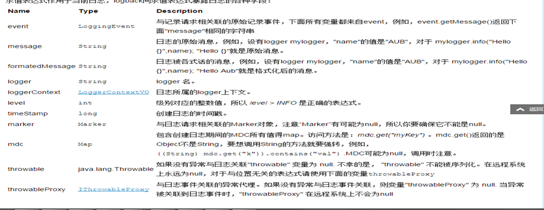
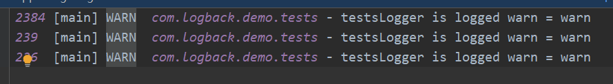
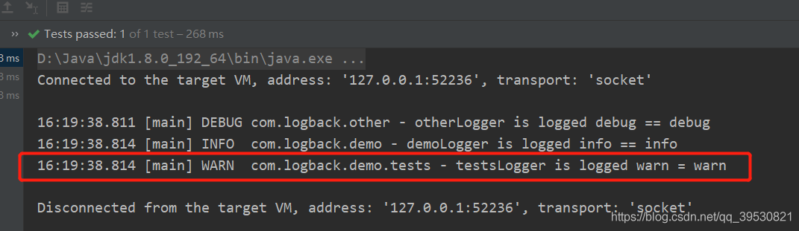
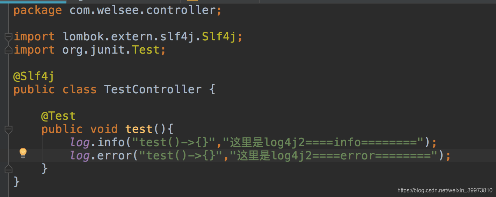
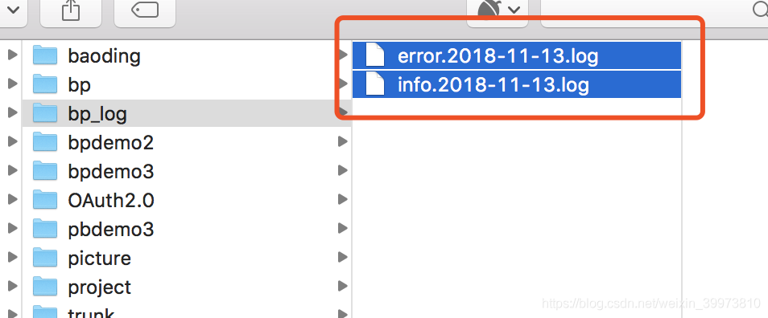
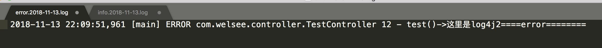
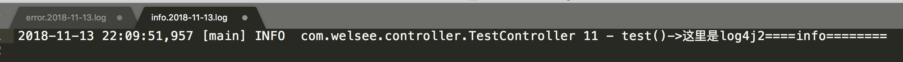

# 1、Slf4j

## 1.1、Slf4j简介

- SLF4J，即简单日志门面（Simple Logging Facade for Java），不是具体的日志解决方案，它只服务于各种各样的日志系统。实际上，SLF4J所提供的核心API是一些接口以及一个LoggerFactory的工厂类。从某种程度上，SLF4J有点类似JDBC，不过比JDBC更简单，在JDBC中，你需要指定驱动程序，而在使用SLF4J的时候，不需要在代码中或配置文件中指定你打算使用那个具体的日志系统。如同使用JDBC基本不用考虑具体数据库一样，SLF4J提供了统一的记录日志的接口，只要按照其提供的方法记录即可，最终日志的格式、记录级别、输出方式等通过具体日志系统的配置来实现，因此可以在应用中灵活切换日志系统。
- slf4j等于commons-logging，是各种日志实现的通用入口，会根据classpath中存在下面哪一个Jar来决定具体的日志实现库。

## 1.2、Slf4j优势

- 在你的开源库或者私有库中使用SLF4J，可以使它独立于任何的日志实现，这就意味着不需要管理多个库和多个日志文件。你的客户端将会体会到这一点。
- SLF4J提供了占位日志记录，通过移除对isDebugEnabled(), isInfoEnabled()等等的检查提高了代码的可读性。
- 通过使用日志记录方法，直到你使用到的时候，才会去构造日志信息（字符串），这就同时提高了内存和CPU的使用率。
- 做一个侧面的说明，越少的临时字符串，垃圾回收器就意味着越少的工作，这就意味着为你的应用程序提供更好的吞吐量和性能。

## 1.3、Slf4j使用实例


```
 1 public class Demo1 {
 2     private final static Logger slf4jLogger = LoggerFactory.getLogger(Demo1.class);
 3     private final static org.apache.log4j.Logger log4jLogger =         
 4                                       org.apache.log4j.Logger.getLogger(Demo1.class);
 5     public static void main(String[] args) {
 6                slf4jTest();
 7     }
 8 
 9 
10     public static void slf4jTest(){
11     //new Object[] {new Integer(a),new Integer(b), new Integer(c)}
12          slf4jLogger.debug("slf4j:a={};b={};","1","2");
13         Slf4jLogger.debug("slf4j:a={};b={};c={}",
14            new Integer[]{new  Integer(1),new Integer(2),new Integer(3)});
15     }
16 public static void log4jTest(){
17     If(log4jLogger.isDebugEnabled()){
18     Log4jLogger.debug("slf4j:a={"+1+"};b={"+2+"};");
19     log4jLogger.debug("slf4j:a={"+1+"};b={"+2+"};c={"+3+"}");
20     }
21 }                         
```

# 2、logback

## 2.1、logback简介

logback是由log4j创始人设计的又一个开源日志组件。当前分成三个模块：

- logback-core是其它两个模块的基础模块。
- logback-classic是log4j的一个 改良版本。此外logback-classic完整实现SLF4J API，使你可以很方便地更换成其它日志系统，如log4j或JDK14 Logging。
- logback-access访问模块与Servlet容器集成提供通过Http来访问日志的功能。

## 2.2、logback相对于log4j的优势

- **更快的实现**

  ​	Logback的内核重写了，在一些关键执行路径上性能提升10倍以上。而且logback不仅性能提升了，初始化内存加载也更小了。

- **Logback-classic非常自然实现了SLF4j Logback-classic实现了SLF4j。**

  ​	在使用SLF4j中，你都感觉不到logback-classic。而且因为logback-classic非常自然地实现了SLF4J，所以切换到log4j或者其他，非常容易，只需要提供成另一个jar包就OK，根本不需要去动那些通

　　过SLF4JAPI实现的代码。

- **自动重新加载配置文件**

  ​	当配置文件修改了，Logback-classic能自动重新加载配置文件。扫描过程快且安全，它并不需要另外创建一个扫描线程。这个技术充分保证了应用程序能跑得很欢在JEE环境里面。

- **谨慎的模式和非常友好的恢复**

  ​	在谨慎模式下，多个FileAppender实例跑在多个JVM下，能够安全地写道同一个日志文件。RollingFileAppender会有些限制。Logback的FileAppender和它的子类包括RollingFileAppender能够非常友好地从I/O异常中恢复。

- **配置文件可以处理不同的情况**

  ​	开发人员经常需要判断不同的Logback配置文件在不同的环境下（开发，测试，生产）。而这些配置文件仅仅只有一些很小的不同，可以通过,和来实现，这样一个配置文件就可以适应多个环境。

- **Filters（过滤器）**

  ​	有些时候，需要诊断一个问题，需要打出日志。在log4j，只有降低日志级别，不过这样会打出大量的日志，会影响应用性能。在Logback，你可以继续保持那个日志级别而除掉某种特殊情况，

  如alice这个用户登录，她的日志将打在DEBUG级别而其他用户可以继续打在WARN级别。要实现这个功能只需加4行XML配置。可以参考MDCFIlter 

- **SiftingAppender（一个非常多功能的Appender）**

  ​	它可以用来分割日志文件根据任何一个给定的运行参数。如，SiftingAppender能够区别日志事件跟进用户的Session，然后每个用户会有一个日志文件。

- **自动压缩已经打出来的log**

  ​	RollingFileAppender在产生新文件的时候，会自动压缩已经打出来的日志文件。压缩是个异步过程，所以甚至对于大的日志文件，在压缩过程中应用不会受任何影响。

- **堆栈树带有包版本**

  ​	Logback在打出堆栈树日志时，会带上包的数据。

- **自动去除旧的日志文件**

　　　　通过设置TimeBasedRollingPolicy或者SizeAndTimeBasedFNATP的maxHistory属性，你可以控制已经产生日志文件的最大数量。如果设置maxHistory为12，那那些log文件超过12个月的都会被自动移除。

## 2.3、Logback架构

包括三个类：**Logger，Appender和Layout**。

- Logger， 是log信息的上下文，是跟应用交互以生成log信息之用；
- Appender，负责日志输出的组件；
- Layout，用来格式化日志信息等。

## 2.4 日志级别

logback有5种级别，分别是TRACE < DEBUG < INFO < WARN < ERROR，定义于ch.qos.logback.classic.Level类中。

### 2.4.1 日志级别

Trace:是追踪，就是程序推进以下，你就可以写个trace输出，所以trace应该会特别多，不过没关系，我们可以设置最低日志级别不让他输出.

Debug:指出细粒度信息事件对调试应用程序是非常有帮助的.

Info:消息在粗粒度级别上突出强调应用程序的运行过程.

Warn:输出警告及warn以下级别的日志.

Error:输出错误信息日志.

此外OFF表示关闭全部日志，ALL表示开启全部日志。

### 2.4.2 级别等级

等级从低到高分别是TRACE < DEBUG < INFO < WARN < ERROR

## 2.5、logback配置文件（logback.xml）的加载顺序

1. 如果配置了 指定了 logback.configurationFile属性,将使用这个属性的地址 比如 启动的时候,指定了  java -Dlogback.configurationFile=/path/to/config.xml  xxxxxx
2. 如果没有配置上面的属性, 将会在classpath中查找  logback.groovy 文件
3. 如果没有找到文件, 将会在classpath中查找  logback-test.xml 文件
4. 如果没有找到文件, 将会在classpath中查找  logback.xml 文件
5. 如果没有找到文件, 如果是 jdk6+,那么会调用ServiceLoader 查找 com.qos.logback.classic.spi.Configurator接口的第一个实现类
6. 如果上面都没有,将自动使用ch.qos.logback.classic.BasicConfigurator,在控制台输出日志

　　（对源码感兴趣可参考：http://feitianbenyue.iteye.com/blog/2205482）

## 2.6、logback实例

```xml
<configuration scan="true" scanPeriod="60 seconds" debug="false">  
      <!-- 其他配置省略-->  
</configuration>
Scan：当此属性设置为true时，配置文件如果发生改变，将会被重新加载，默认值为true。
scanPeriod：设置监测配置文件是否有修改的时间间隔，如果没有给出时间单位，默认单位是毫秒。当scan为true时，此属性生效。默认的时间间隔为1分钟。
Debug：当此属性设置为true时，将打印出logback内部日志信息，实时查看logback运行状态。默认值为false。
consoleAppender   输出到控制台
<appender name="STDOUT" class="ch.qos.logback.core.ConsoleAppender">   
    <!-- encoder 默认配置为PatternLayoutEncoder -->   
    <encoder>   
      <pattern>%d{HH:mm:ss.SSS} [%thread] %-5level %logger{36} - %msg%n</pattern>   
    </encoder>   
  </appender>   
  <root level="INFO">             
    <appender-ref ref="STDOUT" />   
  </root>  
```


<!--格式化输出：%d表示日期，%thread表示线程名，%-5level：级别从左显示5个字符宽度%msg：日志消息，%n是换行符-->

## 2.7、各组件说明

### 2.7.1、Appender

#### 2.7.1.1、 fileAppender

```xml
<appender name="FILE" class="ch.qos.logback.core.FileAppender">
       <file>E:/logs/demo2.log</file>
       <append>true</append>
       <encoder>
       <pattern>%-4relative [%thread] %-5level %logger{35} - %msg%n
       </pattern>
       </encoder>
</appender>
File：文件存储位置
Append：默认true，在后面追加；为false时，每次会清空之前的内容
```

#### 2.7.1.2、RollingFile（每天生成一个文件）

　　　　

```xml
<appender name="RollingFile"     class="ch.qos.logback.core.rolling.RollingFileAppender">
<rollingPolicy class="ch.qos.logback.core.rolling.TimeBasedRollingPolicy">
       <fileNamePattern>E:/logs/logFile.%d{yyyy-MM-dd}.log</fileNamePattern>
       <maxHistory>30</maxHistory>
</rollingPolicy>
<encoder>
       <pattern>%-4relative [%thread] %-5level %logger{35} - %msg%n</pattern>
</encoder>
       </appender>
      maxHistory:日志保存的最大数量，超过这个时间自动删除
```

#### 2.7.1.3、RollingFileAppender

```xml
<appender name="RollingFileAppender"class="ch.qos.logback.core.rolling.RollingFileAppender">
    <file>E:/logs/log/test.log</file>
    <rollingPolicy class="ch.qos.logback.core.rolling.FixedWindowRollingPolicy">
    <fileNamePattern>E:/logs/tests.%i.log.zip</fileNamePattern>
    <minIndex>1</minIndex>
    <maxIndex>3</maxIndex>
    </rollingPolicy>
    <triggeringPolicy class="ch.qos.logback.core.rolling.SizeBasedTriggeringPolicy">
          <maxFileSize>1MB</maxFileSize>
    </triggeringPolicy>
    <encoder>
         <pattern>%-4relative [%thread] %-5level %logger{35} - %msg%n
    </pattern>
    </encoder>
</appender>
maxFileSize：当文件大小达到1mb时会将改文件打成一个压缩包并新建一个文件
minIndex：保存的压缩包个数
maxIndex：保存的压缩包最大个数（不能超过12，超过默认为12） 
```

　　另外还有SocketAppender、SMTPAppender、DBAppender、SyslogAppender、SiftingAppender，并不常用，这些就不在这里讲解了，大家可以参考官方文档。

### 2.7.2、Filter

　　过滤器，执行一个过滤器会有返回个枚举值，即DENY，NEUTRAL，ACCEPT其中之一。返回DENY，日志将立即被抛弃不再经过其他过滤器；返回NEUTRAL，有序列表里的下个过滤器过接着处理日志；返回ACCEPT，日志会被立即处理，不再经过剩余过滤器。过滤器被添加到<Appender> 中，为<Appender> 添加一个或多个过滤器后，可以用任意条件对日志进行过滤。<Appender> 有多个过滤器时，按照配置顺序执行

　　1、LevelFilter： 级别过滤器，根据日志级别进行过滤。如果日志级别等于配置级别，过滤器会根据onMathch 和 onMismatch接收或拒绝日志。有以下子节点：

```xml
<level>:设置过滤级别
 
<onMatch>:用于配置符合过滤条件的操作
 
<onMismatch>:用于配置不符合过滤条件的操作
 
<filter class="ch.qos.logback.classic.filter.LevelFilter">  
 
    <level>INFO</level> 
 
    <onMatch>ACCEPT</onMatch>  
 
    <onMismatch>DENY</onMismatch>  
 
</filter>
```

　　

 

　　2、ThresholdFilter： 临界值过滤器，过滤掉低于指定临界值的日志。当日志级别等于或高于临界值时，过滤器返回NEUTRAL；当日志级别低于临界值时，日志会被拒绝。

　　　　例如：过滤掉所有低于INFO级别的日志。

​      

```xml
<!-- 过滤掉 TRACE 和 DEBUG 级别的日志--> 
 
    <filter class="ch.qos.logback.classic.filter.ThresholdFilter">  
 
            <level>INFO</level>  
 
    </filter>
```

　　3、EvaluatorFilter： 求值过滤器，评估、鉴别日志是否符合指定条件（需导org.codehaus.janino .jar）

　　　　

```xml
<filter class="ch.qos.logback.core.filter.EvaluatorFilter">
 
<evaluator> <!-- 默认为 ch.qos.logback.classic.boolex.JaninoEventEvaluator -->  
 
   <expression>return message.contains(“billing”);</expression>（只显示包含billings的日志）
 
</evaluator>  
 
<OnMatch>ACCEPT </OnMatch> 
 
<OnMismatch>DENY</OnMismatch> 
```

　　

 

 

### 2.7.3、Matcher

String类的matches()方法进行模式匹配，但会导致每次调用过滤器时都会创建一个新的Pattern对象，为了消除这种开销，可以预定义一个或多个matcher对象，定以后就可以在求值表达式中重复引用。<matcher>是<evaluator>的子标签。<matcher>中包含两个子标签，一个是<name>，用于定义matcher的名字，求值表达式中使用这个名字来引用matcher；另一个是<regex>，用于配置匹配条件。

```xml
<filter class="ch.qos.logback.core.filter.EvaluatorFilter">   
      <evaluator>           
        <matcher>   
          <Name>odd</Name>   
          <!-- 过滤掉奇数编号的语句 -->   
          <regex>statement [13579]</regex>   
        </matcher>  
        <expression>odd.matches(formattedMessage)</expression>   
      </evaluator>   
      <OnMismatch>NEUTRAL</OnMismatch>   
      <OnMatch>DENY</OnMatch>   
    </filter>
```

### 2.7.4、Logger

#### 2.7.4.1、Logger继承结构

Logger context的继承类似于java的继承。

- 所有的logger都是root logger的后代；
- 如果一个logger没有指定level，那么它的level将继承上一个祖先logger.
- root logger的默认level是DEBUG。

注意：日志级别分为5种，从小到大依次是TRACE, DEBUG, INFO, WARN 和ERROR。低于指定级别的日志将不打印，例如我们指定日志级别是INFO，那么低于INFO的TRACE和DEBUG都不打印。

#### 2.7.4.2、参数说明

　　用来设置某一个包或者具体的某一个类的日志打印级别、以及指定<appender>。<loger>仅有一个name属性，一个可选的level和一个可选的addtivity属性。

- name:用来指定受此loger约束的某一个包或者具体的某一个类。
- level:用来设置打印级别，大小写无关：TRACE, DEBUG, INFO, WARN, ERROR, ALL 和 OFF，还有一个特俗值INHERITED或者同义词NULL，代表强制执行上级的级别。如果未设置此属性，那么当前loger将会继承上级的级别。
- addtivity:是否向上级loger传递打印信息。默认是true。
  <loger>可以包含零个或多个<appender-ref>元素，标识这个appender将会添加到这个loger。

```xml
<logger name="com.demo1" additivity="false"> 
       <level value="error" /> 
       <appender-ref ref="STDOUT" /> 
</logger>
```

### 2.7.5、root

　　也是<loger>元素，但是它是根loger。只有一个level属性，应为已经被命名为"root".

　　level:用来设置打印级别，大小写无关：TRACE, DEBUG, INFO, WARN, ERROR, ALL 和 OFF，不能设置为INHERITED或者同义词NULL。***默认是DEBUG。***

　　***<root>可以包含零个或多个<appender-ref>元素，标识这个appender将会添加到这个loger。***

```xml
<root level="DEBUG">
　　<appender-ref ref="STDOUT" />
　　<appender-ref ref="FILE" />
　　<appender-ref ref="RollingFile" />
　　<appender-ref ref="RollingFileAppender" />
</root>
```

# 3、logback配置和使用

## 3.1、 配置pom.xml

1. logback需要*logback-core*、*logback-classic*、*slf4j-api*、*logback-access*这4个依赖。

2. 其中logback-classic已经包含了logback-core和slf4j-api依赖，由于Maven依赖的传递性，所以我们只需导入logback-classic和logback-access依赖即可。

```
    <dependencies>
        <dependency>
          <groupId>ch.qos.logback</groupId>
          <artifactId>logback-classic</artifactId>
          <version>1.3.0-alpha4</version>
        </dependency>
        <dependency>
          <groupId>ch.qos.logback</groupId>
          <artifactId>logback-access</artifactId>
          <version>1.3.0-alpha4</version>
        </dependency>
    </dependencies>
```

## 3.2、 初始化步骤

1. 在类路径中查找logback-test.xml文件。

2. 如果没有找到，则在类路径中查找logback.groovy文件。

3. 如果没有找到，则在类路径中查找logback.xml文件。

4. 如果没有找到，则尝试使用ServiceLoader加载classpath下META-INF\services\ch.qos.logback.classic.spi.Configurator文件中配置的com.qos.logback.classic.spi.Configurator实现类(Configurator文件内容为实现类的完全限定类名)。

5. 如果还是没有找到，则会加载默认配置，日志默认会输出到控制台，也就是使用BasicConfigurator，BasicConfigurator也是com.qos.logback.classic.spi.Configurator接口的实现类。

```
public class BasicConfigurator extends ContextAwareBase implements Configurator {

    public BasicConfigurator() {
    }

    public void configure(LoggerContext lc) {
        addInfo("Setting up default configuration.");
        
        ConsoleAppender<ILoggingEvent> ca = new ConsoleAppender<ILoggingEvent>();
        ca.setContext(lc);
        ca.setName("console");
        LayoutWrappingEncoder<ILoggingEvent> encoder = new LayoutWrappingEncoder<ILoggingEvent>();
        encoder.setContext(lc);
        
 
        // same as 
        // PatternLayout layout = new PatternLayout();
        // layout.setPattern("%d{HH:mm:ss.SSS} [%thread] %-5level %logger{36} - %msg%n");
        TTLLLayout layout = new TTLLLayout();
 
        layout.setContext(lc);
        layout.start();
        encoder.setLayout(layout);
        
        ca.setEncoder(encoder);
        ca.start();
        
        Logger rootLogger = lc.getLogger(Logger.ROOT_LOGGER_NAME);
        rootLogger.addAppender(ca);
    }
}
```


# 4、 基本的配置和代码demo

在resources下面创建logback.xml文件，添加以下配置:

```xml
<?xml version="1.0" encoding="UTF-8"?>
<configuration>
    <appender name="STDOUT" class="ch.qos.logback.core.ConsoleAppender">
        <encoder>
            <pattern>%d{HH:mm:ss.SSS} [%thread] %-5level %logger{36} - %msg%n</pattern>
        </encoder>
    </appender>

    <root level="debug">
        <appender-ref ref="STDOUT"/>
    </root>
</configuration>
123456789101112
```

创建一个Example：

```java
@Slf4j
public class Example {
    public static void main(String[] args) {
        log.info("Example log from {}", Example.class.getSimpleName());
    }
}

1234567
```

运行得到以下结果：
09:59:36.226 [main] INFO com.logback.demo.Example - Example log from Example。


@Slf4j是来自lombok的注解，相当于如下代码：

```java
private static final Logger log = LoggerFactory.getLogger(Example.class);
```

可以从编译后的class文件，反编译后看到。

## 4.1、 日志级别输出效果

代码：

```java
public class LoggerHierarchyExample {

    @Test
    public void testLoggerHierarchy() {
        // 祖先logger，未指定级别，它将继承root logger的级别，root logger默认debug
        // SLF4J's的抽象logger是没有实现setLevel方法，这里是用ch.qos.logback.classic.Logger
        Logger ancestorLogger = (Logger) LoggerFactory.getLogger("com");
        // 父logger，指定级别为info，不继承祖先logger的级别
        Logger parentLogger = (Logger) LoggerFactory.getLogger("com.logback");
        parentLogger.setLevel(Level.INFO);
        // 子logger，未指定级别，继承最近的父logger的日志级别，为info。
        Logger childLogger = (Logger) LoggerFactory.getLogger("com.logback.demo");

        ancestorLogger.debug("This message is logged because debug == debug");
        ancestorLogger.trace("This message is not logged because trace < debug");
        parentLogger.warn("This message is logged because WARN > INFO.");
        parentLogger.debug("This message is not logged because DEBUG < INFO.");
        childLogger.info("INFO == INFO");
        childLogger.debug("DEBUG < INFO");
        
    }


    @Test
    public void testRootLogger() {
        // 没有指定level，继承root logger的level为debug
        Logger logger = (Logger) LoggerFactory.getLogger("com.logback");
        logger.debug("Hi there!");

        // root logger,重新设定level为error
        Logger rootLogger = (Logger) LoggerFactory.getLogger(org.slf4j.Logger.ROOT_LOGGER_NAME);
        logger.debug("This message is logged because DEBUG == DEBUG.");
        rootLogger.setLevel(Level.ERROR);

        logger.warn("This message is not logged because WARN < ERROR.");
        logger.error("This is logged.");
    }
}
1234567891011121314151617181920212223242526272829303132333435363738
```

testLoggerHierarchy()结果为：

```bash
10:49:16.713 [main] DEBUG com - This message is logged because debug == debug
10:49:16.715 [main] WARN  com.logback - This message is logged because WARN > INFO.
10:49:16.715 [main] INFO  com.logback.demo - INFO == INFO
123
```

testRootLogger() 结果为：

```bash
10:50:06.087 [main] DEBUG com.logback - Hi there!
10:50:06.089 [main] DEBUG com.logback - This message is logged because DEBUG == DEBUG.
10:50:06.089 [main] ERROR com.logback - This is logged.
123
```

## 4.2、 参数化打印日志

实际编码中，看到很多如下日志打印方式：

```java
log.debug("Current count is " + count);
1
```

这种方式的弊端：即使日志打印level设定为info，都会执行字符串的拼接，无疑会白白的损耗性能。

以下方式也不可取，虽然不执行拼接，但仍然做了一次判断。

```java
if(log.isDebugEnabled()) { 
  log.debug("Current count is " + count);
}
123
```

更好的方式是**使用占位符的方式** , 避免字符串拼接，避免日志level的判断。

```java
log.debug("Current count is {}" , count);
1
```

占位符{}允许接收任何object，并且调用其toString方法来记录日志。

```java
@Slf4j
public class ParameterizedExample {

    @Test
    public void testParameterizedExample() {
        String message = "This is a String";
        Integer zero = 0;
        User user = new User().setId("123").setName("Tim");
        try {
            log.debug("Logging message: {}", message);
            log.debug("Going to divide {} by {}", 42, zero);
            log.debug("user is {}", user);
            int result = 42 / zero;
        } catch (Exception e) {
            log.error("Error dividing {} by {} ", 42, zero, e);
        }
    }
}

12345678910111213141516171819
@Data
@Accessors(chain = true)
public class User {
    private String id;
    private String name;
}
```

# 5、 详细配置

logback默认行为：假如它没有找到任何配置文件，它将默认创建一个ConsoleAppender，并且关联到root logger。

## 5.1、 logback查找配置文件顺序

- logback按照顺序在classpath中查找配置文件：logback-test.xml, logback.groovy, logback.xml ；
- 假如上面的file都没有找到，则启动Java的 [ServiceLoader](https://docs.oracle.com/javase/6/docs/api/java/util/ServiceLoader.html) 查找com.qos.logback.classic.spi.Configurator的实现；
- 假如以上都没有，则启动logback默认的行为: 创建一个ConsoleAppender，并且关联到root logger。

## 5.2、 基本配置解释

所有的配置都在里面。

```xml
<appender name="STDOUT" class="ch.qos.logback.core.ConsoleAppender">
        <encoder>
            <pattern>%d{HH:mm:ss.SSS} [%thread] %-5level %logger{36} - %msg%n</pattern>
        </encoder>
    </appender>
12345
```

这里配置了一个Appender，类型是ConsoleAppender，名称是STDOUT。

```xml
 <root level="debug">
        <appender-ref ref="STDOUT"/>
    </root>
123
```

标签是root logger，level是debug，关联到STDOUT的Appender。

## 5.3、 解决日志故障配置

logback的配置文件可以很复杂，因此logback提供内置机制来排查故障。为查看logback自身的日志，可以打开debug模式：

```xml
<configuration debug="true">
1
```

打印出的日志如下所示：

```bash
15:17:24,550 |-INFO in ch.qos.logback.classic.LoggerContext[default] - Could NOT find resource [logback-test.xml]
15:17:24,550 |-INFO in ch.qos.logback.classic.LoggerContext[default] - Could NOT find resource [logback.groovy]
15:17:24,550 |-INFO in ch.qos.logback.classic.LoggerContext[default] - Found resource [logback.xml] at [file:/E:/10_git/LogbackDemo/target/classes/logback.xml]
15:17:24,699 |-INFO in ch.qos.logback.core.joran.action.AppenderAction - About to instantiate appender of type [ch.qos.logback.core.ConsoleAppender]
15:17:24,703 |-INFO in ch.qos.logback.core.joran.action.AppenderAction - Naming appender as [STDOUT]
15:17:24,733 |-INFO in ch.qos.logback.core.joran.action.NestedComplexPropertyIA - Assuming default type [ch.qos.logback.classic.encoder.PatternLayoutEncoder] for [encoder] property
15:17:24,775 |-INFO in ch.qos.logback.classic.joran.action.RootLoggerAction - Setting level of ROOT logger to DEBUG
15:17:24,775 |-INFO in ch.qos.logback.core.joran.action.AppenderRefAction - Attaching appender named [STDOUT] to Logger[ROOT]
15:17:24,776 |-INFO in ch.qos.logback.classic.joran.action.ConfigurationAction - End of configuration.
15:17:24,778 |-INFO in ch.qos.logback.classic.joran.JoranConfigurator@5606c0b - Registering current configuration as safe fallback point
15:17:24.782 [main] INFO  com.logback.demo.Example - Example log from Example
Disconnected from the target VM, address: '127.0.0.1:50977', transport: 'socket'

Process finished with exit code 0

123456789101112131415
```

## 5.4、 自动重载配置

```xml
<configuration debug="true" scan="true" scanPeriod="15 seconds">
1
```

scan=true,表示打开自动扫描配置，默认为false。scanPeriod="15 seconds"表示每15秒扫描一次，也可以设置milliseconds, seconds, minutes, or hour，如果没设置，默认为1分钟。

## 5.5、 修改Loggers

我们可以给任何logger配置level，如下配置：

```xml
<?xml version="1.0" encoding="UTF-8"?>
<configuration debug="false" scan="true" scanPeriod="15 seconds">
    <appender name="STDOUT" class="ch.qos.logback.core.ConsoleAppender">
        <encoder>
            <pattern>%d{HH:mm:ss.SSS} [%thread] %-5level %logger{36} - %msg%n</pattern>
        </encoder>
    </appender>
    <logger name="com.logback.other" level="INFO"/>
    <logger name="com.logback.demo.tests" level="WARN"/>
    <root level="debug">
        <appender-ref ref="STDOUT"/>
    </root>
</configuration>
12345678910111213
public class ModifyingLoggersExample {
    @Test
    public void testModify() {
        Logger otherLogger = LoggerFactory.getLogger("com.logback.other");
        Logger demoLogger = LoggerFactory.getLogger("com.logback.demo");
        Logger testsLogger = LoggerFactory.getLogger("com.logback.demo.tests");

        otherLogger.debug("otherLogger is logged debug == debug");
        demoLogger.debug("demoLogger is not logged debug < info");
        demoLogger.info("demoLogger is logged info == info");
        testsLogger.info("testsLogger is not logged warn > info");
        testsLogger.warn("testsLogger is logged warn = warn");
    }
}

123456789101112131415
```

结果：

```bash
15:52:17.359 [main] DEBUG com.logback.other - otherLogger is logged debug == debug
15:52:17.361 [main] INFO  com.logback.demo - demoLogger is logged info == info
15:52:17.362 [main] WARN  com.logback.demo.tests - testsLogger is logged warn = warn
123
```

Logger同样能继承root logger的appender-ref。

## 5.6、 变量替代

```xml
<property name="LOG_DIR" value="/var/log/application" />
<appender name="FILE" class="ch.qos.logback.core.FileAppender">
    <file>${LOG_DIR}/tests.log</file>
    <append>true</append>
    <encoder>
        <pattern>%-4relative [%thread] %-5level %logger{35} - %msg%n</pattern>
    </encoder>
</appender>
12345678
```

我们声明一个 名称是LOG_DIR, 值是/var/log/application，logback会将它的值注入到${LOG_DIR}。

# 6、 Appenders

logback支持不进支持log以文件形式输出，还支持其他的形式。

## 6.1、 ConsoleAppender

控制台输出，利用System.out 或 System.err输出。

## 6.2、 FileAppender

FileAppender是把log输出到文件。

```xml
<?xml version="1.0" encoding="UTF-8"?>
<configuration debug="false" scan="true" scanPeriod="15 seconds">
    <appender name="STDOUT" class="ch.qos.logback.core.ConsoleAppender">
        <encoder>
            <pattern>%d{HH:mm:ss.SSS} [%thread] %-5level %logger{36} - %msg%n</pattern>
        </encoder>
    </appender>

    <appender name="FILE" class="ch.qos.logback.core.FileAppender">
        <file>tests.log</file>
        <append>true</append>
        <encoder>
            <pattern>%-4relative [%thread] %-5level %logger{35} - %msg%n</pattern>
        </encoder>
    </appender>

    <logger name="com.logback.demo" level="INFO"/>
    <logger name="com.logback.demo.tests" level="WARN">
        <appender-ref ref="FILE"/>
    </logger>
    <root level="debug">
        <appender-ref ref="STDOUT"/>
    </root>
</configuration>
123456789101112131415161718192021222324
```

运行ModifyingLoggersExample的testModify可以看到工程中多了一个文件tests.log.
我们可以同时在tests.log文件和控制台看到同样的输出信息；


这是因为logger继承了来自 的<appender-ref , 如果要阻止，只需如下配置：添加additivity=“false”

```xml
<logger name="com.baeldung.logback.tests" level="WARN" additivity="false" > 
    <appender-ref ref="FILE" /> 
</logger> 
123
```

## 6.3、 RollingFileAppender

有时候我们不需要将log信息一直输出到同个文件，而是根据时间，文件大小或者两者，将历史文件打包输出。

```xml
<property name="LOG_FILE" value="LogFile" />
    <property name="LOG_DIR" value="/var/logs/application" />
    <appender name="ROLL_FILE" class="ch.qos.logback.core.rolling.RollingFileAppender">
        <file>${LOG_DIR}/${LOG_FILE}.log</file>
        <rollingPolicy class="ch.qos.logback.core.rolling.TimeBasedRollingPolicy">
            <!-- 每日滚动打包 -->
            <fileNamePattern>${LOG_DIR}/${LOG_FILE}.%d{yyyy-MM-dd}.gz</fileNamePattern>
            <!-- 保存30天日志，文件总大小在3GB -->
            <maxHistory>30</maxHistory>
            <totalSizeCap>3GB</totalSizeCap>
        </rollingPolicy>
        <encoder>
            <pattern>%-4relative [%thread] %-5level %logger{35} - %msg%n</pattern>
        </encoder>
    </appender>
123456789101112131415
```

这里定义了文件路径和文件名，使用基于时间的TimeBasedRollingPolicy，不仅定义文件名，而且定义了每天打包一次文件。也可以按月打包一次：

```xml
<fileNamePattern>${LOG_DIR}/%d{yyyy/MM}/${LOG_FILE}.gz</fileNamePattern>
1
```

## 6.4、 自定义Appender

参考这里：https://www.baeldung.com/custom-logback-appender。

# 7、 Layouts

Layouts用于格式化log信息。也可以自定义Layout，但通常我们使用默认的PatternLayout 。

```xml
<encoder>
    <pattern>%d{HH:mm:ss.SSS} [%thread] %-5level %logger{36} - %msg%n</pattern>
</encoder>
123
```

- %d{HH:mm:ss.SSS}，表示小时，分钟，秒，毫秒；
- [%thread] ，表示线程；
- %-5level，表示日志level；
- %logger{36}，表示logger的名，截取35个字符；
- %msg%n，%msg日志信息，%n表示换行。
  可以参考：http://logback.qos.ch/manual/layouts.html#conversionWord

# 8、 总结

我们学习了Logback的基本功能，了解了三个组件：Logger，Appender和Layouts，比较详细讲解了主要使用的FileAppender和RollingFileAppender.
代码地址：https://github.com/tobebetter9527/LogbackDemo。

# 9、综合logback.xml

```xml
<configuration scan="true" scanPeriod="30 seconds">
  <!-- 自定义属性，通过${}访问 -->
  <property name="filePath" value="/logs/" />
    
  <!-- 输出到控制台 -->
  <appender name="STDOUT" class="ch.qos.logback.core.ConsoleAppender">
    <encoder>
      <pattern>%d{HH:mm:ss.SSS} [%thread] %-5level %logger{36} %msg%n</pattern>
    </encoder>
  </appender>
  
  <!-- 输出到文件 -->
  <appender name="FILE" class="ch.qos.logback.core.rolling.RollingFileAppender">
    <!-- 文件路径 -->
    <file>${filePath}app.log</file>
    <!-- 日志输出格式化 -->
    <encoder>
        <pattern>%date [%level] [%thread] %logger{80} [%file : %line] %msg%n</pattern>
    </encoder>
    
    <!-- 滚动策略 -->
    <rollingPolicy class="ch.qos.logback.core.rolling.TimeBasedRollingPolicy">
      <!-- 每日滚动 -->
      <fileNamePattern>${filePath}app.log%d{yyyy-MM-dd}.log</fileNamePattern>
     
      <!-- 将30天的日志总大小限制在3GB内  -->
      <maxHistory>30</maxHistory>
      <totalSizeCap>3GB</totalSizeCap>
    </rollingPolicy>
  </appender> 
  
  <!-- 基于尺寸和时间的滚动策略 -->
  <appender name="ROLLING" class="ch.qos.logback.core.rolling.RollingFileAppender">
    <file>${filePath}other.log</file>
    <rollingPolicy class="ch.qos.logback.core.rolling.SizeAndTimeBasedRollingPolicy">
      <fileNamePattern>${filePath}other.log%d{yyyy-MM-dd}%i.log</fileNamePattern>
       <!-- 每个日志文件最多100MB，保存60天的历史记录，总大小不超过20GB -->
       <maxFileSize>1KB</maxFileSize>    
       <maxHistory>60</maxHistory>
       <totalSizeCap>20GB</totalSizeCap>
    </rollingPolicy>
    <encoder>
        <pattern>%date [%level] [%thread] %logger{80} [%file : %line] %msg%n</pattern>
    </encoder>
  </appender>
  
  <!-- name属性指定包名或者完全限定类名 -->
  <logger name="service.OtherService" level="DEBUG">
        <appender-ref ref="ROLLING" />
  </logger>

  <!-- 根logger -->
  <root level="DEBUG">
    <!-- 配置输出源 -->
    <appender-ref ref="STDOUT" />
    <appender-ref ref="FILE" />
  </root>
</configuration>
```

测试：

```xml
public class HelloService {
    private final static Logger logger = LoggerFactory.getLogger(HelloService.class);
    
    public static void main(String[] args) {
        //根据logback.xml中配置的日志级别，TRACE级别的日志将不会输出，只会输出DEBUG及以上级别的日志。
        //TRACE < DEBUG < INFO <  WARN < ERROR
        logger.trace("---------------trace---------------");
        logger.debug("---------------debug---------------");
        logger.info("---------------info---------------");
        logger.warn("---------------warn---------------");
        logger.error("---------------error---------------");
    }
}
```

# 10、springboot与logback的一些记录

## 10.1、logback配置info,error分开记录

> logback.xml配置,注意这里如果使用logback-spring.xml命名的话会有问题,具体原因还未发现

```xml
<?xml version="1.0" encoding="UTF-8"?>
<configuration>

    <!--日志输出路径-->
    <property name="LOG_HOME" value="/Users/lixinyu/workspace"/>
    
    <!--控制台日志输出配置-->
    <appender name="consoleLog" class="ch.qos.logback.core.ConsoleAppender">
        <!--对输出日志进行格式化-->
        <encoder>
            <!-- %d日期,%p日志级别,%file文件名,%line所在行数,%m输出的信息,%n换行 -->
            <pattern>%d %p (%file:%line\)- %m%n</pattern>
            <!--字符编码-->
            <charset>UTF-8</charset><!--此处设置字符集-->
        </encoder>
    </appender>


    <!--日志文件配置info-->
    <appender name="fileInfoLog" class="ch.qos.logback.core.rolling.RollingFileAppender">
        <!--如果只是想要 Info 级别的日志，只是过滤 info 还是会输出 Error 日志，因为 Error 的级别高，
        所以我们使用下面的策略，可以避免输出 Error 的日志-->
        <filter class="ch.qos.logback.classic.filter.LevelFilter">
            <!--过滤 Error-->
            <level>ERROR</level>
            <!--匹配到就禁止-->
            <onMatch>DENY</onMatch>
            <!--没有匹配到就允许-->
            <onMismatch>ACCEPT</onMismatch>
        </filter>

        <rollingPolicy class="ch.qos.logback.core.rolling.TimeBasedRollingPolicy">
            <!--文件路径,定义了日志的切分方式——把每一天的日志归档到一个文件中,以防止日志填满整个磁盘空间-->
            <FileNamePattern>${LOG_HOME}/bp_log/info.%d.log</FileNamePattern>
        </rollingPolicy>

        <!--日志输出编码格式化-->
        <encoder>
            <charset>UTF-8</charset>
            <pattern>%d [%thread] %-5level %logger{36} %line - %msg%n</pattern>
        </encoder>
    </appender>
    

    <!--日志文件配置error-->
    <appender name="fileErrorLog" class="ch.qos.logback.core.rolling.RollingFileAppender">
        <filter class="ch.qos.logback.classic.filter.ThresholdFilter">
            <!--设置日志级别,过滤掉info日志,只输入error日志-->
            <level>ERROR</level>
        </filter>
        <encoder>
            <pattern>
                %msg%n
            </pattern>
        </encoder>
        <!--滚动策略-->
        <rollingPolicy class="ch.qos.logback.core.rolling.TimeBasedRollingPolicy">
            <!--路径-->
            <fileNamePattern>${LOG_HOME}/bp_log/error.%d.log</fileNamePattern>
        </rollingPolicy>L

        <!--日志输出编码格式化-->
        <encoder>
            <charset>UTF-8</charset>
            <pattern>%d [%thread] %-5level %logger{36} %line - %msg%n</pattern>
        </encoder>
    </appender>


    <root level="INFO">
        <appender-ref ref="consoleLog"/>
    </root>
    <logger name="com.welsee" level="INFO">
        <appender-ref ref="fileInfoLog"/>
        <appender-ref ref="fileErrorLog"/>
    </logger>
</configuration>
1234567891011121314151617181920212223242526272829303132333435363738394041424344454647484950515253545556575859606162636465666768697071727374757677
```


运行测试类



在目录下分别生成info,error两个文件



生成的记录



## 10.2、 Logback的application.yml和logback-spring.xml配置

application.yml：

```yaml
logging:
    pattern:
    # %d（时间）%msg（打印信息）%n换行
      console: "%d - %msg%n"
    #日志输出路径（部署后可以指定部署路径)
    path: E:/ideaspringboot/
    #日志输出到指定文件（部署后可以指定部署路径）
    file: E:/ideaspringboot/sell/sell.log
    level: debug
    #日志级别指定到某个类
    # com.zlt.LoggerTest: debug
```

logback-spring.xml配置：在resource目录下建立名称为logback-spring.xml的文件，做如下配置：

```xml
<?xml version="1.0" encoding="UTF-8" ?>
<configuration>

    <!--输出格式-->
    <appender name="consoleLog" class="ch.qos.logback.core.ConsoleAppender">
        <layout class="ch.qos.logback.classic.PatternLayout">
            <pattern>
                %d - %msg%n
            </pattern>
        </layout>
    </appender>

    <!--输出error文件-->
    <appender name="fileErrorLog" class="ch.qos.logback.core.rolling.RollingFileAppender">
        <filter class="ch.qos.logback.classic.filter.ThresholdFilter">
            <level>ERROR</level>
        </filter>
        <encoder>
            <pattern>
                %msg%n
            </pattern>
        </encoder>
        <!--滚动策略-->
        <rollingPolicy class="ch.qos.logback.core.rolling.TimeBasedRollingPolicy">
            <!--路径-->
            <fileNamePattern>E:/ideaspringboot/sell/error.%d.log</fileNamePattern>
        </rollingPolicy>
    </appender>

    <!--输出info文件-->
    <appender name="fileInfoLog" class="ch.qos.logback.core.rolling.RollingFileAppender">
        <filter class="ch.qos.logback.classic.filter.LevelFilter">
            <!--过滤error日志-->
            <level>ERROR</level>
            <onMatch>DENY</onMatch>
            <onMismatch>ACCEPT</onMismatch>
        </filter>
        <encoder>
            <pattern>
                %msg%n
            </pattern>
        </encoder>
        <!--滚动策略-->
        <rollingPolicy class="ch.qos.logback.core.rolling.TimeBasedRollingPolicy">
            <!--路径-->
            <fileNamePattern>E:/ideaspringboot/sell/info.%d.log</fileNamePattern>
        </rollingPolicy>
    </appender>
    <!--全局应用该日志配置-->
    <root level="info">
        <appender-ref ref = "consoleLog"/>
        <appender-ref ref = "fileErrorLog"/>
        <appender-ref ref = "fileInfoLog"/>
    </root>
</configuration>
```