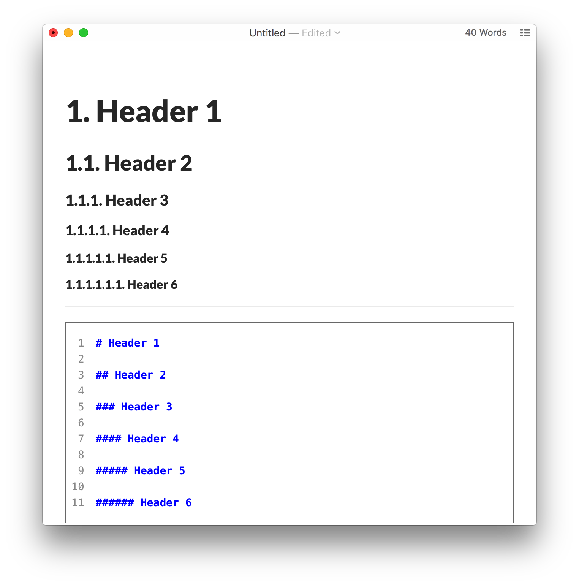

# typora自动编号

> 提示：要了解将这些CSS片段放在哪里，请参阅[添加自定义CSS](http://support.typora.io/Add-Custom-CSS/)。
>
> 打开Typora偏好设置，打开主题文件夹，在主题文件夹中创建base.user.css文件，放置以下内容，则Typora自带的几个主题都会生效。

# 文章中的自动编号

此方法自动将编号添加到文章中的所有标题，如下所示：

[](http://support.typora.io/media/auto-numbering/1.png)

为此，请将以下内容添加到主题文件夹中的base.user.css或[theme] .user.css中。


```
/** initialize css counter */
#write {
    counter-reset: h1
}

h1 {
    counter-reset: h2
}

h2 {
    counter-reset: h3
}

h3 {
    counter-reset: h4
}

h4 {
    counter-reset: h5
}

h5 {
    counter-reset: h6
}

/** put counter result into headings */
#write h1:before {
    counter-increment: h1;
    content: counter(h1) ". "
}

#write h2:before {
    counter-increment: h2;
    content: counter(h1) "." counter(h2) ". "
}

#write h3:before,
h3.md-focus.md-heading:before /** override the default style for focused headings */ {
    counter-increment: h3;
    content: counter(h1) "." counter(h2) "." counter(h3) ". "
}

#write h4:before,
h4.md-focus.md-heading:before {
    counter-increment: h4;
    content: counter(h1) "." counter(h2) "." counter(h3) "." counter(h4) ". "
}

#write h5:before,
h5.md-focus.md-heading:before {
    counter-increment: h5;
    content: counter(h1) "." counter(h2) "." counter(h3) "." counter(h4) "." counter(h5) ". "
}

#write h6:before,
h6.md-focus.md-heading:before {
    counter-increment: h6;
    content: counter(h1) "." counter(h2) "." counter(h3) "." counter(h4) "." counter(h5) "." counter(h6) ". "
}

/** override the default style for focused headings */
#write>h3.md-focus:before,
#write>h4.md-focus:before,
#write>h5.md-focus:before,
#write>h6.md-focus:before,
h3.md-focus:before,
h4.md-focus:before,
h5.md-focus:before,
h6.md-focus:before {
    color: inherit;
    border: inherit;
    border-radius: inherit;
    position: inherit;
    left:initial;
    float: none;
    top:initial;
    font-size: inherit;
    padding-left: inherit;
    padding-right: inherit;
    vertical-align: inherit;
    font-weight: inherit;
    line-height: inherit;
}
```

# TOC中的自动编号

如果要`TOC`显示自动编号的实体，可以尝试使用Typora用户发布的https://pastebin.com/NYugSbXk。

```css
/**************************************
 * Header Counters in TOC
 **************************************/
 
/* No link underlines in TOC */
.md-toc-inner {
    text-decoration: none;
}
 
.md-toc-content {
    counter-reset: h1toc
}
 
.md-toc-h1 {
    margin-left: 0;
    font-size: 1.5rem;
    counter-reset: h2toc
}
 
.md-toc-h2 {
    font-size: 1.1rem;
    margin-left: 2rem;
    counter-reset: h3toc
}
 
.md-toc-h3 {
    margin-left: 3rem;
    font-size: .9rem;
    counter-reset: h4toc
}
 
.md-toc-h4 {
    margin-left: 4rem;
    font-size: .85rem;
    counter-reset: h5toc
}
 
.md-toc-h5 {
    margin-left: 5rem;
    font-size: .8rem;
    counter-reset: h6toc
}
 
.md-toc-h6 {
    margin-left: 6rem;
    font-size: .75rem;
}
 
.md-toc-h1:before {
    color: black;
    counter-increment: h1toc;
    content: counter(h1toc) ". "
}
 
.md-toc-h1 .md-toc-inner {
    margin-left: 0;
}
 
.md-toc-h2:before {
    color: black;
    counter-increment: h2toc;
    content: counter(h1toc) ". " counter(h2toc) ". "
}
 
.md-toc-h2 .md-toc-inner {
    margin-left: 0;
}
 
.md-toc-h3:before {
    color: black;
    counter-increment: h3toc;
    content: counter(h1toc) ". " counter(h2toc) ". " counter(h3toc) ". "
}
 
.md-toc-h3 .md-toc-inner {
    margin-left: 0;
}
 
.md-toc-h4:before {
    color: black;
    counter-increment: h4toc;
    content: counter(h1toc) ". " counter(h2toc) ". " counter(h3toc) ". " counter(h4toc) ". "
}
 
.md-toc-h4 .md-toc-inner {
    margin-left: 0;
}
 
.md-toc-h5:before {
    color: black;
    counter-increment: h5toc;
    content: counter(h1toc) ". " counter(h2toc) ". " counter(h3toc) ". " counter(h4toc) ". " counter(h5toc) ". "
}
 
.md-toc-h5 .md-toc-inner {
    margin-left: 0;
}
 
.md-toc-h6:before {
    color: black;
    counter-increment: h6toc;
    content: counter(h1toc) ". " counter(h2toc) ". " counter(h3toc) ". " counter(h4toc) ". " counter(h5toc) ". " counter(h6toc) ". "
}
 
.md-toc-h6 .md-toc-inner {
    margin-left: 0;
}
 
/**************************************
 * Header Counters in Content
 **************************************/
 
/** initialize css counter */
#write {
    counter-reset: h1
}
 
h1 {
    counter-reset: h2
}
 
h2 {
    counter-reset: h3
}
 
h3 {
    counter-reset: h4
}
 
h4 {
    counter-reset: h5
}
 
h5 {
    counter-reset: h6
}
 
/** put counter result into headings */
#write h1:before {
    counter-increment: h1;
    content: counter(h1) ". "
}
 
#write h2:before {
    counter-increment: h2;
    content: counter(h1) "." counter(h2) ". "
}
 
#write h3:before, h3.md-focus.md-heading:before { /*override the default style for focused headings */
    counter-increment: h3;
    content: counter(h1) "." counter(h2) "." counter(h3) ". "
}
 
#write h4:before, h4.md-focus.md-heading:before {
    counter-increment: h4;
    content: counter(h1) "." counter(h2) "." counter(h3) "." counter(h4) ". "
}
 
#write h5:before, h5.md-focus.md-heading:before {
    counter-increment: h5;
    content: counter(h1) "." counter(h2) "." counter(h3) "." counter(h4) "." counter(h5) ". "
}
 
#write h6:before, h6.md-focus.md-heading:before {
    counter-increment: h6;
    content: counter(h1) "." counter(h2) "." counter(h3) "." counter(h4) "." counter(h5) "." counter(h6) ". "
}
 
/** override the default style for focused headings */
#write>h3.md-focus:before, #write>h4.md-focus:before, #write>h5.md-focus:before, #write>h6.md-focus:before, h3.md-focus:before, h4.md-focus:before, h5.md-focus:before, h6.md-focus:before {
    color: inherit;
    border: inherit;
    border-radius: inherit;
    position: inherit;
    left: initial;
    float: none;
    top: initial;
    font-size: inherit;
    padding-left: inherit;
    padding-right: inherit;
    vertical-align: inherit;
    font-weight: inherit;
    line-height: inherit;
}
```


# 自动编号大纲面板

要在Typora的“轮廓”面板中显示自动编号，请在“首选项”面板中禁用可折叠的轮廓面板，然后尝试https://pastebin.com/XmYgBbaz。

```css
.sidebar-content {
    counter-reset: h1
}
 
.outline-h1 {
    counter-reset: h2
}
 
.outline-h2 {
    counter-reset: h3
}
 
.outline-h3 {
    counter-reset: h4
}
 
.outline-h4 {
    counter-reset: h5
}
 
.outline-h5 {
    counter-reset: h6
}
 
.outline-h1>.outline-item>.outline-label:before {
    counter-increment: h1;
    content: counter(h1) ". "
}
 
.outline-h2>.outline-item>.outline-label:before {
    counter-increment: h2;
    content: counter(h1) "." counter(h2) ". "
}
 
.outline-h3>.outline-item>.outline-label:before {
    counter-increment: h3;
    content: counter(h1) "." counter(h2) "." counter(h3) ". "
}
 
.outline-h4>.outline-item>.outline-label:before {
    counter-increment: h4;
    content: counter(h1) "." counter(h2) "." counter(h3) "." counter(h4) ". "
}
 
.outline-h5>.outline-item>.outline-label:before {
    counter-increment: h5;
    content: counter(h1) "." counter(h2) "." counter(h3) "." counter(h4) "." counter(h5) ". "
}
 
.outline-h6>.outline-item>.outline-label:before {
    counter-increment: h6;
    content: counter(h1) "." counter(h2) "." counter(h3) "." counter(h4) "." counter(h5) "." counter(h6) ". "
}
```


# Typora设定快捷键

文件 ---> 偏好设置 ---> 往下拉有一个 打开高级设置 ，点击--->看到两个json格式的文件，打开第二个（conf.user.json）

用记事本打开--->第17行“keyBinding”,在大括号中写 "代码块"：“你要设置的快捷键”，比如我的是“代码块”:"Ctrl+Alt+P",保存文件，重启typora即可生效。


```
  // Custom key binding, which will override the default ones.
  "keyBinding": {
    // for example: 
    // "Always on Top": "Ctrl+Shift+P"
    "注释":"Ctrl+Alt+/",
    "代码块":"Ctrl+Alt+P",
    "打开文件夹…":"Ctrl+Alt+O"
  },
```

# 一些主题文件

FloraDark主题：

​	**位置：**.\\_attchments\typora-theme-FloraDark-main

​	**使用：**拷贝flora和flora-dark.css和flora-hans.css文件到主题文件夹，重启typora即可

Vue主题:

​	**位置：**.\\_attchments\typora-vue-theme-master

​	**使用：**拷贝vue和vue-dark.css和vue.css文件到主题文件夹，重启typora即可